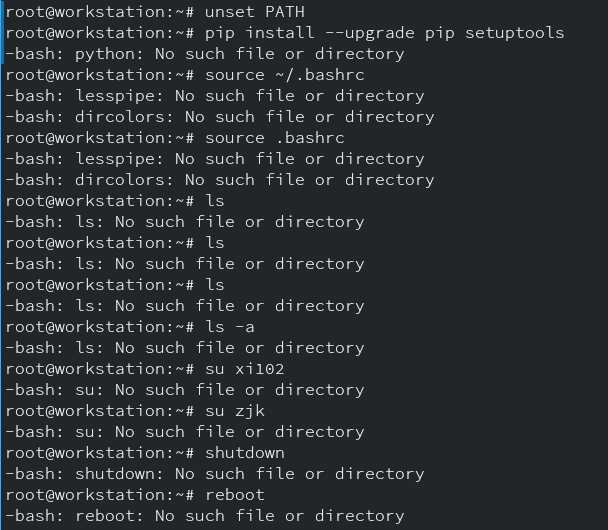

请父母在未成年儿童陪同下观看
<!-- more -->

## 守序善良

### 假装合群

#### 假装用win10

最早是kali-undercover之类的东西，为了不引人注目，把kali伪装成win10（另起了一个xfce桌面）。没办法，kali名声在外，都成牢饭梗出圈了.....  
Arch上有个kali-undercover，不过没什么必要，现在仿Mac和仿win的主题简直数不过来。  
感觉仿苹果的主题更不容易露馅，（笔记本型号不对你就说在用黑苹果嘛

#### 假装用微信

Telegram微信主题

### 假装系统在更新

这个网站值得拥有

## 不讲武德

```bash
unset PATH
```

这样之后效果立竿见影（好处是命令简单，而且不需要sudo或者输入密码）
系统里面其他文件都还在，不用担心像`rm -rf /`那样文件数据都没了被人打死。



```bash
export PATH=/usr/local/sbin:/usr/local/bin:/usr/sbin:/usr/bin:/sbin:/bin:/usr/games:/usr/local/games:/snap/bin
```

/opt/pyenv/plugins/pyenv-virtualenv/shims:/home/zjk/.pyenv/shims:/opt/pyenv/plugins/pyenv-virtualenv/shims:/home/zjk/.pyenv/shims:/usr/local/sbin:/usr/local/bin:/usr/bin:/usr/lib/jvm/default/bin:/usr/bin/site_perl:/usr/bin/vendor_perl:/usr/bin/core_perl

## 混乱邪恶

```c
#define true false
```

## 伪造网站

单个页面直接保存就行了，想要复制整个网站下来就要找一些爬取全站的工具了

当然你可以简单的用wget

```shell
wget -U "Mozilla/4.0 (compatible; MSIE 7.0; Windows NT 5.1; GTB5)" -r -p -k -nc http://example.com
```

用[HTTrack](https://www.httrack.com/)（在community和blackarch源里面）（这个本来是用来做网站镜像和离线浏览保存的，最后一次是更新2017，不过依然是最好用的东西之一）。

有两个比较重要的参数，-rN，设置爬取深度，比如爬取30层`-r30`,-%eN设置外部链接的爬取深度`-%e0`（这个参数很重要，HTTrack会爬取所有外链，并不会认`<nofollow>`标签之类的东西）

HTTrack的官网告诉你了不要干坏事：

>What you mustn't do : bandwidth abuse, and other bad behaviours


## 见

<https://dev.to/devmount/9-evil-bash-commands-explained-4k5e>
<https://zhuanlan.zhihu.com/p/27147501>
<https://www.reddit.com/r/LinuxCirclejerk/comments/2qfk82/alias_lsrm_r>
<https://www.kali.org/docs/introduction/kali-undercover/>