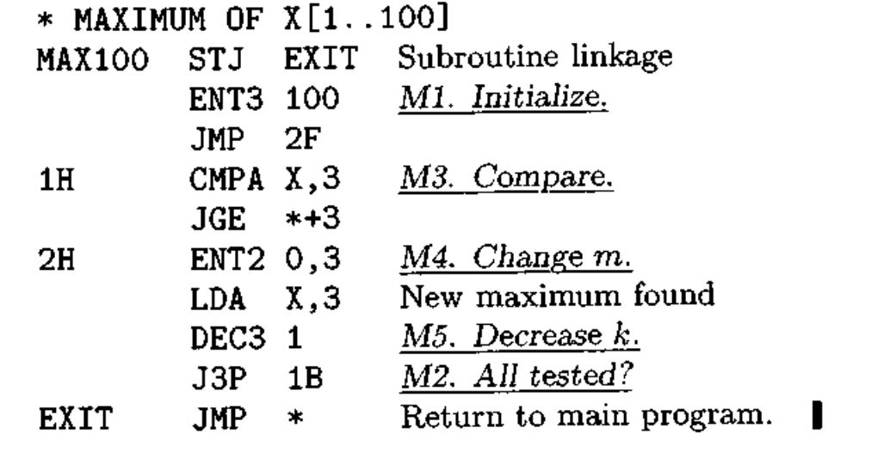
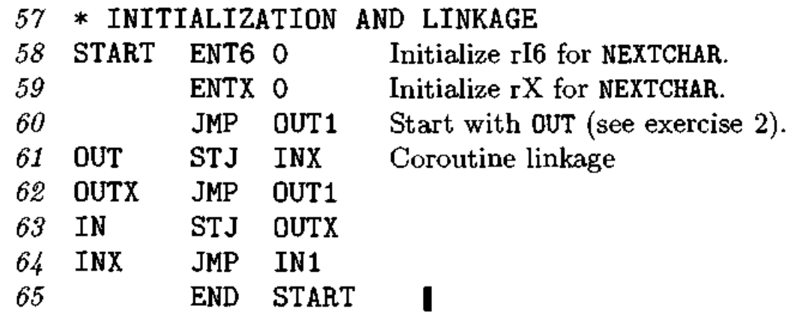

同时把coroutine和coroutine叫做协程，迷惑性太强了。我在看xv6和linux的线程的时候就一直很奇怪，这goroutine跟用户态线程有啥区别，怎么就成协程了？然后async/await、yield还有fiber吵来吵去，一度搞得我更迷惑了。好吧，最近发现我又搞反了，协程的历史比线程要早。
<!-- more -->
由于本人水平有限，对OS调度、编译器和一些我不太熟的语言的理解比较菜，如有问题还请诸位看官指教

## coroutine

打开维基百科的[Coroutine](https://en.wikipedia.org/wiki/Coroutine)词条，发现Coroutine的历史很早，1958年就有了。其实比线程这些概念要早。（以前一直以为现有的线程，因为线程的一些问题才有了协程）

>Coroutines are computer program components that generalize subroutines for non-preemptive multitasking, by allowing execution to be suspended and resumed. Coroutines are well-suited for implementing familiar program components such as cooperative tasks, exceptions, event loops, iterators, infinite lists and pipes.

协程（coroutine）的诞生也比多核要早，在单核的时代就有了。当时的CPU处理速度比较快，而I/O比较慢。如果一直等待一个任务完成，CPU等待I/O会造成浪费。为了充分利用CPU的性能，自然我们会想到同时多个I/O设备连接一个CPU，让CPU在完成一个任务的时候将这个任务给I/O，然后不等这个I/O去做另一个任务。类似这样任务的切换和控制转移就是协程的雏形。这个时候还没有线程这些东西，通过寄存器的保存和恢复以及JMP等汇编指令完成这种操作。

我们来看看TAOCP书里面Knuth的说法，第一卷1.4章。1.4.1讲了Subroutines，这个一般都翻译成子程序，字面意思理解即可。直接看书上的例子：

有入口有出口可以嵌套，这里就先把它当成函数吧。汇编操作就是通过JMP跳转到开始一些子程序的操作又JMP跳转回主程序（这里就和函数一样的）。

1,4,2讲coroutine（有的地方翻译成共行程序，就是协程啦），在上一章主程序中的子程序执行完又跳转回主程序继续执行，而协程没有main和sub，地位是相等的。书里面给了一个打纸带例子，对一串输入，对每一个数字N后面的字符打印N次。
汇编太长就不贴上来了，有兴趣可以去看看。
NEXTCAHR是取下一个字符的子程序；IN是一个coroutine，用于找到要循环N次的数字N，OUT是另一个coroutine,用来打孔。重点看下面这一段两个coroutine是怎么跳转的：

>Coroutines originated as an assembly language method, but are supported in some high-level programming languages.

## 协程的io阻塞问题

## goroutine

goroutine叫它协程，容易和上面那个混。但是大家都把goroutine和coroutine翻译成协程，我也只好这么说。把它叫做go的协程、有栈协程好一点，不太容易混。

## async/await

## go的协程这么火c怎么就不行

c/c++里的协程

## 链接

https://en.wikipedia.org/wiki/Coroutine  
[Design of a Separable Transition-Diagram Compiler](http://melconway.com/Home/pdf/compiler.pdf) 最早出现coroutine这个词的COBOL论文，用状态机进行跳转和切换任务  
http://golang.org/doc/faq#goroutines  

https://yearn.xyz/posts/techs/%E5%8D%8F%E7%A8%8B/  

为什么觉得协程是趋势？ - Tim Shen的回答 - 知乎
https://www.zhihu.com/question/32218874/answer/56255707