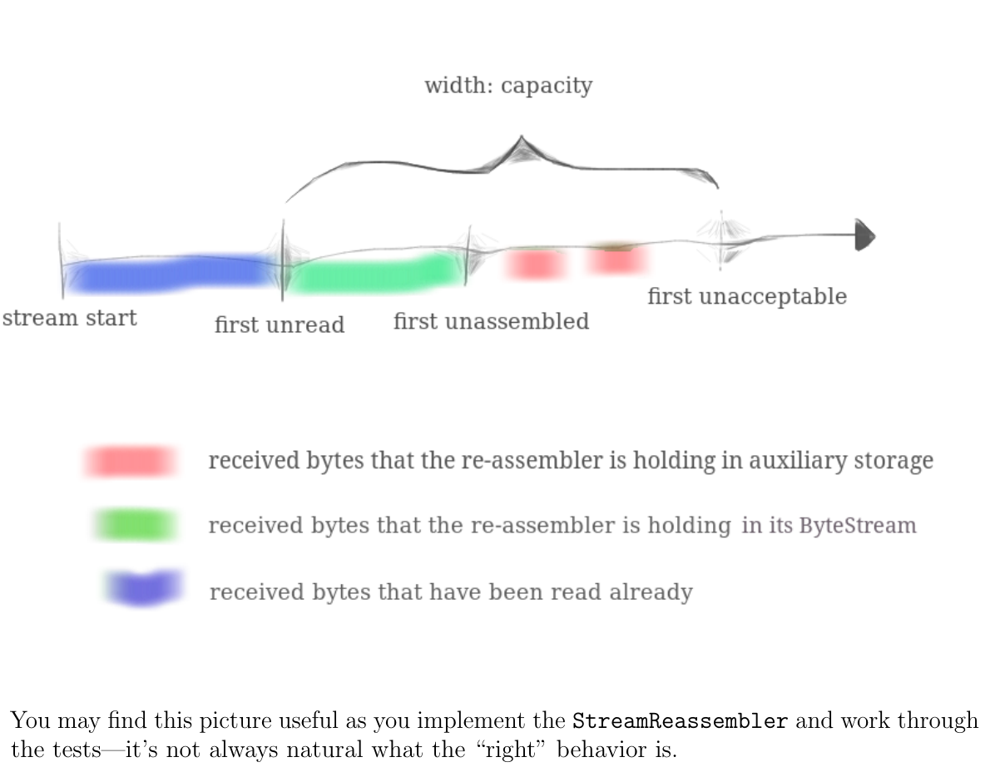

更新：做到Lab4，test跑不过才发现前面的实现有问题。。。
<!-- more -->

## Lab1笔记

这个Lab是TCP流重组，这个我回去翻自顶向下那本书没看到有讲具体实现，然后去翻《TCP/IP协议》，在卷2看到了。但是卷2的流重组实现太复杂了，直接讲了几十页（可能是卷2最复杂的一部分），最后还是看着Lab的文档做了。

第一反应是用链表，但是这个课的C++风格不让我们用指针，那就STL那个list吧。然后测试没有跑过，超时了。然后改成了map， 然后用lower_bound和upper_bound去找重叠，然后过了（总感觉哪里不对）

这个Lab的关键在于Capacity（可以暂时把这个当作窗口的width）, Lab的定义是这样的：

>1. The number of bytes in the reassembled ByteStream (shown in green below), and
>2. The maximum number of bytes that can be used by “unassembled” substrings (shown
in red)

就是图里面绿色和红色的  
绿的是已经 reassembled ByteStream（已经重组了的有序stream） 
红色是还没重组的  

当大于capacity的时候直接丢掉

## Lab2笔记： Receiver

## Lab3笔记：Sender

## 链接
