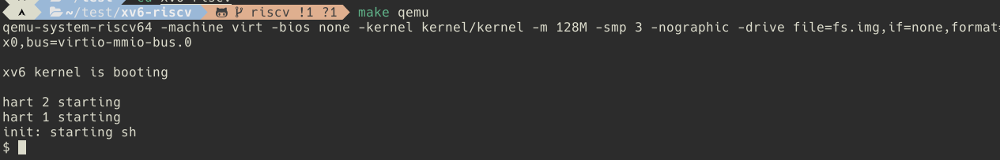
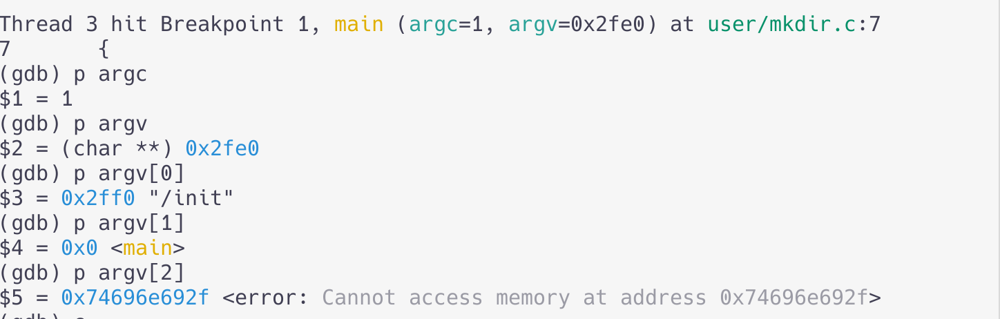
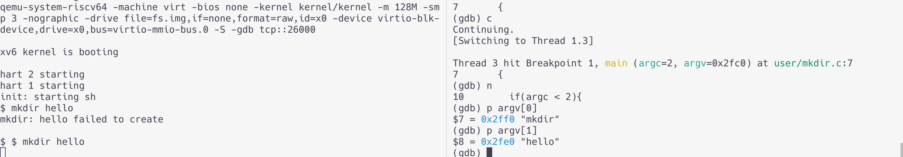
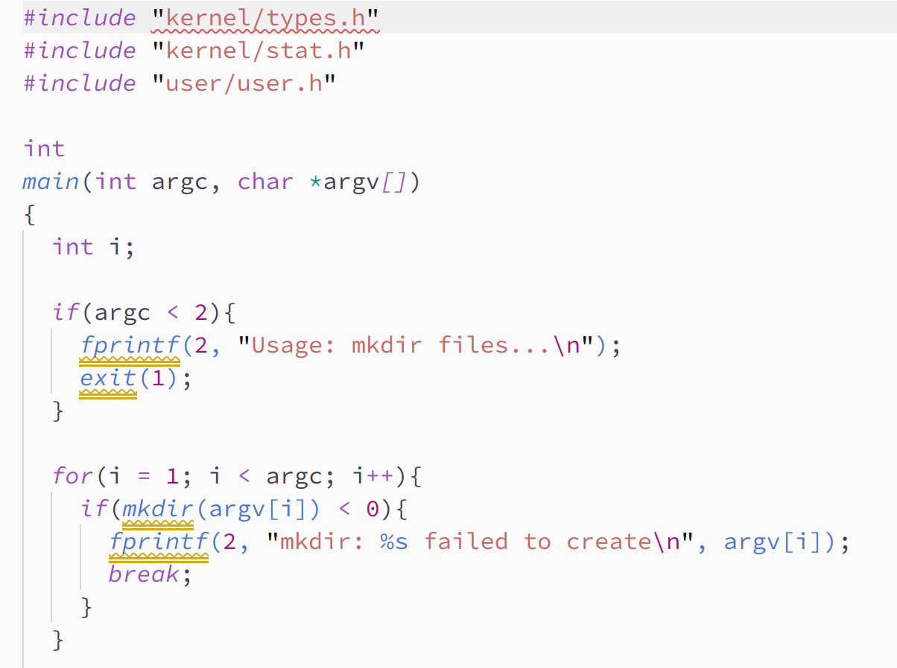
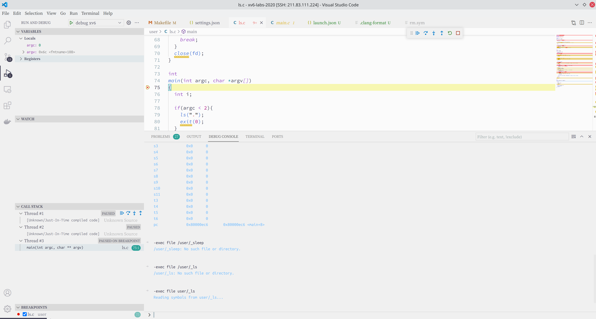

6.S081的调试和VSCode环境配置，还有一些踩坑和小技巧，杂七杂八的都放在这一篇里面了。（遇到什么情况就更新，准备一直更到做完Lab）
<!-- more -->

## 准备环境

### Archlinux环境配置

我们可以用qemu模拟risc-v，就像模拟ARM一样。

直接参照这里来就好了。如果没有自带的包，可能会编译比较久。

https://pdos.csail.mit.edu/6.828/2020/tools.html

Archlinux可以用pacman装这四个包，都在comunity源里。

```bash
sudo pacman -S riscv64-linux-gnu-binutils riscv64-linux-gnu-gcc riscv64-linux-gnu-gdb qemu-arch-extra
```

然后测试一下：

```bash
riscv64-linux-gnu-gcc --version
qemu-system-riscv64 --version
```

测试一下编译运行xv6

```bash
git clone git://github.com/mit-pdos/xv6-riscv.git
cd xv6-risvv
make qemu
```

结果发现不行，卡在这里不动了。搜了一下Archlinux就官网这一句话教程，也没别人遇到相同的问题（随手一搜arch的教程全是ubuntu的结果）。

```
qemu-system-riscv64 -machine virt -bios none -kernel kernel/kernel -m 128M -smp 3 -nographic -drive file=fs.img,if=none,format=raw,id=x0 -device virtio-blk-device,drive=x0,bus=virtio-mmio-bus.0
```

依我用Archlinux的踩坑血泪史，八成是版本太高了。降级**qemu-arch-extra** 6.0.0一下试试，降级到跟官方页面上一致的版本5.1.0

```bash
sudo downgrade qemu-arch-extra
```

紧接着又报了这个错：

```bash
qemu-system-riscv64 -machine virt -bios none -kernel kernel/kernel -m 128M -smp 3 -nographic -drive file=fs.img,if=none,format=raw,id=x0 -device virtio-blk-device,drive=x0,bus=virtio-mmio-bus.0
qemu-system-riscv64: error while loading shared libraries: liburing.so.1: cannot open shared object file: No such file or directory
make: *** [Makefile:165: qemu] Error 127
```

找不到io_uring的动态链接库，没关系，我们而再降级一下liburing或者自己下一个动态链接库趁系统不注意偷偷塞到`/usr/lib`之类的地方就好了。io_uring虽然很重要，但是查了依赖，我目前只有qemu直接依赖`liburing`(还有一个virtualbox的vde2是optionally requires)，那就直接降级吧。

```bash
sudo downgrade liburing
```



然后一个sh就出现了，按Ctrl-a x退出。

到这里准备环境就好了，耗时10分钟。（用了降级系统包版本的脏办法，`io_uring`这么重要的东西自己乱换版本不太好，不过目前直接依赖系统`liburing`的包不多）

### 更新Ubuntu20.04配置

受不了坑位上7年前采购的老电脑的编译速度了，换教研室的20核服务器远程编译了。为了方便先将Ubuntu Server强行

```bash
sudo apt-get install git build-essential gdb-multiarch qemu-system-misc gcc-riscv64-linux-gnu binutils-riscv64-linux-gnu
```

直接`make qemu`试试，耗时5s，舒服了


### Hello, World

写一个helloworld看看是不是真的好了。

在user目录里面直接新建一个hello.c

```c
#include "kernel/types.h"
#include "kernel/stat.h"
#include "user/user.h"

int
main(int argc, char *argv[])
{
  printf("Hello, nerd!\n");
  exit(0);
}
```

然后在Makefile里面修改，加上`$U/_hello\`

```makefile
UPROGS=\
	$U/_cat\
	$U/_echo\
	$U/_forktest\
	$U/_grep\
	$U/_hello\
	$U/_init\
	$U/_kill\
```

然后编译运行：

```bash
make qemu
```

（注意不要用return 0，用exit(0)终止进程，或者你喜欢单片机的裸机的写法不要返回直接void main也行）

（Make sure `main` calls `exit()` in order to exit your program. ）

```bash
$ hello
Hello, nerd!
```


## gdb+qemu调试

### 使用

现在6.S081推荐用`gdb-multiarch`这个包。
然后开两个终端（严格来讲应该叫终端模拟器，以下简称终端）, 第一个

```bash
make qemu-gdb
```

第二个终端运行的你gdb（arch用riscv64-linux-gnu-gdb、ubuntu用gdb-multiarch或者其他的版本）

```bash
riscv64-linux-gnu-gdb
```

然后能看到输出下面这样应该就没问题了

```
This GDB was configured as "x86_64-pc-linux-gnu".
Type "show configuration" for configuration details.
For bug reporting instructions, please see:
<https://www.gnu.org/software/gdb/bugs/>.
Find the GDB manual and other documentation resources online at:
    <http://www.gnu.org/software/gdb/documentation/>.
--Type <RET> for more, q to quit, c to continue without paging--

For help, type "help".
Type "apropos word" to search for commands related to "word".
The target architecture is set to "riscv:rv64".
warning: No executable has been specified and target does not support
determining executable automatically.  Try using the "file" command.
0x0000000000001000 in ?? ()
```

Archlinux上`gdb-multiarch`还有一段报错，guile的问题不过貌似没啥太大影响，`riscv64-linux-gnu-gdb`是好的

```log
Exception caught while booting Guile.
Error in function "make_objcode_from_file":
bad header on object file: "\x7fELF\x02\x01\x01ÿ\x00\x00\x00\x00\x00\x00\x00\x00"
gdb-multiarch: warning: Could not complete Guile gdb module initialization from:
/usr/share/gdb/guile/gdb/boot.scm.
Limited Guile support is available.
Suggest passing --data-directory=/path/to/gdb/data-directory.
```

在第一个终端你会看到：

```bash
*** Now run 'gdb' in another window.
qemu-system-riscv64 -machine virt -bios none -kernel kernel/kernel -m 128M -smp 3 -nographic -drive file=fs.img,if=none,format=raw,id=x0 -device virtio-blk-device,drive=x0,bus=virtio-mmio-bus.0 -S -gdb tcp::26000
```

然后在另一个终端就可以调试了。gdb平时怎么用的现在就怎么用。这里以mkdir为例，给`main`函数打一个断点：

```gdb
(gdb) file user/_mkdir
Reading symbols from user/_mkdir...
(gdb) b main
Breakpoint 1 at 0x0: file user/mkdir.c, line 7.
(gdb) c
Continuing.

Thread 1 hit Breakpoint 1, main (argc=84215045, argv=0x505050505050505)
    at user/mkdir.c:7
7       {
```

输入c, 停在了initing,没有进入xv6的sh，可能是系统初始化的时候调用了mkdir，我们看一下变量



接着输入`c`往下走，在第一个终端（qemu）会进入xv6的sh，然后输入`mkdir hello`：

```bash
(gdb) c
Continuing.
[Switching to Thread 1.3]

Thread 3 hit Breakpoint 1, main (argc=2, argv=0x2fc0) at user/mkdir.c:7
7       {
(gdb) n
10        if(argc < 2){
(gdb) p argv[0]
$7 = 0x2ff0 "mkdir"
(gdb) p argv[1]
$8 = 0x2fe0 "hello"
(gdb) 
```



可以看到执行过程中的变量了

### 其他信息

#### 寄存器

查看寄存器`info registers`，会列出32个通用寄存器

```gdb
(gdb) info registers
ra             0x80001f60       0x80001f60 <scheduler+92>
sp             0x8000a7c0       0x8000a7c0 <stack0+3984>
gp             0x505050505050505        0x505050505050505
tp             0x0      0x0
t0             0x800027c6       2147493830
t1             0x8000000000087fff       -9223372036854218753
t2             0x505050505050505        361700864190383365
fp             0x8000a810       0x8000a810 <stack0+4064>
s1             0x80017768       2147579752
a0             0x80011968       2147555688
a1             0x80011970       2147555696
a2             0x80025000       2147635200
a3             0x80023086       2147627142
a4             0x0      0
a5             0x22     34
--Type <RET> for more, q to quit, c to continue without paging--RET
a6             0x505050505050505        361700864190383365
a7             0x7      7
s2             0x2      2
s3             0x80017768       2147579752
s4             0x80011950       2147555664
s5             0x0      0
s6             0x80011970       2147555696
s7             0x1      1
s8             0x3      3
s9             0x0      0
s10            0x0      0
s11            0x0      0
t3             0x505050505050505        361700864190383365
t4             0x505050505050505        361700864190383365
t5             0x505050505050505        361700864190383365
t6             0x505050505050505        361700864190383365
pc             0x80001faa       0x80001faa <scheduler+166>
dscratch       Could not fetch register "dscratch"; remote failure reply 'E14'
mucounteren    Could not fetch register "mucounteren"; remote failure reply 'E14'
(gdb) 
```

RISC-V的寄存器有32个，比ARM多，已经超过了我的记忆容量。有需要就去翻[手册](http://crva.ict.ac.cn/documents/RISC-V-Reader-Chinese-v2p1.pdf.11.3)吧  
调试时大多数情况只要关注a开头的几个就好了, s开头的是系统保留。a0和a1是函数参数和返回值(Function arguments/return values)，a2到a7是变量(Function arguments), 你可以用汇编操作这些寄存器的值。  

#### 进程

`info threads`查看进程


## VSCode配置

### 代码提示和自动补全

自动补全插件推荐clangd（比Microsoft官方的那个c/c++ extension好用）

默认的库函数提示会告诉你找不到`kernel/kernel.h`，需要手动添加




### gdb调试

参照这篇博客设置[MIT 6.S081 xv6调试不完全指北](https://www.cnblogs.com/KatyuMarisaBlog/p/13727565.html)，改一改那个`launch.json`。

```json
{
    "version": "0.2.0",
    "configurations": [
        {
            "name": "debug xv6",
            "type": "cppdbg",
            "request": "launch",
            "program": "${workspaceFolder}/kernel/kernel",
            "args": [],
            "stopAtEntry": true,
            "cwd": "${workspaceFolder}",
            "miDebuggerServerAddress": "211.83.111.224:26000",
            "miDebuggerPath": "/usr/bin/gdb-multiarch",
            "environment": [],
            "externalConsole": false,
            "MIMode": "gdb",
            "setupCommands": [
                {
                    "description": "pretty printing",
                    "text": "-enable-pretty-printing",
                    "ignoreFailures": true
                }
            ],
            "logging": {
                // "engineLogging": true,
                // "programOutput": true,
            }
        }
    ]
}
```

然后删掉`.gdbinit`里`target remote 127.0.0.1:26000`

然后其他的都跟这篇博客里的差不多，以`ls`为例：

```gdb
-exec file user/_ls
```



于是就可以并不太愉快的debug了。试了一下发现其实体验还没直接在gdb里面敲命令好，vscode的debugger跟IDE差距很大，鼠标点来点去可能都没有gdb直接敲命令舒服。

**如果真想找一个好的图形化debugger推荐nemiver**

### 使用clangd-format进行xv6代码风格的格式化

有没有像Golang的go-fmt一样强制代码格式化的东西呢，有的，[clang format](https://clang.llvm.org/docs/ClangFormat.html)。

安装`clangd`插件，在VSCode的设置里面启用`format on save`，然后在根目录下新建`.clang-format`文件。每次`ctrl+s`的时候就可以像go-fmt插件那样格式化代码了。

很遗憾的是，c/c++的代码风格并没有一个官方的统一风格，各种风格争论不休。
[Linux的format风格](https://github.com/torvalds/linux/blob/master/.clang-format)我不太习惯，比如一个tab占8个空格。
下面是我改了改llvm风格的配置，跟6.828Lab的xv6风格不太一样，函数类型和函数一行，tab是4个空格（tab空两个看起来真的难受，早期显示屏小才这样子干，我觉得24寸以上显示器空四个才是合理的），括号换行和golang一样。（不然在go和c之间来回切换我要精神分裂了）

https://github.com/Archaeoraptor/dotfiles/blob/master/vscode/.clang-format

需要注意的是，一定不要对#include头文件自动排序，要设置`SortIncludes:    false`不然头文件顺序不对会报错。

比如排序前：
```c
#include "kernel/types.h"
#include "kernel/stat.h"
#include "user/user.h"
```

自动格式化后

```c
#include "kernel/stat.h"
#include "kernel/types.h"
#include "user/user.h"
```

就会报错：

```log
./kernel/stat.h:7:3: error: unknown type name ‘uint’
    7 |   uint ino;    // Inode number
      |   ^~~~
./kernel/stat.h:10:3: error: unknown type name ‘uint64’
   10 |   uint64 size; // Size of file in bytes
      |   ^~~~~~
make: *** [<builtin>: user/pingpong.o] Error 1
```

ps：如果你想要xv6Lab的风格，可以用Mozilla的风格改一改。

### clion等IDE

大多数时候用的VSCode，clion不怎么用。（不是我不想用，教研室那个七年前的老电脑用Jetbrains家的IDE实在是有点卡，而且JB还经常封你电邮箱，要用学生证照片去申请学生帐号）

clion的配置可以参考
https://zhuanlan.zhihu.com/p/166413604

## 其他问题

### gdb调试报错Cannot access memory at address

我在Archlinux下用`riscv64-linux-gnu-gdb`调试会报`Cannot access memory at address 0x278`

本来以为是跟以前在ARM上内核地址随机化一样的问题，关了随机化还是不行，最后发现要在`.gdbinit.tmpl-riscv`加一条`set riscv use-compressed-breakpoints yes`

## 链接

[MIT 6.S081 xv6调试不完全指北](https://www.cnblogs.com/KatyuMarisaBlog/p/13727565.html)  
[Using the GNU Debugger](https://pdos.csail.mit.edu/6.828/2020/lec/gdb_slides.pdf)

https://github.com/wabscale/xv6-public