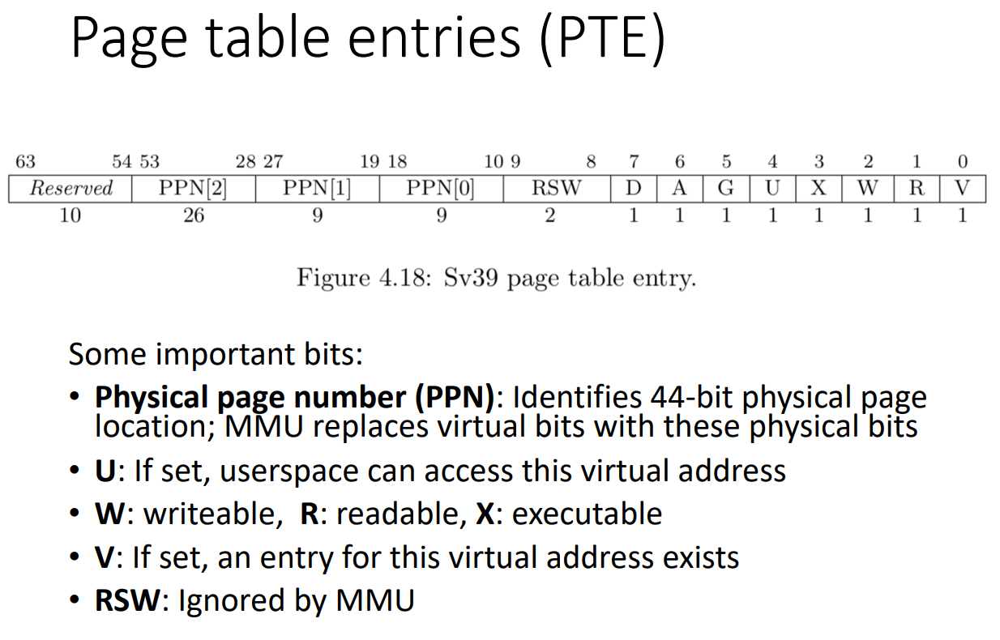
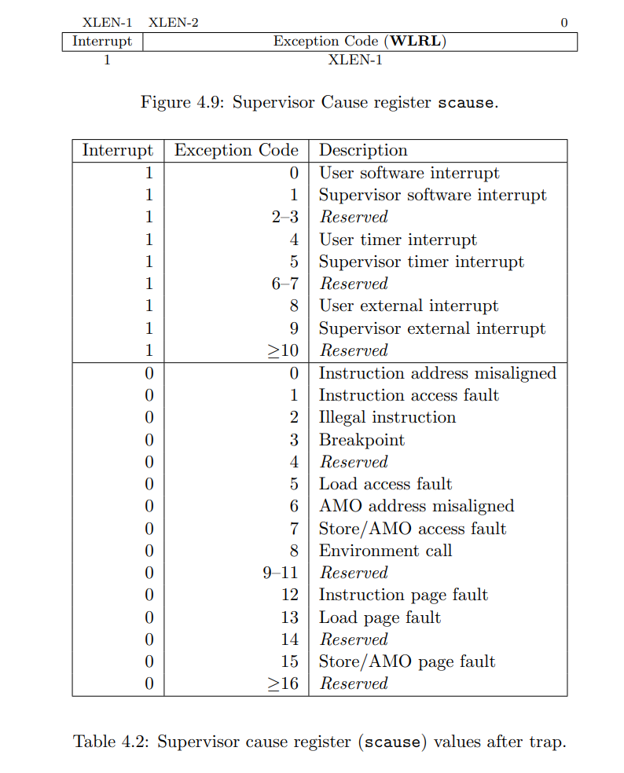
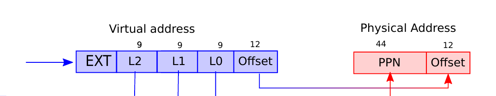
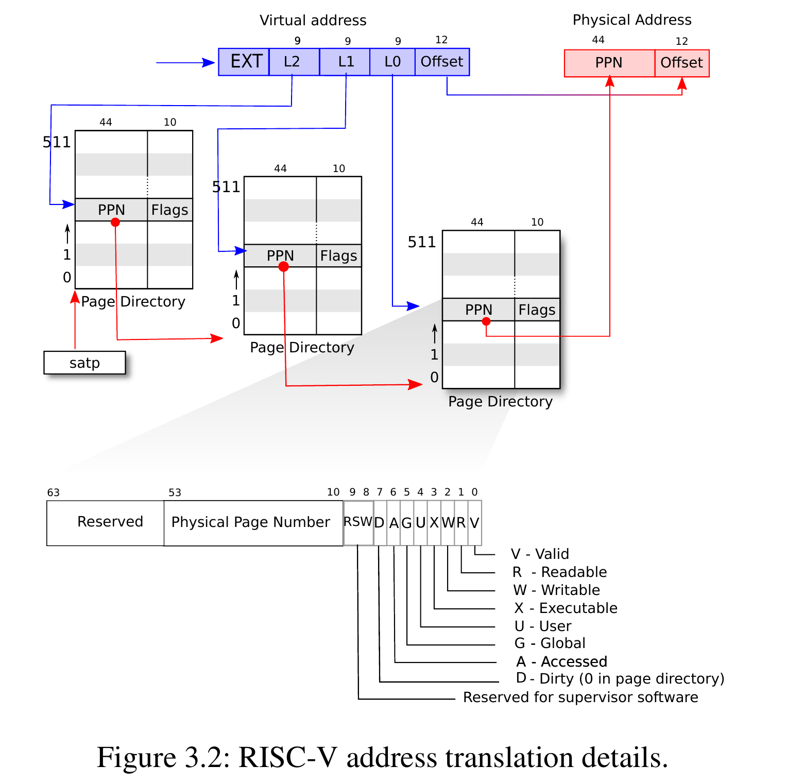

COW实现起来好多小坑啊（更新了一点页表相关的笔记，当时做页表那个Lab的时候xv6页表相关的源码研究的不仔细, 把页表和进程那一堆东西好好看一遍这个Lab就好做了）
<!-- more -->

## Copy on Write

大概思路就是，父子进程fork出来的时候共享物理内存（这个时候是只读的）。当子进程修改的时候copy出来一份（通过page fault触发的）。

设置内存是只读还是可写就在PTE里面修改相关的标志位：

PTE_V: is the PTE present? （是否valid，如果不是尝试访问将会缺页异常）
PTE_R: allowed to read (to the page)? （COW刚fork出来的时候是只读的）
PTE_W: allowed to write? （COW时child有修改，复制后状态变为可写）
PTE_X: interpret the content of the page as instructions and execute （内容（4k大小的页里面村的东西）能否被当成指令执行）
PTE_U: allowed user mode instructions to access the page （这个是用来区分用户页表和内核页表的，下面Lab用到的是用户进程页表）



然后先说一下RISC-V中的page fault，当CPU无法完成虚拟地址（virtual address）到物理地址（physical address）的转换，就会page fault。一般有三种：  

load page fault：load指令不能地址转换
store page fault：store指令不能完成地址转换
instruction page fault：when the address for an instruction
doesn’t translate

前面两个比较熟悉，那个`instruction page fault`是什么呢， 翻了一下RISC-V的手册的SCAUSE，好像就是其他指令触发的page fault



我们要获取page fault的原因就去读SCAUSE寄存器的值，xv6中直接用xv6封装好的`r_scause()`函数

要判断是哪个virtual address造成的page fault就去看STVAL寄存器， xv6中可以用封装好的`r_stval()`函数（STVAl寄存器保存的是page fault时出错的地址， Supervisor bad address or instruction.）

然后就是引用计数的问题，在xv6面一个physical page一般只对应一个进程（或者COW的父子进程），进程销毁物理页就直接删了就好了。所以不需要引用计数也能跑过这个Lab的test。但是在linux等其他系统中，会存在多个进程共享一个物理页的情况，一般是用引用计数来解决这个问题。

## xv6进程的虚拟内存和页表操作

相关函数在`kernel/vm.c`，一些定义在`riscv.h`。

页大小是4k，然后pageshift（offset）是12（32位系统）。下面引用一下linux里面PAGE_SHIFT的作用：

>PAGE_SHIFT的作用是通过对地址右移PAGE_SHIFT得到一个地址所在页的页号
>内核地址，无论是虚拟的还物理的，其都由两部分组成。往往是高N位是页号，低M位是页内的偏移量。
>当我们将地址中的低M位偏移量抛弃不用，高N位的页号，移到右端，得到这个结果称页帧号。
>移动位以在页帧数和地址之间转换是一个常用操作。宏PAGE_SHIFT， 告诉我们要右移多少位得到页帧号。

这个先简单的当成offset就可以了



```c
#define PGSIZE 4096 // bytes per page
#define PGSHIFT 12  // bits of offset within a page

// 以PGSIZE为单位向上取整， 比如514会被取整为4096
#define PGROUNDUP(sz) (((sz) + PGSIZE - 1) & ~(PGSIZE - 1))
// 以PGSIZE为单位向下取整， 比如114会被取整为0
#define PGROUNDDOWN(a) (((a)) & ~(PGSIZE - 1))
```

pagetable_t类型是一个uint64

```c
typedef uint64 *pagetable_t; // 512 PTEs
```

PTE(page table, entry, 页表项)也是一个uint64

```c
typedef uint64 pte_t;
```

然后我们看mappages，用来创建Virtual Address的PTE, 将长度为size，从pa开始的物理内存映射到虚拟内存

```c
// Create PTEs for virtual addresses starting at va that refer to
// physical addresses starting at pa. va and size might not
// be page-aligned. Returns 0 on success, -1 if walk() couldn't
// allocate a needed page-table page.
int mappages(pagetable_t pagetable, uint64 va, uint64 size, uint64 pa,
             int perm) {
    uint64 a, last;
    pte_t *pte;

    if (size == 0)
        panic("mappages: size");

    a = PGROUNDDOWN(va);
    last = PGROUNDDOWN(va + size - 1);
    for (;;) {
        if ((pte = walk(pagetable, a, 1)) == 0)
            return -1;
        if (*pte & PTE_V)
            panic("mappages: remap");
        *pte = PA2PTE(pa) | perm | PTE_V;
        if (a == last)
            break;
        a += PGSIZE;
        pa += PGSIZE;
    }
    return 0;
}
```

进程在fork的时候调用了uvmcopy，用来从parent拷贝一份一样的内存到child

```c
int fork(void) {
    ......
    // Copy user memory from parent to child.
    if (uvmcopy(p->pagetable, np->pagetable, p->sz) < 0) {
        freeproc(np);
        release(&np->lock);
        return -1;
    }
    ......
}
```

这里的实现是直接copy的，类似memcpy那样直接拷贝了一段内存（实际上xv6里面的memcpy就是memmove实现的）

```c
// Given a parent process's page table, copy
// its memory into a child's page table.
// Copies both the page table and the
// physical memory.
// returns 0 on success, -1 on failure.
// frees any allocated pages on failure.
int uvmcopy(pagetable_t old, pagetable_t new, uint64 sz) {
    pte_t *pte;
    uint64 pa, i;
    uint flags;
    char *mem;

    for (i = 0; i < sz; i += PGSIZE) {
        if ((pte = walk(old, i, 0)) == 0)
            panic("uvmcopy: pte should exist");
        if ((*pte & PTE_V) == 0)
            panic("uvmcopy: page not present");
        pa = PTE2PA(*pte);
        flags = PTE_FLAGS(*pte);
        if ((mem = kalloc()) == 0)
            goto err;
        memmove(mem, (char *)pa, PGSIZE);
        if (mappages(new, i, PGSIZE, (uint64)mem, flags) != 0) {
            kfree(mem);
            goto err;
        }
    }
    return 0;

err:
    uvmunmap(new, 0, i / PGSIZE, 1);
    return -1;
}
```

uvmcreate也是类似的，分别调用了`kalloc`， 然后设置一下PTE标志位

```c
// create an empty user page table.
// returns 0 if out of memory.
pagetable_t uvmcreate() {
    pagetable_t pagetable;
    pagetable = (pagetable_t)kalloc();
    if (pagetable == 0)
        return 0;
    memset(pagetable, 0, PGSIZE);
    return pagetable;
}
```

相对应的是`uvmfree`，这个需要递归的释放子进程的内存，`freewalk`递归的释放了所有子进程的内存

```c
// Recursively free page-table pages.
// All leaf mappings must already have been removed.
void freewalk(pagetable_t pagetable) {
    // there are 2^9 = 512 PTEs in a page table.
    for (int i = 0; i < 512; i++) {
        pte_t pte = pagetable[i];
        if ((pte & PTE_V) && (pte & (PTE_R | PTE_W | PTE_X)) == 0) {
            // this PTE points to a lower-level page table.
            uint64 child = PTE2PA(pte);
            freewalk((pagetable_t)child);
            pagetable[i] = 0;
        } else if (pte & PTE_V) {
            panic("freewalk: leaf");
        }
    }
    kfree((void *)pagetable);
}
```

在`kernel/proc.c`中, `proc_freepagetable`先调用uvmunmap释放当前进程的内存，然后调用了`uvmfree`释放子进程的pagetable

```c
// Free a process's page table, and free the
// physical memory it refers to.
void proc_freepagetable(pagetable_t pagetable, uint64 sz) {
    uvmunmap(pagetable, TRAMPOLINE, 1, 0);
    uvmunmap(pagetable, TRAPFRAME, 1, 0);
    uvmfree(pagetable, sz);
}
```

然后是`uvmalloc`和`uvmdealloc`用来调整virtual memory的大小，封装调用了kalloc、memset和uvmunmap这些，这里不多说了。

说完用户态页表我们看一下内核页表, 在开机的时候由kvminit直接创建，这些是不参与page fault的，也没有COW或者换页那些，也不会参与TLB或者参与分页

```c
// add a mapping to the kernel page table.
// only used when booting.
// does not flush TLB or enable paging.
void kvmmap(pagetable_t kpgtbl, uint64 va, uint64 pa, uint64 sz, int perm) {
    if (mappages(kpgtbl, va, sz, pa, perm) != 0)
        panic("kvmmap");
}
```

## Lab

>Your task is to implement copy-on-write fork in the xv6 kernel. You are done if your modified kernel executes both the cowtest and usertests programs successfully.

我们要通过修改PTE来调整内存的访问权限， PTE相关的标志为已经给出了：

```c
#define PTE_V (1L << 0) // valid
#define PTE_R (1L << 1)
#define PTE_W (1L << 2)
#define PTE_X (1L << 3)
#define PTE_U (1L << 4) // 1 -> user can access
```



在PTE的标志位中， 第8-9位是保留的（Reversed for supervisor software）， 我们可以把第八位指定成COW的标志位（上图RSW那里）

```c
#define PTE_COW (1L << 8) // cow
```

>Modify uvmcopy() to map the parent's physical pages into the child, instead of allocating new pages. Clear PTE_W in the PTEs of both child and parent.

首先我们修改`uvmcopy()`, 在copy的时候将父子进程的PTE标志位都设为只读

```c
// Given a parent process's page table, copy
// its memory into a child's page table.
// Copies both the page table and the
// physical memory.
// returns 0 on success, -1 on failure.
// frees any allocated pages on failure.
int uvmcopy(pagetable_t old, pagetable_t new, uint64 sz) {
    pte_t *pte;
    uint64 pa, i;
    uint flags;
    char *mem;

    for (i = 0; i < sz; i += PGSIZE) {
        if ((pte = walk(old, i, 0)) == 0)
            panic("uvmcopy: pte should exist");
        if ((*pte & PTE_V) == 0)
            panic("uvmcopy: page not present");
        pa = PTE2PA(*pte);
        *pte &= ~PTE_W;
        *pte |= PTE_COW;
        flags = PTE_FLAGS(*pte);
        // 这里不需要立即memove分配内存了，注释掉
        // if ((mem = kalloc()) == 0)
        //     goto err;
        // memmove(mem, (char *)pa, PGSIZE);

        if (mappages(new, i, PGSIZE, (uint64)pa, flags) != 0) {
            // kfree(mem);
            goto err;
        }
    }
    return 0;

err:
    uvmunmap(new, 0, i / PGSIZE, 1);
    return -1;
}
```

>Modify usertrap() to recognize page faults. When a page-fault occurs on a COW page, allocate a new page with kalloc(), copy the old page to the new page, and install the new page in the PTE with PTE_W set.

然后发生page fault的时候（要用`r_scasue`判断是否发生原因），然后用kalloc分配内存，同时将PTE标志位从只读变为可写。


>Ensure that each physical page is freed when the last PTE reference to it goes away -- but not before. A good way to do this is to keep, for each physical page, a "reference count" of the number of user page tables that refer to that page. Set a page's reference count to one when kalloc() allocates it. Increment a page's reference count when fork causes a child to share the page, and decrement a page's count each time any process drops the page from its page table. kfree() should only place a page back on the free list if its reference count is zero. It's OK to to keep these counts in a fixed-size array of integers. You'll have to work out a scheme for how to index the array and how to choose its size. For example, you could index the array with the page's physical address divided by 4096, and give the array a number of elements equal to highest physical address of any page placed on the free list by kinit() in kalloc.c.

按照这个提示，我们在kalloc的时候将引用计数设为1, 在fork的时候增加引用计数，然后在进程不需要这个页的时候将引用计数减1，等到引用计数为0的时候就可以kfree了


>Modify copyout() to use the same scheme as page faults when it encounters a COW page.

## 闲聊一下Linux的COW漏洞


## 链接