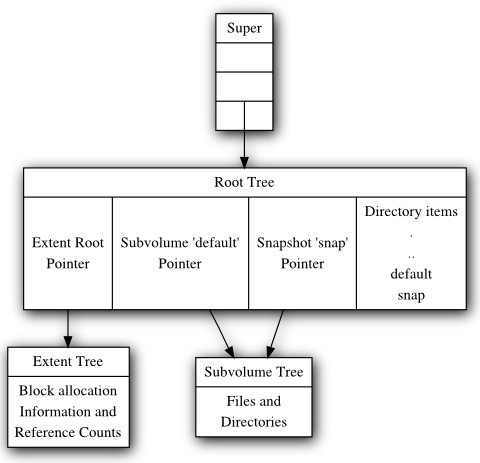
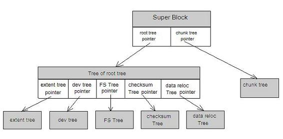
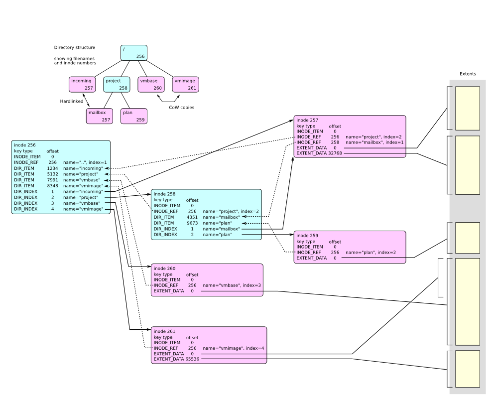
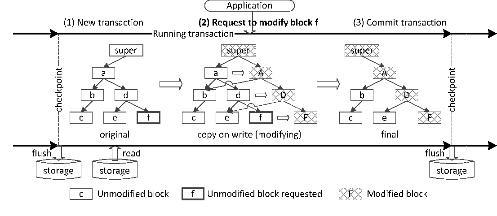
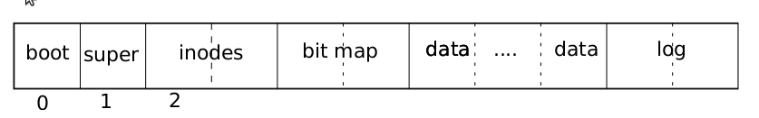
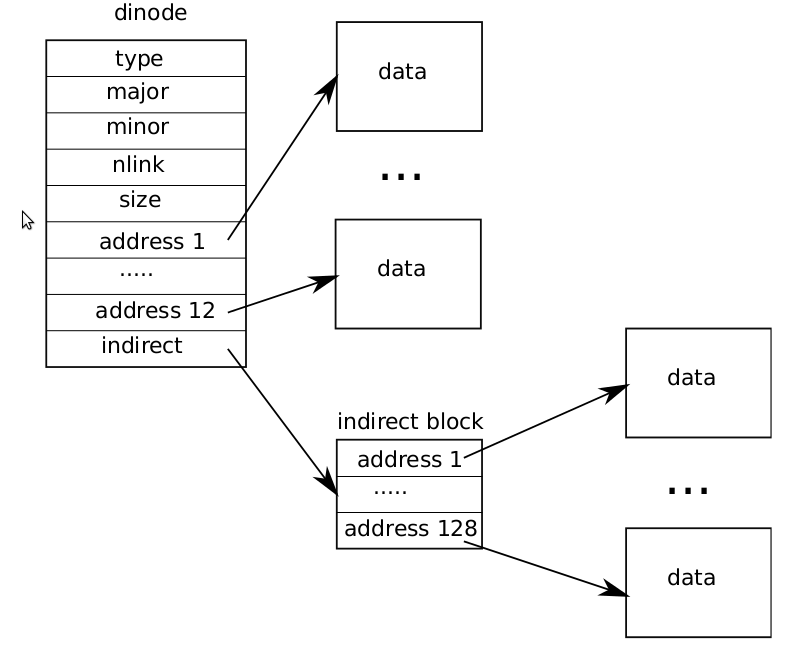

鸽了有点日子的6.S081的filesystem笔记，主要是看到ZFS和Btrfs之类的现代文件系统，再看看自己做的Lab，感觉跟幼儿园哄小孩玩的一样


不过，如果你只是一个路过的普通用户，懂的越少越幸福。在我接触Btrfs之前，我根本没担心过我电脑的文件系统。
THERE POWER LEADS ONLY TO RUIN.  
<!-- more -->

## 文件系统笔记

经典的文件系统网上各种资料和介绍太多了，也无外乎inode、多级索引、引用计数、权限这些。现代文件系统比较复杂，像Btrfs的那些日志、秒级快照、COW我又不太懂不敢讲，像Ceph这些分布式的文件系统我也不太懂。我感觉像Btrfs这样的文件系统已经很像数据库了，你看b-tree索引啊日志啊COW事物啊。

这一篇写的比较凌乱，而且大部分内容都和Lab没关系，随便说说吧

### Btrfs

Btrfs我不太敢讲，相比ext4比较复杂、资料也更少。把台式主力的文件系统换成Btrfs后我都有些提心吊胆的，一直害怕哪一天Boom-tree-fs炸了。还好，快一年了，依然存活。

```bash
$sudo btrfs device stats /dev/nvme0n1p1
[/dev/nvme0n1p1].write_io_errs    0
[/dev/nvme0n1p1].read_io_errs     0
[/dev/nvme0n1p1].flush_io_errs    0
[/dev/nvme0n1p1].corruption_errs  0
[/dev/nvme0n1p1].generation_errs  0
```

普通用户用Btrfs的一些好处是透明压缩、快照、COW。不过，Btrfs的问题是真要是出了什么问题会修的人不多，用ext4什么的坏了实在不行可以花钱找数据恢复，btrfs就自求多福吧（或者你在群里大喊fc老师救我，fc老师没空就自求多福吧）。而且市面上的磁盘修复工具几乎也都不怎么支持btrfs。

Btrfs可以直接添加、删除设备、调整大小（增加和缩小都行，XFS暂时还不支持缩）。我用Btrfs将两个500G的固态硬盘拼成了一个1T的逻辑分区（这个东西有点像LVM的逻辑卷）
Btrfs可以直接热插拔增删设备，比如我要加一快硬盘，直接添加然后balance一下就可以了。我要移除一块硬盘，直接remove就可以了。

```bash
sudo btrfs device add /dev/nvme0n1p1 / -f   # 添加设备
sudo btrfs balance start /  # 开始平衡
sudo btrfs device remove /dev/nvme0n1p1
```

之前用ext4等文件系统很多都习惯`/`，`/home`, `/var`，Btrfs一般不分那么多区，而是用子卷。一般对`var`这样的目录单独建一个子卷，然后禁用COW。


#### B-Tree索引

b-tree有三种结构：keys, items, and a block header

block header 包括uuid和checksum之类的东西

```c
struct btrfs_header {
    u8 csum[32];
    u8 fsid[16];
    __le64 bytenr;
    __le64 flags;

    u8 chunk_tree_uid[16];
    __le64 generation;
    __le64 owner;
    __le32 nritems;
    u8 level;
}
```

key中包括了存储的数据类型

```c
struct btrfs_disk_key {
    __le64 objectid;
    u8 type;
    __le64 offset;
}
```

item的大小是可变的

```c
struct btrfs_item {
    struct btrfs_disk_key key;
    __le32 offset;
    __le32 size;
}
```

文件系统的struct放在 item data 里面，比如objectid、inode和offset这些。每个文件都有一个objectid，然后根据objectid组成了一个B-tree的索引。inode放在`btrfs_inode_item`结构体里面。

Btrfs的索引是b树（free space tree），每个子卷（subvolume）有一颗b-tree索引，大概长这个样子


Btrfs中有很多的树索引，包括FS Tree(包括Extent tree, Root tree)，Chunk tree(区块索引)，Checksum tree， Device Tree。



其中文件树（FS Tree）长这样



Btrfs的snapshot是类似COW的操作，增量备份节点



#### 存储

大多数比较新的文件系统都对SSD存储的优化。这里简单说一下Btrfs的文件存储。Btrfs的一个对小文件的优化是直接塞进Metadata里面，这样就不用占一个块（block）了。大文件存在将block合并的Extent中，这样就不用每个block一个Metadata占空间了。
Btrfs还有一个很出名的特性是透明压缩，此外还有COW的reflink（这个不能），de-duplicaiton，这个之前写过不多说了

#### 关于Btrfs的性能问题

Btrfs性能不好的说法主要来源于跑分跑不过ext4等等。不过跑分这种事情对于普通的桌面用户意义不大，以下引用fc老师的话

>phoronix 測文件系統性能的最大問題在於容易讓讀者以為文件系統是左右存儲性能的關鍵，實際上文件系統只是夾在內存子系統和塊IO子系統中間的決策層，通常瓶頸不會在文件系統，除非文件系統過度簡化設計，對存儲性能影響更大的是別的層面的東西，按他們的方式測試文件系統只能測出一堆難以預計到的副作用的結果，沒法對文件系統優化提供可供參考的提示
>要測純讀寫做對比肯定不考慮 reflink 和透明壓縮，但是實際幹活的時候這些新特性很節省時間（

当然Btrfs在重io的情况下桌面特别卡，那很有可能是quota的问题，把quota关掉吧，quota有已知的性能问题，尤其是在ssd上。（关了这个磁盘配额你就看不到快照大小、指定不了每个子卷的大小）

## 简单说一下Lab

这个Lab很简单，一个是让给xv6的文件系统做一个二级索引用来支持大文件，一个是让你给xv6实现一下软链接。xv6作为一个教学的系统，文件系统索引很简单，并没有像Btrfs等文件系统那样采用b-tree等树形结构。软链接的实现也很简单，就类似一个指针+引用计数嘛，不像一些现代文件系统的reflink那样类似COW的操作实现de-duplication很麻烦。

其实没啥好说的，但是这一篇一开始是6.S081的Lab笔记，一点Lab的内容都没有有点挂羊头卖狗肉的嫌疑。还是写点吧。

## xv6中的文件系统

这里简化起见不讲磁盘结构了。不考虑底层差异，磁盘直接被文件系统视为一连串块（block），xv6中block大小是1024k。block0一般是引导块，然后block1是superblock，然后是log, inodes，bitmap，这些统称为Metadata block。再后面都是 data block



这里xv6的精简实现比较简单，不像linux那样很复杂，我们直接看源码好了。超级块superblock用来记录总共有多少个block、inode block、log block，以及它们的开始位置

```c
// super block describes the disk layout:
struct superblock {
  uint magic;        // Must be FSMAGIC
  uint size;         // Size of file system image (blocks)
  uint nblocks;      // Number of data blocks
  uint ninodes;      // Number of inodes.
  uint nlog;         // Number of log blocks
  uint logstart;     // Block number of first log block
  uint inodestart;   // Block number of first inode block
  uint bmapstart;    // Block number of first free map block
};
```

inode的定义也非常简单，inode在磁盘中大概就记录文件类型、大小、链接数量这些信息。

```c
// On-disk inode structure
struct dinode {
  short type;           // File type
  short major;          // Major device number (T_DEVICE only)
  short minor;          // Minor device number (T_DEVICE only)
  short nlink;          // Number of links to inode in file system
  uint size;            // Size of file (bytes)
  uint addrs[NDIRECT+1];   // Data block addresses
};

// in-memory copy of an inode
struct inode {
  uint dev;           // Device number
  uint inum;          // Inode number
  int ref;            // Reference count
  struct sleeplock lock; // protects everything below here
  int valid;          // inode has been read from disk?

  short type;         // copy of disk inode
  short major;
  short minor;
  short nlink;
  uint size;
  uint addrs[NDIRECT+1];
};
```

在内存中inode有 refernce conut，这个就是引用计数，删除文件的时候只有当引用计数减为0的时候才会真正删除



## sleeplock

```c
// Long-term locks for processes
struct sleeplock {
  uint locked;       // Is the lock held? 0是没有， 1是hold
  struct spinlock lk; // spinlock protecting this sleep lock
  
  // For debugging:
  char *name;        // Name of lock.
  int pid;           // Process holding lock
};
```

xv6的文件系统用的是睡眠锁而不是spinlock，因为读写这种io操作耗时很长。相关定义在`kernel/sleeplock.c`，其中`wakeup`和`sleep`定义在`kernel/proc.c`， 这里就简单认为sleep操作干了`p->state = SLEEPING;`这一件事，而`wakeup`干了`p->state = RUNNABLE;`，作用是让process睡眠和唤醒

```c
// Wake up all processes sleeping on chan.
// Must be called without any p->lock.
void
wakeup(void *chan)
{
  struct proc *p;

  for(p = proc; p < &proc[NPROC]; p++) {
    if(p != myproc()){
      acquire(&p->lock);
      if(p->state == SLEEPING && p->chan == chan) {
        p->state = RUNNABLE;  // 这里我们只关注这一行就行了
      }
      release(&p->lock);
    }
  }
}
```

```c
void initsleeplock(struct sleeplock *lk, char *name)
{
  initlock(&lk->lk, "sleep lock");
  lk->name = name;
  lk->locked = 0; //locked = 0 没上锁，= 1 表示被锁住了
  lk->pid = 0;
}

void acquiresleep(struct sleeplock *lk)
{
  acquire(&lk->lk); // 获取spinlock
  while (lk->locked) {  // 如果其他pid持有锁
    sleep(lk, &lk->lk); //睡眠
  }
  lk->locked = 1;       // 上锁
  lk->pid = myproc()->pid;  //拿锁进程的pid
  release(&lk->lk); //释放spinlock
}

void releasesleep(struct sleeplock *lk)
{
  acquire(&lk->lk);
  lk->locked = 0; // 释放锁
  lk->pid = 0;
  wakeup(lk); // 唤醒
  release(&lk->lk);
}

// 检查是否持有sleeplock锁
int holdingsleep(struct sleeplock *lk)
{
  int r;
  acquire(&lk->lk);
  r = lk->locked && (lk->pid == myproc()->pid); // r表示当前proc的pid是否持有锁
  release(&lk->lk);
  return r;
}
```

sleeplock是用spinlock实现的，在中断（IO）操作的时候可以持有锁。实现比较精简，我加了点注释，不多说了。

ps：睡眠锁类似linux里面的信号量semaphore（后来改用mutex了）

### xv6的日志

xv6的日志实现比较简单，在磁盘上有一段固定的block。
日志这里不多说了，log-structured的文件系统和COW这些有点跑题了。掉电恢复什么的建议买个UPS电源。

### block cache

这里就是经典的LRU和睡眠锁

## Lab内容

### Large Files

>In this assignment you'll increase the maximum size of an xv6 file. Currently xv6 files are limited to 268 blocks, or 268*BSIZE bytes (BSIZE is 1024 in xv6). This limit comes from the fact that an xv6 inode contains 12 "direct" block numbers and one "singly-indirect" block number, which refers to a block that holds up to 256 more block numbers, for a total of 12+256=268 blocks.

ext3支持4TB的大文件，ext4支持16TB的大文件，ZFS、Btrfs等现代文件系统支持16EB（如果你执行`ulimit -a`会显示file size (blocks)，其实这个数字是64位操作系统的上限（16EB=2^64））

这里让xv6的文件系统支持大文件的做法很naive，做一个二级索引，让inode有更多block就行了。

### Symbolic Links

这个也很简单，实现一个符号链接就行了。之前看了醉卧沙场写的XFS的符号链接的实现，这里做的很顺利。

## 链接

[Chapter 6 File system](https://pekopeko11.sakura.ne.jp/unix_v6/xv6-book/en/File_system.html)  

下面放的链接是一些文件系统相关的文章，跟这个Lab关系并不是特别大，适合无聊的时候读着玩

[fc老师的fs笔记](https://farseerfc.me/zhs/tag/fsbi-ji.html)  
[Analyzing IO Amplification in Linux File Systems](https://arxiv.org/pdf/1707.08514.pdf)    
[XFS: There and back ... and there again?](https://lwn.net/Articles/638546/)  
[Btrfs vs ZFS 实现 snapshot 的差异](https://farseerfc.me/zhs/btrfs-vs-zfs-difference-in-implementing-snapshots.html)   
[醉卧沙场 README - 计算机专业性文章及回答总索引](https://zhuanlan.zhihu.com/p/67686817) 这个知乎答主写了好多XFS的文章  

[Filesystem Hierarchy Standard](https://www.pathname.com/fhs/2.2/index.html)  
[BTRFS documentation](https://btrfs.readthedocs.io/) 偏向使用文档，没怎么介绍原理   
[Btrfs Trees](https://btrfs.wiki.kernel.org/index.php/Trees)  
[Btrfs Design](https://btrfs.wiki.kernel.org/index.php/Btrfs_design)  
[新一代 Linux 文件系统 btrfs 简介
](https://web.archive.org/web/20200226133747/https://www.ibm.com/developerworks/cn/linux/l-cn-btrfs/index.html)  比较老的一篇文章  
[Btrfs FAQ](https://btrfs.wiki.kernel.org/index.php/FAQ) 希望你用不到这些东西，有一天要翻这那你Btrfs多半是出问题了  