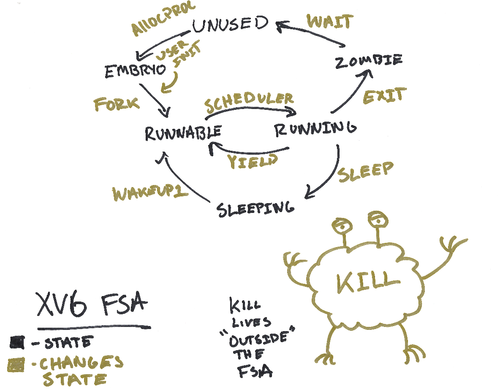

实现一个用户态线程uthread，就照着xv6的内核态线程抄呗。怎么什么FUSE啊、UIO啊，什么东西都想往用户态搬啊，连RCU都有人想往用户态搬。这个跟go的
<!-- more -->

## xv6中的process

### process的状态

xv6的线程状态包括 UNUSED, USED, SLEEPING, RUNNABLE, RUNNING, ZOMBIE



### process调度

用户态进程的切换是需要内核态的 kstack scheduler的


我们下面来看调度过程，相比linux里面的调度器这个简单多了。就是一个最简单的时间片轮转。

首先我们看proc这个结构体（就相当于linux里面的task这个结构体）

```c
// Per-process state
struct proc {
  struct spinlock lock;

  // p->lock must be held when using these:
  enum procstate state;        // Process state
  void *chan;                  // If non-zero, sleeping on chan
  int killed;                  // If non-zero, have been killed
  int xstate;                  // Exit status to be returned to parent's wait
  int pid;                     // Process ID

  // wait_lock must be held when using this:
  struct proc *parent;         // Parent process

  // these are private to the process, so p->lock need not be held.
  uint64 kstack;               // Virtual address of kernel stack
  uint64 sz;                   // Size of process memory (bytes)
  pagetable_t pagetable;       // User page table
  struct trapframe *trapframe; // data page for trampoline.S
  struct context context;      // swtch() here to run process
  struct file *ofile[NOFILE];  // Open files
  struct inode *cwd;           // Current directory
  char name[16];               // Process name (debugging)
};
```

在process切换的时候，保存proc的trapframe和context用来恢复，然后还有proc的状态（STATE）、pid等。

在切换的时候主要的工作是context和trapframe的保存和恢复。context被翻译成上下文，然后当年书里说半天我也没搞懂这到底是个啥玩意。后来看了xv6的源码才知道这是个啥。到底是谁最先把context翻译成上下文的啊？？？？ 我们直接看源码， `kernel/proc.h`

```c
// Saved registers for kernel context switches.
struct context {
  uint64 ra; # return address, 返回地址
  uint64 sp; # stack pointer，栈指针寄存器

  // callee-saved
  uint64 s0;
  uint64 s1;
  uint64 s2;
  uint64 s3;
  uint64 s4;
  uint64 s5;
  uint64 s6;
  uint64 s7;
  uint64 s8;
  uint64 s9;
  uint64 s10;
  uint64 s11;
};
```

context是一个结构体，里面是寄存器的值（用来保存和恢复process的状态）

trapframe也是一个结构体，放的东西更多了点。比如process的内核页表、比如kernel_sp寄存器，比如epc寄存器

```c
struct trapframe {
  /*   0 */ uint64 kernel_satp;   // kernel page table
  /*   8 */ uint64 kernel_sp;     // top of process's kernel stack
  /*  16 */ uint64 kernel_trap;   // usertrap()
  /*  24 */ uint64 epc;           // saved user program counter
  /*  32 */ uint64 kernel_hartid; // saved kernel tp
  /*  40 */ uint64 ra;
  /*  48 */ uint64 sp;
  /*  56 */ uint64 gp;
  /*  64 */ uint64 tp;
  /*  72 */ uint64 t0;
  /*  80 */ uint64 t1;
  /*  88 */ uint64 t2;
  /*  96 */ uint64 s0;
  /* 104 */ uint64 s1;
  /* 112 */ uint64 a0;
  /* 120 */ uint64 a1;
  /* 128 */ uint64 a2;
  /* 136 */ uint64 a3;
  /* 144 */ uint64 a4;
  /* 152 */ uint64 a5;
  /* 160 */ uint64 a6;
  /* 168 */ uint64 a7;
  /* 176 */ uint64 s2;
  /* 184 */ uint64 s3;
  /* 192 */ uint64 s4;
  /* 200 */ uint64 s5;
  /* 208 */ uint64 s6;
  /* 216 */ uint64 s7;
  /* 224 */ uint64 s8;
  /* 232 */ uint64 s9;
  /* 240 */ uint64 s10;
  /* 248 */ uint64 s11;
  /* 256 */ uint64 t3;
  /* 264 */ uint64 t4;
  /* 272 */ uint64 t5;
  /* 280 */ uint64 t6;
};
```

说一下trapframe和context的区别，context保存的是线程切换（比如调度器切换线程）时候的数据（寄存器），trapframe保存的是trap的时候（切换内核态时候）的数据

#### 运行状态切换

进入RUNNING是由`scheduler`处理的，这里就直接是一个简单的for循环，加锁找到可用的直接将状态变成RUNNING释放锁。

```c
void
scheduler(void)
{
  struct proc *p;
  struct cpu *c = mycpu();
  
  c->proc = 0;
  for(;;){
    // Avoid deadlock by ensuring that devices can interrupt.
    intr_on();

    for(p = proc; p < &proc[NPROC]; p++) {
      acquire(&p->lock);
      if(p->state == RUNNABLE) {
        // Switch to chosen process.  It is the process's job
        // to release its lock and then reacquire it
        // before jumping back to us.
        p->state = RUNNING;
        c->proc = p;
        swtch(&c->context, &p->context);    // 保存context（上下文）

        // Process is done running for now.
        // It should have changed its p->state before coming back.
        c->proc = 0;
      }
      release(&p->lock);
    }
  }
}
```

这里swtch是保存并切换context。`swtch(&c->context, &p->context);`表示保存c的context, 加载p的context。我们直接看一下`swtch.S`的代码就明白了：

```asm
.globl swtch
swtch:
        sd ra, 0(a0)
        sd sp, 8(a0)
        sd s0, 16(a0)
        .......

        ld ra, 0(a1)
        ld sp, 8(a1)
        ld s0, 16(a1)
        .......

        ret
```

退出的过程是调用了`yield`，从RUNNING进入RUNNABLE

```c
// Give up the CPU for one scheduling round.
void
yield(void)
{
  struct proc *p = myproc();
  acquire(&p->lock);    // 这里也要加一个自旋锁，如果不加，在yield过程中来一个中断之类的会出问题
  p->state = RUNNABLE;
  sched();  // 这里调用sched切换进程（恢复上下文等操作）
  release(&p->lock);
}
```

yield 调用了 sched

```c
void
sched(void)
{
  int intena;
  struct proc *p = myproc();

  if(!holding(&p->lock))    // 必须持有锁
    panic("sched p->lock");
  if(mycpu()->noff != 1)    //中断是关的
    panic("sched locks");
  if(p->state == RUNNING)   //之前已经设为RUNNABLE，肯定不能是RUNNING
    panic("sched running");
  if(intr_get())    // 中断不能是enabled
    panic("sched interruptible");

  intena = mycpu()->intena; //将itena置为当前CPU的itena
  swtch(&p->context, &mycpu()->context);    //恢复context（上下文）
  mycpu()->intena = intena;
}
```

说一下这个itena，定义在`kernel/proc.h`中，就是中断（interrupt）是否在push_off之前enable了

```c
// Per-CPU state.
struct cpu {
  struct proc *proc;          // The process running on this cpu, or null.
  struct context context;     // swtch() here to enter scheduler().
  int noff;                   // Depth of push_off() nesting.
  int intena;                 // Were interrupts enabled before push_off()?
};
```

从RUNNING退出到别的状态可能是收到了中断，也可能是进入SLEEPING（比如耗时较长的文件IO），也可能是被kill了或者父进程被kill了进入了ZOMBIE状态

```c
int
kill(int pid)
{
  struct proc *p;
 
  for(p = proc; p < &proc[NPROC]; p++){
    acquire(&p->lock);
    if(p->pid == pid){
      p->killed = 1;
      if(p->state == SLEEPING){
        // Wake process from sleep().
        p->state = RUNNABLE;
      }
      release(&p->lock);
      return 0;
    }
    release(&p->lock);
  }
  return -1;
}
```

#### 睡眠和唤醒

wakeup比较简单，就正常的加锁然后置为RUNNABLE就好了

```c
// Wake up all processes sleeping on chan.
// Must be called without any p->lock.
void
wakeup(void *chan)
{
  struct proc *p;

  for(p = proc; p < &proc[NPROC]; p++) {
    if(p != myproc()){
      acquire(&p->lock);
      if(p->state == SLEEPING && p->chan == chan) {
        p->state = RUNNABLE;
      }
      release(&p->lock);
    }
  }
}
```

sleep这里要注意！这个spinlock是为了保证在执行sleep的时候没有别的进程调用wakeup。开始执行sleep之后lk就可以释放掉了。

```c
// Atomically release lock and sleep on chan.
// Reacquires lock when awakened.
void
sleep(void *chan, struct spinlock *lk)
{
  struct proc *p = myproc();
  
  // Must acquire p->lock in order to
  // change p->state and then call sched.
  // Once we hold p->lock, we can be
  // guaranteed that we won't miss any wakeup
  // (wakeup locks p->lock),
  // so it's okay to release lk.

  acquire(&p->lock);  //DOC: sleeplock1
  release(lk);

  // Go to sleep.
  p->chan = chan;
  p->state = SLEEPING;

  sched();

  // Tidy up.
  p->chan = 0;

  // Reacquire original lock.
  release(&p->lock);
  acquire(lk);
}
```

## Lab

这个Lab有点意思，实现可以直接照抄内核态线程，做一个naive的用户态线程

### Uthread: switching between threads (moderate)

### Using threads (moderate)

这个就是学一下怎么用pthread（这个是在unix/linux里面，不是在qemu里），简单加一个mutex锁就好了


### Barrier

这个也是在linux下面，练习一下条件变量

