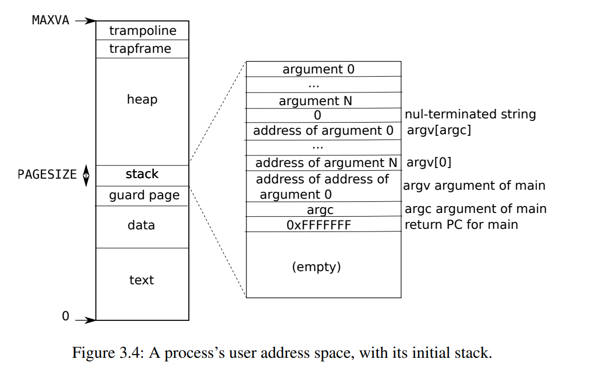
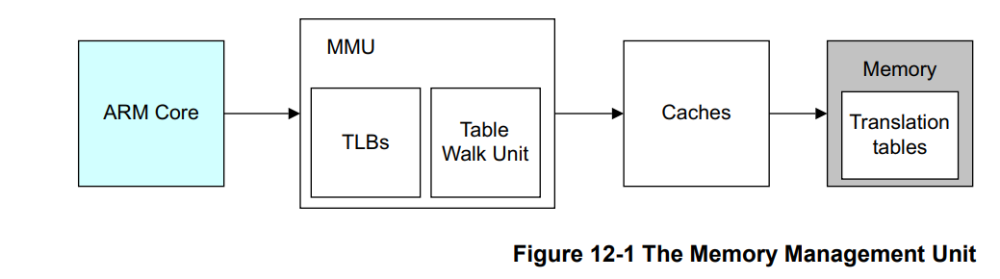
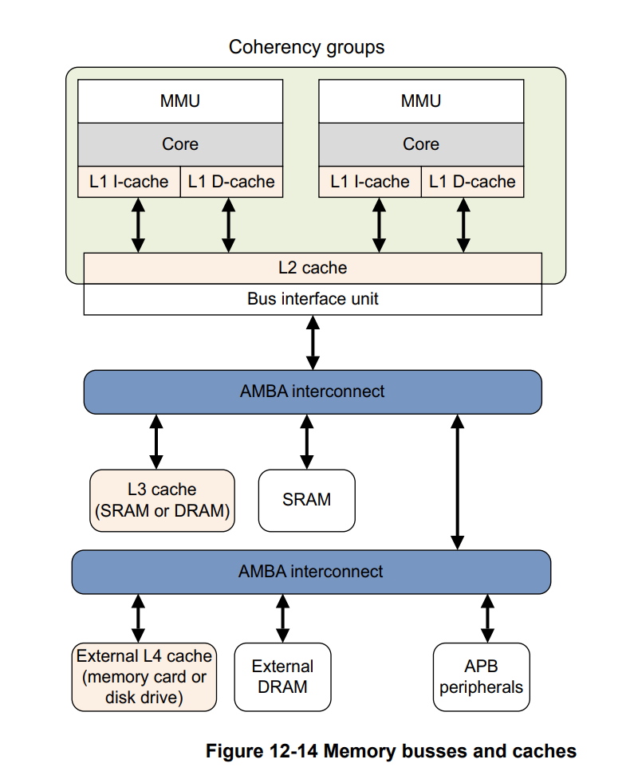
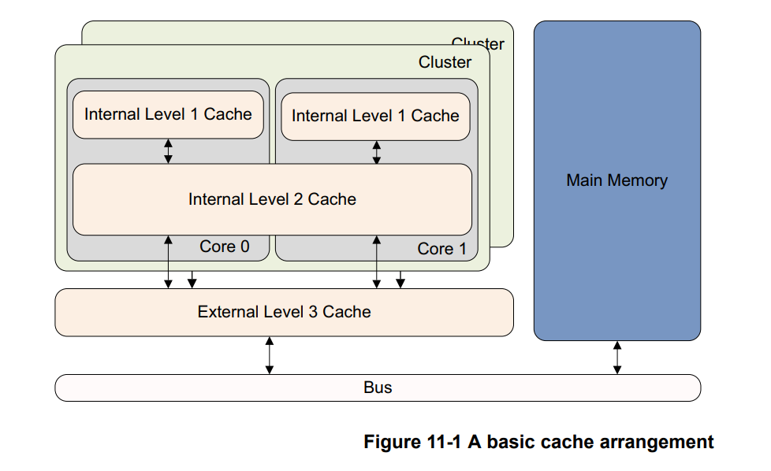
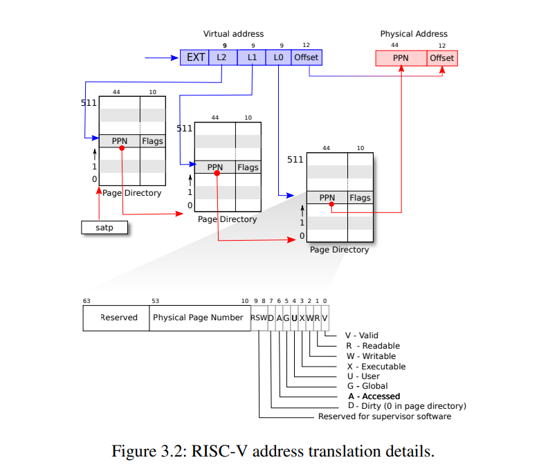
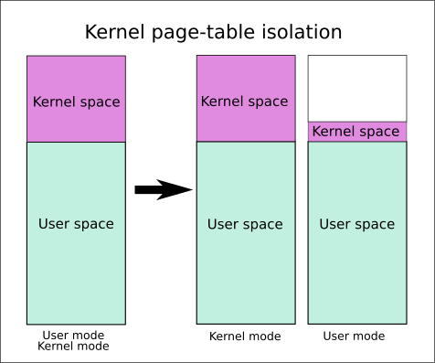

这个Lab前几个月写的，最近比较闲整理一下之前做的Lab。内存管理这块比较复杂，当时做Lab的时候对内存这块理解也浅，实现有些挺蠢的地方，重新整理了一下。接下来的笔记会多一点和Lab作业关系不是特别大的东西，闲着没事看OS相关的东西觉得有意思就一起记到笔记里了。
<!-- more -->

## 从单片机的内存和MMU说起

早期的操作系统是就像现在的一些单片机一样没有虚拟内存、页表这些东西的。以前我一开始用ARM的STM32的单片机的时候，用的是cortex-m系列，没有MMU（Memory Management Unit，内存管理单元）的，直接访问物理地址。当时我上嵌入式的课上也不讲这些东西，上课、做实验讲到内存的时候都直接访问物理地址的（Keil里面直接看物理地址的值确实比较简单）。

这个时候内存的管理方式挺简单的，**可能为数不多的坑就是大小端**，有一次被坑了挺久

下面这张图很熟悉了，堆、栈，数据段、代码段

访问栈就直接用sp去寻址就可以了，简单直接。

没有MMU也有好处，这样便宜、功耗低、而且比较简单。有的对实时性要求比较高的东西，也没有MMU（比如Cortex-R系列）

注：嵌入式的soc芯片，如果能跑操作系统的大概率有MMU，但是两者之前没有必然关系。比如uCLinux，就是为了在没有MMU上的设备跑。有MMU，当然也可以不用操作系统，直接跑裸机（MMU其实可以关掉，但是我们一般不关，手动指定映射，因为MMU的cache对性能提升很大）。（uClinux要小心内存碎片，而且由于MMU没了，内存保护、内存置换、COW基本都没了，大部分时候还是用mmap和内存直接打交道）

单片机可以不要MMU，但是一个运行着很多任务的操作系统需要对内存进行抽象和封装，提供给应用。于是后来诞生了虚拟内存/虚拟存储器（Virtual Memory），虚拟内存可以比物理内存大，可以让每个程序都认为自己拥有一段连续独立的内存，还可以权限控制（内存保护），虚拟内存在硬件上是MMU实现的。操作系统的虚拟内存几乎都依赖MMU。（当然，操作系统有自己的页表，这个一会再说）
像Cortex-A系列的soc芯片，是有mmu的，上面能跑一些完整的操作系统，有页表等一系列完整的内存管理机制。下图来自xv6 book，每个进程都有自己独立的虚拟内存，这样主要的好处一个是安全隔离，一个是让进程操作一段连续的内存，即使映射到物理内存上是不连续的（你可以**试试在Cortex-A系列soc的板子上跑个uClinux这种没有虚拟内存的，很容易搞出内存碎片然后OOM了**）。



下面这是ARM的图，RISC-V和x86我不熟，就没找RISC的图。下面这些图来自：[ARMv8-A-Programmer-Guide](https://cs140e.sergio.bz/docs/ARMv8-A-Programmer-Guide.pdf)




MMU以页为最小单位将内存从物理地址映射到虚拟地址，页表大小一般是4k。除了地址映射MMU还实现了内存保护。每个页有读、写、执行三种权限。

MMU里有TLB（Translation Lookaside Buffer），专门用来缓存页表，CPU要访问内存的时候会先去TLB里面找，没有命中再去遍历找物理地址（Translation Table Walk）。

图中的Caches就是我们熟悉的L1、L2、L3缓存，l1一般有ICache和DCache，分别用来缓存指令和数据。



一部分ARM的芯片是将L1的ICache做成逻辑地址的（不经过MMU），有的芯片是逻辑地址（Cache缓存的是经过MMU转换后的虚拟地址），这个和芯片的实现有关，不是这里的重点。我们就简单的认为，Cache一般速度远比主存快，用于缓存最常用的内存数据（页）。



当L1、L2、L3都没有命中（Write Miss）的时候，会走总线去内存里面找。至于L1、L2、L3缓存的置换、一致性这些问题，我们也简单的认为芯片已经帮我们做好了，这里我们不去管它。

## 页表

以页为单位完成了物理内存到虚拟内存的映射，要访问这些页我们需要查表，于是就有了页表（Page Table）。但是如果把每个页都映射成一张页表，这一个页表是很大的，于是就有了多级页表。多级页表中每一级都有index和offset用于定位页和页中的偏移量。



上图中的PPN是物理page号（PPN，Physical Page Number）。

### 进程页表和内核页表

xv6里面有，内核页表和用户页表（进程页表），每个进程都有自己独立的页表。内核页表只有一个。一般进程页表都有一份内核页表的直接copy，但是一些开了内核页表隔离（KPTI, Kernel Page Table Isolation）的，情况会比较复杂。



我们这里先不考虑这些复杂情况，做Lab的时候只需要知道进程地址空间是`exec`创建的，进程页表是`proc_pagetable`创建的

## 页表放在哪

放在内存里面（是虚拟内存）。准确的说，是在内存的内核空间（kernel address space）里。在RISC-V中，SATP寄存器保存当前进程的页表地址，通过切换SATP的值来切换进程页表，MMU通过这个地址去找页表（先去TLB找，那里放的是页表的缓存）。
x86的寄存器是CR3，作用类似。

## 这么多年过去了页大小怎么还是4K

如果你执行`getconf PAGE_SIZE`看一下，大概率还是`4096`。
页表的级数一直在增加，ARM的嵌入式soc（比如Cortex-A系列）一般是二级页表，Linux一开始也是二级，后来有了3级和4级页表。然而这么多年过去了，页表大小基本还是4k。

透明大页

## Lab作业笔记

这个Lab是第四章内存管理的配套Lab，做之前推荐还是看一下第四章的讲义。涉及到的几个函数在`vm.c`中

### Speed up system calls

>Some operating systems (e.g., Linux) speed up certain system calls by sharing data in a read-only region between userspace and the kernel. This eliminates the need for kernel crossings when performing these system calls.

仿照Linux通过共享内存来加快syscall。一开始看lwm这篇：[How to speed up system calls](https://lwn.net/Articles/18411/) 02年的文章和[Patch](https://lwn.net/Articles/18414/)没看懂是要干嘛，后来搜了一下vsyscall才明白这个Lab想让我们做什么。  
>vsyscall 或 virtual system call 是第一种也是最古老的一种用于加快系统调用的机制。 vsyscall 的工作原则其实十分简单。Linux 内核在用户空间映射一个包含一些变量及一些系统调用的实现的内存页。
不过后来vsyscall几乎都换成vDSO和vvar了（安全原因），现在不少发行版默认禁用这个的。  

知道干什么就好办了，我们照着课程提示先看`user/ulib.c`中的`ugetpid()`，这里已经将共享地址`USYSCALL`转成usyscall结构体，然后返回pid

```c
int
ugetpid(void)
{
  struct usyscall *u = (struct usyscall *)USYSCALL;
  return u->pid;
}
```

我们只要在`kernel/proc.h`中补全USYSCALL的映射（mapping），这个仿照trapframe就好了，在`proc.h`中

```c
  struct usyscall *usyscall    // data page for getpid syscall
  struct trapframe *trapframe; // data page for trampoline.S
```
然后在`proc.c`设置映射和读权限（PTE_U、PTE_R，详见xv6文档）。我们继续照着trapframe的写法加上：

```c
  // map the getpid (for systemcall return)
  if (mappages(pagetable, USYSCALL, PGSIZE,
              (uint64)(p->usyscall), PTE_R | PTE_U) < 0) {
      uvmfree(pagetable, 0);
      return 0;
  }
```

然后在`allocproc()`中分配，在`freeproc()`中释放内存（这个直接照抄trapframe的分配和释放就可以了）。注意还要在`proc.c`中的`proc_freepagetable`释放一下`uvmunmap(pagetable, USYSCALL, 1, 0);`

### Print a page table

这个也简单，实现一个打印页表方便下面调试。

### 


## 链接


[CPU体系架构-MMU](https://nieyong.github.io/wiki_cpu/CPU体系架构-MMU.html)  
[（一）ARMv8 MMU及Linux页表映射](https://www.cnblogs.com/LoyenWang/p/11406693.html)  

阅读更多

[How to speed up system calls](https://lwn.net/Articles/18411/)  
[x86 架构下 Linux 的系统调用与 vsyscall, vDSO](https://vvl.me/2019/06/linux-syscall-and-vsyscall-vdso-in-x86/)  
[17. Page Table Isolation (PTI)](https://www.kernel.org/doc/html/latest/x86/pti.html)  
[KPTI - Kernel Page Table Isolation CTF-Wiki](https://ctf-wiki.org/pwn/linux/kernel-mode/defense/isolation/user-kernel/kpti)  