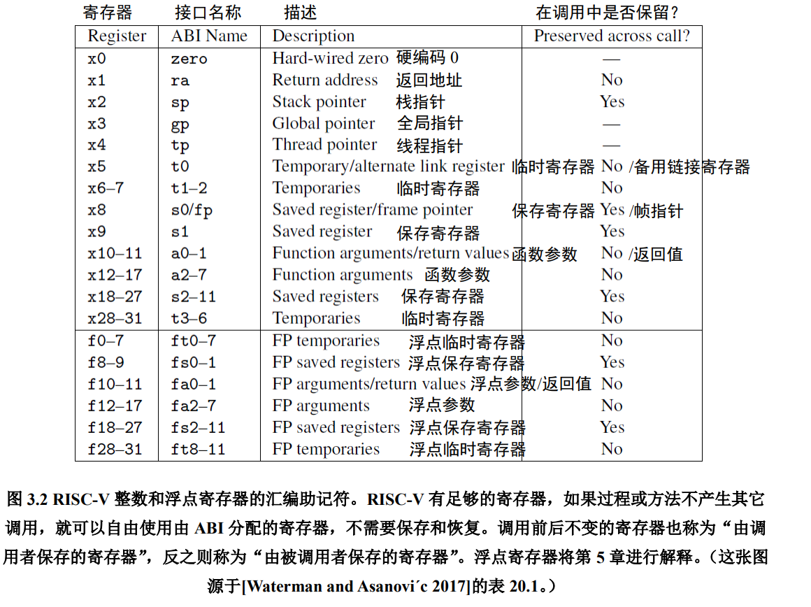
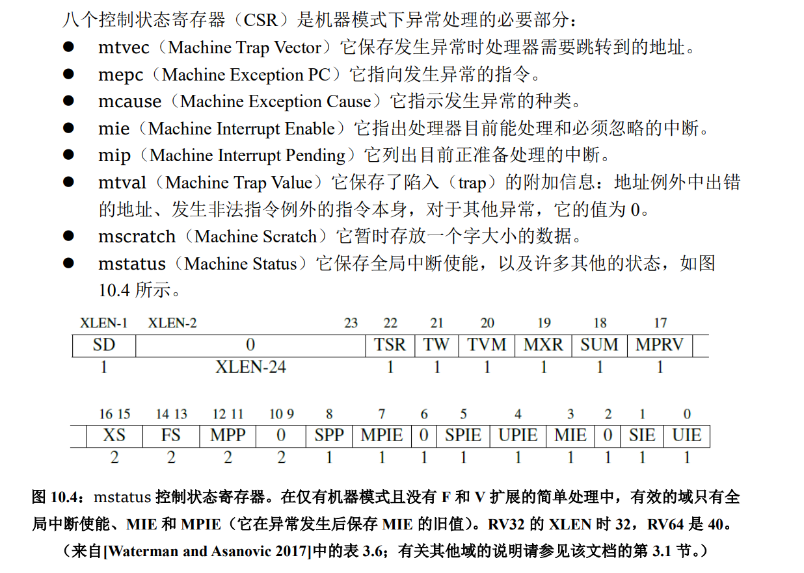
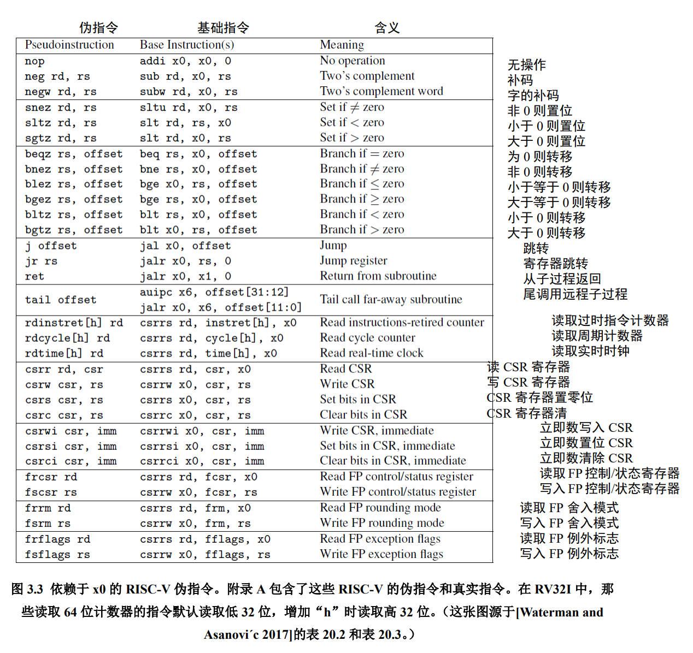
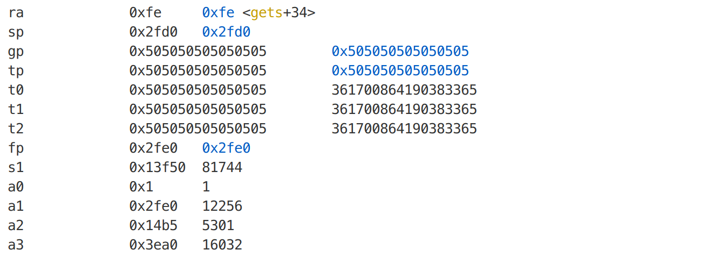
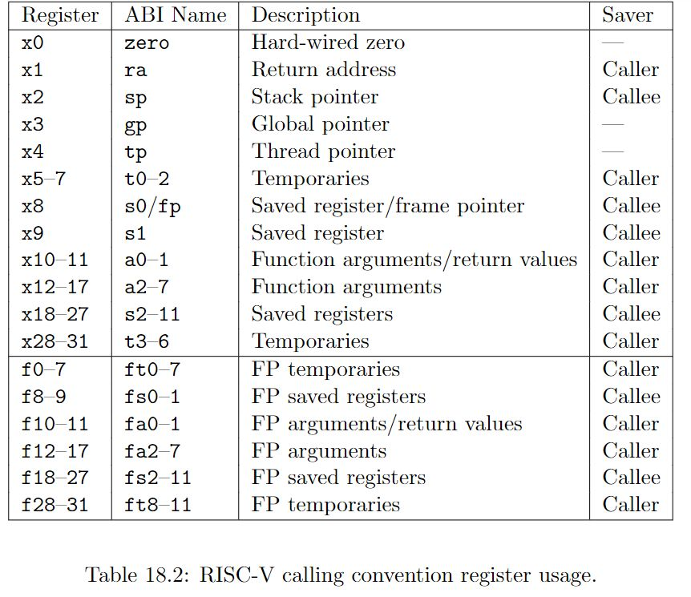

这个Lab跟其他的比起来挺简单的，主要是汇编要去翻翻手册，简单说一下吧。顺便讲一下中断之类的东西。
<!-- more -->

## xv6的Trap

xv6的trap包括interrupt这些，就是大部分切入内核态的东西都算作中断。以`write`系统调用为例，一般是`ecall`指令进入特权模式，然后`uservec`保存 寄存器进入内核态，然后`usertrap`, 然后syscall执行16号`sys_write`, 执行完之后`usertrapret`调用`userret`返回用户空间

### 相关的寄存器和指令

RISC-V的汇编指令和ARM的还是有挺多不一样的地方，我一开始凭着本科学的那点ARM汇编的印象，搞错了好几次（最后还是翻手册的时候才意识到我错了，太坑了，说好的RISC-V和ARM指令差不多呢）



通用寄存器和ARM差不多，a0-a2这些是函数的参数，t0-t9和s0-s7这些都是保存临时值的（saved registers），区别是t开头的是caller-saved，可以被其他函数返回值更改，s开头的是callee-saved，不会被函数返回值之类的的东西更改。

ECALL会进入特权模式，这个syscall的时候讲过了不多说了。risc-v跟中断有关的寄存器比较多，建议下面看到什么直接去翻手册：[RISC-V 手册](http://riscvbook.com/chinese/RISC-V-Reader-Chinese-v2p1.pdf)  



在RISC-V中，下面这些跟中断有关的寄存器属于CSR（Control and Status Registers）寄存器

SP寄存器： 栈寄存器，不说了
PC寄存器： 程序计数器，不说了
SATP寄存器： 用来控制分页的特权模式
STVEC寄存器：中断向量基址寄存器
SEPC寄存器：记录触发中断的向量地址，用来trap返回时恢复
SSRATCH寄存器：一般通过csrrw指令交换，在用户态保存内核栈的地址，在内核态值为0（可以通过这个判断是否处于内核态）
SCAUSE寄存器：中断类型和原因
STVAL寄存器：用来存储其他异常有关的东西


SIE寄存器：Supervisor Interrupt Enable， 中断使能
SIP寄存器：记录每种中断是否被触发
SSTAUTS寄存器：也是记录状态  

再简单说一下用到的指令：

sd指令（Store Double）
sd rs2, offset(rs1)
将 x[rs2]中的 8 字节存入内存地址 x[rs1]+sign-extend(offset)。

ld指令（load double，双字加载）
ld rd, offset(rs1) x[rd] = M[x[rs1] + sext(offset)][63:0]
双字加载 (Load Doubleword). I-type, RV32I and RV64I.
从地址 x[rs1] + sign-extend(offset)读取八个字节，写入 x[rd]。



读写CSR寄存器的指令：

```armasm
# 控制状态寄存器

# CSR Read Write, 将csr读入rd， 同时将zimm写入csr（原子操作）
csrrw rd, csr, zimm 
# Control ans Status Register Read, 读控制状态寄存器, 读取csr
csrr rd, csr
# CSR Write， 写控制状态寄存器, 作用相当于将rs1的值写入csr
csrw csr, rs1
```

还有csrs和csrc，用来将csr指定位置的值置为0或1。此外还有csrrs、csrrc这些，用来读取（read）一个csr的值然后, 将csr中特定的bit置为0/1，trap的相关操作没有涉及到，暂时不用管。

然后是中断切换的指令

ecall：切换特权模式触发中断
sret：从S MODE（内核态）返回用户态，将PC的值设置为SEPC
ebreak：断点（调试的时候用）
mret：从M MODE（机器态）返回内核态，将PC置为MEPC（这个不用管，这个Lab没涉及到）

然后是用来保证内存屏障的指令，用来在更改页表的时候刷新内存屏障的

sfemce.vma rs1, rs2
虚拟内存屏障(Fence Virtual Memory). R-type, RV32I and RV64I 特权指令。
根据后续的虚拟地址翻译对之前的页表存入进行排序。当 rs2=0 时，所有地址空间的翻译都
会受到影响；否则，仅对 x[rs2]标识的地址空间的翻译进行排序。当 rs1=0 时，对所选地址
空间中的所有虚拟地址的翻译进行排序；否则，仅对其中包含虚拟地址 x[rs1]的页面地址翻
译进行排序。

### Trap种类

```c
// xv6中用户态trap的代码
// handle an interrupt, exception, or system call from user space.
// called from trampoline.S
//
void
usertrap(void)
{
  int which_dev = 0;

  if((r_sstatus() & SSTATUS_SPP) != 0)
    panic("usertrap: not from user mode");

  // send interrupts and exceptions to kerneltrap(),
  // since we're now in the kernel.
  w_stvec((uint64)kernelvec);

  struct proc *p = myproc();
  
  // save user program counter.
  p->trapframe->epc = r_sepc();
  
  if(r_scause() == 8){
    // system call

    if(p->killed)
      exit(-1);

    // sepc points to the ecall instruction,
    // but we want to return to the next instruction.
    p->trapframe->epc += 4;

    // an interrupt will change sstatus &c registers,
    // so don't enable until done with those registers.
    intr_on();

    syscall();
  } else if((which_dev = devintr()) != 0){
    // ok
  } else {
    printf("usertrap(): unexpected scause %p pid=%d\n", r_scause(), p->pid);
    printf("            sepc=%p stval=%p\n", r_sepc(), r_stval());
    p->killed = 1;
  }

  if(p->killed)
    exit(-1);

  // give up the CPU if this is a timer interrupt.
  if(which_dev == 2)
    yield();

  usertrapret();
}
```

Trap在xv6里面指的是用户空间和内核空间的切换，包括系统调用、page fault、中断等。（**xv6这里的Trap是一个统称**，跟其他地方的称呼习惯不一样，比如CSAPP和一些linux的书习惯把syscall之类的东西叫trap，而把键盘I/O这种interrupt叫做中断，**大部分其他的书认为trap、interrupt、fault是三种不同的东西**）

一般Trap干了这些事：

保存32个用户寄存器
保存pc和sp寄存器
切到supervisor mode
从user page table切到kernel page table
进入内核态执行程序

完成这些过程的就是`kernel/trampoline.S`中的`uservec`函数，加了点注释，直接看注释吧。

```armasm
.globl uservec
uservec:    
	#
        # trap.c sets stvec to point here, so
        # traps from user space start here,
        # in supervisor mode, but with a
        # user page table.
        #
        # sscratch points to where the process's p->trapframe is
        # mapped into user space, at TRAPFRAME.
        #
        
	# swap a0 and sscratch
        # so that a0 is TRAPFRAME
        csrrw a0, sscratch, a0

        # save the user registers in TRAPFRAME
        # sd（store指令)，sd  rs2, offset(rs1)  ，将rs1寄存器的值加上offset偏移存入rs2
        sd ra, 40(a0) # return address, 返回地址
        sd sp, 48(a0) # stack pointer， 栈指针
        sd gp, 56(a0) # gloabl pointer，全局指针寄存器
        sd tp, 64(a0) # thread pointer，线程指针
        sd t0, 72(a0) # t0-t2 是临时寄存器
        sd t1, 80(a0)
        sd t2, 88(a0)
        sd s0, 96(a0) # saved register
        sd s1, 104(a0)
        sd a1, 120(a0)  # a0-a7是function arguements，函数参数
        sd a2, 128(a0)
        sd a3, 136(a0)
        sd a4, 144(a0)
        sd a5, 152(a0)
        sd a6, 160(a0)
        sd a7, 168(a0)
        sd s2, 176(a0) # saved registers，
        sd s3, 184(a0)
        sd s4, 192(a0)
        sd s5, 200(a0)
        sd s6, 208(a0)
        sd s7, 216(a0)
        sd s8, 224(a0)
        sd s9, 232(a0)
        sd s10, 240(a0)
        sd s11, 248(a0)
        sd t3, 256(a0)
        sd t4, 264(a0)
        sd t5, 272(a0)
        sd t6, 280(a0)

	# save the user a0 in p->trapframe->a0
        csrr t0, sscratch
        sd t0, 112(a0)

        # restore kernel stack pointer from p->trapframe->kernel_sp
        ld sp, 8(a0)

        # make tp hold the current hartid, from p->trapframe->kernel_hartid
        ld tp, 32(a0)

        # load the address of usertrap(), p->trapframe->kernel_trap
        ld t0, 16(a0)

        # restore kernel page table from p->trapframe->kernel_satp
        ld t1, 0(a0)
        csrw satp, t1
        sfence.vma zero, zero

        # a0 is no longer valid, since the kernel page
        # table does not specially map p->tf.

        # jump to usertrap(), which does not return
        jr t0
```


与之对应的是`userret`，用来在返回userspace的时候恢复这些寄存器

```armasm
.globl userret
userret:
        # userret(TRAPFRAME, pagetable)
        # switch from kernel to user.
        # usertrapret() calls here.
        # a0: TRAPFRAME, in user page table.
        # a1: user page table, for satp.

        # switch to the user page table.
        将a1的值写入satp，切换到user page table
        csrw satp, a1
        #  sfence是虚拟内存屏障的指令，sfence.vma是用来通知处理器页表已经更改，需要刷新TLB缓存
        sfence.vma zero, zero

        # put the saved user a0 in sscratch, so we
        # can swap it with our a0 (TRAPFRAME) in the last step.
        ld t0, 112(a0)
        csrw sscratch, t0

        # restore all but a0 from TRAPFRAME
        # ld a0, a1 是将a1的值load进a0，方向不要搞反了
        ld ra, 40(a0) # return address, 返回地址
        ld sp, 48(a0) # stack pointer， 栈指针
        ld gp, 56(a0) # gloabl pointer，全局指针寄存器
        ld tp, 64(a0) # thread pointer，线程指针
        ld t0, 72(a0) # t0-t2 是临时寄存器
        ld t1, 80(a0)
        ld t2, 88(a0)
        ld s0, 96(a0) # saved register
        ld s1, 104(a0)
        ld a1, 120(a0)  # a0-a7是function arguements，函数参数
        ld a2, 128(a0)
        ld a3, 136(a0)
        ld a4, 144(a0)
        ld a5, 152(a0)
        ld a6, 160(a0)
        ld a7, 168(a0)
        ld s2, 176(a0) # saved registers
        ld s3, 184(a0) 
        ld s4, 192(a0)
        ld s5, 200(a0)
        ld s6, 208(a0)
        ld s7, 216(a0)
        ld s8, 224(a0)
        ld s9, 232(a0)
        ld s10, 240(a0)
        ld s11, 248(a0)
        ld t3, 256(a0)  # 临时寄存器
        ld t4, 264(a0)
        ld t5, 272(a0)
        ld t6, 280(a0)

	# restore user a0, and save TRAPFRAME in sscratch
  # csrrw 是同时读写的原子操作，将sscratch的值写入a0，将a0写入sscratch
  # csrrw 这里的效果是将sscratch和a0两个寄存器的值交换（原子的）
        csrrw a0, sscratch, a0
        
        # return to user mode and user pc.
        # usertrapret() set up sstatus and sepc.
        # sert 从S MODE（内核态）返回用户态，将PC的值设置为SEPC
        sret
```

除了上面的usertrap，还有内核态引发的trap

```c
// interrupts and exceptions from kernel code go here via kernelvec,
// on whatever the current kernel stack is.
void 
kerneltrap()
{
  int which_dev = 0;
  uint64 sepc = r_sepc();
  uint64 sstatus = r_sstatus();
  uint64 scause = r_scause();
  
  if((sstatus & SSTATUS_SPP) == 0)
    panic("kerneltrap: not from supervisor mode");
  if(intr_get() != 0)
    panic("kerneltrap: interrupts enabled");

  if((which_dev = devintr()) == 0){
    printf("scause %p\n", scause);
    printf("sepc=%p stval=%p\n", r_sepc(), r_stval());
    panic("kerneltrap");
  }

  // give up the CPU if this is a timer interrupt.
  if(which_dev == 2 && myproc() != 0 && myproc()->state == RUNNING)
    yield();

  // the yield() may have caused some traps to occur,
  // so restore trap registers for use by kernelvec.S's sepc instruction.
  w_sepc(sepc);
  w_sstatus(sstatus);
}
```

还有一个trap就是时钟，这个东西做过单片机的应该非常熟悉，就是用来做时钟嘀嗒的（ticks）。一般板子上有晶振等东西产生时钟信号，然后在固定的时间每次都出发一个时钟中断，用来做基准时间。（在linux里面就是会变成我们熟悉的那个jiffies）
这个比较特殊，直接用的比较少，不多说了。

详见`kernel/kernelvec.S`中的timervec函数。需要注意的是这个玩意虽然也算作interrupt，但是它是不归中断处理函数管的。我们在一些spinlock等操作关中断的时候`intr_off`是不会把时钟中断也关掉的。

```c
void
clockintr()
{
  acquire(&tickslock);  // 自旋锁
  ticks++;
  wakeup(&ticks);
  release(&tickslock);
}
```

此外还有来自设备的trap，就是别的系统习惯成为外部中断（external interrupt）的东西，定义在`kernel/trap.c`的`devintr`函数，这个后面说道驱动的时候再讲。

ps：外部中断的优先级是很高的，比syscall等其他的trap都高

## Lab

### RISC-V assembly (easy)

```c
int g(int x) {
  return x+3;
}

int f(int x) {
  return g(x);
}

void main(void) {
  printf("%d %d\n", f(8)+1, 13);
  exit(0);
}
```

```armasm
int g(int x) {
   0:	1141                	addi	sp,sp,-16
   2:	e422                	sd	s0,8(sp)
   4:	0800                	addi	s0,sp,16
  return x+3;
}
   6:	250d                	addiw	a0,a0,3
   8:	6422                	ld	s0,8(sp)
   a:	0141                	addi	sp,sp,16
   c:	8082                	ret

000000000000000e <f>:

int f(int x) {
   e:	1141                	addi	sp,sp,-16
  10:	e422                	sd	s0,8(sp)
  12:	0800                	addi	s0,sp,16
  return g(x);
}
  14:	250d                	addiw	a0,a0,3
  16:	6422                	ld	s0,8(sp)
  18:	0141                	addi	sp,sp,16
  1a:	8082                	ret

000000000000001c <main>:

void main(void) {
  1c:	1141                	addi	sp,sp,-16
  1e:	e406                	sd	ra,8(sp)
  20:	e022                	sd	s0,0(sp)
  22:	0800                	addi	s0,sp,16
  printf("%d %d\n", f(8)+1, 13);
  24:	4635                	li	a2,13
  26:	45b1                	li	a1,12
  28:	00000517          	auipc	a0,0x0
  2c:	7a050513          	addi	a0,a0,1952 # 7c8 <malloc+0xe8>
  30:	00000097          	auipc	ra,0x0
  34:	5f8080e7          	jalr	1528(ra) # 628 <printf>
  exit(0);
  38:	4501                	li	a0,0
  3a:	00000097          	auipc	ra,0x0
  3e:	274080e7          	jalr	628(ra) # 2ae <exit>
```

给你一个`call.c`，然后`make fs.img`之后会生成一个`call.asm`，下面问了你几个汇编的问题（然而我懒，我直接掏出gdb回答）

这个简单，翻手册就完事了

>Which registers contain arguments to functions? For example, which register holds 13 in main's call to printf?

a0-a7这些a开头的呗，没啥好说的。第二问， 我们直接打开`call.asm`，然后找到`main`函数，发现main函数第45行赫然写着`li a2,13` 那就是a2呗。

（这直接`cat user/call.asm | rg 13`搜索13不就好了, 逃）

>Where is the call to function f in the assembly code for main? Where is the call to g? (Hint: the compiler may inline functions.)

我一开始傻乎乎的找调用没找到，一看提示才发现直接内联了。第46行，`li a1,12`，紧挨刚才那个13，f(8)+1 = 8 + 3 + 1 = 12，这个12就是了。（你比编译器聪明系列

>At what address is the function printf located?

就是pc的address，就是ra寄存器的值呗，gdb看一下就知道了。算了算了不偷懒了，看一下汇编，接着刚才的12向下面找，

查手册发现`auipc rd, immediate`，是左移12 immediate立即数加到rd上
jalr指令： `jalr rd, offset(rs1)`， 把 pc 设置为 x[rs1] + sign-extend(offset),把计算出的地址的最低有效位设为 0,并将原 pc+4的值写入 f[rd]。rd 默认为 x1。 大概就是跳转到rs1, 然后将下一条指令（pc+4）保存到rd里面。

auipc和jalr这一对指令就相当于jal跳转，参见stackoverflow的这个问题[Understanding the auipc+jalr sequence used for function calls](https://stackoverflow.com/questions/43956612/understanding-the-auipcjalr-sequence-used-for-function-calls)  

说人话就是`jalr	1528(ra) # 628 <printf>`，在jalr这个无条件跳转的时候，将printf的pc的值（628）放到了ra里面

答案就是628


>Run the following code.
>unsigned int i = 0x00646c72;
>	printf("H%x Wo%s", 57616, &i);
>      
>What is the output? 

这一看就是hello, world啦

结果`HE110 World`。直接查表就好了（唯一的小坑是大小端的问题，我这是小端，所以你还得倒过来查，不过这个坑很隐蔽，因为57616不管是大端还是小端结果都是一样的`e110`，所以第二问的回答是不需要改57616，i要倒过来，改成`0x00726c64`）

>In the following code, what is going to be printed after 'y='? (note: the answer is not a specific value.) Why does this happen?
>printf("x=%d y=%d", 3);

`call.asm`是这样，对比`printf("x=%d y=%d", 3, 4);`, 只少了一行`li a2，4`, 推测这个printf函数打印出的y的值是寄存器a2中的值，由于我们没有赋值所以打印出来是原来的a2

```c
    printf("x=%d, y=%d", 3);
   8:	458d                	li	a1,3
   a:	00000517          	auipc	a0,0x0
   e:	79e50513          	addi	a0,a0,1950 # 7a8 <malloc+0xe6>
  12:	00000097          	auipc	ra,0x0
  16:	5f8080e7          	jalr	1528(ra) # 60a <printf>
```

运行结果y=5301，然后我们用gdb验证一下呗，断点打到`file user/_call.c`, 然后`b mian`， 然后`info registers`发现a2寄存器是5301，好了，问答环节结束，我们看下面的Lab



多说一下printf的实现，这个在csapp的第八章里面有讲，大概就是 调用 vspringf 然后调用sys_write, 然后去跟显示驱动打交道

### Backtrace (moderate)

实现这个方便panic的时候看到backtrace结果，这个搞懂他想让我们干什么就很简单了，我们只要读出fp寄存器然后打印就好了。

怎么读 frame poiner提示已经告诉我们了，编辑`kernel/riscv.h`:

```c
static inline uint64
r_fp()
{
  uint64 x;
  asm volatile("mv %0, s0" : "=r" (x) );
  return x;
}
```

在`kernel/printf.c`那里加一个backtrace函数，然后输出照抄`printint`和`printptr`用consputc就好了。

提示甚至连栈顶和栈底怎么获取都告诉你了（PGROUNDDOWN(fp) and PGROUNDUP(fp)）， 那就直接把这一段地址中间的所有东西打印出来就好了

### Alarm (hard)

>In this exercise you'll add a feature to xv6 that periodically alerts a process as it uses CPU time. This might be useful for compute-bound processes that want to limit how much CPU time they chew up, or for processes that want to compute but also want to take some periodic action. More generally, you'll be implementing a primitive form of user-level interrupt/fault handlers; you could use something similar to handle page faults in the application, for example. Your solution is correct if it passes alarmtest and usertests.

这个也不是很难，有点繁琐。就是添加一个syscall而已，做法跟syscall那个Lab的内容差不多。大概思路就是先trap进内核态看中断然后返回用户态打印，搞清楚流程照着做就行了。

保存和恢复寄存器这个我一开始是照抄uservec,全部保存的，后来看到Lab的Hints, 又看了一遍讲义

>Your solution will require you to save and restore registers---what registers do you need to save and restore to resume the interrupted code correctly? (Hint: it will be many).

这里只要保存那些caller寄存器就可以了，像s开头的callee寄存器可以不管。Caller寄存器需要调用者主动保存，不然会被函数返回值覆盖（比如临时寄存器），Callee寄存器在函数调用的过程中不需要调用者保存，会由被调用者保存 。



只保存和恢复这些就可以了（注意sp寄存器也是callee寄存器）

```armasm
        sd ra, 40(a0)
        sd gp, 56(a0)
        sd tp, 64(a0)
        sd t0, 72(a0)
        sd t1, 80(a0)
        sd t2, 88(a0)
        sd a1, 120(a0)
        sd a2, 128(a0)
        sd a3, 136(a0)
        sd a4, 144(a0)
        sd a5, 152(a0)
        sd a6, 160(a0)
        sd a7, 168(a0)
        sd t3, 256(a0)
        sd t4, 264(a0)
        sd t5, 272(a0)
        sd t6, 280(a0)
```

那s0-s11是谁保存的？是被调用者保存的，比如进程的context上下文保存的就是这些callee寄存器，保存和恢复context就是操作这些callee-saved registers。哦，扯远了，到multithreading那个Lab再说

```c
// Saved registers for kernel context switches.
struct context {
  uint64 ra;
  uint64 sp;

  // callee-saved
  uint64 s0;
  uint64 s1;
  uint64 s2;
  uint64 s3;
  uint64 s4;
  uint64 s5;
  uint64 s6;
  uint64 s7;
  uint64 s8;
  uint64 s9;
  uint64 s10;
  uint64 s11;
};
```
