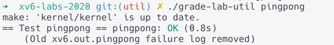
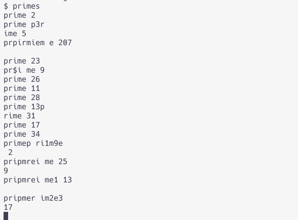

6.S081是原6.828 lab的简单重置版（萌新青春版），以RISC-V和xv6为例讲OS，Lab还挺有意思的。 
<!-- more -->

之前都是学的ARM，之前自己看csapp的时候x86汇编那几章全跳过去了。正好最近刚考完最后一门课，老板留我们7月在学校里打黑工（其实完全没啥事干），可以闲下来做点一直想做但没空的Lab了。

## Lab1

第一个Lab,都很简单，帮你熟悉一下xv6和系统调用。

直接照着提示做就好了。

测试可以用`make grade`测试全部成绩。测试单个成绩可以用`./grade-lab-util xxx` 或者`make GRADEFLAGS=xxx grade`

有的时候需要测试打印

### Boot xv6

先下载

```bash
git clone git://g.csail.mit.edu/xv6-labs-2020
cd xv6-labs-2020
git switch util
```

然后编译运行xv6。

### sleep(easy)

> Implement the UNIX program `sleep` for xv6; your `sleep` should pause  for a user-specified number of ticks.  A tick is a notion of time  defined by the xv6 kernel, namely the time between two interrupts  from the timer chip.  Your solution should be in the file  `user/sleep.c`.

这个也没有什么好说的，让你熟悉一下系统调用。

```c
#include "kernel/types.h"
#include "kernel/stat.h"
#include "user/user.h"

int
main(int argc, char *argv[])
{
  if (argc != 2)
  {
      fprintf(2, "usage: sleep <n>\n");
      exit(1);
  }
  int n = atoi(argv[1]);
  sleep(n);
  exit(0);
}
```

然后看一下测试（grade），一次通过，简单。


### pingpong(easy)

> Write a program that uses UNIX system calls to ''ping-pong'' a  byte between two processes over a pair of pipes, one for each  direction.  The parent should send a byte to the child;  the child should print "<pid>: received ping",  where <pid> is its process ID,  write the byte on the pipe to the parent,  and exit;  the parent should read the byte from the child,  print "<pid>: received pong",  and exit.  Your  solution should be in the file `user/pingpong.c`.

```c
#include "kernel/types.h"
#include "kernel/stat.h"
#include "user/user.h"

int
main(int argc, char *argv[])
{
  int parent[2];
  int child[2];
  int p = pipe(parent);
  int c = pipe(child);

  char buf[1];

  if(p == -1) {
    printf("error create pipe parent");
  }

  if(c == -1) {
    printf("error create pipe child");
  }

  if (fork() == 0)  //child process, fork = 0
  {
    close(parent[1]); //close write of parent
    close(child[0]); //close read of child
    read(parent[0], buf, 1);
    printf("%d: received p%sng\n", getpid(), buf);
    write(child[1], "o", 1);
    close(child[1]); //close write of child
  }
  else if (fork() > 0)  //parent process, fork > 0
  {
    close(parent[0]); //close read of parent
    close(child[1]);  //close write of child
    write(parent[1], "i", 1);
    close(parent[1]); //close write of parent
    read(child[0], buf, 1);
    printf("%d: received p%sng\n", getpid(), buf);
  }
  exit(0);
}
```

熟悉一下fork和管道呗。

一开始传的是"ping", "pong"，各占四个byte，又读了一遍题发现这里只让用1个byte，注意到ping和pong只差一个字母，那就传i和o好了。

这个小玩意本身没什么难的，已经对c完全手生的我愣是做了一个多小时。pipe的0是读，1是写，一开始我搞反了，下午上一个水课的时候又困又饿，调了半个小时百思不得其解。这个Lab几个作业里面做的最失败的一个（没想到竟然栽在一个easy上了），写了一点注释整理了好几次思路才pass。



### primes

>Write a concurrent version of prime sieve using pipes. This idea is due to Doug McIlroy, inventor of Unix pipes. The picture halfway down [this page](http://swtch.com/~rsc/thread/) and the surrounding text explain how to do it. Your solution should be in the file `user/primes.c`.

素数筛，这个之前看go语言圣经的经典例子。 扔给你的这篇论文[Bell Labs and CSP Threads](https://swtch.com/~rsc/thread/) 扯了一下CSP模型的，你看这作者Russ Cox，霍，这不是go的.....再一看素数筛、共享内存、CSP模型介绍、  后面还提了一嘴go，引用里一堆Robe Pike等熟悉的名字。写过go的孩子是不是有一股我们在哪里见过的感觉......

```c
int
main(int argc, char *argv[])
{
  // char prime[MAXN];
  // menset(prime, 1, sizeof(prime));
  int p[2];
  pipe(p);

  if (fork() < 0) //children process
  {
    fprintf(2, "fork error\n");
    exit(0);
  }
  if (fork() == 0) {
    sieve(p);
  }
  else  //p process
  {
    for (int i = 2; i <= MAXN; i++) {
      write(p[1], &i, sizeof(int)); //write numbers into pipe
    }
    close(p[1]); //close wiring of parent
    wait((int *)0);  //wait for all child process to end
  }
  exit(0);
}

void
sieve(int* p)
{
  int child[2];
  int n;

  close(p[1]);

  if (read(p[0], &n, sizeof(int)) == 0)
  {
    exit(0); //exit 
  }
  pipe(child);
  if (fork() == 0)  //child is not prime
  {
    sieve(child); //start a new child process
  }
  else
  {
    close(child[0]);
    printf("prime %d\n", n);
    int prime = n;
    while (read((p[0]), &n, sizeof(int)) != 0) {
      if (n%prime != 0) {
        write(child[1], &n, sizeof(int));
      }
    }
    close(child[1]);  //close writing of parent
    wait((int *)0);
    exit(0);
  }
}
```

一开始觉得这有什么难的，仿照go版本写一个不就完事了。也没看提示，在我本机上明明是好的扔到qemu的xv6上就开始乱了，调了半天。然后又读了一遍看到提示`Be careful to close file descriptors that a process doesn't need, because otherwise your program will run xv6 out of resources before the first process reaches 35.`

然后发现打印出来有时是正确的，有时是乱序的。



最后又搜了一下， [Coroutine prime number sieve](https://www.cs.dartmouth.edu/~doug/sieve/sieve.pdf), Douglas McIlroy在这里面给了一个c的例子，用dup来复制文件描述符，然后关闭管道。对照着这个我检查了一下，是少了一个`    close(p[0]);`

比go麻烦好多........

### find

> Write a simple version of the UNIX find program: find all the files in a directory tree with a specific name. Your solution should be in the file `user/find.c`.

这个不难，处理细节有点繁琐，注意递归的时候不要把`.`和`..`算进去就好了。可以参考`ls.c`和`grep.c`（选做正则匹配）。照抄ls的代码然后写一个简单的DFS或者BFS就可以了（目录是个树，如果不考虑软链接）。

### xargs

实现xarg命令，就用fork和exec实现就好了。这些碰到问题可以直接参考（抄 袭）一下xv6的源码或者gnu coreutils的实现。代码略长，不贴了。**注意**这里每次调试的时候要`make clean`清除编译缓存。

贴一个xargs用法的比较好的文章：[Linux xargs命令详解](https://www.junmajinlong.com/shell/xargs/) 为数不多的对这个命令的用心介绍。

## 题外话


大三的时候学的微嵌（ARM的），当时讲的也水，大作业和实验也水（什么跑马灯驱动啊、ARM汇编啊，c内联汇编啊，还有一点FPGA），考试全都是抄书抄PPT写概念。深感当时学的太水了，走马观花看了一堆概念，实际上根本不会。

现在在实验室基本除了划水就是做一些CRUD的垃圾项目，什么XX管理系统，什么XX网站，什么基于机器学习的论文灌水；偶尔维护一下师兄师姐乱七八糟的祖传代码，感觉再这样虚度时光就要变成一个废人了，现在连c都生疏了。暂时打算从6.828和6.824开始，后面可能会做一点数据库的。

Verilog和VHDL这些暂时不打算再碰了，现在只想用c写。现在实验室有没有FPGA的板子，现在对RTL那些几乎也忘得差不多了，逻辑综合那些更别提了，本科那基本verilog的书当时疫情毕业也都送人了。

实验室已经两三年没人搞硬件了，堆在角落里的示波器和焊台也已经蒙了一层灰尘，罪过罪过。估计以后也没什么焊板子调运放的机会了.......

突然发现用go已经用习惯了，甚至感觉写go还挺舒服。。。用习惯了go的管道defer写close，写这个的时候老忘了close。**而且我至少不下十次忘记末尾加分号`；`了**，完了，写go写出肌肉记忆了。

（说起来Go写多了真是有点被惯坏了，现在再回去写c，手动管理内存和指针都觉得好麻烦，管道和进程也觉得不顺手。另一个非常非常难受的地方是，习惯了go很快的编译速度，现在每次等编译都好难受啊）

## 参考和推荐

### 链接


https://pdos.csail.mit.edu/6.828/2020/schedule.html
<!-- 
https://www.cnblogs.com/fatsheep9146/p/5216681.html

https://www.cnblogs.com/fatsheep9146/category/769143.html

https://clownote.github.io/about/ -->

xv6的资料

https://pdos.csail.mit.edu/6.828/2020/xv6/book-riscv-rev1.pdf

哈工大的课，跟6.S081前面几个lab差不多。

https://hitsz-lab.gitee.io/os_lab/

risc-v 资料

http://crva.ict.ac.cn/documents/RISC-V-Reader-Chinese-v2p1.pdf

调试：

https://twdlll.github.io/2020/11/10/6.S081-2/

https://zhuanlan.zhihu.com/p/166413604 clion调试

https://www.cnblogs.com/KatyuMarisaBlog/p/13727565.html vscode调试


### 其他的一些推荐

*The Linux Programming Interface: A Linux and UNIX System Programming Handbook*（中文版：《Linux/Unix系统编程手册》上下两册，下册翻译的很烂），相当不错的工具书，可以放在手边当参考书和工具书用。

[Linux man pages online](https://man7.org/linux/man-pages/index.html) 在线参考手册，必备

https://github.com/SI-RISCV/e200_opensource 没看过，据说还行。

现代操作系统

[《现代操作系统：原理与实现》](https://ipads.se.sjtu.edu.cn/mospi/) 上交IPADS的，我还没买。据说相当不错。（这本我自己一点也没看过，）

### 前置工作


c语言， 大概弄懂k&r那本*The C Programming Language*就可以开工了。当然，懂得越多越好，多多益善。

**菊巨可以用Rust哦，贵清[rCore](https://github.com/rcore-os/rCore)那边的课据说挺好的**（群友们人均Rust, 就只本菜不会Rust了）

gdb等调试手段要熟， 没法调试等着两眼抓瞎吧。

熟悉链接库和编译那一套，Makefile什么的会用就行了。不熟悉编译的去编译个LFS（Linux from Scratch）就差不多了。

一些基础的书和知识，比如csapp等书可以先看看。

参考手册和工具书先备着，RISC-V的资料也备着。xv6有很多可以参考的地方。

xv6的资料在这里：https://pdos.csail.mit.edu/6.828/2020/xv6.html
这有一个中文的翻译：（版本略老，是x86的）
https://github.com/ranxian/xv6-chinese

