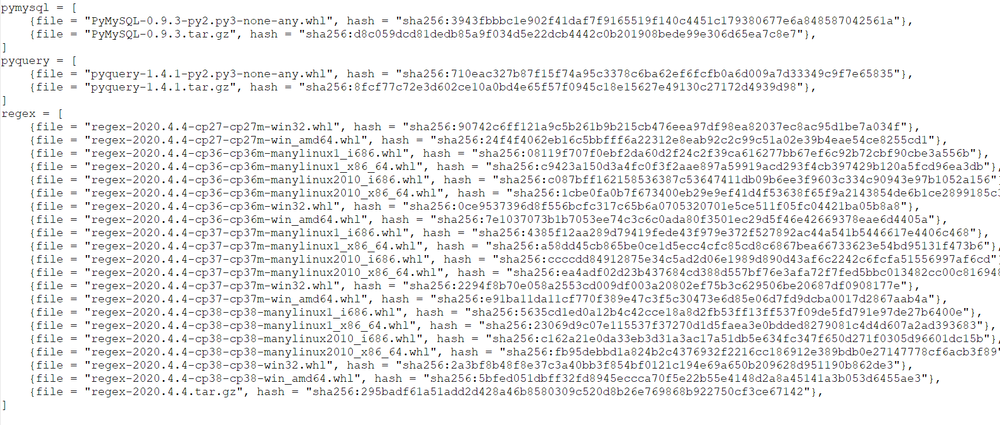

等待填坑
<!-- more -->

## 碎碎念

2020年了，python2该退休了（真是不太想再看到python2了，祖传依赖令人头大）

安利包管理工具poetry，试了都说好

python3.8怕是串了Go和C++的味，算了，真香

## python多版本管理

python的包管理是个很混乱的事，
一般单版本基本上没事，但是装了N个版本，甚至还有python2，麻烦就来了，一不小心就被坑，尤其是在大家都用的服务器上。（这上面有2.7，3.5，3.6和师兄炼丹装的conda3.7、3.6，不要问我为什么linux装conda，师兄干的）

我用自己的linux用户可以避开root用户底下一些混乱环境（比如conda）
主要的问题是切换python版本和python包管理，切换python版本一般用pyenv；包管理选择很多，一直没发现特别完美的工具。直到，发现了Poetry

### pyenv

pyenv用来切换python版本，配合其他工具管理包

### venv和virtualvenv

venv是[python3官方的包管理工具](https://docs.python.org/zh-cn/3/tutorial/venv.html)，virtualvenv兼容py2、3，这两个感觉用的最多了，看到别人的很多项目都用的这个，pycharm默认也是这玩意
没什么特殊需求就用这个吧

### pipenv

一个类似Ruby的Bundler的东西
纯指定依赖，使用体验比上面那个好，有一点慢
（不推荐在win上用）

就跟npm差不多，和node_modules差不多的Pipfile（存放本地包），和npm的package-lock.json差不多的Pipfile.lock（版本锁）

### Poetry

用了一阵发现这个挺好，喜欢

能管理python版本和python的包，还能用来打包
配置文件是单个toml，很舒服，依赖在poetry.lock里面

一个小问题是初次加载依赖有点慢，原因见[这里](https://python-poetry.org/docs/faq/#why-is-the-dependency-resolution-process-slow)。这也不能怪poetry，PyPI上那么多库，还有不少野库，很多库并没有规范声明Metadata，poetry没法通过调PyPI的API判断该下哪种版本的包，就只能把所有的都拉下来然后判断该用哪个

我们打开poetry.lock文件,可以看到，一个版本所有的发行包（packages）都被拉了下来



这个目前无解
>At the moment there is no way around it.

如果再次用到某个库，poetry之前缓存了发行信息，不会出现那种全下一遍的事了
>Once Poetry has cached the releases' information, the dependency resolution process will be much faster.

目前还没有太好的办法，在[issue评论区](https://github.com/python-poetry/poetry/issues/2094#issuecomment-609648194)看到一个扭曲的方法

```shell
poetry export -f requirements.txt > requirements.txt
python -m pip install -r requirements.txt
poetry install
```

### Docker&虚拟机

Django之类的项目部署的时候推荐Docker
一般开发环境没有必要上Docker，真机就挺好，Docker不熟悉的反而可能造成不少麻烦(比如网络部分那堆坑)，怕搞乱环境不如直接上虚拟机。
Docker的镜像有官方的python，但是非常大，上G。如果自己写Dockerfile构建一个，缩减镜像，调度每个容器的内存，都是远比前面那几个东西麻烦的事情。
Docker我感觉并不适合个人开发环境，感觉部署和运行的时候方便点，用来当开发环境体验不是太好。
Docker在调试的时候并不太舒服，而且对Docker初学者来说，网络那里很多坑，为了方便或节省时间用Docker配python的开发环境
但是这么一配置，怎么比原来麻烦多了，Docker狂热爱好者吹嘘的部署方便这里在需要调试的时候并没有什么优势。
虽然Docker本身并不吃你太多内存，但是Docker容器跑起来，如果不调度和限制，经常占了好多内存，虽然写python一般也不在乎在这个。

### anaconda

我反正不喜欢，没怎么用过，看到这种全家桶我就害怕（早年360和金山留下的阴影，请谅解）。
把python当matlab用的、习惯matlab那种又大又卡但是科学计算功能齐全的全家桶的人可以装个这个。
win10有些包很难装，倒是可以把ananconda当jupyter notebook的win10安装工具人；平时就写写python玩就不要装这玩意了，打开win10的应用商店，搜python，点安装，好了，用吧
炼丹CUDA之类的建议出门左转用Linux，win10跟torch之类的东西八字不合，这是conda也挽救不了的


## 参考

1. [PEP8](https://www.python.org/dev/peps/pep-0008/)
2. [Effective Python 翻译版](https://guoruibiao.gitbooks.io/effective-python/content/)
3. Fluent Python
4. [pylint](https://www.pylint.org/)
5. [poetry官网](https://python-poetry.org/)
