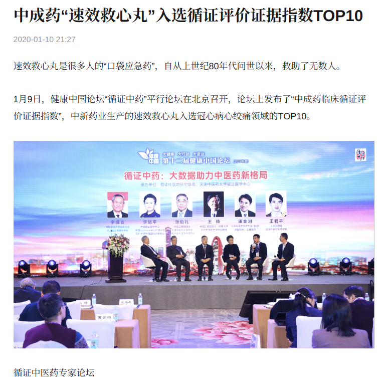
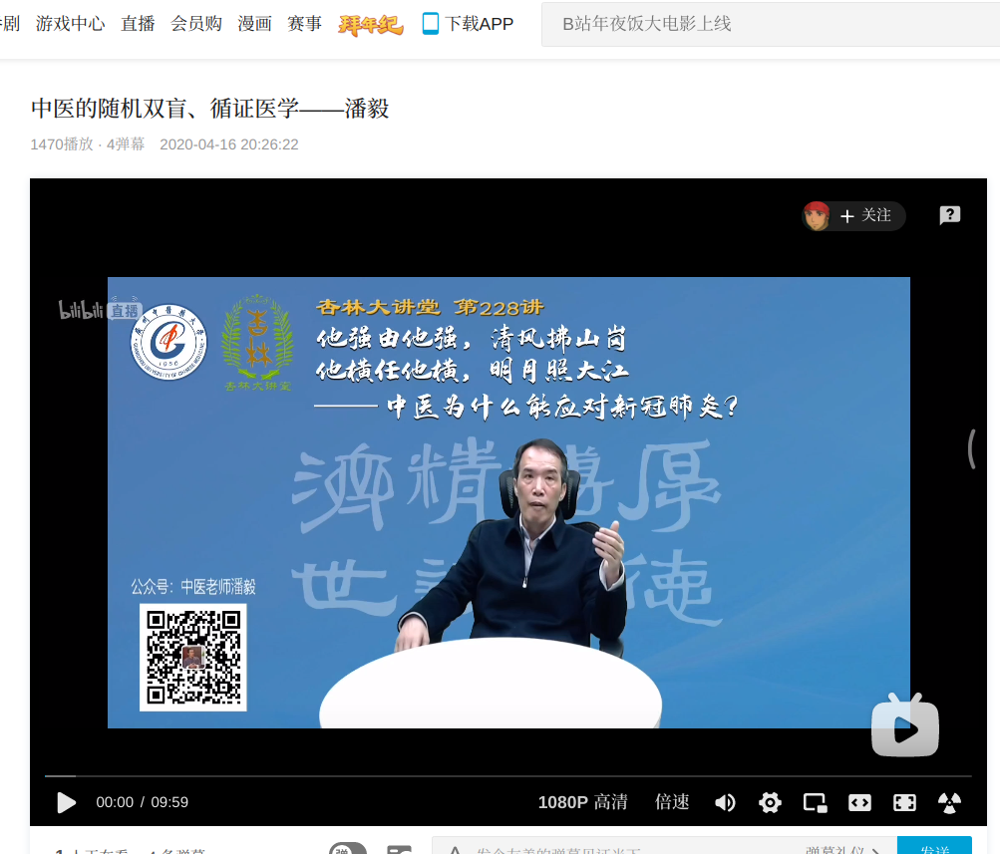
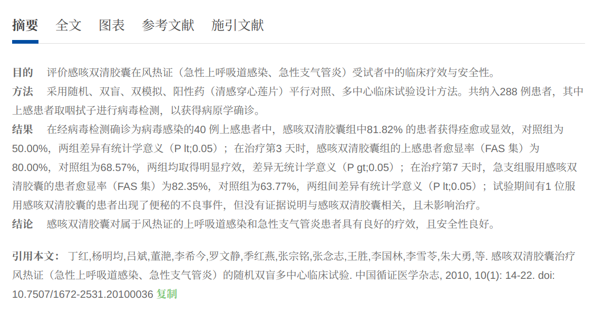
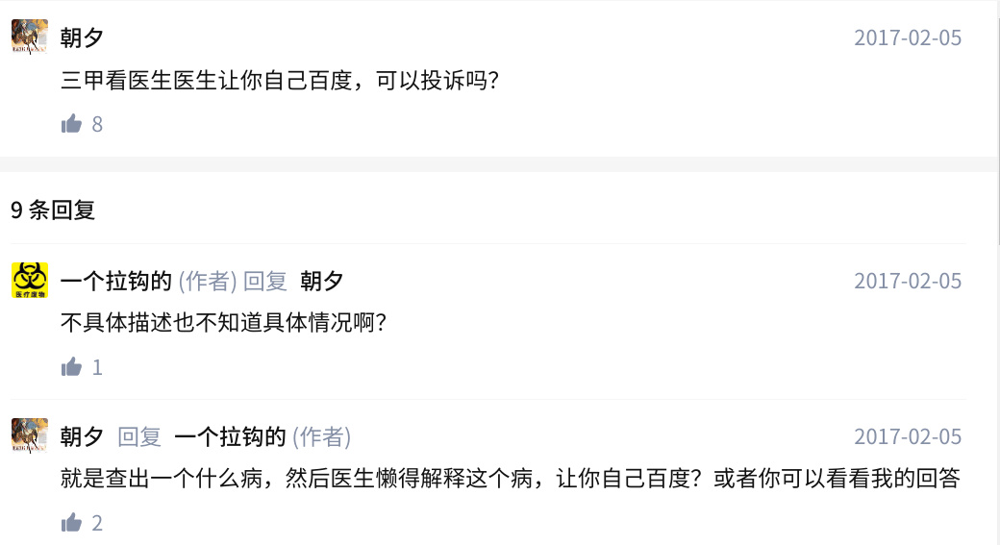
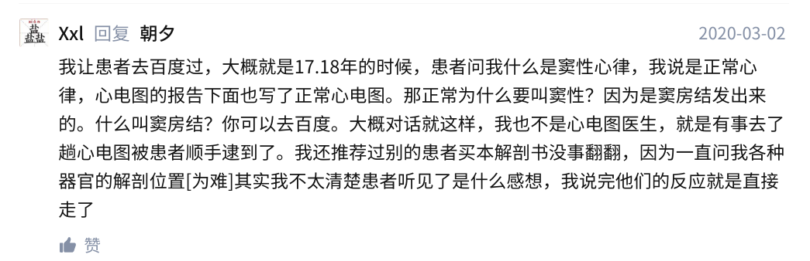

半个局外人的流言谶语，以及乌鸦嘴。未完待续，不定期更新。
<!-- more -->

目前施工进度：35%   
大概列个标题，很多大坑比如医疗私有化的问题有空了慢慢填。

当然我不是医学生，当年高考报志愿的时候由于色弱被医学几乎所有专业拒之门外。

虽然本科录取通知书和毕业证上都写的是生物医学工程（是的，这个专业也是色弱与狗不得报考。可我是报了通信电子被调剂过来的），虽然每次出门说出这个专业总被认成是学生物的、学医的，很惭愧，生化相关的就没学过，唯一跟生物沾点边的是大一的必须选的选修课生命科学导论（只有一个学分的选修，上课全程在写微积分线代作业，老师非常善良，开卷考试全程抄书），唯一跟医学沾点边的是大一的解剖（也是选修，两个学分，上课全程在写电分大雾作业，考试划重点精确到第几章第几页第几段的第几个句子）。

本来是想去搞硬件的，本科还在搞医疗器械那会也确实在焊板子弄单片机搞stm32烧串口调测量信号，不过最后还是逃离了医疗器械，当了硬件逃兵。

快要过去的一年发生了不少事，每次想写点什么，打了一堆字又删了，原来的知乎大号早就宣布退乎清空回答了，丁香园小木虫之类的地方又不想去，发到博客没多少人看（以及会有另一些人看，近似于发QQ空间的效果）。

发在这里又不能像某乎那样开个小号再开个匿名，利益相关，匿了.jpg

由于还在坑中+实名网上冲浪，有些东西不会多讲。

## 现状

### 医疗器械

啊，老本行，拿出来单独说一下（很惭愧，从这一行跑路了）

这里的医疗器械只讲一下电子设备，比如血压血糖体温之类的传感测量设备，还有那些X光机、CT、PETCT、彩超、MRI、NMRI那一堆摆在影像科的昂贵的大设备。用于检测的那些设备没搞过，不懂；医疗耗材之类的完全不懂，听说川大那边有不少搞生物医学材料的，听说强生美敦力罗氏之类的企业在做。

比较贵的那些大设备以前长期处于国外几家大公司垄断中，主要是GPS三家。通用电气一直在没落，飞利浦这两年也有点不思进取，西门子还行，不过这两年逐渐被联影迈瑞蚕食掉不少市场。

国内公司大概就
联影 迈瑞 理邦，这些后面慢慢讲，一时半会讲不完

联影号称是医疗器械行业的华为，实际加班可能比华为还严重；像当年菊花从思科挖人一样，联影从西门子等挖了好多高管和技术人员，从而实现了自主研发。

东软之类的国企现在大都没落了。

国内学校搞医疗器械的不是很多，基本都挂在生物医学工程下面，有的挂在精密仪器和自动化下面（说起来你电生命学院最早就是从自动化测量那边分出去的，早年一群搞医疗器械的，不过后来逐渐都去灌水了，硬件没多少人搞了）。不算材料那些，高校里面还在搞医疗电子并且还算可以的可能就浙大和重庆大学的一些组了(不仅难搞还要投入很多钱还不好发文章，最终一个个都去生化环材或者人工智能识别影像病灶灌水去了)。

### 医学影像

这个以后再讲。

### 医学信息

算是正在医学信息的坑里面划水吧，

入坑，你将看到各路祖传机器和祖传代码，包括Delphi，PowerBuilder，SQL Server 2000，远古版本的Windows Server 和 Windows XP（当然，都是盗版的），Oracle（几乎都是远古版本，不少盗版，比较有钱的大医院可能会有正版），偶尔可能还有完美兼容ie的Flash，WebForms；
各种神奇的导出格式，不规范的XML，各种自定义的数据格式和编码（某些公司自己弄出来的私有格式）

各种打着信息化方便服务医护人员和患者旗号的政策把医护人员和患者都折腾的半死。各种灌水论文，各路骗钱公司。。。。

<!-- 国内知名的医疗软件基本都是再用PB,比如金蝶 创业 众阳。也没有互联网软件公司出来革了她们的命 -->

#### HIS系统

略有年头的词。不少HIS系统比我还老，祖传代码没人敢动，去医院转一圈一下你会发现真就是祖传微机祖传服务器祖传软件，不知道多少年前采购的东西用到天荒地老。

有些话我不方便说太多。

这种单位采购的XX系统，大家心里应该都能想象出来。想像不出来的请回忆一下学校选课系统/教务系统支配的恐惧。除了学校学生自己做的选课系统，采购的选课系统基本都是方正、清元、强智。

比如[隔壁西电曾经的清元](https://www.zhihu.com/question/26516180)，比如[武大这个](https://www.zhihu.com/question/362667701)，当然还有[你电这个](https://www.zhihu.com/question/264705499/answer/284391933)我大一的时候连续崩溃一周搞得大家半夜起来的神仙选课系统（这可不是高并发抢课，这是用权重投分选课，而且还是各年级分开错峰权重选课）

为什么HIS系统这么难用，和这个问题大致是一样的：

> 为什么学校的选课系统、教务系统这么垃圾

还没用过选课系统的高中生可以看丁香园的这篇吐槽[^2]感受一下，医院的HIS系统操作使用起来非常不舒服，被医护人员吐槽是家常便饭的事。不过HIS系统，怎么说呢，全世界就没一个好用的。

用教务选课系统来形容可能会让你们低估HIS系统的难用程度，选课系统最多也就世界上最好的语言PHP+WebForms，新一点的前端可能是jQuery，都还能招到人来维护；而且都是Web版的选课系统。不少选课系统还有在校学生维护，运维和改祖传代码的能力已经吊打医院信息科了。

而且大部分医院都异常执着于采用所谓的C/S架构（狭义的Client/Server，多指能且仅能装在Windos XP上的桌面客户端），非常看不起也不愿意买B/S（Browser/Server,就是Web呗）的东西，认为那都是不安全的东西。
~~说的好像他们的祖传windows xp多安全一样，不管，反正就是浏览器的东西不安全~~

有的医院倒是想换新的电脑，结果发现以前斥巨资采购的老软件最高只支持Windows XP；换新的HIS系统又拿不出那么多钱，将就着用呗。

采购价格通常很贵，三甲医院买的软件可能基本都几百万甚至上千万吧（有的是吃回扣，有的是花公家的钱不心疼，有的是）

国内的医院大部分是是断网的，是只能上医院内部局域网那种，他们说是为了安全。我悟了，安全全靠断网物理隔离。

#### 电子病历

##### 到底有啥用

在处理常见大量重复病情的时候能复制粘贴会比手写快一点。
感觉为数不多的好处可能是不用再面对手写病历和处方上面难以辨认的字了。
但是手写病历自带的最高级别的加密通信也没了。

当医院采购的电子病历软件极其难用的情况下，可能对医生是个负担。经常有医师吐槽用某些电子病历系统比手写还慢，远远不如医生直接用Word写病历。
（废话，Word可是地表最强富文本编辑器之一，能打过Word的东西怕是一只手能数过来）

##### 命名实体识别

命名实体识别（Named Entity Recognition），不少人NLP入门的第一个项目。（确实适合入门，NLP不少领域都很难，而这个很简单，而且可以从爬数据、清洗、自己指定规则和标注（标注几百份就能见效），自己构建数据集，选模型调参（简单的模型可以自己从底层实现一遍））

电子病历/医学文献/其他乱七八糟的医学文本，能用来命名实体识别的都被轮过不知道多少次了。实乃广大学子毕业设计水论文居家编论文必备。

从隐马尔科夫模型到SVM到CNN到LSTM到BERT，基本上但凡NLP取得一点进展，就拿来用电子病历做一个命名实体识别，英文做一遍，中文再做一遍。实乃苦命学子水论文毕业的不二法宝。

现在已经非常成熟，BERT的准确率在电子病历上能轻易达到95%，只要喂的语料数据足够多足够好，达到98%也不难。

基本已经没有什么上升空间了。

#### 临床决策

正在搞，以后再讲。跟医学图像那些可以做到准确率超越多年经验的医师不一样，临床决策不管是早年的专家系统、量表、决策树、自动机之类的东西还是后来又火了一阵的机器学习，效果都不太好，跟人类经验比差的太远了。

#### 循证医学、RCT和Meta分析

循证医学这个东西，非医学人士不要去看它那些概念，现在这个东西跟中医一起同步高频出现。

正经学过数理统计、随机过程、就当作重新发明统计学就好了。

> 可能是统计学没学过的老专家想出来的一种 “科学” 研究方法

**如果你听到一个人/媒体整天把循证医学挂在嘴边，先怀疑一下是不是个骗子。就像把AI、人工智能、区块链挂在嘴边的，直接先当成炒作骗子再说。虽然区块链确实是很不错的技术。**

比如:

1. 国士无双老骗子

>"我从事了50多年的临床工作,对中医做得很少.为什么我现在来学习中医?因为经过SARS防治至今十几 年对中医防治流感的临床体会,认识到需要发挥国家战略优势,以独特的医疗思路,模式,方法和要领,把我国的中医药推广到全世界.克强总理说,中国发展的重 要思路是体制驱动创新.我们有很好的传统和精神,中医药也要在新的体制下推动创新.在不久前召开的首届两岸四地中医药循证高峰论坛上,呼吸疾病国家重点实 验室主任,广州医科大学附属第一医院,广州呼吸疾病研究所荣誉所长钟南山院士深有感慨地表示.

2. 速效救心丸



3. 老中医



>潘毅老师直播末尾说的：疫情爆发后，全世界只有我们能用中医、西医两种诊疗手段，并且都发挥了很大作用。对比国外只有西医一种诊疗手段，我们能深刻体会到「天佑中华」四字的含义

以上节选自b站最爱的团团（共青团广州中医药大学委员会）

以上结论是我结合老祖宗千年古籍，经过大样本调查结合人工智能得出的。

如果有人感到被冒犯，那一定是你慧根不足，受到了食品添加剂和化学污染，百年之内必死无疑，快吃点速效救心丸抢救一下，毕竟心主神明。

>被列入中成药临床循证评价证据指数，是对速效救心丸在循证医学层面又一次认可，将为推动速效救心丸高质量研究提供技术支持。

##### RCT

RCT，就是现在初中生物都要学的随机对照试验。

医学实验和生物实验有点区别，



##### 一些来不及/做不出来实验的特殊场合

正常流程的新药审批和
有些只是来不及等不了，比如去年疫情刚爆发的时候

##### Meta分析

嗯，Meta分析的名声也快被灌水搞烂了（本来也不怎么好，Meta material之类的带Meta的字眼听着就像灌水）

大概的原理可以看[这篇回答](https://www.zhihu.com/question/264789460/answer/286468477)


Meta分析的论文作者如果没有该领域相关研究成果或者多年临床经验，不妨直接当这篇Meta分析是垃圾灌水


Meta分析在十几年是灌水的黄金时期，大量灌水文章批量生产。以至于灌到现在，不少单位已经明令不能用Meta分析的文章来评奖和评职称了，灌水都不让灌了。

有固定格式和套路，不需要投入经费和时间做实验，甚至不需要熟悉该领域，也不要懂Meta分析的统计学原理，就可以灌水。

随便一个本科生甚至初中生，完全没有相关领域的知识，临时培训三个月都能弄出一篇Meta分析来，这灌水速度和难度在生物医学这些灌水成风的领域都引起了恐慌，甚至评职称评奖考核不允许Meta分析。

大部分Meta分析的价值可能远不如某领域大牛或有经验医生的采访、回顾总结或综述。

综述类的东西，就应该请该领域的执牛耳者、多年从业人员、一线临床医生或在前沿领域做出突出贡献的人来写

**大部分Meta分析的价值，可以作为医学本科生或者研究生《医学文献检索和写作》成绩占比40%的期末作业**

如果还要再说点什么，

**Meta分析的灌水文章和Uptodate临床指南之间差了10个维基百科**

### 远程医疗

别让我听到5G+远程医疗了行不行。TMD, 烦死了。

医生做个飞刀被举报了都要罚款，却在吹什么远程医疗。允许病人外地就医，医生可以去外出开飞刀，比什么远程医疗都好。

## 一些风气

施工中，尚未写完

## 关于医疗私有化

这个问题比较复杂，一时半会讲不完，以后再说。
大部分公立医院都有着国企的通病

下面是比较有意思的几个：

宿迁医改

莆田系

爱思眼科

<!-- 奥派喜欢自由市场，不过长远看我们都死了。等不及了，信誉和口碑的建立至少需要二十年，人能有几个二十年？ -->

## 业界和学界脱节

大多数工科的教育、学界和业界基本都或多或少脱节，这是全球普遍现象.

### 学校跟不上行业发展

学生的教材更新慢，实际参与项目的机会也少，不少工科上课只讲PPT，考核也更偏重理论研究。国内很多教科书和讲课方式基本一成不变，一些停滞不前的领域还好。一些发展迅速的领域，从编教材到审批到讲课使用可能有至少五至十年的代差，结果讲的东西几乎都被淘汰了。

CT和磁共振这些设备，学校的科研成果和实力已经和联影迈瑞脱节太远了。

在一些需要大量砸钱投入产品研发的领域，高校甚至很多研究所和企业的差距特别明显。软硬件这些最近几十年发展比较快又比较赚钱的行业尤其明显，学界被远远甩在后面。
（分两种，一种是航天这种几乎不赚钱的；一种是芯片这种能赚钱的）

在大型医疗器械基本被联影和迈瑞甩开太多，国外的学校也和西门子通用电气有巨大的差距。在通信方面，高校和研究所和中兴华为存在代差。在芯片方面，高通英特尔AMD台积电随便拉一个出来都和学校的工艺有代差，紫光和中芯也和象牙塔里的研究有巨大的差距。

这些学界逐渐落后的行业，有学术理想的，可能到业界去是更好的选择。下一个贝尔实验室大概率不会在动作迟缓还没太多钱的学界出现。

钱，主要是钱。哪钱多人去哪。

### 自娱自乐的科研

就喜欢研究些所谓高端和超前的东西，结果实际十年内制造不了、有重大缺陷、成本太高，都没法用。

很多工科已经全面生化环材化了。（不如说是被生化环材凭借高影响因子和发论文快的优势大举入侵）原先在做模拟器件电源的纷纷去搞钙钛矿、石墨烯，原先做射频、电磁场和控制的纷纷去搞深度学习。用钙钛矿做电磁材料，用深度学习搞天线和电路布线，论文发了不少，学术圈玩的挺High,实际效果一塌糊涂。

## 论文水漫金山

在全球，生化环材等实验研究的灌水和造假都是普遍现象。对该领域抱有幻想、未接触过的推荐阅读以下回答。

[如何看待 2019 年诺奖得主塞门扎 30 多篇论文涉嫌 P 图造假、学术不端，是真的翻车了吗？ - 阿诺的回答](https://www.zhihu.com/question/425911838/answer/1530280302
)
(这个用户只有这一个回答，约等于匿名，答案1万两千字左右，赞数接近两万。为了防止哪天被b乎獾狸猿删了，备个份：[回答](../uploads/知乎回答.md)
同样适用于基础医学领域，或者说，生物医学的实验科研本就是一家。（这里主要指基础医学，临床的科研论文情况稍有不同）
准备入坑基础医学和医学科研的不要再背什么医学誓言了，多看点这种东西。

过气网红王垠几年前写的这个也可以看看，[学术腐败是历史的必然](http://www.yinwang.org/blog-cn/2014/03/24/academic-corruption)。王垠在PL界的建树虽然有些争议，当喷子时候的言论还是可以看一下，敢爱敢恨，比某些只会说漂亮话的人强。（不过计算机的科研跟生化环材比起来简直就是冰清玉洁，看王垠的这个会大大低估生化环材药学医学科研的黑暗程度）

### 科研论文的灌水和学阀的成型

博士大规模扩招，基础医学扩招，并不会带来医学科研水平的提升。恰恰相反，科研灌水和造假、急功近利、基础医学毕业像生化环材一样失业、研究内容像钙钛矿一样工业界用不了，都在加剧……

#### 高校和科研院所

>刑不上学部委员

学阀集团已经形成。前一阵饶毅举报大家也都看到了，图片误用。

当然饶毅自己也https://www.zhihu.com/question/306905936

基础医学正在扩招，大批理工院校和一些原来没有医学院的综合院校开办医学院。

#### 劳苦功高不如论文灌水

之前中科院、工信部、社科院的大学变成教育部直接管之后，基本都变成后娘养的。中国科学院大学整天被教育部排挤，原先工信部的一些学校也是。

前几个月发文说要破除"唯论文论"，很多人在那里担心那不就倒退回举孝廉了吗？有的学科哪怕直接举孝廉也不会比现在更烂了。

论文在很多工程性的领域已经变成了像八股文一样的东西，还是选武状元看八股文。

#### 医院的科研

以论文作为升值和考核的主要指标，会造成很恶劣的影响。医生的工作是治病，老师的工作是讲课和带学生，然而这些基本不算在评职称考核，主要看论文。
结果认真治病、辛勤工作可能最高也就停留在副主任医师，一点贡献没有整天文章灌水的升值贼快。

### 企业买通医院和论文

#### 研究造假和虚假宣传

https://zhuanlan.zhihu.com/p/35229540

买通期刊杂志和科研人员

不过大部分情况，只要买通媒体宣传就行了。实在不行再来点水军。

画风是这样的：

找二流报纸之类的权威媒体，已经微信公众号之类的文章，以及电视广告，再写点软文，成了。

#### 医药代理用论文贿赂医院

论文这种评职称和考核的硬通货最适合拿来行贿啦！
而且比直接打钱送礼隐蔽多了。

怎么说，感觉有的销售也挺惨的。帮医生写论文，帮医生动手术，帮。。。

### 圣人不死，大盗不止

学术圈至今能被各路期刊和杂志出版商两头赚钱疯狂割韭菜，劝大家还是不要报太大希望。用某人的话说，小资天然的软弱性，庙小妖风大，池浅王八多；用另一种流行的话说，费拉不堪。

学术圈和科研圈一群人整天说着要为人类XX事业做贡献，伟大的科学研究。结果发表个成果要给出版商和期刊交钱，下载个论文想查看个人类共有财产还要给爱思唯尔和知网这些毒瘤交钱。

知网能搞出cajviewer这种毒瘤和caj这种垃圾格式，这么多年骑在科研工作者头上拉屎，在座的各位科研人员都有责任。

```
导致学者修饰数据的祸首，回答里已经讲的很清楚了：执行同行评议的学术期刊。解决的方法也给出了：直接在网上发表实验数据。实际上这样的数据库也有类似的出现，例如各类预印本网站。但这些预印本仍然有形式审查，有内容审查，运营模式僵化，这样的发表几乎对传统学术期刊没有施加到任何压力。

真正会威胁到传统学术期刊的平台，应该具备如下特点：

首先，它的名字可以叫做例如Hypothesis in progress/in evolution, 其内容格式为先提出一个科学假设、然后上传相应的图片和数据，每一个图片和数据都有相应的原始数据，比如WB要有未剪切的原始的电泳和膜染色图，荧光照片要有未剪切的原片，如果服务器的储存量够大，则把每一组所有照片都要上传，并且指出结果中的图片是选用的哪一组的哪一张。

每一阶段实验完成后，对原始提出的假说进行完善、修改甚至推翻重来，但是不删除最原始的Hypothesis，以完整的呈现该Hypothesis的发展和完善过程。无论何时都允许任何人进行评论，从Hypothesis的创新性到方法学的合理性都可以评论和提出建议，比如是否有其他人已提出类似的假说，或有没有其他方法可以改进其假说，某个实验方法是否不合适等。

在该平台发表的目的是尽最大努力还原出一个研究的整体过程，呈现出研究的原貌，并且最大程度的保证其可重复性。而不是像现有学术器刊物那样，一个研究必须是完美的、要把数据修饰到作者自己都呕吐才可以发表。

每一个研究的影响力应该建立在发表者的理论/假设/数据在其领域内有多少人使用(注意不是引用)、有多少人利用该理论/假设/数据发现了新的药靶、开发了新的药物，或者开辟了新的研究领域。研究的评价再也不是根据什么影响因子、什么H因子、什么自然指数(让这些东西都他么的fu*k off！)。
```

这些年从开源到互联网（www原本的意思），免费开放共享的风气一直没怎么刮进大部分传统行业。不止传统行业，甚至计算机的很多领域都没这个风气。计算机图形学的封闭和计算机视觉突飞猛进形成了强烈的对比。

在医学领域（至少我接触到的国内）小圈子和不开放风气尤重，接受新知识和变化的速度也比较慢，山头和派系林立。
有什么好东西基本都当“祖传秘方”一样藏着，从来就不想着造福全人类，除非发论文或者开公众号吸粉。一副教会徒弟饿死师傅的作风。
有价值的资料除非发论文压榨光之后几乎很少放出来给大家共享，哪怕是去年疫情这种危急时刻，依然各怀鬼胎。

sci-hub程度还不够，要有效果需要像海盗湾那种法外狂徒之类的东西。

#### 何计身后评

比如这样，医保也没钱了，国家也别花些冤枉钱研究些灌水的东西了。就仿造国外领先的医疗耗材、医疗器械、医药（完全复刻不偷工减料那种），不管他什么专利版权。按打破国外垄断和降价多少的贡献评职称、企业免税，按为国家节省多少进口外汇评奖。药企等过来告侵犯版权？不管，党国千里长城封锁谷歌的壮举都干了还在乎这个。声称这是人类共同财产，把原来的垄断技术直接像全世界公开，不怕师出无名。
啥？扰乱市场秩序，逼得投入研发创新造福病人的医药企业血本无归？长期不利于医学进步？骂名背就背了，反正也不是第一次扰乱市场秩序了，医保都没钱了管它欧美医药企业死活干什么。医疗器械和医药一堆垄断寡头企业，名声本来也不是多好，本来也不是什么自由市场，一时半会亏损不了（挣钱都是上市圈钱，也不怎么靠真业绩）  
就现在这样子，经济危机动荡和战时状态十年内到来的概率并不低，该干的先干了再说。党和郭嘉背的黑锅

<!-- 
## 做梦

下面是黄梁美梦时间：

- 工科、医学等本科生取消毕业论文
- 原先归工信部的、卫生部的学校都从教育部还回去
- 李艳红和莆田系该坐牢的坐牢，该枪毙的枪毙
- 喂鸡委相关人员全国公审
- 中药注射液相关人员同上
- 计生干部该还钱，该偿命偿命
 -->

## 医患关系

网上提到医患关系，经常就在新闻评论区吵起来了。然后一拨人开始骂医生，另一拨人开始骂患者。

这里有必要引入其他的一些重要角色，并对角色做一些细分：

- 新闻媒体
- 网易新闻等新闻评论区
- b乎渣浪豆瓣
- 丁香园等医学论坛
- 党国
- 卫健委
- 财政部
- 百度
- 患者
- 医护人员
- 医院

然后还要再细分一下

- 公立医院医生
- 私立医院医生

公立医院

- 对患者认真负责的医生，医术也很好
- 对患者认真负责的医生，医术不行
- 对患者态度很差但是医术很好
- 对患者表面态度很好实际谋财害命
- 对患者表面态度不好，医术也不好

据我观察，除了知乎相关问题和丁香园论坛，以及微博医学大V的评论区，就没几个说医生好话的。

打着公益献血的献血车可能是很多人（尤其是某些在校学生）第一次对白衣天使和医护人员美好印象的幻灭。

也唯有这种问题下，知乎群情激愤，连医护人员都不护短了

https://www.zhihu.com/question/265527652

那问题来了，在人民群众眼里，身穿白大衣的血站采血护士等和医院医护人员是不是一伙的？

你说不是一伙的那在这个社会主义国家他们是不是同属卫生部门？

截取一段知乎三万赞的回答

>这就是典型的违约，我知道血液的储存等都需要费用，但是当卫生部制作发放献血证的时候代表国家确认了上面的那句话。
>
>这是国家给我的承诺。但是她违约了。

那你说这医患矛盾——————

我看还远远不够，全国患者和广大人民群众民意汹涌程度再加10倍，才算有点意思

不过到时候人头太多，血站红十字会和计生就爆满了，轮到某些人的时候监狱不够用，当然领导不用急，领导先走，可以优先进秦城。

那

### 知乎部分回答选摘

知乎，又名资乎。在医疗相关话题上又称医乎

[医患关系一直恶化下去会怎样？](https://www.zhihu.com/question/38850948) 这个回答底下放眼望去，九成回答都是医生和医学生。

比如这个问题：为什么现在有些人不尊重老师和医生呢？怎样才是健康的医患关系和师生关系？

```
发现一个非常有意思的情况

这个问题是关于老师和医生的，可是目前回答里几乎没有看到老师身影，80%都是医生在回答，尤其高赞的，而且大多数是批评老百姓的，真是有意思，不知是为啥。
```


为数不多的一些问题

[请大家说一说对医生的看法，我是医生，我想听负面的，看看医患关系的主要矛盾在哪里？](https://www.zhihu.com/question/327917541
)

难得的回答出现不同声音的问题：为什么知乎上关于医患关系的主流舆论站在医生一边？

```

我开始也站医生这边，直到看到一个患者做B超时，医生不顾及患者隐私，在患者未穿好衣服时候就喊下位进来。下面的评论全在阴阳怪气的嘲讽患者，顿时对这种风气极为反感。之后一个患者做了一个简单的挑手里的刺，收费大几百。我才发现知乎上的医学生连屁股也歪了。患者花费大几百，三个医生的治疗费只有几十块。是什么完美实现患者多花钱，医护少挣钱的。医生和患者同是资本和权利的受害者，医生确俨然觉得自己是资本和权利本身，站在患者对立面，喷患者。真分不清是屁股歪，还是短视。

作者：晓白
链接：https://www.zhihu.com/question/40289474/answer/1265159736
来源：知乎
```

```
知乎看久了，会对医生的认知产生割裂。知乎上的医生都是妙手仁心和蔼可亲，病患都是愚昧无知，口头禅是“好好一个人，怎么就没了呢？”而现实生活中呢，反正我见到的病人对着医生都是低声下气，而医生护士都各个趾高气扬对病人爱理不理，就算理了——不止一次见到病人或家属陪笑问医生问题，一句话还没说完，医生就怼了四五句。医生是不是都是精神分裂？

作者：黑喵警长酥酥
链接：https://www.zhihu.com/question/40289474/answer/974835166
来源：知乎
著作权归作者所有。商业转载请联系作者获得授权，非商业转载请注明出处。
```


```

作为曾经的护理人员，已离开这个行业好多年。

之前我还是很体谅医护人员辛苦，知道他们不容易，非常配合医护人员工作，有点小失误我都能理解，哪个医护人员不是在错误中成长的呢。

但是真的是他们不需要体谅。

我现在看病都要网上查阅一下，书本翻阅一下，有备而去。

我女儿2岁的时候有斜视的毛病，

网上说是视力有问题，建议查视力。

带她去儿科有名的三甲，医生看了看说是习惯问题，纠正就好了。

我说要查视力，医生说太小，没必要。

在我的坚持下，遗传散光200度，配了眼镜。

最近陪我妈甲状腺癌症术后复查，

真是气的我要死。

我妈一直没有盯着一个医生复诊，就是到了复诊时间，哪个医生坐班，就哪个医生复查。

但是一直按时按量吃药。

这次一查，医生劈头盖脸说我们服的药量不够，癌症复发。

我说我们是一直按照医嘱服药的。

她说那是你们没遇上我，其他医生就随便给你们开药的，如果是我不会这样。

我说那你帮我看一下开错药量的医生是哪个，病历本上字太潦草了，我不知道是什么名字，我去投诉。

她又说是我们的问题，是我们复诊时间晚了，是我们看到化验单的指标异常也不长点心，自己提前来医院。

我和我妈也不住在一起，她也不懂，我也有疏忽，没有关心，我也才刚看到指标，只知道她最近这个指标一直波动，在调整药量。

我说这个指标一直不在正常区间，所以一直来复查的，这次正好碰到疫情，晚了一个月来复诊。

她说那没办法，怪你们自己。

我当时就火了，我说行，是我们的问题，那你告诉我开错药量的医生的名字。

她就说你找别人干什么，是你们自己的问题干什么找别人。

我说你就说哪个人，你都说我妈癌症复发了，我总要问问他当时什么情况。

这个医生说你再不依不饶我就报警了，对着门诊护士说叫保安。

我就带着我妈走了，我还要带我爸去办理住院手续。

我对自己说再也不体谅医护人员，人家有保安有警察呢，我有什么？

哦～～～我有知道打人杀人违法，我不会干这些。

不知道干这些的人当时怎么想的。
```

```
这些年对于医患关系中的患者行为也有些矫枉过正了，前段时间看到一个帖子，题主说自己在医院被误诊了，感到很生气，如何要求医院和医生对此事负责。我认为这是很正常的维护自己权利的行为，结果最高赞嘲讽了题主，说医生在诊断过程中出现误诊是很正常的现象，机器流水的线上还会出现误差呢。

作者：司马碧池Valeria
链接：https://www.zhihu.com/question/327917541/answer/784547555
来源：知乎
著作权归作者所有。商业转载请联系作者获得授权，非商业转载请注明出处。

对，就像我去医院拆线，医生居然检查后告诉我没有线（问题是出院时她亲口告诉我需要拆线）。导致我伤口都掉痂愈合了才发现有线，惊恐地去医院拆线，这难道不比该拆的时候疼吗？我把事情发到知乎，有个医生居然觉得是我多事儿，医生没有责任，不该道歉。

只是让医生道个歉而已啊，这么难吗？
```

### 百度为代表的，咳咳

百度对整个中文互联网环境恶化都负有不可推卸的责任，直接把网上冲浪体验降低了五个档次。

**不像其他东西一样可以上网搜，甚至单凭网上的信息解决问题比问其他人效果还好，医学内容搜出来。。。。
（像计算机的大多数简单问题，直接怼一句“你不会百度吗”，然后扔给他“提问的智慧”）**

没受过完整医学培训的人只会变成这个样子：[百度查病给你带来过阴影吗？](https://www.zhihu.com/question/267965244)

然而总有医生不仅不想给病人解释，还让病人去百度（不想解释就不解释呗，直接跟病人说爱信不信）





ps: 多说一句无关的，作者“一个拉钩的”身为协和医学博士信中医[^3]，是一个比较有意思的观察样本。

这东西就没法让患者自己去了解，但凡真去搜了，一定演变成：之前医生在骗我，这病很重，患了绝症三天之内必死。然后怒骂医生，没病也给吓出病了。最终被莆田系谋财害命。

真的，医生不要让病人没事乱搜，病人想了解直接扔给他一个靠谱的科普网站、书籍之类的。

**魏则西**

### 历史变迁

现代医学发展起来以前各路巫医开开草药安慰剂，宗教信仰一般的存在，也很和谐（碰上曹操砍华佗那算倒霉）
赤脚医生那个年代很和谐，不过那个时候农村都是熟人社会，城市乡镇的国企和单位也是熟人社会。
在车匪路霸那个年代，收红包啊，庸医谋财害命啊，给人民群众留下了不好的印象。当然那个时候各行各业都乱。
大概1998-2010，经济发展特别快，房价也不是特别高，各行各业的矛盾都被掩盖了。
再后来经济增速放缓了，房价在14年暴涨，15年股灾，老龄化也来了，医保也恰好没钱了。
当然中央开会几次承诺要解决看病难看病贵的问题，然后医改改来改去......
当然现任某大领导还特别喜欢中医。

### 信息极度不对称

不管网上描绘的医生多惨，大部分情况下医生对患者拥有绝对的信息差优势。而且人体又不像工厂流水线出产的产品，同样的病情有的能好有的就死了，也不好断案到底是谁的问题，跟家庭内部纠纷、家务事一样扯不清。

于是断案的时候基本都是偏向患者，就像有了家暴纠纷和骚扰指控通常会偏向妇女儿童，哪怕没有证据。
这种做法好不好呢，

### 法律没用

毕竟这个地方“按闹分配”嘛，谁能闹谁有统战价值

### 媒体煽风点火

不是骂医生就是骂医闹（大部分媒体，尤其是官媒，都是在骂患者和医闹）  
反正就把矛盾往这些上面引，闭口不提医保钱都去哪儿，怎么亏空的，为什么当初承诺的不给报销了。

不过当年呼风唤雨的报社和纸媒杂志没什么人看了，不管是国内的人日南周还是国外的CNN，都在人人上网的新时代遭到唾骂。

## 规培

这个，冤有头债有主。华西一开始搞的还是不错的（至少看起来），然而，一推广....
旗号包括提升基层医院水平，然而有了规培之后华西等三甲医院赚了，没有规培点的小医院亏了。

至于医学生：

- 行会学徒制度
- 打杂苦力，轮转学到的也不多
- 钱又少拿三年
- 全面否定毕业证和执业医师考试
- 专硕性价比爆炸
- 离生化环材又近了一步

你看隔壁生化环材，三十多大龄博士穷的叮当响只能向家里要钱啃老；越老越吃香，指既得利益的老人压榨新人；本科毕业没法直接工作。
此时，一个不知规培为何物的工科生打酱油路过强势围观.jpg  

不过我人在成都，而且目前做的一堆项目和华西/川大有牵连，不多说了。

## 失灵的公共卫生体系

[如何看待湖南桃江四中暴发群体性肺结核？](https://www.zhihu.com/question/68241151)

这次疫情之后可能亡羊补牢会有所好转，但愿吧。哈哈，怎么可能，人类总是重复相同的悲剧。

每次先知作为乌鸦嘴被烧死，战士死在了战场。

## 医疗广告和互联网现状

占坑，施工中

### 医疗广告

占坑，施工中

### 百度和莆田系

### 医美和口腔

这些应该算是私立医院和广告最多的地方。也是最挣钱的。
从早年的百度莆田系、电视广告开始，到后来的小红书、美团、新康

## 医保

这有些话说了肯定要查水表，罢了

<!-- 

医保早就没钱了[停用部分医疗耗材是福是祸？](https://www.zhihu.com/question/67621140/answer/255464052)


>以前国家是喊口号，不动真格的，现在是不声不响却翻天覆地改变医疗现状。不仅仅是医报控费问题，而是去医疗包袱，医保广覆盖，维稳三位一体一次性解决。猜测步骤是：药品零差价（控药）→耗材停用（控医疗费用）→医疗器械零差价（控器械）→三级甲等医院停门诊（医疗分级，医疗下沉基层医院）→以上低水平，广覆盖解决老百姓医疗问题（三明政策终极目的）→五年后到十年间开始放开少量高端私立医院（同时放开医疗保险，法律监管等政策，五年内绝不会放开，最多口头鼓励，稍一深入思考就知道为什么了）→十年后开始大量放开高端私立医院。牺牲二十年的医疗，换得国家医疗长治久安。同时换一批人！留一个预言在这里，十年后看看有没有错。

>中国医生是不是价廉物美，要看怎么看。价廉是肯定的，同一疾病的花费绝对是全世界最便宜之一。物美不美要分开看，中国医生分布有个特点，就是工资一样，奖金差距不大。正当收入哪里都低的可怜，而职称和位置决定了……。从全国范围来讲，中国50%左右的基层医生，加上20%的民营医院医生，专科医院医生，军队医院医生…水平是及其低下的。其中人员大部分学历也是本科以下，这部分绝对谈不上物美。应该是价廉物不美。但很多规范的或附属的或大型的三乙以上的等等医院，医生来源基本都是正规科班出身硕士以上，常年轮转和经验集攒，主治及以下多是收入低廉。副主任以上虽然收入增高，但压力，科研，技术等要求明显也增高。这一部分绝对是价廉物美，来知乎的网友多是这一部分，所以容易愤愤不平，这一部分是受削剥的，占到30%左右。当然我国医学教育费用同国外比是便宜，主要因为我国教育整体都便宜，医学已经是我国教育里最贵的，也比国外便宜的多，国外家境不好的想学医几乎是做梦。医学教育门槛却是不低的，过去几十年长期霸具高考热门专业前排，分数线也是高高在上，也就这几年开始招不到人了，没落了。国家医保搞霸权定价，我是支持的，国家不是慈善家，要算账的，刚开始搞医保高水平广覆盖，我就觉得居心叵测，果然现在定价了，但是不对老百姓明言，让老百姓找医院去，矛盾转移的手段……哎，几十年来也没改过。

>70,80年代老百姓在社区和各级医院看病基本都是基本医疗，高干，有关系的可以看到好的医疗，其实，当时很和谐，老百姓不会因为自己的孩子得了痢疾死了而不满，也不会对高干和有关系的人看病像现在这样仇视。以后要看到好医生，也要看个人能力，经济条件，人脉关系等。现在主要是这二十年高效医疗胃口被调高了。一时半会下不来，所以国家先用基础医疗托住，然后崩掉重建，大家都落到基础医疗的地毯上，左望望，右望望，众生皆平等，就不会不满了。然后就像60,70年代一样，有钱的去大医院看病，没钱的在小医院挂挂水。现在我们医疗其实就是全民免费医疗，只有药品，器械，耗材才收了费，医疗基本不要钱（想想挂号费1元的主任），以后，药品，器械，耗材都会和医院脱钩。病人花了钱看过医生了，缺不一定有钱去买药买耗材。那时候，病人也不太好意思砍杀医生了，毕竟，看不起病是因为他没钱买药啊。所以，中医中药，气功大师，理疗等等未来有前途。因为这些不要去买昂贵的药，双手轻悬，一气化三清，暖暖暖洋腹中流过，气功大师的医疗不会太贵。国家现在不正也在鼓励吗？现在还没市场化呢，所有的私立医院和保险都是骗子在搞。

作者：匿名用户
链接：https://www.zhihu.com/question/67621140/answer/256173857 -->

## 报考和劝退等

本来不想写这部分的，奈何今年医学相关专业的录取分数线暴涨，看到几个高中毕业的萌新听着不知道谁给的建议盲目乱报。今天听人说医生待遇低啦，哪又医闹砍人啦；明天又听说社会地位高福利待遇好做手术有红包啦；最后一打听学医背书又苦又累大学活的像高中又不想去了，在家长威逼利诱下只得不情愿的报了。

来，我们打开[你电的招生网](https://zs.uestc.edu.cn/score/)，拿19年看一下刚高考完的瓜娃子脑子能有多不清醒

这别不是被你电招生办给忽悠了吧（外加信软一群天生反骨的反贼从不护短一个个黑你电比我还狠，医学院的几乎全在说好话夸学校[^1]）

（别问我为什么就光逮着你电喷，别的学校我也不熟啊）

 

19年，你电的四川本省主场，没有2020年医学分数暴涨的影响，应该比较典型。

通信 687 676 673 

临床 667 662 659

信软 665 659 656

材料 669 664 661

护理 636 623 618

这就很离谱，虽然我整天喷你电，虽然沙河确实有点破，但是电子科技大学信息与软件工程的录取线比电子科技大学临床医学录取线还要低这.....认真的吗？护理分倒是比较冷静，估计是被网上一片劝退吓了回去。

你要说川大华西临床比川大软件工程录取线高，这听起来还很正常。你电这些孩子用这个分报临床，你说这是图什么呢？

你电医学院本科开始招生才两年，虽然学校和省医院、肿瘤医院、人民医院等给学生的资源倾斜还不错，但是和一些老牌的医学院比起来认可度和出路还是差不少。

你电信软的软件工程出路和待遇说一句不比华西临床差应该还是有底气的。虽然你软很多阴间操作和只会念PPT的老师，去996修福报等出路和薪资已经足以抵消一切。

而且本科三年上课加一年实习直接跑路找工作比隔壁学医的五+三+规培（有的还再读个博）的煎熬稳太多了。

围观刚高考完的萌新们报志愿总让想起我四年前无知的我看着网上道听途说的消息乱报的样子，看到有些孩子踩坑还是于心不忍。还是说点什么。

~~注意身边亲戚朋友劝你学医的时候可能只是想有一个免费医生~~

### 待遇问题

要恰饭的嘛，人可不可能不恰饭，医生挣不了钱要饿死的嘛

>医护人员的待遇不能一概而论

注意乡村卫生院、县市医院、某些三甲的巨大差距。

注意不同地区的医保政策财政盈余和医院工资福利存在巨大的差异。

注意考虑省会城市、县城、村镇的房价和消费水平。

貌似看这几年报志愿的大部分还是冲着待遇去的，真心喜欢学医的不是特别多。

### 强基计划

（这一部分写的比较早，下面的今年都指的是2020）

今年自招和竞赛生降分几乎无了，新上了综合评价和强基计划

恩，2020年教育部上了一大批羟基计划，基本上除了天坑专业就是基础研究，适合读书改变命运的不多（啊，如果是指反向改变命运，那很多）。
这次的招生政策和降分等对于高中竞赛党是沉重的打击。竞赛党基本上被坑惨了。对真正想投身科研的一部分竞赛党和有情怀的学生，今年
虽然名字叫羟基，但是实际政策沉重打击了真正有天赋和有热情的一部分竞赛党，很多有天赋的人可能只能多卷三年将时间浪费在挤高考的独木桥上，运气不好的偏科同学无缘科研。教育部这几年的挨骂操作我都数不过来了，不过讲这些就又跑题了，不说了。

生化环材方向的约等于卖身契，这个劝退的太多了，真喜欢或者家里有钱也不建议去，不说了。
数学物理等方向的看个人天赋、情怀和家境吧。

今年把基础医学也放到强基计划里面了。

大致看了一下，基础医学这块还是比生物化学天坑好一点。

[你如何看待强基计划？](https://www.zhihu.com/question/391076586)

[如何看待 2020 年最新发布的强基计划简章？](https://www.zhihu.com/question/392951130)

### 某些理工科最近开始建设的医学院

太长不看：

>反正你听到新开的院系所谓交叉学科赶紧跑就是了，尤其是本科（贵清叉院除外）

肥科合并安徽省医院，你电跟四川省医院和肿瘤医院搞的医学院。

华理、天大、哈工大、中科大、西大、西北工业

这么多大学基本上在这几年（2014至今）突然想搞医学院，当然不是打算医工结合，为人类健康事业做贡献，主要还是冲着发论文去的。

生物医学论文影响因子又高，灌水又快，只要舍得砸钱，文章稳定产出，这谁不喜欢。你看看新英格兰和柳叶刀的的影响因子，再看看那些纯数顶刊的影响因子。你看看生物医学的灌水速度和砸钱投入与产出，再看看高能所和肥科粒子物理那帮人，几十个亿不当钱一样，发出来PRL才这么点影响因子。隔壁肥科的领导都看哭了，立马决定~~废理兴工~~废理兴医

### 关于数理功底

数理天赋非常好的不推荐报考临床、基础医学、生化环材等。

为什么材料学院发展至此? - 霍华德的回答 - 知乎
https://www.zhihu.com/question/391942345/answer/1216144250


### 生物医学工程

这是个大框，啥都能往里装。包括但不限于生物材料、生物力学、医疗器械（弱电为主）、医疗器械（机械为主）、生物医药、偏医学方向（五年制，有的还开在医学院下面拿医学学位）

**报考的时候不要报就对了，这个听我的肯定没错**

### 护理

这个经常被考生和家长嫌弃，尤其是考的还不错的孩子，在他们看来护理卫校是中专、三本、带专生上的。

怎么说，现在一些热门的医学分数本来就非常高，今年由于疫情等缘故又被炒高了很多，很有可能复现十年前土木最火的时候高分接盘的惨状。而护理由于网上一片哀嚎，一本以上学校的护理分数非常低，经常比同学校的临床低几十分甚至断档。差不多是情况特殊的人为数不多捡捡漏的途径。

有缘人：

1. 真心热爱（这种应该不多）
2. 家里有关系（混几年能混个护士长护理部主任啥的）
3. 低分进入某校转专业，考公考选调
4. 出国
5. 男的
6. 长得招人喜欢、身高160+

第1条，护理网上说的再惨，也惨不过生化环材，如果真的热爱（完全不在乎钱和待遇的那种）去也无妨。当然累和夜班是避免不了的，除非你去CRC（看起来竞争很激烈的样子，感觉人均硕士博士，等今年的高中生至少十年后毕业不知道会内卷成什么样子）

第5、6条应该不需要多解释，男的在护理的抢手程度可能比壮汉在骨科还抢手，160+可能找工作时大于研究生学历（你不信我也没办法，事实就是这个样子）

第3条，高考考砸了几十分特别不甘心但又不愿意复读可以试试，不过风险比较大

第2条，嗯，如果本身学校还不错，凭着文凭和家里关系能走上评职称升值的快车道。本来护理平均学历就远比临床低，但凡有点关系又嫌苦嫌累嫌社会地位和牌面不如医生，评职称阻力远小于医生。

第4条，~~去非洲~~去北美或者土澳还行（不要看）

另外不知道为什么网上所有跟护理相关的话题都在说学护理出路比学医差多了，在川内的几个医院暗中观察看起来似乎收入和前途并不比医生差。

也可能是我的观察出了偏差，至少暗中观察看到的（四川省）护士待遇并不比医生差，考虑平均学历差距和早工作几年的情况下

**甚至一些科室，尤其是，心内科、重症，护士待遇比医生好，算上学历差距和早工作几年，护士应该比医生好的多，跟我之前的想像和网上的看到的护士哭惨完全不一样**

护理不存在这个问题，一本以下是性价比最高的报考专业之一。护理在211以上的分数段是这个画风，但凡在网上搜一下很少有人被骗进来。

另一个需要记住的是**工作要趁早**，中专>大专，本科>研究生。

虽然中专没有编制，但是跟其他职业学院的其他专业比起来性价比依然爆炸。在离家近的小县城和卫生所，
大专大概率一样没有编制还多上三年高中，亏了三年。
研究生多上这么多年，亏惨了。

**不太建议国内全日制读研读博，先工作，然后读在职的**，全日制研究生没啥性价比可言

### 学医

#### 临床

这里我不懂就不乱说了。情况很复杂，自己要打听好。
国内情况比较复杂，五年七年八年硕八年博还有混乱的规培专培实习政策。五年之内可能政策还要朝令夕改。

#### 基础医学

和生化环材并没有本质不同，待遇比生环环材好一点，比临床差很多。我说完了。

#### 公卫预防法医军医等

也不懂。

### 药学

送上弗兰克扬的一句话：药学和四大天坑专业并没有什么不同

有想着开发药物为人类健康事业做贡献的，不是很建议（除非家里有矿）

### 番外

不得不说你电招生办真的能忽悠，我都差点被这一堆改来改去的名字给骗了。

|                             专业                             | 最高分 | 平均分 | 最低分 | 扒皮           |
| :----------------------------------------------------------: | :----: | :----: | :----: | -------------- |
| [信息管理与信息系统](https://zs.uestc.edu.cn/zhaos/showproduct.php?id=33) | 663.00 | 662.00 | 661.00 | 公，公管学院？ |
| [自动化(智能制造实验班)](https://zs.uestc.edu.cn/zhaos/showproduct.php?id=24) | 672.00 | 671.00 | 670.00 | 就自动化呗 |
| [智能电网信息工程(“互联网＋”复合培养实验班)](https://zs.uestc.edu.cn/zhaos/showproduct.php?id=22) | 680.00 | 676.00 | 673.00 | 能源学院，还行吧（差点以为是机电的） |
| [新能源材料与器件(“互联网＋”复合培养实验班)](https://zs.uestc.edu.cn/zhaos/showproduct.php?id=29) | 679.00 | 674.40 | 672.00 | 虽然有器件两字，灌水材料，快跑（想搞芯片去沙河集电） |
| [物联网工程(“互联网＋”复合培养实验班)](https://zs.uestc.edu.cn/zhaos/showproduct.php?id=36) | 683.00 | 680.40 | 679.00 | 物联网几年前火过 |
| [数学与应用数学(“互联网＋”复合培养实验班)](https://zs.uestc.edu.cn/zhaos/showproduct.php?id=19) | 678.00 | 675.60 | 675.00 | 数学学院 |
| [数学类(数据科学与计算、数学及应用、计算科学)](https://zs.uestc.edu.cn/zhaos/showproduct.php?id=19) | 671.00 | 670.40 | 670.00 | 同上 |
| [生物医学工程类](https://zs.uestc.edu.cn/zhaos/showproduct.php?id=20) | 665.00 | 661.20 | 660.00 | 生命学院今年的大类招生(听我的，赶紧跑) |
| [人工智能](https://zs.uestc.edu.cn/zhaos/showproduct.php?id=26) | 683.00 | 676.40 | 673.00 | 计院的 |
| [经济管理试验班(管理与电子工程复合培养)](https://zs.uestc.edu.cn/zhaos/showproduct.php?id=35) | 678.00 | 672.60 | 671.00 | 所以为啥不去西财 |
| [计算机类](https://zs.uestc.edu.cn/zhaos/showproduct.php?id=26) | 683.00 | 677.70 | 674.00 | 计院 |
| [计算机科学与技术(“互联网＋”复合培养实验班)](https://zs.uestc.edu.cn/zhaos/showproduct.php?id=26) | 686.00 | 683.10 | 681.00 | 计院还互联网+复合就离谱 |
| [互联网金融(“互联网＋”复合培养实验班)](https://zs.uestc.edu.cn/zhaos/showproduct.php?id=35) | 680.00 | 676.30 | 672.00 | 听这名字就像诈骗窝子 |
| [航空航天类(航空电子及控制、无人驾驶航空器技术)](https://zs.uestc.edu.cn/zhaos/showproduct.php?id=25) | 671.00 | 670.30 | 670.00 | 航天学院，原来有国防生的，现在无了。航天研究所待遇略惨，快跑.jpg |
| [工科试验班(智能仪器、智能控制)](https://zs.uestc.edu.cn/zhaos/showproduct.php?id=24) | 672.00 | 669.80 | 669.00 | 就自动化的控制和仪器呗（看到智能之类的字眼直接忽略） |
| [工科试验班(新材料、新能源与电子化学)](https://zs.uestc.edu.cn/zhaos/showproduct.php?id=29) | 669.00 | 664.00 | 661.00 | 天坑材料，钙钛矿，快跑.jpg |
| [工科试验班(机器人、电气信息、智能制造)](https://zs.uestc.edu.cn/zhaos/showproduct.php?id=22) | 677.00 | 671.10 | 670.00 | 机电，不如西南交大机械（快跑.jpg） |
| [工科试验班(电子信息与地球科学复合培养)](https://zs.uestc.edu.cn/zhaos/showproduct.php?id=27) | 670.00 | 665.50 | 663.00 | 资环，有些搞GIS和遥感的，不如隔壁西南交大测绘，快跑.jpg |
| [工科试验班(电子工程类)](https://zs.uestc.edu.cn/zhaos/showproduct.php?id=34) | 684.00 | 674.80 | 671.00 | 老电工 |
| [电子信息类(智能感知、光通信与显示、智慧照明)](https://zs.uestc.edu.cn/zhaos/showproduct.php?id=28) | 672.00 | 670.30 | 669.00 | 圣光电（加老通信光纤） |
| [电子信息类(信息与通信)](https://zs.uestc.edu.cn/zhaos/showproduct.php?id=36) | 687.00 | 676.00 | 673.00 | 老通信（现信通） |
| [电子信息类(电子信息与物理科学复合培养)](https://zs.uestc.edu.cn/zhaos/showproduct.php?id=30) | 680.00 | 671.80 | 670.00 | 老物电（现物理） |
| [电子信息类(“成电英才计划”拔尖创新人才实验班)](https://zs.uestc.edu.cn/zhaos/showproduct.php?id=37) | 693.00 | 687.70 | 686.00 | 英才（提前批） |
| [软件工程(国家示范性软件学院)](https://zs.uestc.edu.cn/zhaos/showproduct.php?id=23) | 665.00 | 659.20 | 656.00 |         孤儿沙河(毕业薪资掉打除计院外所有)         |
| [软件工程(“互联网＋”培养实验班)](https://zs.uestc.edu.cn/zhaos/showproduct.php?id=23) | 670.00 | 667.00 |   66   |         孤儿沙河         |
| [临床医学](https://zs.uestc.edu.cn/zhaos/showproduct.php?id=18) | 667.00 | 662.50 | 659.00 | 沙河（实际在清水河上课） |
| [集成电路设计与集成系统(国家示范性微电子学院)](https://zs.uestc.edu.cn/zhaos/showproduct.php?id=23) | 670.00 | 663.70 | 662.00 |   沙河（已经搬清水河去了）大微固亡了.jpg，想搞芯片报这个   |
| [护理学](https://zs.uestc.edu.cn/zhaos/showproduct.php?id=18) | 636.00 | 623.60 | 618.00 |   沙河（实际在清水河）   |
| [电子信息类(中外合作办学)(通信、微电子)](https://zs.uestc.edu.cn/zhaos/showproduct.php?id=21) | 662.00 | 647.80 | 643.00 |   沙河（一直都在清水河) 土豪格院   |
| [电子信息类(中外合作办学)(电子信息)](https://zs.uestc.edu.cn/zhaos/showproduct.php?id=21) | 665.00 | 651.30 | 646.00 |   沙河（一直都在清水河）土豪格院   |

所谓的"互联网+"是和“大众创新，万众创业”、OFO小黄车、区块链一个时期的骗钱概念（大概就15、16、17年吧），直接无视就好了。

## Q&A

Q：你们这帮人整天劝退某些行业没人了怎么办？  
A：没人了那不是更好吗。

Q：这次疫情后医护人员待遇会改善吗？  
A：这次疫情后，医保缺口更大了，那待遇当然会更差了。
地方财政没钱了，不委屈你们一下怎么行，总不能饿着王公贵胄吧

Q: 我想报考/入坑医学信息、医疗器械，能不能推荐........  
A：我推荐你快跑

Q: 那学医呢........  
A：去问医生和医学生吧

Q：国外, 怎么样？  
A：国外不了解。去问别人吧。

Q：听说这些行业很有前~~钱~~途.....  
A：前途是用你这样的韭菜和炮灰铺的路，钱是敲骨吸髓压榨患者来的

Q: 什么时候写完？还会更新吗？  
A: 毕业之前可能会写完吧。不排除当老鸽子的可能。

Q: 长寿和永生..  
A: 老而不死是为贼。活个几十岁差不多得了。

<!-- 
科研穷三代，读博毁一生

https://kknews.cc/zh-my/education/x4ngnqo.html

如何看待中国科学技术大学合并安徽省立医院一事？ - 贱贱的回答 - 知乎
https://www.zhihu.com/question/67131138/answer/249650160 -->

## 阅读更多

[如何看待本科护理专业?](https://www.zhihu.com/question/29691535/answers/updated)

[去 985 学护理，这真的好吗？](https://www.zhihu.com/question/282963674/answers/updated)

https://zh.wikipedia.org/wiki/舍恩事件

[^1]:[电子科技大学医学院具体情况是什么？](https://www.zhihu.com/question/53934952)
[^2]:[花了上千万买的病历系统，为什么永远这么难用？](https://mp.weixin.qq.com/s?src=11&timestamp=1612949792&ver=2882&signature=yBU6wWMhg3taSHSUQRIi8s4EaInxFLhNOlMM6kZW1LhAv07RopcJj4EePfJsSaptb*P22MLcC-*dYTkJJgmq8I1P3*mBfbNIm2SiPyEG-8AUeBbdtaVkF7I24Q8WmxAu)
[^3]: https://www.zhihu.com/question/26246543/answer/32440410

<!-- 

预防口腔麻醉检验公卫影像

从统计学角度，meta 分析的实际意义在哪里，几年前 meta 热于循证医学，这个报道反映了哪些弊端？ - 大名顶顶的回答 - 知乎 https://www.zhihu.com/question/264789460/answer/286666881

13线医生抠着脚表示医学论文什么统计方法都不重要，因为论文本身就没有任何实际作用，除了卖自己的药/操作，以及打压对手。

我根本不关心学术，自己署名的论文不多，但一直没有忘记其实真正的任务是站街卖银，啊不对，当枪手。凭空代写，中翻英丢SCI，从SCI抄下来改一改英翻中投国内，挣点外快玩玩。全是假数据。客户主要两类，药代和不上不下的老医生。药代就是卖药卖器械，医生就是晋升和装X。


中医能发展成为循证医学吗？ - 「已注销」的回答 - 知乎 https://www.zhihu.com/question/265223414/answer/291460603

以你们中医学生"统计就是求个平均值"的知识水平来说当然做不了随机对照实验。
[https://clinicaltrials.gov/ct2/show/NCT03313778](https://link.zhihu.com/?target=https%3A//clinicaltrials.gov/ct2/show/NCT03313778)
这才是真正的个体化治疗，把每个人自己的癌细胞拿出来测序，做出一个只适用于这个人的药打回去调动免疫系统防癌症扩散，每个人用的都是一个新的分子新的序列，比你们拿一堆草草矿矿线性组合不知道个体化到哪里去了。人家做得，你们做不得？
根本不存在不能做，无非不想做，不敢做，不会做。非蠢即坏而已，不要找借口。

预检分诊

分诊台

全科医生

生化环材大举入侵

名校名牌生化环材也劝退吗？ - 咖喱鸡的回答 - 知乎
https://www.zhihu.com/question/401708377/answer/1294784929

 -->