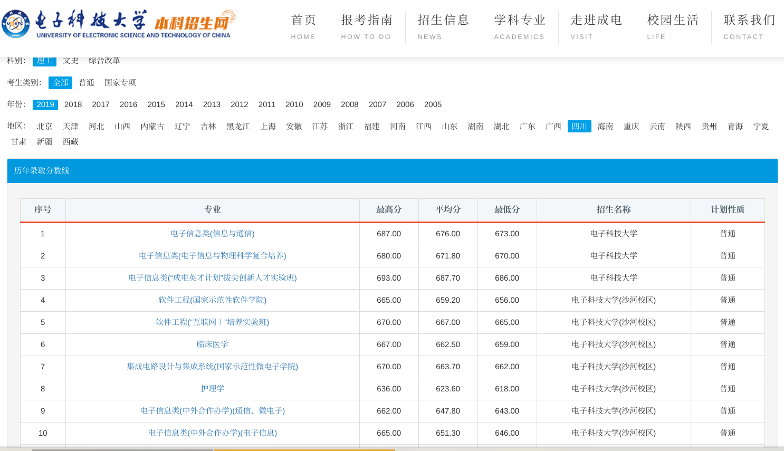

半个局外人的流言谶语，以及乌鸦嘴。未完待续，不定期更新。
<!-- more -->

当然我不是医学生，当年高考报志愿的时候由于色弱被医学几乎所有专业拒之门外。

虽然本科录取通知书和毕业证上都写的是生物医学工程（是的，这个专业也是色弱与狗不得报考。可我是报了通信电子被调剂过来的），虽然每次出门说出这个专业总被认成是学生物的、学医的，很惭愧，生化相关的就没学过，唯一跟生物沾点边的是大一的必须选的选修课生命科学导论（只有一个学分的选修，上课全程在写微积分线代作业，老师非常善良，开卷考试全程抄书），唯一跟医学沾点边的是大一的解剖（也是选修，两个学分，上课全程在写电分大雾作业，考试划重点精确到第几章第几页第几段的第几个句子）。

本来是想去搞硬件的，本科还在搞医疗器械那会也确实在焊板子弄单片机搞stm32烧串口调测量信号，不过最后还是逃离了医疗器械，当了硬件逃兵。

快要过去的一年发生了不少事，每次想写点什么，打了一堆字又删了，原来的知乎大号早就宣布退乎清空回答了，丁香园小木虫之类的地方又不想去，发到博客没多少人看（以及会有另一些人看，近似于发QQ空间的效果）。

发在这里又不能像某乎那样开个小号再开个匿名，利益相关，匿了.jpg

所以这篇博客写的不太尽兴，有些话不方便多说，

## 现状

### 医疗器械

啊，老本行，拿出来单独说一下（很惭愧，从这一行跑路了）

这里的医疗器械只讲一下电子设备，比如血压血糖体温之类的传感测量设备，还有那些X光机、CT、PETCT、彩超、MRI、NMRI那一堆摆在影像科的昂贵的大设备。用于检测的那些设备没搞过，不懂；医疗耗材之类的完全不懂，听说川大那边有不少搞生物医学材料的，听说强生美敦力罗氏之类的企业在做。

比较贵的那些大设备以前长期处于国外几家大公司垄断中，主要是GPS三家。通用电气一直在没落，飞利浦这两年也有点不思进取，西门子还行，不过被

联影 迈瑞 理邦

联影号称是医疗器械行业的华为，实际加班可能比华为还严重；像当年菊花从思科挖人一样，联影从西门子等挖了好多高管和技术人员，实现了 自主研发 。

东软之类的国企

国内学校搞医疗器械的不是很多，基本都挂在生物医学工程下面，有的挂在精密仪器和自动化下面（说起来你电生命学院最早就是从自动化测量那边分出去的，早年一群搞医疗器械的，不过后来逐渐都去灌水了，硬件没多少人搞了）。不算材料那些，高校里面还在搞医疗电子并且还算可以的可能就浙大和重庆大学的一些组了。

### 医学信息

算是正在医学信息的坑里面划水吧，

入坑，你将看到各路祖传机器和祖传代码，包括Delphi，PowerBuilder，SQL Server 2000，远古版本的Windows Server 和 Windows XP（当然，都是盗版的），Oracle（几乎都是远古版本，不少盗版，比较有钱的大医院可能会有正版）

jQuery还好，可能还有完美兼容ie的Flash，WebForms；

各种神奇的导出格式，不规范的XML，各种自定义的数据格式和编码（某些公司自己弄出来的私有格式）

<!-- 国内知名的医疗软件基本都是再用PB,比如金蝶 创业 众阳。也没有互联网软件公司出来革了她们的命 -->

#### HIS系统

略有年头的词。不少HIS系统比我还老，祖传代码没人敢动，去医院转一圈一下你会发现真就是祖传微机祖传服务器祖传软件，不知道多少年前采购的东西用到天荒地老。

有些话我不方便说太多，就拿选课系统类比一下吧。

这种单位采购的XX系统，大家心里应该都能想象出来。想像不出来的请回忆一下学校选课系统/教务系统支配的恐惧。除了学校学生自己做的选课系统，采购的选课系统基本都是方正、清元、强智。

比如[隔壁西电曾经的清元](https://www.zhihu.com/question/26516180)，比如[武大这个](https://www.zhihu.com/question/362667701)，当然还有[你电这个](https://www.zhihu.com/question/264705499/answer/284391933)我大一的时候连续崩溃一周搞得大家半夜起来的神仙选课系统（这可不是高并发抢课，这是用权重投分选课，而且还是各年级分开错峰权重选课）

为什么HIS系统这么难用，和这个问题大致是一样的：

> 为什么学校的选课系统、教务系统这么垃圾

还没用过选课系统的高中生可以看丁香园的这篇吐槽[^2]感受一下，医院的HIS系统操作使用起来非常不舒服，被医护人员吐槽是家常便饭的事。不过HIS系统，怎么说呢，全世界就没一个好用的。

用教务选课系统来形容可能会让你们低估HIS系统的难用程度，选课系统最多也就世界上最好的语言PHP+WebForms，新一点的前端可能是jQuery，都还能招到人来维护；而且都是Web版的选课系统。不少选课系统还有在校学生维护，运维和改祖传代码的能力已经吊打医院信息科了。

有的医院倒是想换新的电脑，结果发现以前斥巨资采购的老软件最高只支持Windows XP；换新的HIS系统又拿不出那么多钱，将就着用呗。

采购价格通常很贵，三甲医院买的软件可能基本都几百万甚至上千万吧（有的是吃回扣，有的是花公家的钱不心疼，有的是）

国内的医院大部分是是断网的，是只能上医院内部局域网那种，他们说

#### 电子病历

##### 到底有啥用

大部分情况下可能对医生是个负担，尤其是当医院采购的电子病历软件极其难用的情况下。

##### 命名实体识别

命名实体识别（Named Entity Recognition），做过的都懂。

电子病历/医学文献/其他乱七八糟的医学文本，能用来命名实体识别的都被轮过不知道多少次了。实乃广大学子毕业设计水论文居家编论文必备。

从隐马尔科夫模型到SVM到CNN到LSTM到BERT，基本上

#### 临床决策

正在搞，没太多头绪

#### 循证医学、RCT和Meta分析

循证医学这个东西，非医学人士不要去看它那些概念，就当作重新发明统计学就好了。

> 可能是统计学没学过的老专家想出来的一种 “科学” 研究方法

RCT就是现在初中生物都要学的随机对照试验。

## 关于医疗私有化

大部分公立医院都有着国企的通病

宿迁医改

莆田系

爱思眼科

奥派喜欢自由市场，不过长远看我们都死了。等不及了，信誉和口碑的建立至少需要二十年，人能有几个二十年？

## 业界和学界脱节

大多数行业的本科教育和业界基本都脱节，

在一些需要大量砸钱投入产品研发的领域，高校甚至很多研究所和企业的差距特别明显。
航天这种不赚钱的基本

## 报考和劝退等

本来不想写这部分的，奈何今年医学相关专业的录取分数线暴涨，看到几个高中毕业的萌新听着不知道谁给的建议盲目乱报。今天听人说医生待遇低啦，哪又医闹砍人啦；明天又听说社会地位高福利待遇好做手术有红包啦；最后一打听学医背书又苦又累大学活的像高中又不想去了，在家长威逼利诱下只得不情愿的报了。

真就乱报啊。

来，我们打开[你电的招生网](https://zs.uestc.edu.cn/score/)，拿19年看一下刚高考完的瓜娃子脑子能有多不清醒

这别不是被你电招生办给忽悠了吧（外加信软一群天生反骨的反贼从不护短一个个黑你电比我还狠，医学院的几乎全在说好话夸学校[^1]）

（别问我为什么就光逮着你电喷，别的学校我也不熟啊）

 

19年，你电的四川本省主场，没有2020年医学分数暴涨的影响，应该比较典型。

通信 687 676 673

临床 667 662 659

信软 665 659 656

材料 669  664  661

护理

这就很离谱，虽然我整天喷你电，虽然沙河确实有点破，但是电子科技大学信息与软件工程的录取线比电子科技大学临床医学录取线还要低这就很魔幻，这我都不敢信。护理分倒是比较冷静，估计是被网上一片劝退吓了回去。

你要说川大华西临床比川大软件工程录取线高，这听起来还很正常。你电这些孩子用这个分报临床，你说这是图什么呢？

你电医学院本科开始招生才两年，虽然学校和省医院、肿瘤医院、人民医院等给学生的资源倾斜还不错，但是和一些老牌的医学院比起来认可度和出路还是差不少。

你电信软的软件工程出路和待遇说一句不比华西临床差应该还是有底气的。虽然你软很多阴间操作和只会念PPT的老师，去996修福报等出路和薪资已经足以抵消一切。

而且本科三年上课加一年实习直接跑路找工作比隔壁学医的五+三+规培（有的还再读个博）的煎熬稳太多了。

围观刚高考完的萌新们报志愿总让想起我四年前无知的我看着网上道听途说的消息乱报的样子，看到有些孩子踩坑还是于心不忍。还是说点什么。

~~注意身边亲戚朋友劝你学医的时候可能只是想有一个免费医生~~

### 待遇问题

要恰饭的嘛，人可不可能不恰饭，医生挣不了钱要饿死的嘛

>医护人员的待遇不能一概而论

注意乡村卫生院、县市医院、某些三甲的巨大差距。

注意不同地区的医保政策财政盈余和医院工资福利存在巨大的差异。

注意考虑省会城市、县城、村镇的房价和消费水平。

貌似看这几年报志愿的大部分还是冲着待遇去的，真心喜欢学医的不是特别多。

### 强基计划

（这一部分写的比较早，下面的今年都指的是2020）

今年自招和竞赛生降分几乎无了，新上了综合评价和强基计划

恩，2020年教育部上了一大批羟基计划，基本上除了天坑专业就是基础研究，适合读书改变命运的不多（啊，如果是指反向改变命运，那很多）。
这次的招生政策和降分等对于高中竞赛党是沉重的打击。竞赛党基本上被坑惨了。对真正想投身科研的一部分竞赛党和有情怀的学生，今年
虽然名字叫羟基，但是实际政策沉重打击了真正有天赋和有热情的一部分竞赛党，很多有天赋的人可能只能多卷三年将时间浪费在挤高考的独木桥上，运气不好的偏科同学无缘科研。教育部这几年的挨骂操作我都数不过来了，不过讲这些就又跑题了，不说了。

生化环材方向的约等于卖身契，这个劝退的太多了，真喜欢或者家里有钱也不建议去，不说了。
数学物理等方向的看个人天赋、情怀和家境吧。

今年把基础医学也放到强基计划里面了。

大致看了一下，基础医学这块还是比生物化学天坑好一点。

[你如何看待强基计划？](https://www.zhihu.com/question/391076586)

[如何看待 2020 年最新发布的强基计划简章？](https://www.zhihu.com/question/392951130)

### 某些理工科最近开始建设的医学院

太长不看：

>反正你听到新开的院系所谓交叉学科赶紧跑就是了，尤其是本科（贵清叉院除外）

肥科合并安徽省医院，你电跟四川省医院和肿瘤医院搞的医学院。

华理、天大、哈工大、中科大、西大、西北工业

这么多大学基本上在这几年（2014至今）突然想搞医学院，当然不是打算医工结合，为人类健康事业做贡献，主要还是冲着发论文去的。

生物医学论文影响因子又高，灌水又快，只要舍得砸钱，文章稳定产出，这谁不喜欢。你看看新英格兰和柳叶刀的的影响因子，再看看那些纯数顶刊的影响因子。你看看生物医学的灌水速度和砸钱投入与产出，再看看高能所和肥科粒子物理那帮人，几十个亿不当钱一样，发出来PRL才这么点影响因子。隔壁肥科的领导都看哭了，立马决定~~废理兴工~~废理兴医

### 生物医学工程

这是个大框，啥都能往里装

### 护理

这个经常被考生和家长嫌弃，尤其是考的还不错的孩子，在他们看来护理卫校是中专、三本、带专生上的。

怎么说，现在一些热门的医学分数本来就非常高，今年由于疫情等缘故又被炒高了很多，很有可能复现十年前土木最火的时候高分接盘的惨状。而护理由于网上一片哀嚎，一本以上学校的护理分数非常低，经常比同学校的临床低几十分甚至断档。差不多是情况特殊的人为数不多捡捡漏的途径。

有缘人：

1. 真心热爱（这种应该不多）
2. 家里有关系（混几年能混个护士长护理部主任啥的）
3. 低分进入某校转专业，考公考选调
4. 出国
5. 男的
6. 长得招人喜欢、身高160+

第1条，护理网上说的再惨，也惨不过生化环材，如果真的热爱（完全不在乎钱和待遇的那种）去也无妨。当然累和夜班是避免不了的，除非你去CRC（看起来竞争很激烈的样子，感觉人均硕士博士，等今年的高中生至少十年后毕业不知道会内卷成什么样子）

第5、6条应该不需要多解释，男的在护理的抢手程度可能比壮汉在骨科还抢手，160+可能找工作时大于研究生学历（你不信我也没办法，事实就是这个样子）

第3条，高考考砸了几十分特别不甘心但又不愿意复读可以试试，不过风险比较大

第2条，嗯，如果本身学校还不错，凭着文凭和家里关系能走上评职称升值的快车道。本来护理平均学历就远比临床低，但凡有点关系又嫌苦嫌累嫌社会地位和牌面不如医生，评职称阻力远小于医生。

第4条，~~去非洲~~去北美或者土澳还行（不要看）

另外不知道为什么网上所有跟护理相关的话题都在说学护理出路比学医差多了，在川内的几个医院暗中观察看起来似乎收入和前途并不比医生差。

也可能是我的观察出了偏差，至少暗中观察看到的（四川省）护士待遇并不比医生差，考虑平均学历差距和早工作几年的情况下

**甚至一些科室，尤其是，心内科、重症，护士待遇比医生好，算上学历差距和早工作几年，护士应该比医生好的多，跟我之前的想像和网上的看到的护士哭惨完全不一样**

护理不存在这个问题，一本以下是性价比最高的报考专业之一。护理在211以上的分数段是这个画风，但凡在网上搜一下很少有人被骗进来。

另一个需要记住的是**工作要趁早**，中专>大专，本科>研究生。

虽然中专没有编制，但是跟其他职业学院的其他专业比起来性价比依然爆炸。在离家近的小县城和卫生所，
大专大概率一样没有编制还多上三年高中，亏了三年。
研究生多上这么多年，亏惨了。

**不太建议国内全日制读研读博，先工作，然后读在职的**，全日制研究生没啥性价比可言

#### 番外

不得不说你电招生办真的能忽悠，我都差点被这一堆改来改去的名字给骗了。

|                             专业                             | 最高分 | 平均分 | 最低分 | 扒皮           |
| :----------------------------------------------------------: | :----: | :----: | :----: | -------------- |
| [信息管理与信息系统](https://zs.uestc.edu.cn/zhaos/showproduct.php?id=33) | 663.00 | 662.00 | 661.00 | 公，公管学院？ |
| [自动化(智能制造实验班)](https://zs.uestc.edu.cn/zhaos/showproduct.php?id=24) | 672.00 | 671.00 | 670.00 | 就自动化呗 |
| [智能电网信息工程(“互联网＋”复合培养实验班)](https://zs.uestc.edu.cn/zhaos/showproduct.php?id=22) | 680.00 | 676.00 | 673.00 | 能源学院，还行吧（差点以为是机电的） |
| [新能源材料与器件(“互联网＋”复合培养实验班)](https://zs.uestc.edu.cn/zhaos/showproduct.php?id=29) | 679.00 | 674.40 | 672.00 | 虽然有器件两字，灌水材料，快跑（想搞芯片去沙河集电） |
| [物联网工程(“互联网＋”复合培养实验班)](https://zs.uestc.edu.cn/zhaos/showproduct.php?id=36) | 683.00 | 680.40 | 679.00 | 物联网几年前火过 |
| [数学与应用数学(“互联网＋”复合培养实验班)](https://zs.uestc.edu.cn/zhaos/showproduct.php?id=19) | 678.00 | 675.60 | 675.00 | 数学学院 |
| [数学类(数据科学与计算、数学及应用、计算科学)](https://zs.uestc.edu.cn/zhaos/showproduct.php?id=19) | 671.00 | 670.40 | 670.00 | 同上 |
| [生物医学工程类](https://zs.uestc.edu.cn/zhaos/showproduct.php?id=20) | 665.00 | 661.20 | 660.00 | 生命学院今年的大类招生(听我的，赶紧跑) |
| [人工智能](https://zs.uestc.edu.cn/zhaos/showproduct.php?id=26) | 683.00 | 676.40 | 673.00 | 计院的 |
| [经济管理试验班(管理与电子工程复合培养)](https://zs.uestc.edu.cn/zhaos/showproduct.php?id=35) | 678.00 | 672.60 | 671.00 | 所以为啥不去西财 |
| [计算机类](https://zs.uestc.edu.cn/zhaos/showproduct.php?id=26) | 683.00 | 677.70 | 674.00 | 计院 |
| [计算机科学与技术(“互联网＋”复合培养实验班)](https://zs.uestc.edu.cn/zhaos/showproduct.php?id=26) | 686.00 | 683.10 | 681.00 | 计院还互联网+复合就离谱 |
| [互联网金融(“互联网＋”复合培养实验班)](https://zs.uestc.edu.cn/zhaos/showproduct.php?id=35) | 680.00 | 676.30 | 672.00 | 听这名字就像诈骗窝子 |
| [航空航天类(航空电子及控制、无人驾驶航空器技术)](https://zs.uestc.edu.cn/zhaos/showproduct.php?id=25) | 671.00 | 670.30 | 670.00 | 航天学院，原来有国防生的，现在无了。航天研究所待遇略惨，快跑.jpg |
| [工科试验班(智能仪器、智能控制)](https://zs.uestc.edu.cn/zhaos/showproduct.php?id=24) | 672.00 | 669.80 | 669.00 | 就自动化的控制和仪器呗（看到智能之类的字眼直接忽略） |
| [工科试验班(新材料、新能源与电子化学)](https://zs.uestc.edu.cn/zhaos/showproduct.php?id=29) | 669.00 | 664.00 | 661.00 | 天坑材料，钙钛矿，快跑.jpg |
| [工科试验班(机器人、电气信息、智能制造)](https://zs.uestc.edu.cn/zhaos/showproduct.php?id=22) | 677.00 | 671.10 | 670.00 | 机电，不如西南交大机械（快跑.jpg） |
| [工科试验班(电子信息与地球科学复合培养)](https://zs.uestc.edu.cn/zhaos/showproduct.php?id=27) | 670.00 | 665.50 | 663.00 | 资环，有些搞GIS和遥感的，不如隔壁西南交大测绘，快跑.jpg |
| [工科试验班(电子工程类)](https://zs.uestc.edu.cn/zhaos/showproduct.php?id=34) | 684.00 | 674.80 | 671.00 | 老电工 |
| [电子信息类(智能感知、光通信与显示、智慧照明)](https://zs.uestc.edu.cn/zhaos/showproduct.php?id=28) | 672.00 | 670.30 | 669.00 | 圣光电（加老通信光纤） |
| [电子信息类(信息与通信)](https://zs.uestc.edu.cn/zhaos/showproduct.php?id=36) | 687.00 | 676.00 | 673.00 | 老通信（现信通） |
| [电子信息类(电子信息与物理科学复合培养)](https://zs.uestc.edu.cn/zhaos/showproduct.php?id=30) | 680.00 | 671.80 | 670.00 | 老物电（现物理） |
| [电子信息类(“成电英才计划”拔尖创新人才实验班)](https://zs.uestc.edu.cn/zhaos/showproduct.php?id=37) | 693.00 | 687.70 | 686.00 | 英才（提前批） |
| [软件工程(国家示范性软件学院)](https://zs.uestc.edu.cn/zhaos/showproduct.php?id=23) | 665.00 | 659.20 | 656.00 |         孤儿沙河(毕业薪资掉打除计院外所有)         |
| [软件工程(“互联网＋”培养实验班)](https://zs.uestc.edu.cn/zhaos/showproduct.php?id=23) | 670.00 | 667.00 |   66   |         孤儿沙河         |
| [临床医学](https://zs.uestc.edu.cn/zhaos/showproduct.php?id=18) | 667.00 | 662.50 | 659.00 | 沙河（实际在清水河上课） |
| [集成电路设计与集成系统(国家示范性微电子学院)](https://zs.uestc.edu.cn/zhaos/showproduct.php?id=23) | 670.00 | 663.70 | 662.00 |   沙河（已经搬清水河去了）大微固亡了.jpg，想搞芯片报这个   |
| [护理学](https://zs.uestc.edu.cn/zhaos/showproduct.php?id=18) | 636.00 | 623.60 | 618.00 |   沙河（实际在清水河）   |
| [电子信息类(中外合作办学)(通信、微电子)](https://zs.uestc.edu.cn/zhaos/showproduct.php?id=21) | 662.00 | 647.80 | 643.00 |   沙河（一直都在清水河) 土豪格院   |
| [电子信息类(中外合作办学)(电子信息)](https://zs.uestc.edu.cn/zhaos/showproduct.php?id=21) | 665.00 | 651.30 | 646.00 |   沙河（一直都在清水河）土豪格院   |

所谓的"互联网+"是和“大众创新，万众创业”、OFO小黄车、区块链一个时期的骗钱概念（大概就15、16、17年吧），直接无视就好了。

## Q&A

Q：你们这帮人整天劝退某些行业没人了怎么办？

A：没人了那不是更好吗。

Q：这次疫情后医护人员待遇会改善吗？

A：这次疫情后，医保缺口更大了，那待遇当然会更差了。

地方财政没钱了，不委屈你们一下怎么行，总不能饿着王公贵胄吧

Q: 我想报考/入坑医学信息、医疗器械，能不能推荐........

A：我推荐你快跑

Q：国外, 怎么样？

A：国外不了解。去问别人吧。

Q：听说这些行业很有前途.....

A：前途是用韭菜和炮灰铺的路

<!-- 
科研穷三代，读博毁一生

https://kknews.cc/zh-my/education/x4ngnqo.html

如何看待中国科学技术大学合并安徽省立医院一事？ - 贱贱的回答 - 知乎
https://www.zhihu.com/question/67131138/answer/249650160 -->

## 阅读更多

[如何看待本科护理专业?](https://www.zhihu.com/question/29691535/answers/updated)

[去 985 学护理，这真的好吗？](https://www.zhihu.com/question/282963674/answers/updated)

[^1]:[电子科技大学医学院具体情况是什么？](https://www.zhihu.com/question/53934952)
[^2]:[花了上千万买的病历系统，为什么永远这么难用？](https://mp.weixin.qq.com/s?src=11&timestamp=1612949792&ver=2882&signature=yBU6wWMhg3taSHSUQRIi8s4EaInxFLhNOlMM6kZW1LhAv07RopcJj4EePfJsSaptb*P22MLcC-*dYTkJJgmq8I1P3*mBfbNIm2SiPyEG-8AUeBbdtaVkF7I24Q8WmxAu)

<!-- 

预防口腔麻醉检验公卫影像

从统计学角度，meta 分析的实际意义在哪里，几年前 meta 热于循证医学，这个报道反映了哪些弊端？ - 大名顶顶的回答 - 知乎 https://www.zhihu.com/question/264789460/answer/286666881

13线医生抠着脚表示医学论文什么统计方法都不重要，因为论文本身就没有任何实际作用，除了卖自己的药/操作，以及打压对手。

我根本不关心学术，自己署名的论文不多，但一直没有忘记其实真正的任务是站街卖银，啊不对，当枪手。凭空代写，中翻英丢SCI，从SCI抄下来改一改英翻中投国内，挣点外快玩玩。全是假数据。客户主要两类，药代和不上不下的老医生。药代就是卖药卖器械，医生就是晋升和装X。

中医能发展成为循证医学吗？ - 「已注销」的回答 - 知乎 https://www.zhihu.com/question/265223414/answer/291460603

以你们中医学生"统计就是求个平均值"的知识水平来说当然做不了随机对照实验。
[https://clinicaltrials.gov/ct2/show/NCT03313778](https://link.zhihu.com/?target=https%3A//clinicaltrials.gov/ct2/show/NCT03313778)
这才是真正的个体化治疗，把每个人自己的癌细胞拿出来测序，做出一个只适用于这个人的药打回去调动免疫系统防癌症扩散，每个人用的都是一个新的分子新的序列，比你们拿一堆草草矿矿线性组合不知道个体化到哪里去了。人家做得，你们做不得？
根本不存在不能做，无非不想做，不敢做，不会做。非蠢即坏而已，不要找借口。 -->