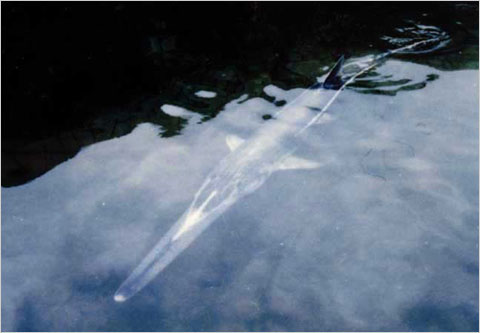

又南水行七百里，曰孟子之山，其木多梓桐，多桃李，其草多菌浦，其兽多麋鹿。是山也，广员百里。其上有水出焉, 名日碧阳，其中多鳣鲔
<!-- more -->

元旦在沙河边转着玩，又看到沙河有一群大妈拿着七八个桶直接倾倒鱼和小龙虾，口中佛经念念有词。这几天网上冲浪又看到日人民报等辣鸡营销号消费过世白鲟，还纷纷把图配成匙吻鲟，心里不是滋味。长江流域基本也凉的差不多了，当年葛洲坝一建，白鲟中华鲟达氏鲟就凉了一半，挖沙和万安水库和富春江水电站也把最后的鲥鱼搞没了。鄱阳湖要是再乱搞，江豚基本也要凉透了。那些数不清名字的小鱼就更惨了，好多两个图片和影像都没留下。前几年长江养殖逃逸了大量杂交鲟，中华鲟和达氏鲟野生种群基本就废了。寡鳞鱊重现江湖的奇迹可能再也不会有了。

斑鳖在某动物园的惨状大家也都看到了，鼋也好不到哪去（国内的龟鳖都好不到哪去，毕竟不是熊猫，谁让你不可爱呢，长成这样小清新看了人嫌狗厌）
>鼋，到现在，都没有一个像样的保护区。也就是说，救助团体一直是民间（或挂靠）开展的。某保护区我就不点名了，有文件，一直不施工，民间捐的俩成体鼋一直养在水泥池子里……

一直想去苏州见斑鳖最后一面，但是想起上方山那个垃圾动物园就来气，去了多半会伤心，也罢，算了。神龟虽寿，犹有竟时。腾蛇乘雾，终为土灰。


君不见，高堂明镜悲白发，朝如青丝暮成雪

