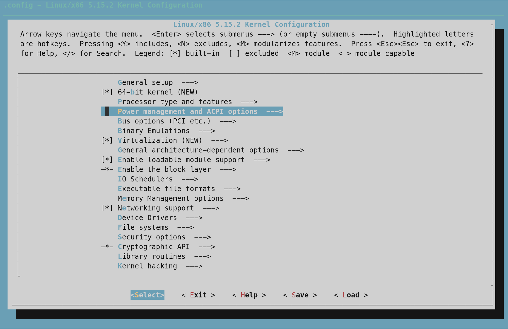

久闻大名，然而真的编译了几圈下来，和想象中的不太一样。照着手册一步一步来并不难，但是特别繁琐。其实我更建议去看一看Alpine等更精简的Linux的构建过程。哦，对了，我等编译的时候通关了蔚蓝a面
<!-- more -->

LFS的主要目的是教你打造一个你自己的发行版，所以它特别繁琐。如果你想自己做一个优麒麟去骗钱那不妨看看。如果想了解一下Linux的依赖和编译过程，想看看一个特别精简版的Linux长什么样子，**请试试Alpine而不是LFS**

**感觉Alpine更适合作为一个 玩具来学习，而LFS更适合作为正经用途。** 大家不知为何都反着来。

推荐阅读：[不要在生产环境中使用alpine基础镜像 – 容器基础镜像的选择](https://ttys3.dev/post/do-not-use-alpine-in-production-environment/)

之前觉得就是一个安装超麻烦版的Arch/Gentoo，就没试过。最近终于试了一下，学到的东西倒不是很多，没有当时第一次完整安装Arch时的收获大。

这个东西告诉你linux里面glibc之类的依赖关系是什么样的。这个东西就像单片机最小系统一样，告诉你。你可以从头开始看一看系统是怎么从源码构建的，glibc那一堆依赖又是怎么鸡生蛋、蛋生鸡的。推荐想了解系统构建依赖的Linux用户看一看这个东西。

闲着没事的人最适合玩一玩这个了，不过不太推荐日常使用。虽然还是是有一些人真的把这个当日用主力的，比如fcitx输入法初代目鱼王（Yuking）就是在LFS上面写了早期的fcitx输入法。
LFS is free if your time is free.     

## 准备工作

首先去找一个好一点的机器用来编译。你要有一个宿主机，一般用Ubuntu 20的比较多一点，我用的Arch, 暂时没遇到什么大问题。

然后下载LFS的手册和源码，我用的是最新的r11.0-92这个版本：https://www.linuxfromscratch.org/lfs/downloads/development/

手册说的wget-list没有说在哪，wget-list 可以用香港的镜像： https://lfs-hk.koddos.net/lfs/view/r11.0-92/wget-list

如果想稳一点可以用stable版本，喜欢systemd可以用systemd版本（最近对systemd全家桶有点怨念，就不上systemd了）。

## 编译流程

这里面绝大部分编译都是make那一套流程。

```bash
./configure
make
make install
```

## 个人的改动

其实不太建议第一次就用dev版本还加上一大堆自己的改动。我自己乱改，前面几次都没有开机成功，反复编译了四五次才成功开机。

### 我和手册有些出入的地方

手册里面要求使用bash，我在宿主机一直都用的zsh，好在没出什么大问题（主要是想接着用我习惯的那几个插件和语法，反正这个东西兼容sh，问题不大）（**不要学我，坑特别多**）

chroot之后用的是bash，然而看到那个没有自动补全和色彩高亮的bash, 我不能接受，于是配了半天的

分区我只分了一个100G的`/`分区，swap和boot都是和Arch共用的。（我懒）

### 一些手册上有但我没编译和安装的东西

现在看文档基本都在浏览器上面搜了，很少看本地目录的文档，那些doc之类的东西我基本上都没装。没用默认的vim，参考BLFS的手册装了一个我习惯的neovim

Meson这个包编译报错了，这个是systemd和BLFS需要的，我就没管

```bash
(lfs chroot) root:/sources/meson-0.60.2# python3 setup.py build
Traceback (most recent call last):
  File "/sources/meson-0.60.2/setup.py", line 23, in <module>
    from setuptools import setup
  File "/usr/lib/python3.10/site-packages/setuptools/__init__.py", line 18, in <module>
    from setuptools.dist import Distribution
  File "/usr/lib/python3.10/site-packages/setuptools/dist.py", line 38, in <module>
    from setuptools import windows_support
  File "/usr/lib/python3.10/site-packages/setuptools/windows_support.py", line 2, in <module>
    import ctypes
  File "/usr/lib/python3.10/ctypes/__init__.py", line 8, in <module>
    from _ctypes import Union, Structure, Array
ModuleNotFoundError: No module named '_ctypes
```

## 加快速度

### 多核编译

通常可以直接拉满，比如我的宿主机最多能`-j20` 那就`export MAKEFLAGS='-j20' `。
需要注意的是有的时候必须用`-j1`参数，比如编译`binutils`

### 多核压缩解压

xz压缩格式，使用最新版的tar看起来默认就是多核的。加上参数之后`XZ_OPT='-T0' tar -xf linux-5.15.2.tar.xz`和直接`tar -xf linux-5.15.2.tar.xz`没有区别。
有几个gz后缀的使用`pizg`应该会快一点，但是这几个文件太小了，几乎没区别。

### 备份

第七章结尾会教你`tar -cJpf $HOME/lfs-temp-tools-r11.0.92.tar.xz .`进行备份，这个备份速度很慢，比上面那些解压慢不少。

我推荐使用Btrfs snapshot，在每次重要的make都建立一个snapshot，这样不用从头开始，而且备份和恢复的速度也很快。

## 其他的一些小问题

### i和l

`Iana-etc`这里是大写的`i`，不是小写的`L`，另一个叫`Inetutils`的也是。

### chroot的时候PTY allocation request failed

我是ssh连的另一台电脑编译的（本地和远程都是Arch），结果有一天突然`PTY allocation request failed`

我以为是chroot或者ssh的问题，穷尽毕生所学调试了半个小时，**结果发现是那台服务器的校园网账户欠费了**。

### 一些编译报错

编译findutils报错，但是装上去能用。

```log
/sources/findutils-4.8.0/find/pred.c:751: undefined reference to `rpl_fnmatch'
/usr/bin/ld: libfindtools.a(pred.o):/sources/findutils-4.8.0/find/pred.c:1180: more undefined references to `rpl_fnmatch' follow
collect2: error: ld returned 1 exit status
```

编译gzip时报错：

```log
In file included from ./lib/getopt.h:84,
                 from gzip.c:77:
./lib/getopt-cdefs.h:31:5: error: #if with no expression
   31 | #if
      |     ^
```

执行`make clean`后错误消失。

`make check`失败一项：`FAIL: help-version`，这个影响不大，忽略。

在编译Patch的时候发生了同样的报错，重新编译后成功。

```bash
In file included from ../lib/getopt.h:84,
                 from patch.c:27:
../lib/getopt-cdefs.h:32:5: error: #if with no expression
   32 | #if
      |     ^
```

怀疑是多线程编译的问题，采用`make -j1`和`make -j20`分别编译了10次，发现这个问题确实是在`-j20`多线程编译时才会发生。

## 编译内核

接下来就是重头戏编译内核了。编译内核这个gentoo用户应该很熟悉了。可以自己选择编译参数，没有什么特殊喜好就默认吧。



编译速度比想象中的快，我从下午2:49编译到3:17，大概半个小时左右。

魔改编译参数请量力而行。我前面几次都自己改了很多参数，编译虽然没报错，但是启动的时候CapsLock和ScrollLock同时闪烁，只能重新编译。

### 编译时make clean和make mrproper的区别

`make mrproper`相比`make clean`多删除了config文件。

### 启动引导设置

**设置Grub的时候记得备份你宿主机的grub！**

本来我是想用Arch的`os-prober`自动识别`grub-mkconfig -o /boot/grub/grub.cfg`，但是不行。这样会识别成`Arch Linux， with Linux 5.15.2.-lfs-r11.0.92`

在Archlinux宿主机中编辑Grub，加上：

```bash
menuentry "GNU/Linux, Linux 5.15.2-lfs-r11.0-92" {
linux
 /boot/vmlinuz-5.15.2-lfs-r11.0-92 root=/dev/sda2 ro
}
```

## Fly Bitch！
 
到这里我已经累了，BLFS已经不打算再弄了，没啥意思。Nvidia驱动，折腾了好几次，想用dkms装驱动结果都失败了。最后我把Nvidia独显拆了，整个世界都美好了。
试图整个KDE桌面上去，结果一堆依赖没成功，结果发现最容易的反而是dwm。。。

## 小结

终于记住了tar命令解压时候哪个参数是压缩哪个是解压。  
不过sed还是不太会用，已经被sd惯坏了。  
发现了starship这个不错的prompt，bash上很舒服，体验接近powerlevel10k。  
LFS的企鹅LOGO真的好丑啊，见过的最丑的企鹅。  
bash里`+h`关闭hash查找。这个参数的意思是不使用当前hash表里面存放的路径，精确的使用现在给出的路径。使用`set +h`关闭hash，使用`set -h`启用hash。（我总觉得`+h`才是开启hash, 真是令人迷惑）  

断断续续折腾了四五天，等编译期的间隙里蔚蓝从3a跳到了到7a登顶。

## 编译时无聊发现的其他东西

这几天在等编译的时候闲着没事发现了其他一些有意思的东西。

### 编译

https://github.com/dcjones/mk plan9的mk

### bash和zsh的环境变量是怎么传递和继承的

login shell 和 nonlongin shell的读取环境变量方式不太一样

### zsh里面的‘-’命令是干什么的


[zsh的文档](https://zsh.sourceforge.io/Doc/Release/Shell-Grammar.html#Precommand-Modifiers)是这样说的：

```txt
- 
The command is executed with a ‘-’ prepended to its argv[0] string.
```

看起来似乎它会在`argv[0]`前面加上一个`-`，可是这有什么用？

argv[0]你可以当作[execve](https://man7.org/linux/man-pages/man2/execve.2.html)的第一个变量，通常是`\bin\bash`这样的可执行路径。

再看一下exec这个命令，参数`-l`的效果和zsh里面的`-`是一致的

```txt
exec [ -cl ] [ -a argv0 ]

    The following command together with any arguments is run in place of the current process, rather than as a sub-process. The shell does not fork and is replaced. The shell does not invoke TRAPEXIT, nor does it source zlogout files. The options are provided for compatibility with other shells.

    The -c option clears the environment.

    The -l option is equivalent to the - precommand modifier, to treat the replacement command as a login shell; the command is executed with a - prepended to its argv[0] string. This flag has no effect if used together with the -a option.

    The -a option is used to specify explicitly the argv[0] string (the name of the command as seen by the process itself) to be used by the replacement command and is directly equivalent to setting a value for the ARGV0 environment variable. 
```

哦，就是把当前shell视为login shell，试了一下看起来的确是这样

```bash
❯ echo $0
/bin/zsh
❯ - echo $0
/bin/zsh
❯ - zsh
❯ echo $0
-zsh
❯ exit
❯ zsh
❯ echo $0
zsh  
```

## 链接

[Linux from Scratch with Training Wheels](https://news.ycombinator.com/item?id=28820602)  
[Alpine](https://alpinelinux.org/)  

[What is the purpose of the hash command?](https://unix.stackexchange.com/questions/86012/what-is-the-purpose-of-the-hash-command)  