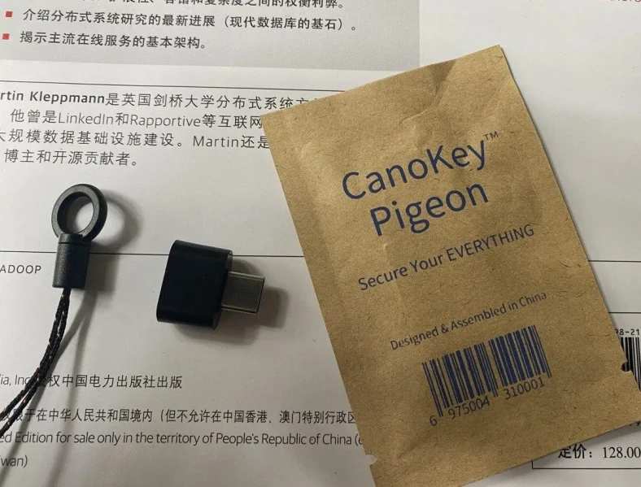
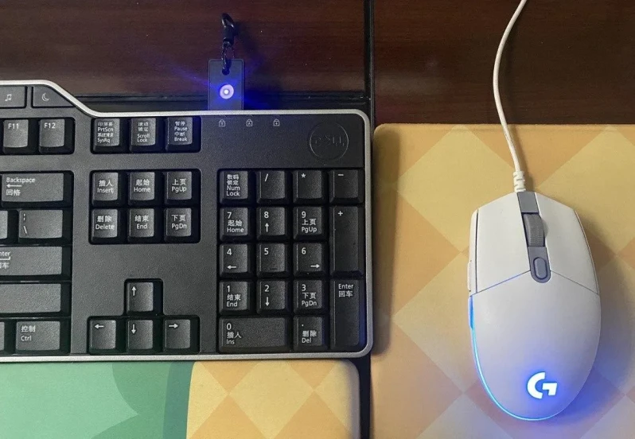
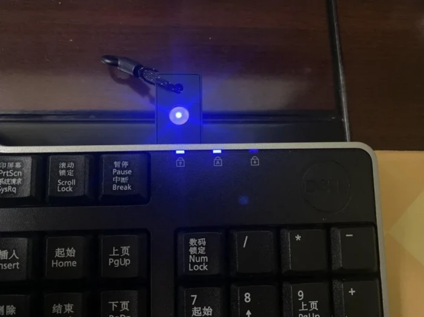
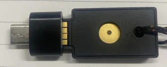

迟来的开箱，本来以为快递1号当天能到的，结果晚了一点。不管怎么说，元旦快落！
<!-- more -->

## 开箱

Canokey就是tuna那一帮人弄的重置版yubikey啦，stm32版本完全开源，发售的版本固件开源加密算法没开。至于后门和售后这些问题，由子安人格担保。这一批的500个比以前更贵了，169大洋，小贵。（据说以前是亏本买的）和之前透明探索版不同，这次虽然有壳，但是似乎更脆弱了，总担心一不小心掉水里。然而还是买了，看到群友人均有一个key我也想整一个。虽然小贵，但是飞天的key又怕有后门不太敢要。其他的产品算上跨国邮费还是比这个贵了。（虽然我有个stm32的，找嘉立创打样整了一个，不过做工一般（毕竟白嫖的嘉立创打样，有就不错了），不太适合挂钥匙扣上一直带着）

子安29号从深圳发的，去快递的时候货架上还放着不少连号的相同包装，应该都是群友的。外包装有点脏，里面完好，附带一个绳子和USB-A转type-c的转接头。插上以后chromium浏览器会自动弹出管理界面（Firefox不支持Webusb所以用不了）

好，然后生成个ed25519的密钥换掉我原来用于ssh登陆的rsa（这个对我来说好处是密钥不像rsa那么长，可以用笔抄在纸上一份，不要paperkey一类的工具把它变短了）。按照惯例找个liveusb，装好gpg，断网，生成公钥密钥子密钥。然后将子密钥导入CanoKey，主密钥抄下来。

感觉还是原来的透明探索版看起来耐用一点，这个的壳子不怎么防水容易进灰。上几张图给大家看一下灯光亮度。亮度和罗技G102鼠标最亮的蓝光大致相当，远高于我的键盘（dell kb522）指示灯和机箱电源的蓝光。（建议在管理页面调成默认关闭LED）

一个惊喜是这个功率比较低，在我的键盘USB插槽上可以正常使用。我的键盘USB插槽功率连U盘都带不动，也带不动g102等大部分鼠标，闲置了许久终于有了用途。

## 用途和体验

1.两步验证

这个没有FIDO认证，因为没交保护费。所以YubiKey能干的一些事他干不了，比如可以跳过验证的[cloudflarechallenge](https://cloudflarechallenge.com/)。[互联网上消防栓的消亡-Cloudflare 无图 CAPTCHA 的应运而生](https://zhuanlan.zhihu.com/p/377631861) 想不要CAPTCHA那得交保护费。 

国内大多数网站不支持，不过Google帐号之类的还是可以的。Webauthn有FIDO2会用FIDO2,没有会去用U2F。

2.NFC

打开了一直关闭的iphone NFC功能试了一下，然而没有成功。据说这一批的确不太行，可能还不如之前的透明探索版。见[对 NFC 的一些说明和建议](https://github.com/canokeys/canokey-pigeon/discussions/4)。

更新：读取成功了！弹出提示 网站NFC标签 “在Safari浏览器中打开"canokeys.org"”（当然，没有webUSB，console用不了），NFC Tools成功读到标签类型和序列号。试了一下Google的两步验证，登陆成功。  
iphone读NFC的位置非常靠上，大概在刘海屏的背面那里，其他位置读不到。  

3.sudo免密码

可以装`pam_u2f`实现，配置方式见[Universal_2nd_Factor ArchWiki](https://wiki.archlinux.org/title/Universal_2nd_Factor)。不过还是建议不要sudo免密，在恍惚走神的状态下使用sudo容易酿成大祸。有的时候确认处在清醒状态直接`sudo su -`临时操作一下就好了。

4.放密钥

终于说到了我买这个key的主要目的了，拿来放密钥。体验还不错，有些时候跑到别人的电脑上或者在公共电脑上用ssh登陆的时候终于不用担心密钥泄漏了。 

5.加密LUKS之类的

去年systemd-homed刚出的那个时候我写过一篇博客，还说等我有了YubiKey试试LUKS加密home分区。不过到今年我已经很不喜欢systemd了（底裤，注意底裤！）。更重要的是我终于想明白了我home分区里面那点破玩意价值不足10元，用一个几百元的key去保护一个连key的零头都不到的破数据没必要。是时候停止我的被迫害妄想症了。

对于防止普通人直接把你硬盘扣了插到别的电脑上读数据，Arch可以直接装`mkinitcpio-tpm2-encrypt`和`luks-tpm2`这两个包配置TPM2+LUKS加密。systemd 248以上版本用systemd-cryptenroll也行。不过dell、hp几家的国行没有TPM的，有TPM的联想之类的也是有后门的TPM，所以你如果想拿来对付非普通人士还是算了吧。

## 推不推荐买

这要看你拿它来干什么，如果你很在乎体验又不缺钱也对开源没有特殊的感情，那去买YubiKey吧。如果不是很想掏钱或者对安全没那么在乎，那没必要买类似的产品。如果你想找一个足够方便的两步验证设备，那建议去用给FIDO2交了保护费的FIDO2之类的。  

我只是用它放个密钥啥的，倒也够用了。其实三年前我第一次开始用密钥是因为不想每次输入密码，后来逐渐变成了被迫害妄想症，一发不可收拾（倒也不全是杞人忧天，至少我大四的时候经历过一次被盗，由于出租屋家徒四壁幸免于难，合租的两位损失过万）  
设置密码或者加密文件到底是防谁呢？

>There are two types of encryption: one that will prevent your sister from reading your diary and one that will prevent your government.   ----Bruce Schneier

一顿操作下来，突然有一天发现密码忘了、钥匙无了、LUKS损坏了。**防的竟是我自己**
第一种我身边的人用密码挡一下就已经够了，第二种暂时没有这个需求。现在除了你姐姐和gov，更多的是一些大小公司的流氓软件，扫描你的目录上传你的相册。现在已经懒得和它们斗智斗用了，流氓软件扔进虚拟机，密钥扔进CanoKey。   

说说局限  
1.NFC不太灵  
2.蓝色的灯光比较刺眼（设置里可以关）  
3.由于芯片性能原因不能直接在CanoKey里面生成rsa4096（不过可以导入）  
4.加密算法不开源（不过有子安人格担保）  
5.这次一个Yubikey的价格没法买5个CanoKey了症  
6.送的type-c转接头短一截看着逼死强迫

## 链接

[从Ant Design GitHub失窃案谈开去：国内有可用的2FA吗](https://blog.zenithal.me/2021/02/15/Ant-Design-GitHub-2FA-unavailable-in-China/)  
[Comparison of security keys](https://docs.google.com/spreadsheets/d/1PP6akStL_xHTY68zDMmKbJrBqQhN3FE9MwLDoMGxbas/edit#gid=0) 群友整理的关于隔壁各家类似产品的功能对比  
[CanoKeys官方文档](https://docs.canokeys.org/)  
[YubiKey Guide](https://github.com/drduh/YubiKey-Guide) CanoKey的资料比较少，一些用法可以参考yubikey  
[YubiKey 使用手册](https://iamtwz.gitbooks.io/yubikey-handbook-chinese/) 中文资料  
[应用 Yubikey 的N种方法](https://nwn.moe/posts/yubikey-examples)   

[yubikey full disk encryption](https://github.com/agherzan/yubikey-full-disk-encryption)  
[让系统更安全 - 系统分区加密 (Btrfs on LUKS) 操作实录](https://nwn.moe/posts/btrfs-on-luks/)
[Unlocking LUKS2 Volumes with TPM2, FIDO2, PKCS#11 Security HW on Systemd 248](https://news.ycombinator.com/item?id=25862158)  如果只是想电脑被偷之后，不让普通小偷/电脑城修电脑的/脚本小子看你的数据，用tpm2加密home分区增加的破解成本差不多能够保护你不太之前的数据了。  

[谈谈 WebAuthn](https://flyhigher.top/develop/2160.html)
[webauth.me](https://webauthn.me/) 用于测试webauthn的网站    

[Paperkey Archwiki](https://wiki.archlinux.org/title/Paperkey) paperkey用来减少密钥长度方便抄下来  
[2021年，用更现代的方法使用PGP（上）](https://ulyc.github.io/2021/01/13/2021年-用更现代的方法使用PGP-上/)  
[2021年，用更现代的方法使用PGP（中）](https://ulyc.github.io/2021/01/18/2021年-用更现代的方法使用PGP-中/)   
[2021年，用更现代的方法使用PGP（下）](https://ulyc.github.io/2021/01/26/2021年-用更现代的方法使用PGP-下/)  

目前Pigeon暂时卖完了，你可以自己去嘉立创整一个stm32版本的

[Canokey-stm32](https://github.com/canokeys/canokey-stm32)    
[Canokey-NFC-A](https://lceda.cn/z4yx/nfc-power-test)   
