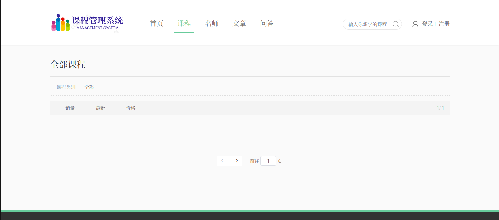
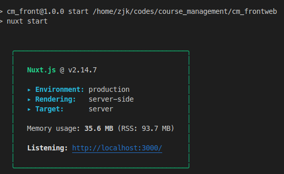
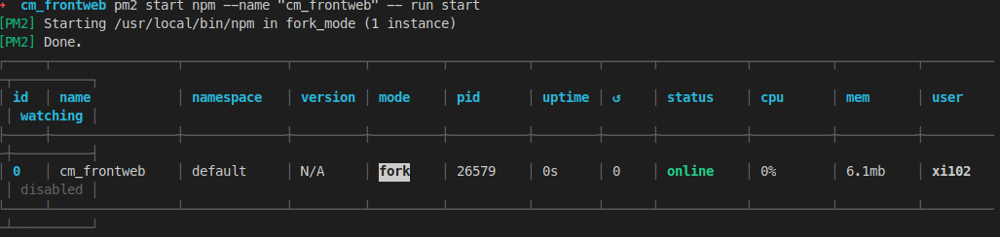

先说一下感想：小作坊不适合微服务，请不起年薪五十万的架构师、年薪三十万的DevOps，没有各种没事造轮子重构刷KPI的目的，没有服务器集群的、开发一只手能数过来的，都谨慎尝试微服务。

<!-- more -->

## 大概情况

- 瞎折腾微服务玩，然而并没有集群（手里三台服务器垃圾配置只够乱开几个Docker玩）

- 并没有Golang，用的java（别问为什么又是java）

- 目测用户量不超过100，很有可能并发量不超过10（对，比我这博客网站还门可罗雀）

- 不过比较麻烦的一点是有视频播放的问题，流量根本顶不住，目前是打算买阿里云的视频点播

~~我感觉到时候日均用户访问量都没有拆分出来的微服务个数多~~

- 用的Spring Cloud全家桶（你看我们像是有闲功夫能自研框架人吗）
- 写的挺好，一上线幺蛾子就多了

cm_admin: 后台管理系统前端代码，vue写的
cm_frontweb: 主页面前端代码，Nuxt.js的
cm_parent: 后端代码 Spring Cloud 拆成了个微服务

~~过度设计，问就是过度设计~~




## 环境配置

### 数据库

docker安装mysql8（其实不是很推荐把数据库扔到Docker里面）

```bash
sudo docker pull mysql:8.0
sudo docker images mysql:8.0
netstat -tunlp
docker run -p 3309:3306 --name mysql8.0 -e MYSQL_ROOT_PASSWORD=102@uestc -d mysql:8.0
docker ps
```

初始化数据库，运行

```bash
mycli -u root -h your_ip_address -P 3309 -p your_password
```

```mysql
create database course_management
use course_management
source ~/codes/course_management/course_management.sql
```

看一下是否成功

```mysql
mysql root@211.83.255.255:course_management> show tables
+-----------------------------+
| Tables_in_course_management |
+-----------------------------+
| crm_banner                  |
| edu_chapter                 |
| edu_comment                 |
| edu_course                  |
| edu_course_collect          |
| edu_course_description      |
| edu_subject                 |
| edu_teacher                 |
| edu_video                   |
| statistics_daily            |
| t_order                     |
| t_pay_log                   |
| ucenter_member              |
+-----------------------------+
13 rows in set
Time: 0.009s
```

### Spring Cloud的8个微服务

分别打包好8个jar包

 启动服务：

```bash
nohup java -jar {微服务名.jar} -Dspring.config.location={配置文件名.properties} > java_cm.log 2>&1 &
```

配置可以从指定的`application.properties` 中覆盖

(本来是都扔在Docker里面的，发现docker images有点大，内存消耗也上去了)

### 修改配置

将`src/main/resources/application.properties`和`src/test/java/CodeGenerator.java`中的配置文件（包括数据库端口、密码、密钥等）改成自己的

或者启动的时候在``application.properties` 中覆盖

### NACOS

一个阿里的动态监控监控服务，有一个控制台。我们只要单机版就够了。还有其他的功能，暂时都没用到。

阿里官方的建库脚本

<https://github.com/alibaba/nacos/blob/master/distribution/conf/nacos-mysql.sql>

或者不要数据库记录日志，直接存成文件。这个直接照着官方的说明启动就行了

见<https://nacos.io/zh-cn/docs/quick-start.html>

```bash
git clone https://github.com/alibaba/nacos.git
cd nacos/
mvn -Prelease-nacos -Dmaven.test.skip=true clean install -U
ls -al distribution/target/
```

不想自己打包的直接下那个release好了

<https://github.com/alibaba/nacos/releases>

运行：

```bash
cd nacos/bin
sh startup.sh -m standalone
```


### Nginx

使用Nginx进行端口映射，还是把Nginx扔到Docker里面了

编写`default.conf`:

```nginx
server {
		listen	9001;
		server_name	localhost;
		location ~ /eduservice/ {
			 proxy_pass http://localhost:8001;
		}
		location ~ /eduoss/ {
			 proxy_pass http://localhost:8002;
		}
		location ~ /eduvod/ {
			 proxy_pass http://localhost:8003;
		}
        location ~ /educms/ {
			 proxy_pass http://localhost:8004;
		}
		location ~ /edumsm/ {
			 proxy_pass http://localhost:8005;
		}
		location ~ /eduucenter/ {
			 proxy_pass http://localhost:8006;
		}
		location ~ /eduorder/ {
			 proxy_pass http://localhost:8007;
		}
		location ~ /edustatistics/ {
			 proxy_pass http://localhost:8008;
		}
	}
```

nginx.conf

```nginx
events {
  worker_connections  4096;  ## Default: 1024
}
http{
    include /etc/nginx/conf.d/*.conf; #includes all files of file type.conf
}
```

编写`Dockerfile`：

```dockerfile
FROM nginx:alpine
COPY default.conf /etc/nginx/conf.d/
```

构建`Docker image`

```bash
sudo docker build -t nginxcm .
```

启动Docker image

```bash
sudo docker run -d nginxcm
```

### 其他的问题

阿里云aliyun-sdk-vod-upload这玩意未开源，需要手动下

```
Cannot resolve com.aliyun:aliyun-sdk-vod-upload:1.4.11
```

去[这里](http://docs-aliyun.cn-hangzhou.oss.aliyun-inc.com/assets/attach/51992/cn_zh/1600848199952/VODUploadDemo-java-1.4.13.zip?spm=a2c4g.11186623.2.40.45c0192biPHxcj&file=VODUploadDemo-java-1.4.13.zip)下载运行

```bash
mvn install:install-file -DgroupId=com.aliyun -DartifactId=aliyun-sdk-vod-upload -Dversion=1.4.11 -Dpackaging=jar -Dfile=aliyun-java-vod-upload-1.4.13.jar
```

## 前端

现在很多教程直接`npm run dev`，好家伙，直接给我看傻了。（CSDN之类的东西实在屏蔽不过来，SEO排名还一个个都贼靠前）

又看了看，貌似静态页面可以直接

然后又看到好多教程，大部分用的`pm2`运行`npm start`作为damon，js一统江湖哎，可能都是nodejs全干写的，感觉不太像运维的风格。可我想找nginx的抄作业，扒拉vue的文档拉到最底下才看到一个Docker里跑Nginx的。

### 后台管理界面

先在`cm_admin`和`cm_forntweb`两个文件夹下`build`

```bash
cd cm_admin
npm run build
```

然后会在`.dist`文件夹下生成压缩后的静态页面。

扔到服务器上跑就行了，用Nginx配置一下端口映射和域名（我这域名没有，老板嫌备案麻烦没向学校申请）

```dockerfile
FROM nginx
COPY dist/ /usr/share/nginx/html/
COPY nginx.conf /etc/nginx/conf.d/default.conf
```

```nginx
server {
    listen       9528;
    server_name  localhost;
	server 0.0.0.0;

    #charset koi8-r;
    access_log  /var/log/nginx/host.access.log  main;
    error_log  /var/log/nginx/error.log  error;

    location / {
        root   /usr/share/nginx/html;
        index  index.html index.htm;
    }
}
```

```bash
sudo docker build -t cm_admin .
sodo docker run cm_admin
```


### 前台界面

Nuxt.js写的，就直接用的`nuxt start`

在`packages.json`里面指定一下端口和IP

```json
  "config": {
    "nuxt": {
      "host": "0.0.0.0",
      "port": "3000"
    }
  }
```

测试一下

```bash
cd cm_frontweb
npm run build
npm run start
```



在服务器上

```bash
sudo npm isntall pm2 -g
cd cm_frontweb
npm install --save
nuxt build
pm2 start npm --name "cm_frontweb" -- run start
pm2 startup
```



## 可能的报错

```
npm ERR! code ELIFECYCLE
npm ERR! errno 126
npm ERR! cm_front@1.0.0 dev: `nuxt`
npm ERR! Exit status 126
npm ERR! 
npm ERR! Failed at the cm_front@1.0.0 dev script.
npm ERR! This is probably not a problem with npm. There is likely additional logging output above.

npm ERR! A complete log of this run can be found in:
npm ERR!     /root/.npm/_logs/2020-11-16T14_13_24_937Z-debug.log
```

运行

```bash
npm cache clean --forceeno1                     14Kb   10Kb   0.0    3.4   6.83G 1.06G  7152 xi102          1:45 50    0 S    ? ?    java -server -Xms2g -Xmx2g -Xmn1g -XX:MetaspaceSize=128m -XX:MaxMetaspaceSize=320m -XX:-OmitStackTraceInFastThrow -XX:+HeapDumpOnOutOfMemoryError -XX:HeapDumpPath=/home/xi102/course_management/nacos/logs/java_heapdump.hprof -XX:-UseLargePages -Dnacos.member.list= -Djava.
rm -rf node_modules package-lock.json
npm install
npm run dev
```

报错

```
Failed to execute goal org.springframework.boot:spring-boot-maven-plugin:2.2.1.RELEASE:repackage (repackage) on project cm_parent: Execution repackage of goal org.springframework.boot:spring-boot-maven-plugin:2.2.1.RELEASE:repackage failed: Plugin org.springframework.boot:spring-boot-maven-plugin:2.2.1.RELEASE or one of its dependencies could not be resolved: Could not transfer artifact org.vafer:jdependency:jar:2.1.1 from/to central (https://repo.maven.apache.org/maven2): /home/zjk/.m2/repository/org/vafer/jdependency/2.1.1/jdependency-2.1.1.jar.part (没有那个文件或目录) -> [Help 1]
```

build报错

```
The POM for com.itwny:service_base:jar:0.0.1-SNAPSHOT is missing, no dependency information available
```

```
Failed to execute goal org.springframework.boot:spring-boot-maven-plugin:2.2.1.RELEASE:repackage (repackage) on project service_base: Execution repackage of goal org.springframework.boot:spring-boot-maven-plugin:2.2.1.RELEASE:repackage failed: Unable to find main class
```

貌似是由于spring-boot-maven-plugin插件打出的包无法被依赖

```bash
sh: /home/zjk/codes/course_management/cm_frontweb/node_modules/.bin/nuxt: Permission denied
```

请用root权限运行。

```
2020-11-17 16:02:57 |ERROR |ThreadPoolTaskScheduler-1 |NacosWatch.java:171 |org.springframework.cloud.alibaba.nacos.discovery.NacosWatch |Error watching Nacos Service change
```

检查一下nacos是否正确启动了(不过这个项目不用NACOS也能完成面向客户的功能)

npm run build 报错

```
ERROR in Template execution failed: ReferenceError: BASE_URL is not defined
```

修改`index.html`中`BASE_URL`为`htmlWebpackPlugin.options.url`

警告可以不用管

```
WARNING in asset size limit: The following asset(s) exceed the recommended size limit (244 KiB).
```

nginx报错`nginx: [emerg] “server” directive is not allowed here`

见https://stackoverflow.com/questions/41766195/nginx-emerg-server-directive-is-not-allowed-here

可能是配置没写好

## 其他

未完待续

## 参考

[vue官方文档的部署通用指南](https://cli.vuejs.org/zh/guide/deployment.html#通用指南)

[next.js nuxt.js等服务端渲染框架构建的项目部署到服务器,并用PM2守护程序](https://segmentfault.com/a/1190000012774650)

[vue、react等单页面项目应该这样子部署到服务器](https://segmentfault.com/a/1190000012675012)

[](https://segmentfault.com/q/1010000008477568)

https://juejin.cn/post/6844903666701320205

