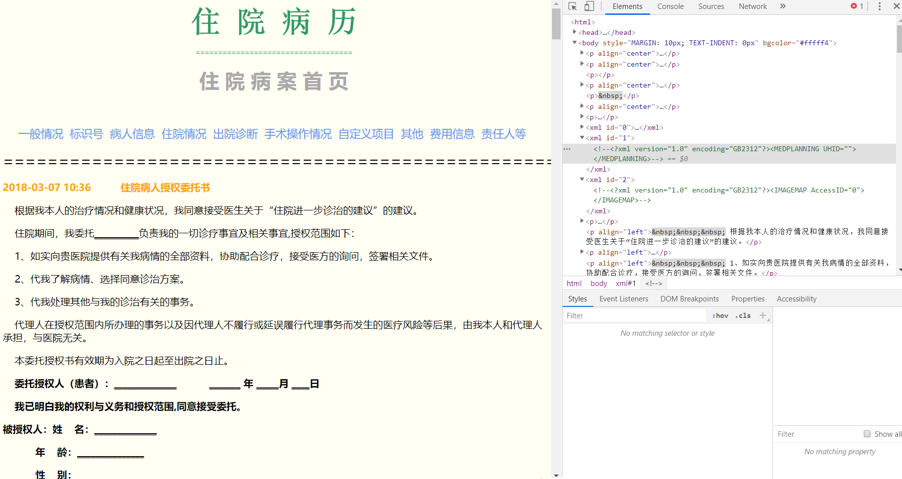
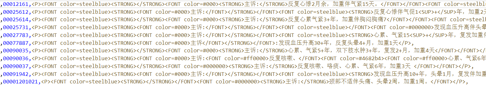
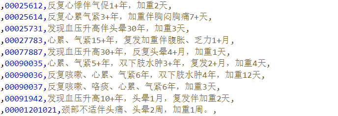

有两种鬼画符，一种是医生的字，一种是正则表达式
<!-- more -->
周某出狱了，而我也开始打工了，咳咳

最近开始折腾电子病历之类的东西，有几家医院的原始数据，几乎都是xml之类的（都是接口导出的，反正从医院要不到数据库里面的原始数据），不同医院数据格式和医生书写风格差的还挺大。

*下面这些基本都是用的python的库*

## 解析和提取内容

### 脱敏

先脱敏，大概的姓名身份证号住址啥的都挑出来抹掉，一般拿正则表达式替换一下就行了

```python
import re

p1 = r'<姓名.*?>.*?</姓名>'
p2 = r'<姓名>小明</姓名>'
newtext = re.sub(p1, p2, text)
```

### 提出内层html

xml里面嵌套了一层html（还是html4.0），html里面又嵌套了几段xml

```xml
<?xml version="1.0" encoding="utf-8"?>
<soap:Envelope xmlns:soap="http://schemas.xmlsoap.org/soap/envelope/" xmlns:xsi="http://www.w3.org/2001/
XMLSchema-instance" xmlns:xsd="http://www.w3.org/2001/XMLSchema">
    <soap:Body>
        <getHospitalInfoResponse xmlns="http://tempuri.org/">
            <getHospitalInfoResult>true</getHospitalInfoResult>
            <HTML>&lt;!DOCTYPE HTML PUBLIC "-//W3C//DTD HTML 4.0 Transitional//EN"&gt;&lt;HTML&gt;&lt;
            HEAD&gt;&lt;TITLE&gt;Demo For Lord&lt;/TITLE&gt;&lt;META http-equiv=Content-Type 
            content="text/html; charset=unicode"&gt;&lt;META content="MSHTML 6.00.2900.6182" 
            
            中间太长略去

            多重耐药菌防控措施处置表 (42)出科病历评分表 (43)病历排序&lt;/FONT&gt;&lt;/P&gt;&lt;P&gt;&amp;nbsp;&lt;/P&gt;&lt;/BODY&gt;&lt;/HTML&gt;</HTML>
            <errorMsg>string</errorMsg>
        </getHospitalInfoResponse>
    </soap:Body>
</soap:Envelope>
```

除了最外层的xml，其他的标签都被转码了。

```xml
@&amp;lt;/FONT&amp;gt;
```

先把`&amp;`转码回`&`，再把`&lt;`转为`<`，`&gt;`转回`>`

转完之后会变成熟悉的标签

```xml
@</FONT>
```

然后删掉空格之类的`&nbsp;`以及`&amp;nbsp;`

规整的数据，比如一些用标签区分出来的数据，解析一下XML或者用直接用正则表达式提出来

```html
<FONT color=#000000><STRONG>主诉:</STRONG>颈部不适伴头痛、头晕2周，加重1周。</FONT>
```

```python
chief_compliant = r'(?<=<STRONG>主诉:</STRONG>).*?(?=</FONT>)|(?<=<STRONG>主诉：</STRONG>).*?(?=</FONT>)'

```

### 病案号等xml中的内容

病案号之类的可以用正则直接抽

```python
medical_record_number = r'<病案号.*?>.*?</病案号>'
medical_record_number_temp = regex.findall(medical_record_number, htmlhandle)
if medical_record_number_temp:
    modified_number = r'\d{6}(?=</病案号>)'
    print("病案号：", regex.findall(modified_number, medical_record_number_temp[0]))
else:
    print("病案号：", "Null")
```

### html部分

要完整的把html中所有的字段都分析一下然后重新存到数据库里面，正则表达式就麻烦起来了，还是直接用xml库解析一下xml比较好，比如Xpath和Beautifulsoup之类的（这里建议数据量大、操作多的直接上lxml和regex、re2之类的，不用Beautifulsoup和re这两个库）

先用utf-8编码读取

```python
with open(path, 'r', encoding='utf-8') as xmlread:
    xmltext = xmlread.read()
```

用lxml直接解析的时候会出报错，因为lxml不认unicode之类的，我们给他转成byte

```log
ValueError: Unicode strings with encoding declaration are not supported. Please use bytes input or XML fragments without declaration.
```

加一句

```python
myxml_b = bytes(bytearray(xmltext, encoding='utf-8'))
```

然后用lxml解析就好了

```python
myxml = etree.XML(myxml_b)
result = etree.tostring(myxml,pretty_print = True,encoding = "utf-8")
print(result.decode('utf-8'))
```

要提取的主要信息都在html部分里面，外层的xml里面没啥东西，我们直接把外层的xml扔了，解析里面的html

另存为html就可以在浏览器里看到了，使用F12调试工具可以直接抓取html里面元素的xpath



但是仔细一看发现这个病历的html标签每份不太一样，比如有的第10对p标签里面是主诉的东西，但是另一份病历第10对p标签里面是住院病人离院责任书。没有固定的标志位，不太好提，不如直接上正则。

多看了几份病历发现小问题很多，格式一点也规整，比如主诉，不同病历有下面这几种

```html
<FONT color=#000000><STRONG>主诉:</STRONG>颈部不适伴头痛、头晕2周，加重1周。</FONT>
<FONT color=#000>主诉:<FONT color=#ff0000>反复咳嗽、</FONT><FONT color=#4682b4><FONT color=#ff0000>心累、气紧6年，</FONT>双下肢水肿4年，加重12天</FONT></FONT></STRONG></FONT
<P><FONT color=steelblue><STRONG><FONT color=#000>主诉</FONT></STRONG></FONT>:发现血压升高30+年，反复头晕4+月，加重1天</P>
```

有的连冒号都被颜色标签截断了，最后索性用正则直接拉取含有主诉的p标签内的整段

```python
    # 主诉（re方法）
    # chief_compliant = r'(?<=<STRONG>主诉.*?</STRONG>).*?(?=</FONT>)|(?<=<STRONG>主诉：</STRONG>).*?(?=</FONT>)'
    chief_compliant = r'<P><FONT color=steelblue>.*?主诉.*?</P>'
    chief = regex.search(chief_compliant, myhtml)
```



输出的结果再把标签、主诉二字和冒号等删去

```python
        from pyquery import PyQuery
        chief_text = PyQuery(chief[0])
        if chief_text.text():
            # clean the chief compliant text
            p1 = r'主诉|\n|:|：'
            chief_clean = regex.sub(p1,'',str(chief_text.text()))
            text.append(chief_clean)
```

差不多能看了



再用同样的方法提现病史的时候遇到了问题，发现正则会把之前主诉的内容也匹配上，这是python正则的懒惰匹配只能向后没有向前。一个办法是抽出来然后删掉主诉

```python
# 现病史（re方法）
phpi = r'<P><FONT color=steelblue>.*?现病史.*?</P>'
hpi = regex.search(phpi, myhtml)
if hpi:
    # remove_tag = r'<[^>]+>'
    # hpi_no_tag = regex.sub(remove_tag,'', hpi[0])
    # if hpi_no_tag:
    #     hpi_no_title_tag = regex.sub(r'主诉','',hpi_no_tag[0])
    #     if hpi_no_title_tag:
    #         text.append(hpi_no_title_tag[0])
    from pyquery import PyQuery
    hpi_text = PyQuery(hpi[0])
    if hpi_text.text():
        # clean the hpi compliant text
        p1 = r'\n|:|：'
        hpi_clean = regex.sub(p1,'',str(hpi_text.text()))
        hpi_cut = regex.sub('.*?(?=现病史)','',hpi_clean)
        hpi_end = regex.sub('现病史','',hpi_cut)
        text.append(hpi_end)
else:
    text.append('Null')
```

后面5个病史都这样正则匹配很浪费时间，索性把这一大段全抽出来，直接全部去格式变为纯文本

```text
主诉颈部不适伴头痛、头晕2周，加重1周。现病史2周前患者因长期伏案工作后出现颈部不适伴头痛、头晕，转颈时头晕、头痛加重，休息后症状有所减轻，无伴双上肢放射痛及麻木感，无耳鸣，无视物旋转，无恶心呕吐，无踩棉花感，疼痛与天气变化无关，遂至“都江堰医院”就诊，检查头颅MRI未提示异常。近1周来，患者头晕、头痛加重，为求进一步系统治疗，遂入我科，门诊以“颈椎病”收入住院。入院症见步入病房，神清，精神可，颈部不适伴头痛、头晕，转颈时头晕、头痛加重，休息后症状有所减轻，无伴双上肢放射痛及麻木感，无耳鸣，无视物旋转，无恶心呕吐，无踩棉花感，纳眠可，二便调。既往史否认“糖尿病”、“高血压病”、“冠心病”等慢性病病史，否认“乙肝”、“结核”等传染病病史，否认重大手术史及外伤史。否认药物过敏史及食物过敏史，预防接种史不详。个人史生于四川阿坝长期居住于当地，否认疫区居住史，否认冶游史，否认吸烟、嗜酒等不良嗜好。月经及婚育史，患者自诉近期月经周期紊乱及月经量减少；适龄婚育，育有1女，家人均体健。
```

然后根据主诉、现病史、既往史拆分每一部分

```python
# 拉取现病史
hpi = regex.findall(r'(?<=现病史).*?(?=既往史)'chiefandhistory_clean)
if hpi:
    text.append(hpi[0])
else:
    text.append('Null')
# 拉取既往史
item = regex.findall(r'(?<=既往史).*?(?=个人史)'chiefandhistory_clean)
if item:
    text.append(item[0])
else:
    text.append('Null')
```

### 批量读写文件

差不多能读了就把所有的病历批处理一下，这里用os.walk遍历所有xml文件（文件名是HIS标识+xml，不连续，就直接批量拉取了）

```python
# dir = "./Data1"
#使用listdir循环遍历
def getxml(dir):
    import os
    path = []
    if not os.path.isdir(dir):
        print(dir)
        path = dir
    dirlist = os.walk(dir)
    for root, dirs, files in dirlist:
        for file in files:
            if file.endswith(".xml"):
                path.append(os.path.join(root, file))
    with open("./XMLfilename.txt", 'w', encoding='utf-8') as f:
        for line in path:
            f.write(line)
            f.write('\n')
    return path
```

## 写入数据库

最后是入库操作，这里为了省事直接用PyMySQL了

```python
import pymysql
connection = pymysql.connect(host=workstation_host,
                             port=workstation_port,
                             user='root',
                             password=workstation_passwd,
                             db='EMR',
                             charset='utf8')
cursor = connection.cursor()
cursor.execute('INSERT INTO `medical_EHR` (`HIS`,`Chief_complaint`) VALUES (%s, %s)', (list[1],list[2]))
connection.commit()
```

## 其他

一些大段的文本，比如主诉、病史之类的后期结构化用LSTM或者Bert跑一下，这个以后再讲。
