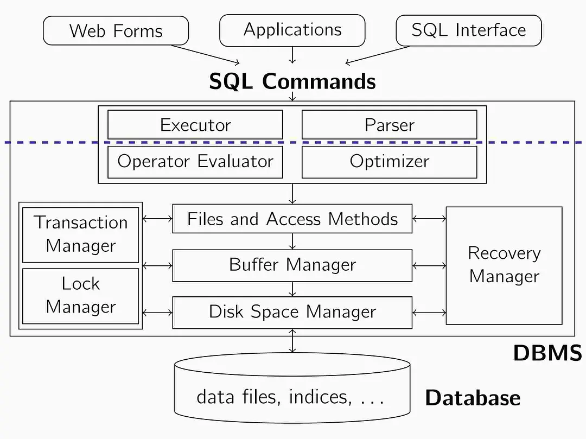

用了这么久数据库，现在还只会增删查改，开个坑学学优化。
<!-- more -->
等待填坑

这个图比较清晰

看到clickhouse的速度很快，有空看一下

## 轻如鸿毛的SQLite

好东西，在性能严重受限的开发板上跑着非常舒服，反正以前我试着感觉比另一个嵌入式数据库BerkeleyDB感觉好用多了。

其实我感觉很多小网站什么的，根本没必要上MySQL之类的东西，SQLite完全够了。什么存储过程啊，什么访问控制用户权限管理啊，基本上不怎么能用得到。数据量也小，那就索性连索引都不要了。
没有那一堆臃肿的东西，也没有那一堆乱七八糟的依赖。

而且这个东西快啊，数据量不怎么大的情况下比MySQL快，配置也简单

## 你们这个是什么教材啊，你们真的是害人不浅啊你们这个教材

### 一张大表不好吗

>范式，什么范式？

课本上这个要新建一张表，那一张表，好多个表

### 隔离性

clickhouse那么快的原因就是一定程度上破坏了隔离性

### 原子性

MySQL在5.7以后支持了json，或许是感受到了Postgres的压力。

## 好用的干活工具

[mycli](https://github.com/dbcli/mycli) MySQL的cli工具，能高亮和自动补全
