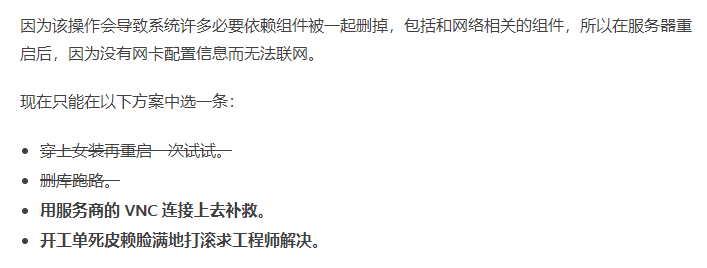

<!-- more -->

在Ubuntu和Debian里卸载iptables会发生严重的后果（大佬请无视）
一开始我们觉得是防火墙把443端口给办了用不了https，结果我用UFW设置不管用，怀疑是iptables的问题，问了花花师兄，也不清楚，我们决定先把iptables禁用了。随手一谷歌，也忘了哪个神仙说的

```shell
sudo apt remove iptables # 不要乱试！
```

感觉对的嘛，卸个防火墙能出什么问题嘛  
然后提示是否卸载我选了y，然后突然在卸载的log发现一堆Docker，瞬间感觉不对劲。然后，然后Docker直接不能用了！
血泪教训啊，防火墙卸了Docker就不能用了！

随手一搜发现不止我一个人中招啊


好家伙



行吧，一堆依赖比python2还多

不说了，准备重装系统了

---

停用iptables请使用`chkconfig iptables off`命令

---

更新，试图垂死挣扎使用

```bash
apt install network-manager
```

既然把网卡配置删了那就再配置一遍
等会，装了NetworkManager选了默认配置之后连22端口也连不上了。。。
行吧，准备重装

