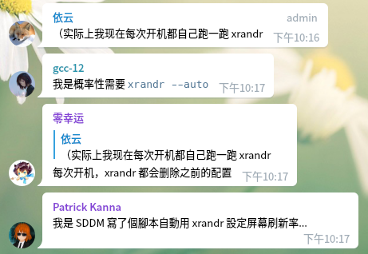
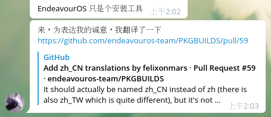
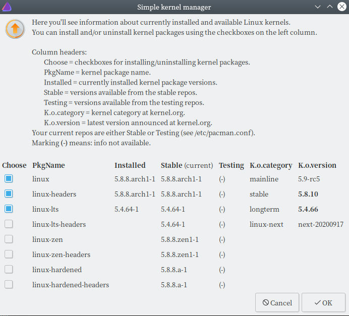

sudo pacman -Rs win10

<!-- more -->

其实还是建议能折腾的玩家直接上原味Arch。不想装Arch的偷懒用户可以试试这个（不过推荐想用KDE等其他桌面的玩家先选择离线安装，然后卸载xfce的包，再装其他DE。这个在线安装的时候每装一个包都会 -Syu 一下，非常慢）

## 镜像源

再次更新，你电镜像源有EndeavourOS了： <http://mirrors.uestc.cn/endeavouros/>

```bash
echo "Server = http://mirrors.tuna.tsinghua.edu.cn/endeavouros/repo/$repo/$arch" > /etc/pacman.d/endeavouros-mirrorlist
```

iso镜像在[这里](http://mirrors.uestc.cn/endeavouros/iso/)

清华已经安排上了EndeavourOS的镜像和[iso](https://mirrors.tuna.tsinghua.edu.cn/endeavouros/iso/)，可以方便的下载iso和更新EndeavourOS的包了。（或者用PT种子下载，实测速度均>10Mb/s）

更改`/etc/pacman.d/endeavouros-mirrorlist`中的内容，改为

```config
## China
Server = https://mirrors.tuna.tsinghua.edu.cn/endeavouros/repo/$repo/$arch
```

然后`sudo pacman -Syy`刷新一下

## 安装virtualbox虚拟机

 我用的kernel是lts版本（偶滴本本是Nvidia独显，不敢上kernel一直滚，怕炸）

装头文件、virtualbox组件、网络和vnc扩展（可选）

```bash
sudo pacman -S linux-lts-headers virtualbox virtualbox-guest-iso virtualbox-host-dkms net-tools virtualbox-ext-vnc
```

推荐安装oracle的增强扩展（一些自适应分辨率缩放、USB驱动什么的都在这里面）

```bash
yay -S virtualbox-ext-oracle
```

然后下载镜像（微软貌似出了用于虚拟机的免费90天win10，然而win10还是耗资源，没有什么特殊需求就只是用用office用用QQ什么的开个win7甚至XP虚拟机就好了，在虚拟机里会流畅一点）

增强功能要在win虚拟机中手动安装扩展才能用

## 终端配置

### 将bash/zsh的终端输出信息和日志改回英文

终端有些报错和输出还是要靠英文去谷歌，中文资料太少了，查不到，但是又不想把全局设置成英文的。直接`export LANG=en_US.UTF-8`不起作用，改成`export LANG=en_US`变成了英文但是中文乱码了，差了一下LANGUAGE参数的优先级比LANG要高、LC_X参数优先级比LANGUAGE高，修改LANGUAGE变量即可。

```bash
export LANGUAGE="en_US:UTF-8"
```

只修改终端那就在.bashrc加上

```bash
if [ "$TERM"="linux" ] ;then 
export LANGUAGE=en_US 
export LANG=en_US.UTF-8 
fi
```

### 默认终端改为zsh

```bash
chsh -s /usr/bin/zsh
```

装oh-my-zsh（因为我懒得自己配置zsh了）和插件，并设置默认终端为oh-my-zsh

```bash
yay -S zsh oh-my-zsh-git autojump zsh-autosuggestions zsh-syntax-highlighting
chsh -s /usr/bin/zsh
cp /usr/share/oh-my-zsh/zshrc ~/.zshrc # 我比较懒，就直接把默认配置拿过来改改
```

## 更换lts内核

更新到5.8以后我的virtualbox又出问题了，换回linux-lts

EndeavourOS有一个叫akm的图形界面，但是你要手动重装virtualbox之类的会受到内核影响的东西。

## 显卡驱动

>so, nvidia f.....

算了，3080那么强，不黑英伟达了

他们从以前Antergos那fork了一个驱动安装脚本，有个包叫nvidia-installer（lts等用户请用nvidia-installer-dkms），看[这里](https://endeavouros.com/docs/hardware-and-network/graphic-cards-gpu-driver-and-setup/)。

## 桌面环境

EndeavourOS官方魔改定制了xfce的主题和图标，离线安装镜像也只有xfce，其他的几乎没怎么魔改。

如果要装其他DE的话

紫红配色看个人喜好吧，其实我不太能欣赏的来（这个配色，Gitlab同款）

多桌面环境可能出问题，非要这样做的话建议每个不同的桌面环境分配一个单独的用户名。
（貌似xfce4和KDE一起用几乎问题（用ssdm），先装ssdm和KDE,然后装xfce4）
尝试了一下i3wm, 简洁是真的简洁，不太习惯又删了换回KDE了。

KDE有一种 Windows Vista 的感觉，感觉是 linux 所有 Desktop Enviroment 里面最舒服的。xfce虽然是EndeavourOS默认的DE，但是xfce开发人手不够，用户和社区贡献者也比KDE少，而且内存占用最新的KDE已经比xfce低了.....现在xfce也不怎么轻量了，渣配置机器上表现没有LXDE好，感觉不少用户都转去用i3wm和KDE了...逐渐没落的夕阳DE，适合养老

## 硬盘扩容和迁移

趁打折买了一块西数SN550,之前只有500G还装了个双系统的笔记本可以扩容了

现在把/home分区（大概60G）从老硬盘移动到新硬盘上，空出来的60G给/目录。我既不是LVM也没有组raid，文件系统用的ext4，500G老硬盘分了400G给win10,剩下100G给了linux，分了一个/，40G,一个/home，60G

先格式化（这里我用的GPT分区表，ext4），然后挂载到/mnt,然后用rsync迁移/home下的文件到/mnt
然后umount，然后分区合并给/root，再挂载到/home下面

```bash
fdisk -l
yay -Sy rsync

mkfs.ext4 /dev/nvme0n1p1
mount /dev/nvme0n1p1 /mnt
rsync -avz /home /mnt
umount dev//nvme0n1p1
```

两边都是nvme,2分钟就同步完成了，速度非常感人，然后修改fstab，将原来/home分区的uuid改为新硬盘的（/dev/nvme0n1p1）uuid

`/etc/fstab`大概长这个样子，分别是uuid,挂载目录，文件类型，noatime后面0表示不开机自检，/

```bash
UUID=8205-8BC5                            /boot/efi      vfat    umask=0077 0 2
UUID=36499174-6a4a-4b9d-b5cc-0b1f555a1f46 /              ext4    defaults,noatime 0 1
UUID=bf5e768c-a2de-4618-9861-5946459a69b6 /home          ext4    defaults,noatime 0 2
```

然后退出来，用livecd或者双系统的分区工具把原来的/home分区删掉分给原来的/目录。（注意做好备份不要删错了，删错了就没了）

再次登陆后应该就行了。弄完突然发现KDE自带一个叫KDE Partition Manager的工具，看起来貌似还行。

## 修grub

双系统grub又出问题了，好在用liveusb重装了一下grub问题救了回来。

我是UEFI，操作除了最后 grub install 用EndeavourOS的，其他的和Arch一样

先挂载，然后chroot进去，然后重装grub

```bash
mount /dev/nvme0n1p3 /mnt
mount /dev/nvme1n1p2 /mnt/boot/efi
grub-mkconfig -o /boot/grub/grub.cfg
grub-install --target=x86_64-efi --efi-directory=/boot/efi --bootloader-id=EndeavourOS-grub
```

## 滚动升级

```bash
sudo pacman -Syu # 装了AUR就yay -Syu
```

如果要自动降级新软件包就`-Syuu`(不推荐)

升级的包里面有内核和显卡驱动的时候要注意小心

升级内核之后最好重启一下，有的时候不重启会遇到开bbr失败了啊，u盘读不出来了啊，就比如[记因内核版本错误导致U盘不能识别的问题解决](https://jlice.top/p/7l9mo/)、[这个v站帖子](https://v2ex.com/t/323559)还有重启后[Grub内核版本号不升级](https://manateelazycat.github.io/linux/2020/02/14/fix-arch-boot-failed.html)，大部分情况下`modprobe`找不到模块八成就是了

### 升级内核不重启

参考reddit这个[帖子](https://www.reddit.com/r/archlinux/comments/4zrsc3/keep_your_system_fully_functional_after_a_kernel/)

一个软链过去，感觉不太优雅，还是乖乖重启比较好

>看来包管理器们应该学习其他两个系统，统一在关机开机的时候更新软件。

## KDE使用事项

### KDE卡死的抢救方案

KDE现在已经比较稳定了，但是Linux桌面程序还是偶尔把桌面搞到卡死，比如vscode内存泄漏。

首先尝试`ctl+alt+t`呼出终端，如果不能就`ctl+alt+F2`调出tty，htop看一下那个进程占用高，kill掉，如果不行就重启tty

```bash
kquitapp5 plasmashell && kstart5 plasmashell
```

正常退出不行就直接killall

```bash
killall plasmashell && kstart5 plasmashell
```

或者重启一下SDDM

```bash
systemctl restart sddm
```

还不行就杀掉tty1，然后重启xorg

```bash
ps aux | grep tty1 # 或者pgrep tty1
```

然后kill掉（或者直接`pkill -9 -t tty1`），重启
或者直接

```bash
pkill x
startx
```

再不行直接`reboot`就好了

或许你开了SysRq，先用SysRq抢救一下，见[Linux Magic System Request Key Hacks](https://www.kernel.org/doc/html/latest/admin-guide/sysrq.html)，或者直接看[linux下的SysRq键](http://blog.lujun9972.win/blog/2018/08/22/linux下的sysrq键/index.html)

再不行就直接尝试长按电源关机了

### 混成器

有Nvidia显卡怕驱动更新出问题可以在设置中将渲染器（混成器）从OpenGL改为XRender，XRender出问题的情况会少一点，虽然很多特效都不支持，性能也略差。没有问题建议还是用OpenGL或者直接关闭特效，XRender没有硬件加速用起来感觉跟OpenGL有明显的体验差距。

另外貌似非整数比缩放的时候透明特效之类的经常不支持，建议直接关了。

### baloo

禁用baloo：`balooctl disable` 这个文件索引服务也是个吃性能大户，不管是在GNOME下还是KDE下。可以考虑禁用。要查找文件可以用find命令之类的东西嘛。

### KDE桌面部件

美化要稍微谨慎一点，魔改太多了不太稳定

latte-dock：虽然KDE官方维护支持这个，动画效果很漂亮，用起来也很舒服，但是这个实在是吃内存大户。KDE桌面不开多余特效和装各种桌面部件待机内存在300M，装个latte-dock后内存占用比其他所有的加起来还多。把dock的鼠标悬停放大之类的特效关一关。貌似这个的背景透明只有XRender支持。

一个很喜欢的任务栏部件event calendar

```bash
yay -S plasma5-applets-eventcalendar
```

### 双显示器开机右侧出现黑边

发现是每次开机分辨率变成1680*1050了

先看一下你的显示器编号

```bash
xrandr
```

比如我的就是DVI-I-1和DVI-D-0，把这两个分辨率改回1080p

```bash
xrandr --output DVI-I-1 --mode 1920x1080 --rate 60
xrandr --output DVI-D-0 --mode 1920x1080 --rate 60
```

这里有一个自动配置的包[autorandr](https://www.archlinux.org/packages/?name=autorandr)

```bash
sudo pacman -S autorandr
autorandr horizontal && autorandr vertical # 这里我直接把显示长宽分辨率都直接拉满了
autorandr --save test1
```

或者你可以手动编辑`/etc/X11/xorg.conf.d`下的配置

见[Arch Wiki xrandr](https://wiki.archlinux.org/index.php/Xrandr)

其实每次开机运行一下xrandr可能更好一点（如果你不是wayland的话），不少人都是这么搞得（顺便刷新调整一下字体啥的



## Mac/win10上的一些软件

~~请阅读王垠经典博文完全用linux工作~~
不少时候用wine还是能搞定的（如果你不在乎wine的稳定性的话），包括一些大型软件，比如PS
当然有的东西用wine体验远没有虚拟机好，拿Virtualbox或者KVM开个虚拟机是个不错的选择。或者身边有闲置安卓机用scrcpy投屏，或者KDE Connect传文件。

部分国产软件开个黑果虚拟机感觉体验比windows虚拟机略好一点
<https://github.com/foxlet/macOS-Simple-KVM>

## 一点闲话

其实我一直很期待Arch系诞生一批用户友好的桌面发行版，就像Debian那样衍生出Ubuntu、Linux Mint那样。（虽然这很不Arch）

1) 之前被apt的地狱依赖搞得心态崩了，想用pacman系的（反正打包粒度粗一点好，硬盘现在这么便宜又不在乎占多大地方）
2) 喜欢KDE
3) 想要稳定一点的系统做日常主力搬砖用
4) 安装方便一点。这个倒是无所谓，不过出了事LiveCD抢救也想有个图形界面方便抢修

Arch把wifi-menu去掉之后就不太想用原味Arch了，我这笔记本没网口高通网卡Nividia独显实在八字不合，只想佛系地找个好装的iso

KaOS基本符合，然而包太少（加上KCP社区包也还是很少），可惜....
另一个[chakra](https://www.chakralinux.org/)也是包太少（这个有自己的CCR社区包，包也不多），KDE和Qt骨灰爱好者的宝藏，软件基本全套KDE和Qt（不过据说他们人手不够维护不过来了打算换到）

此外还有各种层出不穷的真*Arch安装器
<https://firerain.me/>
<https://garudalinux.org/index.html>

Antergos的继承者，EndeavourOS满足了前两点，貌似xfce主题魔改了点主题，KDE基本原封不动。当时Manjaro闹分裂，jonathon出走了，我也跟着跑路到了这个发行版;用了一段时间感觉还不错，接近原味Arch, 不像Manjaro一样整了很多超出自己驾驭能力的魔改。推荐各位Manjaro用户和想用pacman又嫌麻烦的用户尝试一下。
现在看win10反而不习惯，索性把教研室搬砖那台win10全格了只装这个（要用到windows的时候上win7虚拟机 ps. win7 和KDE好像啊）

那天还看到肥猫跑到Manjaro群里推这个


第二天welcome就有了中文，感动



能制止Manjaro的不是Arch佬的疯狂洗手，是另一个比Manjaro更好的Arch简易安装器，EndeavourOS合格了。

最后，不要对EndeavourOS抱有过高的期待，感觉他们人手还是不太足。

不过大方向是走对了，基本上就做做开箱即用和一些代替命令操作的图形界面，没有像Manjaro那样各种魔改搞出很多Arch上反而没有的问题。就比如linux内核切换的图形界面akm，基本上就是代替了archwiki上的手动操作，选项也只有linux,linux-lts,linux-zen几个。不像Manjaro那个内核切换，从linux 5.3 到linux 5.8最新版全都有，非常奔放，你要是真随便选一个linux和linux-lts之外的，哪天滚着滚着就出问题了。



Arch的安装脚本和只是换了个皮的安装器层出不穷，目前看来EndeavourOS是最令人满意的一个（好吧，默认是xfce，这个离线装了然后改DE就好了）

## 最后

AUR包数量很庞大，但也有一些包目前还没有，有精力和意愿打包的可以去给AUR提交打包
可以参看

1. [Archlinux User Repository](https://aur.archlinux.org/)
2. [Creating packages](https://wiki.archlinux.org/index.php/Creating_packages)
3. [Arch用户仓库](https://wiki.archlinux.org/index.php/Arch_User_Repository_(简体中文))
4. [AUR 纯萌新向入门教学(2)-创建一个软件包](https://blog.yoitsu.moe/arch-linux/aur_packaging_guidebook.html)
5. [AUR 纯萌新向入门教学(3)-提交软件包到AUR](https://blog.yoitsu.moe/arch-linux/aur_sumbiting_guidebook.html)

KDE的中文翻译也缺人，有精力的玩家可以去当翻译，中文翻译组在[这里](https://crowdin.com/project/kdeorg)
KDE那边貌似挺缺打杂苦力的，熟悉Qt的同学可以去给社区做点贡献.

