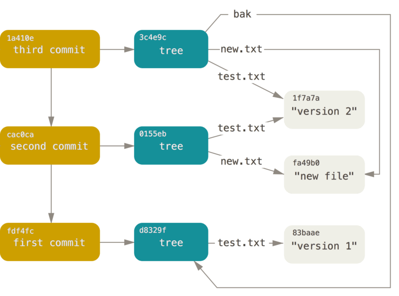
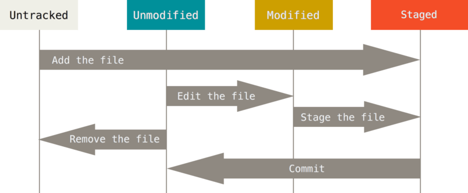

突然发现git还挺有意思的，实现很像kv存储文件系统。
<!-- more -->

有一天博客的repo在vscode侧栏source control显示不出更改文件和详情了，只有一个几个更改的文件个数，但是其他的repo又是好的。用sublime merge和`git diff`,`git status`等其他工具和命令也都是好的。（别问我为什么不用sublime merge，我现在被迫）于是研究了半天`.git`文件夹和git原理试图搞清哪出问题了。（最后发现是submodule的问题）之前在hackergame2023游玩的时候有道题是从 git repo 里找flag，然后又去拆`.git`文件夹。看着看着发现git有点意思。

先来看一下git的目录结构，`.git`目录下面文件大概长这样：

```bash
>cd .git
>tree -L 1
.
├── branches
├── COMMIT_EDITMSG
├── config
├── description
├── FETCH_HEAD
├── HEAD
├── hooks
├── index
├── info
├── logs
├── objects
├── ORIG_HEAD
├── packed-refs
└── refs
```

用`ncdu`看一下文件的大小，发现Objects是很大的

`objects`下面有info和pack，以及存放的所有对象

```bash
>cd objects && ls
03  15  27  35  49  5e  64  6c  7b  84  99  ac  bf  c6  d3  e0  ee  fd
0b  17  2a  37  4e  60  65  6e  7c  85  9c  ba  c0  c7  d4  e4  f0  fe
0d  20  2d  40  53  62  69  72  7f  87  a4  bc  c1  c9  dd  ea  f5  info
0f  21  34  43  55  63  6b  74  81  92  a9  bd  c2  d2  df  ed  f6  pack
```

git用sha1值存储，其他的两个数字或字母开头的文件名是sha1前两位，目录中文件名是sha1值，文件采用zlib压缩格式

```bash
~/codes/blog/.g/objects master ?1 ❯ tree                               7s
.
├── 03
│   └── 4c85b33ffa84adfb9f44d3c38fe13915e18a7c
├── 0b
│   └── 54054172c2050751407e0e9ae9a6c67436822c
├── 0d
│   ├── 0bc9b8cf7b882a3e5dfcd0790f09bc3482e8fe
│   ├── 48c09ea03af3c3f6667be46ed57514e257acfc
│   └── a1ba91c7ead0c0bb4e020a89b8a81ccaec137d
```

今年的hackergame的[git题目](https://github.com/USTC-Hackergame/hackergame2023-writeups/blob/master/official/Git%20Git!/README.md)就是从这里面找flag，撤销commit后在objects下面还有残留数据，于是从objects下的zlib文件后解压后查找flag即可。（文件名的hash可以从git reflog中获取）

解压可以用gzip或者openssl

```bash
zlibd() (printf "\x1f\x8b\x08\x00\x00\x00\x00\x00" | cat - "$@" | gzip -dc)
zlibd 97126e45aebd4c938edc8e11c28cef347cd317 | hexdump -C

# 或者用pigz
unpigz < 97126e45aebd4c938edc8e11c28cef347cd317 | hexdump -C
```

或者蟒蛇

```python
import zlib
s = '...'
z = zlib.uncompress(s)
with open('yourfile', 'w') as f:
    f.write(z)
```

refs目录比较简单，是对obejects的reference，其中origin的HEAD为远程分支。packed-refs文件和refs作用一样。

```bash
~/codes/blog/.git master ?1 ❯ tree refs        
refs
├── heads
│   └── master
├── remotes
│   └── origin
│       ├── HEAD
│       └── master
└── tags
```

config文件为git的配置，index是索引, logs是提交日志，hooks下面是一堆bash脚本

## 原理

git的对象包括blob，tree，commit，tag，blob是文件，tree是目录，在上面的目录结构中都已经看过了。还有一些二进制文件，推荐使用`git-lfs`

git的存储方式是通过类似inode的指针，一般是一个树状，但是commit和branch会变成一个比较复杂的图。

  

  

- add操作

`git add`会把文件添加到缓冲区（staged）

- commit操作

`git commit`会添加缓冲区的版本  
如果`git commit -a`会直接跳过缓冲区（跳过git add），直接添加untracked的版本

- rm操作

rm操作把文件从tracked file list中移除（但是Object中还有历史版本，可以找到）。还没有staged的文件可以直接`git rm`，但是如果已经staged或者已经commit添加到snapshot中，就需要`git rm -f`。

如果直接rm，会把文件也删除，大多数情况下是不小心把一堆编译产物或者二进制文件加到缓冲区去了，这时候要用

```bash
git rm --cached yourfile
```

- mv操作

git中没有类似文件系统的重命名，mv操作相当于删除后再次添加

```bash
git mv oldname newname
# 相当于
mv oldname newname
git rm oldname
git add newname
```

### git是增量存储吗

中文网上大多数资料（比如不靠谱的某乎某SDN某思否）想当然的说git是增量存储的。但是，Pro Git和 Github Blog上说了，**Commits are snapshots, not diffs**。当然是选择相信Github Blog啦，如果不信自己建一个repo commit一下试试看看上一节的`.git`目录里的Object有什么变化就知道了。上一接我们已经看过Objects下面的blob了，并不是增量的。


git采用的保存方式是快照（snapshot），比较像zfs和btrfs的快照（当然那个是块级别的，这个只是对每个文件做快照），tree和blob内容都是zlib压缩后

>Commits, trees, and blobs are immutable

git的增量，是当每次更改的时候


### 远程

- push, pull, clone


## 实现

初版git的实现比较简单，代码量也比较少，可以观摩一下。先看一下第一次提交的版本。"initial revision of "git", the information manager from hell"

```bash
git clone https://github.com/git/git.git
git checkout e83c5163316f89bfbde7d9ab23ca2e25604af290
```

README依然狂野`GIT - the stupid content tracker`

初版代码量很少，没有今天常用的`git add`和`git commit`等功能，实现很精简，完成了自举。

>This is a stupid (but extremely fast) directory content manager.  It
>doesn't do a whole lot, but what it _does_ do is track directory
>contents efficiently. 


直接`make`会报错，需要修改makefile，

先看一下README的介绍：There are two object abstractions: the "object database", and the
"current directory cache".

初版的BLOB和TREE Object和现在的差不多，以及一个CHANGESET。

>CHANGESET: The "changeset" object is an object that introduces the notion of history into the picture.  In contrast to the other objects, it doesn't just describe the physical state of a tree, it describes how we got there, and why. 

changeset用来记录提交信息

>Note on changesets: unlike real SCM's, changesets do not contain rename
>information or file mode chane information.  All of that is implicit in
>the trees involved (the result tree, and the result trees of the
>parents), and describing that makes no sense in this idiotic file
>manager.

可以看到，git一开始最早设计的时候就没有其他源码管理系统的重命名功能，这些操作被视为tree的删除和添加替代了。

init-db.c比较简单，用来初始化，类似现在的`git init`，创建repo并初始化，会在当前目录创建一个`.dircache`目录，类似`.git`

```c
	/*
	 * The default case is to have a DB per managed directory. 
	 */
	sha1_dir = DEFAULT_DB_ENVIRONMENT;
	fprintf(stderr, "defaulting to private storage area\n");
	len = strlen(sha1_dir);
	if (mkdir(sha1_dir, 0700) < 0) {
		if (errno != EEXIST) {
			perror(sha1_dir);
			exit(1);
		}
	}
	path = malloc(len + 40);
	memcpy(path, sha1_dir, len);
	for (i = 0; i < 256; i++) {
		sprintf(path+len, "/%02x", i);
		if (mkdir(path, 0700) < 0) {
			if (errno != EEXIST) {
				perror(path);
				exit(1);
			}
		}
	}
```

cache结构体用来存储时间、SHA、大小等信息

```c
struct cache_entry {
	struct cache_time ctime;
	struct cache_time mtime;
	unsigned int st_dev;
	unsigned int st_ino;
	unsigned int st_mode;
	unsigned int st_uid;
	unsigned int st_gid;
	unsigned int st_size;
	unsigned char sha1[20];
	unsigned short namelen;
	unsigned char name[0];
};
```

`update-cache.c`实现了文件缓冲区的功能，类似`git stage`。

```c
static int add_cache_entry(struct cache_entry *ce)
{
	int pos;
    // 获取pos
	pos = cache_name_pos(ce->name, ce->namelen);

	/* existing match? Just replace it */
	if (pos < 0) {
		active_cache[-pos-1] = ce;
		return 0;
	}

	/* Make sure the array is big enough .. */
	if (active_nr == active_alloc) {
		active_alloc = alloc_nr(active_alloc);
		active_cache = realloc(active_cache, active_alloc * sizeof(struct cache_entry *));
	}

	/* Add it in.. */
	active_nr++;
	if (active_nr > pos)
		memmove(active_cache + pos + 1, active_cache + pos, (active_nr - pos - 1) * sizeof(ce));
	active_cache[pos] = ce;
	return 0;
}

// 添加到缓冲区（类似stage changes）
static int add_file_to_cache(char *path)
{
	int size, namelen;
	struct cache_entry *ce;
	struct stat st;
	int fd;

	fd = open(path, O_RDONLY);
	if (fd < 0) {
		if (errno == ENOENT)
			return remove_file_from_cache(path);
		return -1;
	}
	if (fstat(fd, &st) < 0) {
		close(fd);
		return -1;
	}
	namelen = strlen(path);
	size = cache_entry_size(namelen);
	ce = malloc(size);
	memset(ce, 0, size);
	memcpy(ce->name, path, namelen);
	ce->ctime.sec = st.st_ctime;
	ce->ctime.nsec = st.st_ctim.tv_nsec;
	ce->mtime.sec = st.st_mtime;
	ce->mtime.nsec = st.st_mtim.tv_nsec;
	ce->st_dev = st.st_dev;
	ce->st_ino = st.st_ino;
	ce->st_mode = st.st_mode;
	ce->st_uid = st.st_uid;
	ce->st_gid = st.st_gid;
	ce->st_size = st.st_size;
	ce->namelen = namelen;

	if (index_fd(path, namelen, ce, fd, &st) < 0)   // 索引
		return -1;

	return add_cache_entry(ce);
}
```

rm功能：（类似于 git rm --cached，移出缓冲区）

```c
static int remove_file_from_cache(char *path)
{
	int pos = cache_name_pos(path, strlen(path));
	if (pos < 0) {
		pos = -pos-1;
		active_nr--;
		if (pos < active_nr)
			memmove(active_cache + pos, active_cache + pos + 1, (active_nr - pos - 1) * sizeof(struct cache_entry *));
	}
}
```

写入cache：

```c
static int write_cache(int newfd, struct cache_entry **cache, int entries)
{
	SHA_CTX c;
	struct cache_header hdr;
	int i;

	hdr.signature = CACHE_SIGNATURE;
	hdr.version = 1;
	hdr.entries = entries;

	SHA1_Init(&c);
	SHA1_Update(&c, &hdr, offsetof(struct cache_header, sha1));
	for (i = 0; i < entries; i++) {
		struct cache_entry *ce = cache[i];
		int size = ce_size(ce);
		SHA1_Update(&c, ce, size);
	}
	SHA1_Final(hdr.sha1, &c);

	if (write(newfd, &hdr, sizeof(hdr)) != sizeof(hdr))
		return -1;

	for (i = 0; i < entries; i++) {
		struct cache_entry *ce = cache[i];
		int size = ce_size(ce);
		if (write(newfd, ce, size) != size)
			return -1;
	}
	return 0;
}		
```

`read-tree.c`比较简单，读取tree的sha1和path等信息并打出来

```c
static int unpack(unsigned char *sha1)
{
	void *buffer;
	unsigned long size;
	char type[20];

	buffer = read_sha1_file(sha1, type, &size);
	if (!buffer)
		usage("unable to read sha1 file");
	if (strcmp(type, "tree"))
		usage("expected a 'tree' node");
	while (size) {
		int len = strlen(buffer)+1;
		unsigned char *sha1 = buffer + len;
		char *path = strchr(buffer, ' ')+1;
		unsigned int mode;
		if (size < len + 20 || sscanf(buffer, "%o", &mode) != 1)
			usage("corrupt 'tree' file");
		buffer = sha1 + 20;
		size -= len + 20;
		printf("%o %s (%s)\n", mode, path, sha1_to_hex(sha1));
	}
	return 0;
}
```

`show-diff.c`用来比较文件差异, `match_stat`判断是否一致

```c
// 判断两个文件的cache_entry中的名称、uid、大小等信息是否一致，用以判断是否更改
static int match_stat(struct cache_entry *ce, struct stat *st)
{
    unsigned int changed = 0;

    if (ce->mtime.sec != (unsigned int) st->st_mtim.tv_sec
        || ce->mtime.nsec != (unsigned int) st->st_mtim.tv_nsec)
        changed |= MTIME_CHANGED;
    if (ce->ctime.sec != (unsigned int) st->st_ctim.tv_sec
        || ce->ctime.nsec != (unsigned int) st->st_ctim.tv_nsec)
        changed |= CTIME_CHANGED;
    if (ce->st_uid != (unsigned int) st->st_uid || ce->st_gid != (unsigned int) st->st_gid)
        changed |= OWNER_CHANGED;
    if (ce->st_mode != (unsigned int) st->st_mode)
        changed |= MODE_CHANGED;
    if (ce->st_dev != (unsigned int) st->st_dev || ce->st_ino != (unsigned int) st->st_ino)
        changed |= INODE_CHANGED;
    if (ce->st_size != (unsigned int) st->st_size)
        changed |= DATA_CHANGED;
    return changed;
}
```

`show_differences`用于显示差异

```c
static void show_differences(struct cache_entry *ce,
                             struct stat *cur,
                             void *old_contents,
                             unsigned long long old_size)
{
    static char cmd[1000];
    FILE *f;

    snprintf(cmd, sizeof(cmd), "diff -u - %s", ce->name);
    f = popen(cmd, "w");
    fwrite(old_contents, old_size, 1, f);
    pclose(f);
}
```

`commit-tree.c`用于commit提交：

```c
#define MAXPARENT (16)

int main(int argc, char **argv)
{
    int i, len;
    int parents = 0;
    unsigned char tree_sha1[20];
    unsigned char parent_sha1[MAXPARENT][20];
    char *gecos, *realgecos;
    char *email, realemail[1000];
    char *date, *realdate;
    char comment[1000];
    struct passwd *pw;
    time_t now;
    char *buffer;
    unsigned int size;

    if (argc < 2 || get_sha1_hex(argv[1], tree_sha1) < 0)
        usage("commit-tree <sha1> [-p <sha1>]* < changelog");

    for (i = 2; i < argc; i += 2) {
        char *a, *b;
        a = argv[i];
        b = argv[i + 1];
        if (!b || strcmp(a, "-p") || get_sha1_hex(b, parent_sha1[parents]))
            usage("commit-tree <sha1> [-p <sha1>]* < changelog");
        parents++;
    }
    if (!parents)
        fprintf(stderr, "Committing initial tree %s\n", argv[1]);
    pw = getpwuid(getuid());
    if (!pw)
        usage("You don't exist. Go away!");
    realgecos = pw->pw_gecos;
    len = strlen(pw->pw_name);
    memcpy(realemail, pw->pw_name, len);
    realemail[len] = '@';
    gethostname(realemail + len + 1, sizeof(realemail) - len - 1);
    time(&now);
    realdate = ctime(&now);

    gecos = getenv("COMMITTER_NAME") ?: realgecos;
    email = getenv("COMMITTER_EMAIL") ?: realemail;
    date = getenv("COMMITTER_DATE") ?: realdate;

    remove_special(gecos);
    remove_special(realgecos);
    remove_special(email);
    remove_special(realemail);
    remove_special(date);
    remove_special(realdate);

    // 添加buffer，准备写入
    init_buffer(&buffer, &size);
    add_buffer(&buffer, &size, "tree %s\n", sha1_to_hex(tree_sha1));

    /*
	 * NOTE! This ordering means that the same exact tree merged with a
	 * different order of parents will be a _different_ changeset even
	 * if everything else stays the same.
	 */
    for (i = 0; i < parents; i++)
        add_buffer(&buffer, &size, "parent %s\n", sha1_to_hex(parent_sha1[i]));

    /* Person/date information */
    add_buffer(&buffer, &size, "author %s <%s> %s\n", gecos, email, date);
    add_buffer(&buffer, &size, "committer %s <%s> %s\n\n", realgecos, realemail, realdate);

    /* And add the comment */
    while (fgets(comment, sizeof(comment), stdin) != NULL)
        add_buffer(&buffer, &size, "%s", comment);

    finish_buffer("commit ", &buffer, &size);       // 写入buffer

    write_sha1_file(buffer, size);  // 写入sha1
    return 0;
}
```

remove_special的实现也比较简单，一个简单的遍历：

```c
static void remove_special(char *p)
{
    char c;
    char *dst = p;

    for (;;) {
        c = *p;
        p++;
        switch (c) {
        case '\n':
        case '<':
        case '>':
            continue;
        }
        *dst++ = c;
        if (!c)
            break;
    }
}
```

编译通过之后可以用一下试试:

```bash
# 编译
make

chmod +x *.sh

# 初始化
./init-db
# 随便添加点内容
echo $(date +%c) >> test.txt
# 写入到缓冲区
./update-cache test.txt
# 然后在 .dircache/objects 下面会看到相关内容
tree -L .dircache/objects

# objects下面的内容可以用catfile查看
./cat-file 

# 将缓冲区object写入
./write-tree

# 查看写入内容
./read-tree 

# 提交更改
./commit-tree 

# 查看提交内容

# echo 
```

我们看初版的源码可以发现，git确实是一个保存snapshot而不是保存diff的工具。后面版本我们可以看到git对存储冗余的优化。

## link

[git](https://github.com/git/git)  
[Pro Git](https://git-scm.com/book)  
[Commits are snapshots, not diffs](https://github.blog/2020-12-17-commits-are-snapshots-not-diffs/)  
[Git’s database internals I: packed object store](https://github.blog/2022-08-29-gits-database-internals-i-packed-object-store/)  