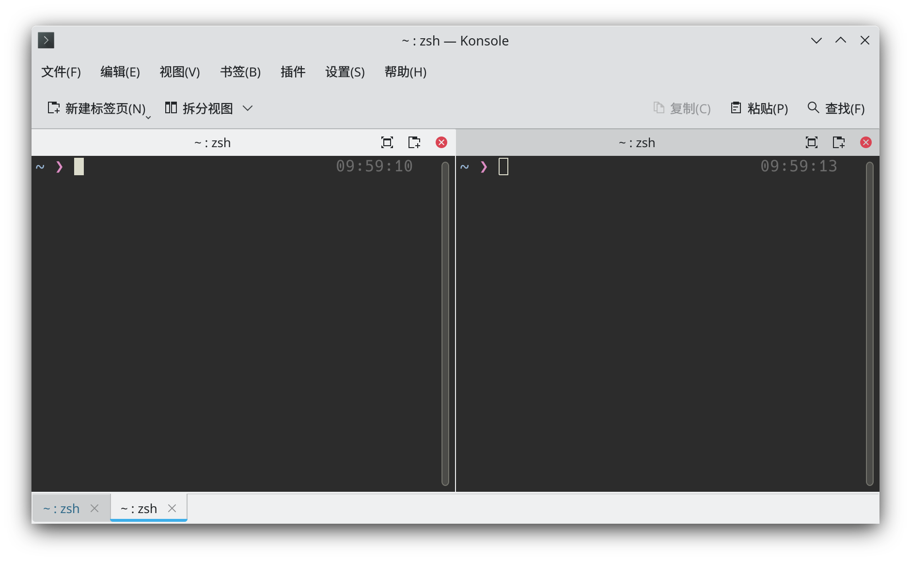
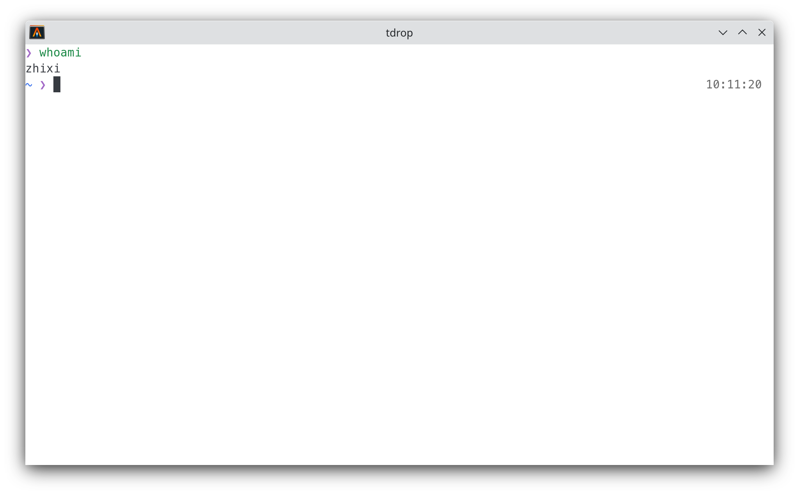
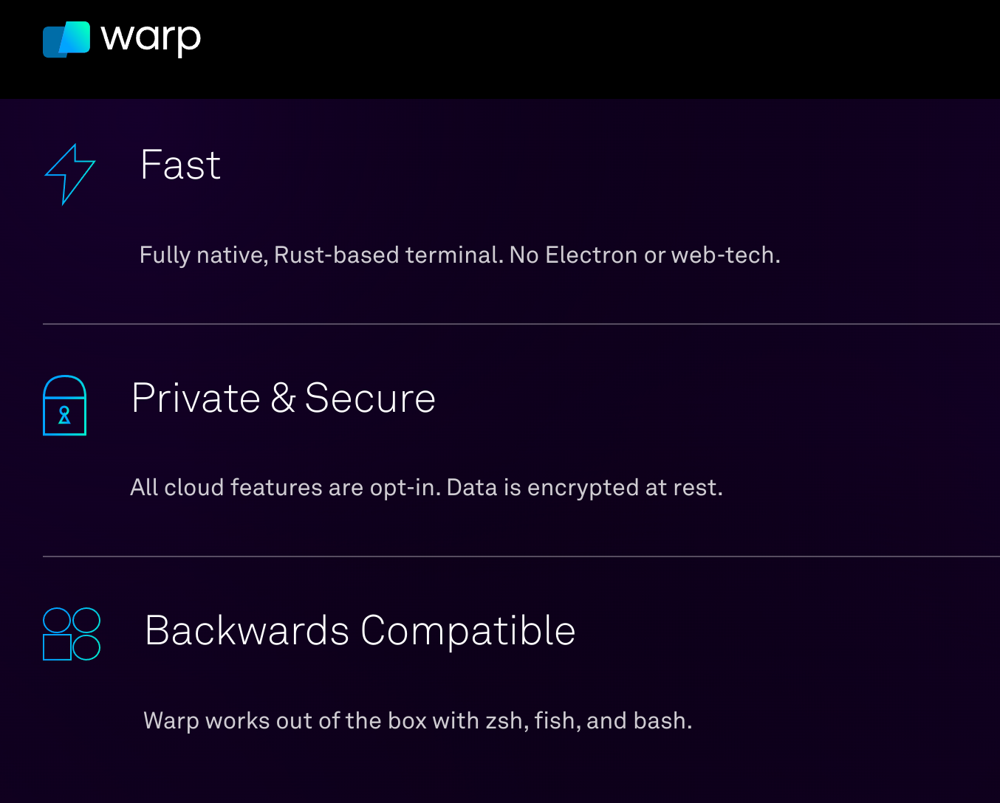

Warp为什么能融资2300万美元，哦，是绿油油的韭菜。
<!-- more -->

## 什么是好的Terminal Emulator

我觉得一个好的Terminal Emulator至少要开源。然后是渲染速度快、字体渲染效果好、美观。

我喜欢的是那种硬朗和简洁的，像素风格、CRT风格的复古终端也不错。而Warp呢，我也没用过，我看他们的介绍视频感受了一下。Warp吹自己UI漂亮，在我眼中反而喧宾夺主，不同命令之间分割的横线和框相当干扰视线，输入命令的时候弹出来的一堆自动补全框和文档看着就烦。这些弹出来的框框我不知到为什么很别扭，仔细一想这不就是当年我用Windows Xp的青葱岁月，动不动就会弹出来的弹窗广告吗？

目前最喜欢的一个是Alacritty，一开始我比较喜欢KDE的yakuake，下拉终端，非常方便，自带分屏和多窗口。后来听说了Alacritty，刚开始用alacritty的时候，总想着yakuake的一些功能。再后来我发现这些功能几乎都可以交给其他东西去做，分屏可以用tmux（wm用户用不着这个东西，直接新开一个窗口就好了），悬浮和下拉这种效果可以用tdrop

KDE的konsole是这样的（我点开了一下新建标签页和拆分视图），有很多功能，甚至还有ssh管理器的插件

而Alacritty是这样的，没有工具栏，没有新建视图和拆分，也没有GUI界面让你去设置主题和行为（你要自己去用yaml配置），习惯了别的终端模拟器的人刚接触Alacritty大概率会觉得缺这少那的（我就是）

然而我后来深深的喜欢上了Alacritty的简洁，在这一段时间里我的观点和品味受到了Unix、go语言、wm（window manager）。那一堆图形界面的按钮和工具栏状态栏和Tab，反而是很占地方很影响视线和注意力的。Alacritty看起来就像一个1970年过来的terminal一样，一点多余的东西都没有，一个干干净净的终端模拟器，仅此而已。在OpenGL的GPU加速下丝滑流畅，比起那些什么需要联网还要注册登陆的所谓21世纪的终端，Alacritty复古到让人感动的内牛满面。

Alacritty对决定支持的特性毫不含糊，比如cjk的支持（非中文开发者对中文支持这么好的真的不多）、比如配置热加载（改完yaml配置立刻更新）

很多时候Alacritty的作者显得有些过于顽固了（Alacritty的作者多次在issue面被人说stubborn），只有一个朴实无华的一个窗口，甚至没有侧面可以用鼠标拖动的滚动条，也没有Tab。就像go一样不怎么听社区意见和接受pr

很早就有支持连字符（ligatures）的issue了，也有其他的fork让alacritty支持连字符，但是alacritty的作者对实现和性能不满意，一直没加

>If you want可知 ligatures so badly that you're willing to run a low quality fork, I'd recommend switching to a terminal emulator that natively supports ligatures.

再看他对scrollbar需求的回应，观点也差不多

>A scrollback that can be dragged around is definitely out of scope of this project. The main reason why this issue is still open, because an indicatior to show position in the scrollback buffer is not completely out of question.

有的时候alacritty ssh登陆比较老的服务器的时候，会报`'alacritty': unknown terminal type`, 这是因为alacritty的`TERM` terminfo env是alacritty而不是`xterm-256color`。其实alacritty基本兼容xterm-256color，大可以直接声称自己是xterm-256color，但是alacritty的作者觉得这样不好，固执的把terminfo设为alacritty。[alacritty的作者告诉你应该安装alacritty的terminfo](https://github.com/alacritty/alacritty/issues/3962)，于是这回复又被踩了，惨

其实可以直接简单的`alias ssh="env TERM=xterm-256color ssh"`

## 再说Warp

Warp的画风几乎完全走向了Alacritty的对立面。

前几天多次看到Warp融资2300万美元的新闻，先是在archcn的水群看到有人说看到v2ex上有人说 hacker news 说这个收集遥测数据。然后晚上打开知乎被推送了warp的问题，关上知乎打开小蓝鸟结果又看到我关注的人在说这个。可能是实在太离谱了

本来我是没兴趣看这种花里胡梢的东西的，毕竟alacritty它不香嘛。这么多人都在说，那我看看这是什么妖魔鬼怪。看完一圈，嗯，上一次让我这么生理性作呕的还是一群人吹元宇宙和web3.0。在 hacker news 上被喷烂了的东西很多，一个苹果的应用软件在果粉大本营v站都能不满居多那你是真的不太行。节选V站网友点评

>先震惊一下：震惊，某号称 21 世纪的终端必须联网登陆后才能使用!!!
>看了下介绍感觉还不错，安装后发现必须要用 Github 登陆才能用，只能说 🐶 听了都摇头。

首先是最离谱的事情，居然要联网注册帐号登陆才能用。你是跟微信学的吗？你要不要把手机扫码登陆也学过来？  

然后是不开源，啊，毕竟要恰烂钱的嘛。这个是 Hacker News 评论区密集的喷点。别的专用的大型工业软件不开源可以理解，Terminal Emulator 不开源是几个意思。如果是微软或者苹果的自带终端不开源，至少还有大公司的背书。Terminal Emulator 是和输入法、浏览器、密码管理器一样重要的东西，但凡留点后门窃取隐私，底裤都全没了。  

融资这么多钱，投资人又不是来做慈善的，又不像微软做VSCode那样砸钱买点名声，就当洒洒水打广告喽。那怎么办呢，要么订阅制收钱，要么就经典的贩卖隐私喽。现在就要登陆才能用了，以后你是不是还要来个开屏广告啊。   

然后再说所谓的杀手级功能，

Input that feels like a code editor 那我为什么不直接新建一个`.sh`文件，然后用vim之类的真正的code editor编辑它？

No more scrolling through a wall of text “Copy the output with one click and zero scrolls.” 为啥不scroll啊，我鼠标呢

Form commands at the speed of thought 为啥要有workflow啊，历史命令自动补全不好用吗。说起自动补全，Warp和fig的类似IDE候选框的自动补全我真的不建议你使用。你应该对自己写的东西有足够的了解，你最多只需要历史命令自动补全。没用过的命令你应该好好看看文档，然后小心的试一下。不要输入不熟悉的命令。至于熟悉的命令，我并不需要

Run your documentation inside the terminal  那我为什么不直接在terminal里面开个vim写markdown

Terminal sharing   这个是最离谱的，前面那些多多少少还算有点用。这个。。。远程多人协作。我惊了，这是心有多大才敢用这玩意。哦，再一看貌似这个作者原来是搞Google Docs的，把在线协作这一套带过来了。我很好奇，终端敲命令难道还需要在线协作吗？终端敲命令能超过10行吗？超过10行难道你不写成bash脚本？大多数情况下就是一行吧。难道这也要协作？别人是来协作的还是来捣乱的？？？

别人当场输入个`rm -rf /`回车，或者当场挂个反弹shell，你怎么办啊。就这么连着网随随便便把终端共享给别人，太Secure啦！太Private啦！这是何等的Private&Secure！

All cloud features are opt-in. Data is encrypted at rest. 太隐私了真的，内置cloud fatures。怎么，合着你还往云端发送data是吧。

Warp暂时只有苹果平台的，linux和win等其他平台暂时还在下一步开发中。哦，也就人傻钱多的果粉这么容易被割韭菜了吧。苹果这几年干的事，当年鲍尔默称linux为毒瘤那会的微软怕是都没有现在的苹果“evil”，封闭程度和霸道程度都不输当年的微软。哦，说起微软。不管是装的还是真的，起码微软这几年对开源社区的态度是变了，多多少少是做了点好事。连微软的windows terminal都开源了。

你看看这几年苹果干的事：

krita等开源社区和苹果的恩怨情仇  
freebsd捐款高达3位数：[Apple Donated $100-$249 to FreeBSD in 2021](https://news.ycombinator.com/item?id=26716177)  
还有curl事件：<https://www.v2ex.com/t/816680> [Free Apple Support](https://news.ycombinator.com/item?id=29267024)  

其他的事我不说了，跑题了，你可以去twitter找知名果粉@virushuo收听关于水果的好事。

## 终端模拟器就该做一个终端模拟器的事

>Simplicity is hard to design

多人协作的功能不是一个终端该有的，就像JNDI查询不是Log4j一个日志库该有的。一个日志库为什么要有动态执行？一个终端模拟器为什么要有多人协作？

之前做一些骗钱项目和管理系统，老板总让我们功能越多越好。事实上大多数人也确实首先看的是功能是不是丰富、是不是好看。于是搞到最后就是一些拼多多一样的东西，一个弹窗接一个弹窗，各种乱七八糟的功能往里面乱扔。15年以前的知乎功能是很简陋的，现在功能是很多的。但是这么多功能除了让人看着烦，还有什么用呢？我要看直播和视频绝不会在知乎看，新加的这一堆功能除了恶心人，还有什么用呢？

我当年看了《effective modern c++》，那一堆auto和眼花缭乱的语法最后让我决定再也不学 moderm C++了，不能将有限的生命和无限的语言律师死磕。也是从那以后，我开始喜欢上了看起来功能残废的go，似乎有点老旧的C

Alacritty作为一个比较新的终端模拟器，界面远比Konsole等终端模拟器简洁，回到了90年代以前的样子。看起来就像一个终端，这是对一个终端模拟器的最高赞扬，修旧如旧。

>Keep it Simple, Stupid！

## 链接

[Less is exponentially more](https://commandcenter.blogspot.com/2012/06/less-is-exponentially-more.html) Robe Pike 写的
[你不需要花哨的命令提示符
](https://zhuanlan.zhihu.com/p/51008087)  
[You Are Not Google](https://blog.bradfieldcs.com/you-are-not-google-84912cf44afb)  

Alacritty相关：

[Alacritty](https://alacritty.org/index.html) Alacritty官网，稳重简洁。点开F12也没有一堆乱七八糟的js  
[Support for ligatures
#50](https://github.com/alacritty/alacritty/issues/50)   ligatures支持的issue  
[Tabs support in the terminal #3129
](https://github.com/alacritty/alacritty/issues/3129)  Tab相关讨论    

以下是Warp相关的讨论

https://news.ycombinator.com/item?id=30921231  
https://www.v2ex.com/t/845150  
https://www.v2ex.com/t/836608  
[终端的困境与 Warp 的野心](https://2d2d.io/s2/warp/) 这篇吹捧Warp的文章原文首发于微信公众号。微信公众号这个东西，怎么说....气味相投吧   
https://twitter.com/zty0826/status/1333989136072491009  
https://twitter.com/zty0826/status/1333990018705100803  对味了  
https://www.youtube.com/watch?v=T7R8lvvBgOI  
视频5分13秒，为什么你这终端点个确认还要拿鼠标点啊？确认为什么不直接用键盘还要弹出来个用鼠标点的按钮，你是流氓弹窗广告吗？  
https://github.com/warpdotdev/Warp  建一个github仓库又不开源（虽然据说后续有开源计划），是跟某国产XXX学的吗？  