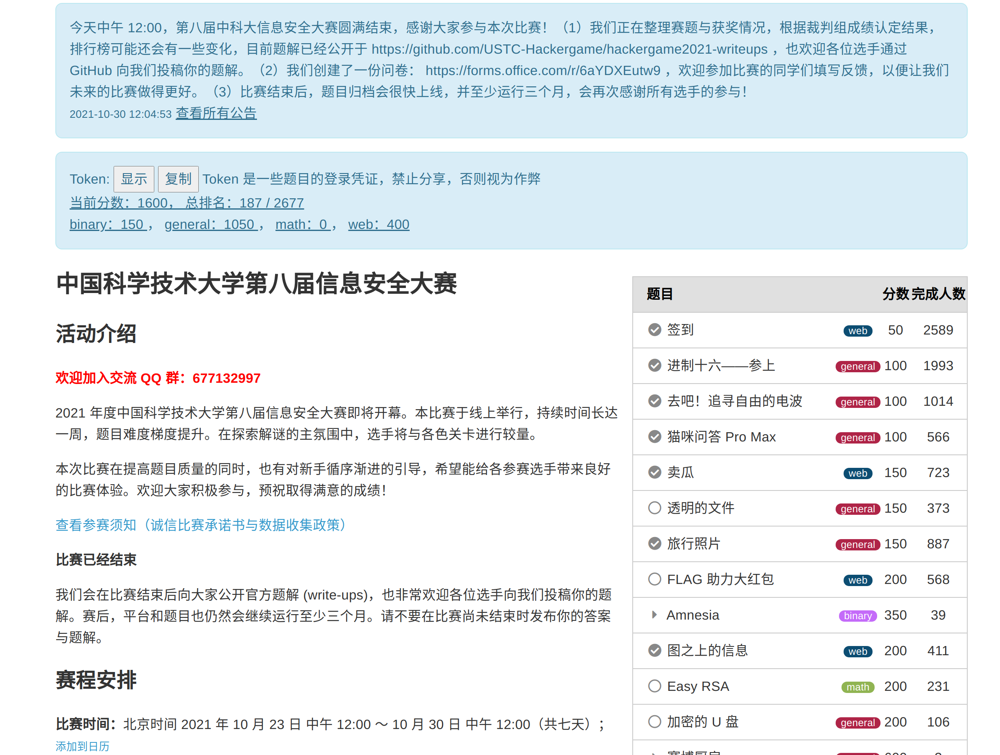
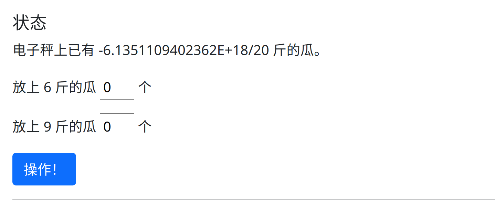

吃瓜群众第一次参赛，从LUG过来的，打酱油路过，没学过信安和密码学，然而很遗憾，跟Linux有关的那几个题全都没做出来。。。。   
很意外自己能挤进200名的，事前完全没有准备，也没接触过CTF之类的东西，甚至比赛开始3天，进行到一半了我才突然发现这比赛它已经开始了，如果早知道 p😭q   
对，今年这个Hackergame就是UTF-8比赛，对萌新可友好了（确信  
<!-- more -->

周二还在想今年中科大信安赛是不是要开始了，结果一看已经进行一半了，来划个水吧。由于太菜加上懒，math零蛋，只能流下数理基础不扎实的泪水p😭q 。 

作为一个纯萌新和老废物，第一次参加Hackergame，以前看到他们中科大LUG办的，就想着下次举办去参加一下玩。以前看到好多Web题和有意思的小题目，虽然我js也特别菜，好歹还能挣扎一下。结果几年一打开就是一堆binary糊脸，二进制和逆向pwm之类的完全不懂，罢了，就做点General吧。

结果？？？？进前200了？



看来Hackergame真的是萌新友好，明年一定再来玩。

## 做出了来的的小题目

还是有不少对我很友好的题目的

### 签到题

>为了能让大家顺利签到，命题组把每一秒的 flag 都记录下来制成了日记本的一页。你只需要打开日记，翻到 Hackergame 2021 比赛进行期间的任何一页就能得到 flag！

打开题目，秒是从1970年开始计算的，这就是UNIX时间戳呗。

```bash
date +%s
```

得到`1635213339`，修改URL后缀，得到`flag{HappyHacking2021-b0e5f6c9af}`签到成功

### 进制十六——参上

首先我们OCR识别一下

```
456163682068657861646563696D616C
20646967697420726570726573656E74
7320666F75722062697473202862696E
61727920646967697473292C20616C73
6F206B6E6F776E2061732061206E6962
626C6520286F72206E7962626C65292C
20776869636820697320312F32206F66
206120627974652E20666C61677B5930
555F5348305531445F6B6E30775F4830
575F74305F43306E763372745F484558
5F746F5F546578547D20466F72206578
616D706C652C20612073696E676C6520
627974652063616E2068617665207661
6C7565732072616E67696E672066726F
6D20303030303030303020746F203131
31313131313120696E2062696E617279
20666F726D2C2077686963682063616E
20626520636F6E76656E69656E746C79
20726570726573656E74656420617320
303020746F20464620696E2068657861
646563696D616C2E0000000000000000
00000000000000000000000000000000
```

这个好办，打开Bless Hex Editor之类的Hex编辑器, flag的16进制是`66 6C 61 67`, 找到相应位置，得到flag为`flag{Y0U_SH0U1D_kn0w_H0W_t0_C0nv3rt_HEX_to_TexT}`

### 卖瓜

F12想直接修改放瓜数量为负是不可以的，我们没有办法放上一个负数或者小数的瓜

```
<p>放上 6 斤的瓜 <input type="number" class="number" name="b6" value="0" min="0"> 个</p>
```

然后开始填一个很大的数尝试溢出，果然。



然后就是打开WolframAlpha, 一边算一边试，试出了一个正好二十。

### 旅行照片

一开始没什么头绪，但是看到左下角那个彩色方块的小房子实在是太显眼了，可能是什么地标建筑。我们以图搜图找一下呗。

Google搜图没有结果，TineEye也没有。算了算了，打开我最讨厌的百度（毕竟这可能是一个国内的位置）

[百度搜图的结果](https://graph.baidu.com/pcpage/similar?originSign=126c0d5b82f232f3069b901635311759&srcp=crs_pc_similar&tn=pc&idctag=gz&sids=10007_10512_10521_10914_10913_11006_10924_10905_10018_10901_10942_10907_11012_10970_10968_10974_11032_17851_17070_18013_18101_17200_17202_18301_18311_18330_19300_19191_19162_19220_19210_19212_19214_19217_19219_19256_19230_19268_19280_19550_19670_10000&logid=2438427008&entrance=general&tpl_from=pc&pageFrom=graph_upload_pcshitu&image=http%3A%2F%2Fimg1.baidu.com%2Fit%2Fu%3D3825340220,927605046%26fm%3D253%26app%3D138%26f%3DJPEG%3Fw%3D640%26h%3D480&carousel=503&index=1&page=1&shituToken=c923d3)

[百度搜图的结果](https://graph.baidu.com/pcpage/similar?originSign=126c0d5b82f232f3069b901635311759&srcp=crs_pc_similar&tn=pc&idctag=gz&sids=10007_10512_10521_10914_10913_11006_10924_10905_10018_10901_10942_10907_11012_10970_10968_10974_11032_17851_17070_18013_18101_17200_17202_18301_18311_18330_19300_19191_19162_19220_19210_19212_19214_19217_19219_19256_19230_19268_19280_19550_19670_10000&logid=2438427008&entrance=general&tpl_from=pc&pageFrom=graph_upload_pcshitu&image=http%3A%2F%2Fimg2.baidu.com%2Fit%2Fu%3D3251290765,1465237489%26fm%3D253%26app%3D138%26f%3DJPEG%3Fw%3D249%26h%3D249&carousel=503&index=5&page=1&shituToken=9d0978)

搜到了，是秦皇岛西浴场。这个彩色方块的小房子是海边的救助亭。

秦皇岛西沙滩，附近有酒店和KFC，而且旁边就是海，应该就是这里了。

旁边甚至还有一个停车场。和一个秦皇岛国际大酒店（最后根据位置发现酒店应该不是这个）

然后查找一下周围的KFC（这种事情应该让馒狗来），果不其然有一个网红Tiffany KFC,一群人在小红书打卡。

https://www.xiaohongshu.com/discovery/item/5e96c91900000000010057c1

高德地图上可以找到电话：0335-7168800

大众点评的照片上可以看到左侧建筑的三个字为：**海豚馆**

http://www.dianping.com/shop/24434087

从地图上看可能是东南方向，从阳光照射方向看可能是傍晚。

然后就剩下了楼层数，大概有15、16层左右的样子，随便试几个。结果是16，好的，得到flag

### 去吧！追寻自由的电波

这个是我精通八门乐器的校艺术团室友秒掉的，听了一遍就说修改采样率（大概从48000调到了18000的样子），就可以听到正常的声音了。
是一串北约音标字母。

真好，虽然找不到中科大少年班的神通口算口算RSA，但是我有精通乐理的室友。

### 喵咪问答 Pro Max

这个没啥好说的，Google搜就完事了（已经关闭的网站看Web Archive的快照就好了）

report地址是`/dev/null`可还行

### 图之上的信息

graphql查询，这个也比较简单，没做什么严格的限制去卡你，直接查就完事了

```json
{
    user(id:1){
        username
        privateEmail
    }
}
```

url接口是`/graphql?query={.....}`, 会得到一个：

```json
{"data":{"user":{"username":"admin","privateEmail":"flag{dont_let_graphql_l3ak_data_dad4053dd4@hackergame.ustc}"}}}
```

收工。。。


### Amnesia 轻度失忆（第一个flag）

>编译后 ELF 文件的 .data 和 .rodata 段会被清零。

唯一整出来的binary题目（避免了binary和math双双爆零的惨状），虽然这个好像也不算binary，更像是在考我编译原理。使劲浑身解数。。。。

```c
#include<malloc.h>
char * hello;
int main() {
    hello = (char*)malloc(13);
    hello[0] = 'H';
    hello[1] = 'e';
    hello[2] = 'l';
    hello[3] = 'l';
    hello[4] = 'o';
    hello[5] = ',';
    hello[6] = ' ';
    hello[7] = 'w';
    hello[8] = 'o';
    hello[9] = 'r';
    hello[10] = 'l';
    hello[11] = 'd';
    hello[12] = '!';
    asm volatile (
    "mov $4,%eax;"
    "mov $1,%ebx;"
    "mov hello ,%ecx;"
    "mov $13,%edx;"
    "int $0x80"
    );
    //free(hello);
    return 0;
}
```

有个小问题是它会内存泄漏，但是想不出什么更好的解答了。

### 赛博厨房

level0 简单，level1 也简单，就是实现一个循环呗。

剩下两个给我整不会了，人都傻了。

### p😭q

我也不知道这道题何德何能排在倒数第三个，甚至还有400分的分值。在学了信号与系统、数字信号处理、数字图像处理、生物医学信号处理的我看来，这应该属于送分题。（不过之前都是用matlab做的，python的库都没用过）

先将gif每一帧转成图像再转成numpy的array再转成一维数组得到功率谱，傅立叶反变换回去得到音频信号......

等等。。。。它只有功率谱的幅度没有相位信息我可怎么恢复。难道要我猜一个相位吗？

搜了一下librosa，有一个自带的恢复库，用的是一个迭代估计的算法


```python
from PIL import Image, ImageSequence
import numpy as np
import librosa
import soundfile as sf

sample_rate = 22050
num_freqs = 32
quantize = 2
min_db = -60
max_db = 30
fft_window_size = 2048
frame_step_size = 512
window_function_type = 'hann'

im = Image.open('flag.gif')
iter = ImageSequence.Iterator(im)


index = 1
spec = np.zeros(32, dtype=int)

for frame in iter:
    # print("image %d: mode %s, size %s" % (index, frame.mode, frame.size))
    frame.save("./imgs/frame%d.png" % index)
    index += 1

    image_arr = np.array(frame, dtype=int)

    image_list = np.sum(image_arr, axis=0)
    # print(image_list)

    image_list = image_list[3::4]
    # print(image_list)

    # print(image_list.shape)
    spec = np.vstack((spec, image_list))

print(spec)

np.savetxt('output1.txt', spec, fmt="%d")

spec = np.delete(spec, 1, 0)

melspectrogram = librosa.db_to_power(spec.T/2) * 2

# print(melspectrogram.shape)

audio_signal = librosa.feature.inverse.mel_to_audio(
    melspectrogram,
    n_iter=32,
    sr=sample_rate,
    n_fft=fft_window_size,
    hop_length=frame_step_size,
    window=window_function_type
)

# print(audio_signal, audio_signal.shape)
sf.write('test.wav', audio_signal, sample_rate)
```

好的，秒了。（怎么有种回到本科写课堂作业的感觉）

声音是有了，但是这个相位好像还是不太对的样子。我超，回声不绝于耳。。。

调一下参数，让他多迭代几轮`n_iter=8192,`，行了，现在清晰度有个高中大喇叭放英语早读听力的样子。

**衬衫的价格是九磅十五便士，现在你有十秒钟时间，将Flag填到输入框上**.......


## 看起来有点头绪但是没做的题目

懒癌又犯了，周六休息一会，周五天气太好了，还有其他事情要做，算了

### Easy RSA

由于我找不到中科大少年班的神通，而我自己的数论还停留在高中水平（当年数竞还过了校队选拔，然后上来就听了好几节数论和组合，直接退出了（后悔，现在就是非常后悔））

只能找山大网安的大二学弟来帮帮我看看这个密码学的问题，问问这种形式该怎么解(已知n, p, q, c)

$$
a^n mod(p*q) = c
$$

他当场就给我秒了，还随手写了3页。

然后问题是怎么跑出这个p来，这次学弟也没什么好办法了

```python
def get_p():
    x = 11124440021748127159092076861405454814981575144744508857178576572929321435002942998531420985771090167262256877805902135304112271641074498386662361391760451
    y = 11124440021748127159092076861405454814981575144744508857178576572929321435002942998531420985771090167262256877805902135304112271641074498386662361391661439
    value_p = sympy.nextprime((math.factorial(y)) %
                              x)  # Hint：这里直接计算会溢出，请你仔细观察 x 和 y 的特征
    return value_p
```

一开始我是这样跑的：

```python
x = 11124440021748127159092076861405454814981575144744508857178576572929321435002942998531420985771090167262256877805902135304112271641074498386662361391760451
y = 11124440021748127159092076861405454814981575144744508857178576572929321435002942998531420985771090167262256877805902135304112271641074498386662361391661439

sum = 1
for i in range(1, y+1):
    sum = (sum*i) % x
    # print(sum)
    if sum == 0:
        print("sum的值是", sum)
        break

print("sum的值是", sum)
```

结果一跑就是一天，看到我的5600g只有1个CPU在跑，我决定整个multiprocessing（本来想用Golang整一个，但是Golang的数值计算库不太行，还得去用那个难用的`math/big`包）

结果再次发现，甚至上了multiprocessing，反而更慢了。

于是我决定搜一下，结果就找到了这个网站的两种算法：[Compute n! under modulo p](https://www.geeksforgeeks.org/compute-n-under-modulo-p/)

哦，有个复杂度$O((p-n)*Logn)$的算法

```python
# Python3 program to comput
# n! % p using Wilson's Theorem

# Utility function to do modular
# exponentiation. It returns (x^y) % p
def power(x, y, p):

    res = 1  # Initialize result
    x = x % p  # Update x if it is more
    # than or equal to p
    while (y > 0):

        # If y is odd, multiply
        # x with result
        if (y & 1):
            res = (res * x) % p

        # y must be even now
        y = y >> 1  # y = y/2
        x = (x * x) % p

    return res

# Function to find modular inverse
# of a under modulo p using Fermat's
# method. Assumption: p is prime


def modInverse(a, p):

    return power(a, p - 2, p)

# Returns n! % p using
# Wilson's Theorem


def modFact(n, p):

    # n! % p is 0 if n >= p
    if (p <= n):
        return 0

    # Initialize result as (p-1)!
    # which is -1 or (p-1)
    res = (p - 1)

    # Multiply modulo inverse of
    # all numbers from (n+1) to p
    for i in range(n + 1, p):
        res = (res * modInverse(i, p)) % p
    return res


# Driver code

x = 11124440021748127159092076861405454814981575144744508857178576572929321435002942998531420985771090167262256877805902135304112271641074498386662361391760451
y = 11124440021748127159092076861405454814981575144744508857178576572929321435002942998531420985771090167262256877805902135304112271641074498386662361391661439
# y = 10

n = y
p = x
print(modFact(n, p))

# This code is contributed by ihritik
```

**只用了1分钟**就跑了出来。这算法好强！

我把这个做法发给学弟，学弟表示：

“可以，回头我看看”  
“**我比较关心这个是怎么构造出来和怎么证明的**”  
“**初等数论比较巧妙**”  
“**可以看一下**”  

听完学弟的话，接下来的内容我不太想做了。  
我这样数理基础不扎实的菜狗（尤其是数论，一窍不通），做出来也**改变不了我是个数论白痴的事实**。都是些trival的东西了，**有这个时间折腾这些应该去系统的补习一下数论**。

### 拼多多砍一刀

FLAG 助力大红包，这个东西应该挂一个爬虫代理池能做。但是这个方法好像太暴力了点，而且我不想再爬东西了，免费的那几个IP池都不太好用，要钱的又不想掏钱。

### minecraft

随便乱走亮了两盏灯，还有一盏。看起来应该F12找找线索，有一个flag.js的东西，但是它一堆16进制的变量和函数名，看起来挺费劲，算了，不看了。

### 二维码

应该就是根据奇偶校验和他给的打码过程的那个python文件。上一次做二维码和奇偶校验的东西还是大二上数字电路的时候。

看起来像是第十版二维码，结果打开qrazybox想手动修复一下最高只有ver.9

然后写了十几行发现好像这个东西要枚举遍历？？可能的二维码团还不止一种。（不知道是不是我漏了什么条件，但看起来还原出来确实不止一种）

周五周六天气真好，成都难得出太阳，不做了，出去玩。

## 以为会做然而被乱杀到怀疑人生的题

### Amnsia记忆清除

抹除掉ELF文件的`.text`段，完全不会

### LUKS

就觉得我这么长时间的Linux白用了，整不出来。我只会hashcat爆破，Hashcat爆破又没啥意思，算了，放弃。

### RAID修复

文件系统白学了，直接不会，白给。RAID-0做不出来，RAID-5也做不出来。

### 赛博厨房后两问

直接人都傻了，找不到规律，根本找不到。

## 小结

现在是周六中午12点，总排名187/2679，很幸运没有掉出200名。

>当前分数：1600， 总排名：187 / 2679
>binary：150 ， general：1050 ， math：0 ， web：400

今年是第一次参见Hackergame，玩的很开心。binary的题比往年多了很多，不过我一个都不会，好在有个打印`Hello, world!`的题，很幸运没有爆零。  

当然，general和web题还是给了我一点信心，让我有种我上我也行的感觉，不过打开排行榜看到mcfx乱秒的样子，嗯，我是傻逼。

主要感想就是数理基础太差，数论是真的是一窍不通，这几个月正好有空，准备去恶补一下数学。    

当然进前100名和CTF师傅们以及天神下凡的mcfx合影留念是无望了，明年再来玩耍吧。欢度周末去了，再见。   


