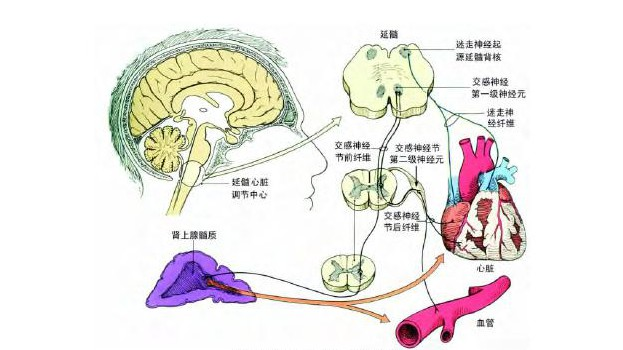

等待填坑
<!-- more -->

## 采集

HRV测定的是NN间期(在正常的窦性心律时就是RR间期)的波动，主要与自主神经调控机制有关。标准的HRV根据正常窦性搏动的NN间期得出的（正常对正常间期，normal-to-normal,*NN* intervals，即由窦房结除极所致相邻QRS波群之间的所有间期）的变化来表示心率的变异性。

### 心电（ECG）

可以从心电图中直接提取R波尖峰并将RR间期的值用于心率变异性分析

### 心冲击图（BCG）

心冲击图去除呼吸和活动的干扰后提取JJ间期时间计算心率变异

### 光电容积图（PPG）

目前市面上主要的脉搏波测量方法是光电容积脉搏波描记法（photoplethysmography），用光电传感器检测光经过人体的反射和衰减转换成电信号后得到，包括Apple Waltch等手环产品，用光电容积法检测血氧、心率、心率变异性等生理参数。

PPG法采集到的脉搏波经过去噪和整流等处理后提取PP间期可以计算心率变异。

#### 远程光电容积扫描

（rPPG，remote PPG）是一种新的方法，只要高清摄像头检测光线变化，真正的无创非接触。

但是这种方法成本高，易受到运动和光线变化的干扰。目前这个领域比较热门，进展也很快。一些补偿和增强鲁棒性的方法包括全局和局部运动跟踪和独立成分分析等。

现在此类研究缺乏可靠的公开数据集支持，现有研究大多采用MAHNOB-HCI和DEAP等用于活体识别和情感识别的公开数据集和私有数据集。

## 产生机理和影响因素

>HRV反映的是自主神经和非自主神经系统所有反馈回路极其复杂的非线性交互作用。自主神经系统是窦性节律条件下心率的主要调节机制。

忽略微小的影响，HRV的高频部分主要受迷走神经的调节，低频部分受到迷走和交感神经的双重作用。

>交感神经增强自律性，而副交感神经抑制自律性。交感神经通过增加起搏点去极化程度产生变时性作用，而对心脏起搏点细胞的迷走刺激会引起超极化而降低去极化程度。自主神经的这两个分支均影响与心脏起搏细胞去极化相关的离子通道的活动。

被测者的体位也会显著影响HRV，多数人处于仰卧位时，副交感神经活动明显增强。

在突然站立或倾斜时，压力反射活动也会引起心率的同步波动。

在24小时HRV中，白天交感神经活动相对增强，心率较快，而夜间迷走神经活动增强，心率较慢。正常睡眠时，生理活动也随每个睡眠周期(约90分钟)而呈现明显节律。

精神情绪的波动也会影响HRV，和迷走神经和交感神经系统的兴奋性有关。

此外，非自主神经因素(如神经内分泌功能)也会影响HRV。

心率变异性也和年龄、性别等因素有关。

## 主要指标和数据分析

### 时域特征

医学上通常要求5分钟以上的的HRV做短时分析，但是有研究表明30s内的HF和LF和5分钟的没有太大区别，应用是可以进一步缩短检测时间。

- SDNN(ms)：NN间期(正常RR间期)的标准差(5分钟)

- SDANN(ms)：NN间期(正常RR间期)的标准差（24小时）

- pNN50：相邻NN间期相差>50ms的数量占总心搏数的百
  分比

- rMSSD(ms)：相邻NN间期差值的均方根

rMSSD反映每搏NN间期变化的平均绝对值，对不规律心搏和/或心搏波形标记错误的敏感性也很高。

24小时记录得到的SDANN值低下表明缺乏昼夜节律。

### 频域特征

- 总功率（TP）：频段≤0. 4Hz。

- 超低频功率（ULF）：频段≤ 0. 003Hz。

- 极低频功率（VLF）：频段 0. 003~0. 04Hz。

- 低频功率（LF）：频段 0. 04~0. 15Hz。

- 高频功率（HF）：频段 0. 15~0. 4Hz。

- LF/HF: 低频功率和高频功率的比值

LF反映副交感传出神经(迷走神经)和交感传出神经系统活性的综合调节

HF反映副交感传出神经(迷走神经)活动的调节

### 非线性分析

#### 动态心电图（Holter monitor）

持续记录24小时或更久（几个月或一年以上）的长时间心电图数据，主要用来检测心律失常或传导异常和晕厥或晕厥前兆。

$a\dot{b}c$

##### 洛伦兹散点图

把前1个心动周期长度（ms）定为横坐标、后1个心动周期长度（ms）定为纵坐标，即可在直角坐标系中确定一点。这样一个点就由3个QRS波（R波）、2个RR间期决定。第1个RR间期R1R2和第2个RR间期R2R3为第1个点，第2个RR间期R2R3和第3个RR间期R3R4为第2个点，依次类推，从R1 -> Rn作图就可得到 n-2 个点，绘制心率散点图（洛伦兹散点图，Lorenz Plot），判断窦性心率、室上性和室性心率失常。正常窦性心律呈彗星状，心衰、房颤等症状会出现不同的散点图。窦性心律沿45°线分布，呈彗星状

散点图可用于：

评价心率波动范围（散点图的位置分布）

评价自主神经调节（长轴）

评价心率变异（短轴）

诊断心律失常（散点图的形态）

##### 差值散点图

首先对序列 $RiR_{i+1}$ 做一阶差分, 得到序列 $d_j ,j=1,2,\dots N-1$ 然后以 $(d_j, d_{j+1})$ 为坐标绘制散点图（Poincaré散点图）。差值散点图反映了RR间期差值的离散度 ,对连续RR间期的变化十分敏感。

首先对序列$R_iR_{i\times1}$做一阶差分, 得到序列 $d_j,j=1,2,\dots N-1$ 然后以 $(d_j, d_{j+1})$ 为坐标绘制散点图（Poincaré散点图）。差值散点图反映了RR间期差值的离散度 ,对连续RR间期的变化十分敏感。

##### 三维散点图

三维散点图的一些意义还不明确，医院里实际用的也很少

##### 心率震荡（HRT）

心率震荡（heart rate turbulence）是指发生室性早搏后，窦性心律出现短暂的加速和减速的过程。检测HRT异常有助于预测自主神经功能障碍以及心血管事件的风险增加。

分析HRT通常需要24小时HRV动态心电图，主要有震荡初始(turbulence onset, TO)和震荡斜率(turbulence slope, TS)两个指标。

## 临床价值和应用

### 心肌梗死死亡率预测

心梗后早期(14日内)，若检测到患者的HRV指标降低，则心梗后3年内的死亡风险增至3-4倍。

### 心力衰竭

已知就预后而言，HRV降低是总体死亡、心力衰竭死亡、心脏性猝死、室性心律失常和心脏移植的
独立预测指标

### 评估自主神经病变

HRV明显降低或缺失可以作为辅助指标。

### 冠心病

冠心病患者的HRV显著降低,且与冠状动脉病变支数及狭窄程度呈负相关,但与冠状动脉病变部位无关。

### 检测精神压力

短时HRV变化可用于辅助检测精神压力

迷走神经的冲动传导频率受呼吸频率和深度的调节而呈现节律性波动，呼吸性窦性心律不齐(respiratory sinus arrhythmia, RSA)。在有节奏的呼吸或冥想时，RSA可被放大。

### 评估体育表现

可以作为推测无氧阈的较为精确的指标之一

>注意
在运动评估中一般只有要求无伤等才会首先考虑HRV，一般是用血清肌酸激酶(CK)、血清睾酮(T)、血红蛋白、乳酸等

### 监测训练负荷及诊断运动性疲劳

交感一副交感神经张力的平衡会随着运动强度的改变而波

### 运动康复医学领域

用于自主神经功能改善的评估

### 睡眠分期

略

## 其他

### 呼吸和心率变异性

#### BCG信号中的呼吸信息

在采集到的BCG信号中，会包含呼吸信息，提取心率变异性通常要去除呼吸的干扰。

但是在一些利用HRV进一步分析情绪、压力、睡眠分期的时候，可以考虑保留部分呼吸特征并将呼吸特征纳入到检测和分类中，有时可以提高检测的准确率。

在心率变异性分析中纳入呼吸频率信息以进行压力评估

#### 呼吸变异性

呼吸频率变异性(Respiratory Rate Variability，RRV, 有的地方也叫Breath Rate Variability），和心率变异性一样反映了一些生理特征，但是这种非电信号采集难，噪声大，不规律，包含的信息也比心电和脉搏波等信号少。除了

目前对于RRV的研究比较少，也很少有人用这个特征做睡眠分期检测、疲劳压力检测或睡眠呼吸暂停的检测。一些使用雷达等手段检测疲劳或者睡眠的研究将这项指标作为判断依据。雷达和监控视频等可以在较近的距离探测人体呼吸活动和心率，但是这样采集分离出的心动信息用作睡眠和疲劳监测不如直接采集呼吸和运动的信息进行分析。对于体重指数（body mass index ）过高的的超重人群、较复杂的干扰和活动等情景，使用雷达等方式检测压力或疲劳时HRV准确率大幅降低，从心动信息检测不如直接从呼吸信息检测。在这些场景下会使用呼吸和体动信息来作为指标。

## 数据和软件

1. <https://www.kubios.com/hrv-standard/> 免费的HRV分析软件
2. <https://www.physionet.org/#latest> 心电图数据
3. <https://www.youtube.com/watch?v=D_KYv7pXAvQ> rPPG检测心率
4. <https://pypi.org/project/bob.rppg.base/> rPPG的开源库，数据集MAHNOB-HCI和DEAP
5. <https://www.hrv4training.com/> 一个用蓝牙测HRV的APP，准确率貌似还可以
6. [Firstbeat HRV Summit](https://www.firstbeat.com/en/firstbeat-hrv-summit-2019/) Firstbeat公司的HRV峰会，一些商用搞的比较好的东西
