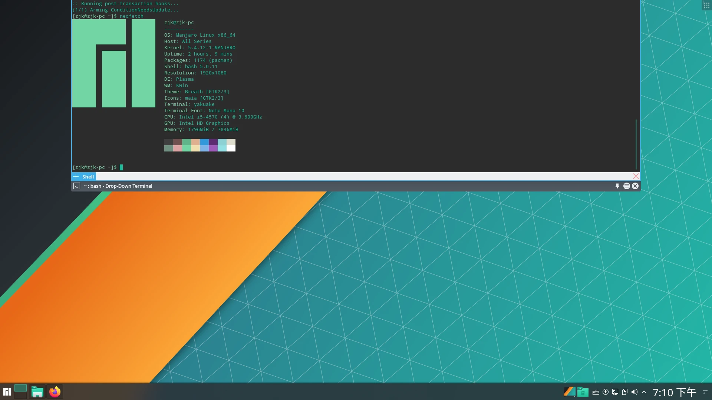

本来我是想装个双系统的，但是想起教研室还有两个老主机，那就.....
<!-- more -->

装Arch是不可能装Arch的

## 安装

选Manjaro是因为对华硕老主板的硬件和驱动支持比较好。

去官网下了最新版的 Manjaro18.1.5 KDE桌面版本，还是拿Rufus做好启动盘用UEFI装，这里直接擦除原来已毕业师兄的win10（erase disk），选 no Hibernate（我不太喜欢systemd，就没设休眠）

看到选项里有个选择LibreOffice还是Free Office的选项，这里我选了FreeOffice试用，体验过两个月再回来填坑写体会。
（更新，还是WPS吧。。。）

习惯性断网安装。没有遇到问题，直接装好了，超乎想象的顺利。唯一的小插曲是装完系统后U盘只剩4M空间，用win10默认的格式化找不回来了，看了[这里](https://zhuanlan.zhihu.com/p/37772825)
网上教程已经很多了，我也不打算再写一篇了，下面仅作个人记录(其实并不怎么需要教程，过时得太快，还不如直接看官方wiki，不想看直接照着提示直接装都没问题，比Ubuntu好装太多了)

内置python是3.8.1，我一时竟有些不习惯😂

## 配置

### 换镜像源

当然还是换成你电的，在`/​etc/​pacman.d/​mirrorlist`加上你电

### 输入法

KDE推荐fcitx

我用的~~sunpinyin~~libpinyin（一个比sunpinyin更新的输入法），googlepinyin也可以，sougoupinyin不推荐，对于它的流氓行为我实在无法放心（如果非要装，记得装fcitx qt4 或 qt5）

如果想要联网提示的功能可以装个cloudpinyin(要用archlinuxcn的源)

```bash
sudo pacman -S fcitx-im fcitx-googlepinyin fcitx-libpinyin fcitx-cloudpinyin
```

有个小问题，那个很多教程都写的/.xproflie, 官方wiki里新版是
~/.pam_environment里面加上那三行, fcitx官网上说是那个~./xprofile, 这里我放到.pam_enviroment里面了。

```log
GTK_IM_MODULE=fcitx
QT_IM_MODULE=fcitx
XMODIFIERS=@im=fcitx
```

然后点开右下角键盘的configure（配置）看不到输入法了，界面是空的，以为是系统语言非中文的问题，但是换了系统语言重启了以后还是不行。
运行了一下fcitx-diagnose, 报这个错误

```log
fcitx: BadWindow (invalid Window parameter)
```

感觉是看不知道哪个教程的时候在~/.xinitrc里面乱配置的时候出问题了

```bash
export LC_ALL=zh_CN.UTF-8
export GTK_IM_MODULE=fcitx
export QT_IM_MODULE=fcitx
export XMODIFIERS="@im=fcitx"
```

搜了一下是我弱智了，看[这里](https://bbs.archlinuxcn.org/viewtopic.php?id=1862)，照着教程乱搞的时候都没注意到。
这里把exec放到后面就行了，或者放到.xprofile里面

配置看这里
https://fcitx-im.org/wiki/Configure_(Other)/zh-hans

我看很多教程都是用的fcitx-configtool，这里推荐KDE桌面用kcm-fcitx进行设置，也可以直接编辑config文件

```bash
sudo pacman -S kcm-fcitx
```

### 软件包管理

装包首选pacman，然后是AUR，然后是其他pip、npm、deb之类的包，然后是自己编译（对自己打包技术自信的编译狂魔请无视), 这样可以避免不少包冲突。
yaourt已经停止维护了[^1]，2020年了很多教程都还是这个，请自行换成yay[^2]等

另外多说一句，Manjaro很多地方和Arch还是不一样的，随便添加arch源或者archlinuxcn源是要出问题的

#### VSCode

这里用vscode举个栗子

不像apt有官方包，VSCode在文档上说可以用这个[非官方包](https://code.visualstudio.com/docs/setup/linux#_aur-package-for-arch-linux)

按照正常的AUR安装方式是这样的

```bash
sudo pacman -S git
cd /Downloads
git clone https://AUR.archlinux.org/visual-studio-code-bin.git
cd visual-studio-code-bin/
sudo pacman -U visual-studio-code-bin-*.pkg.tar.xz
cd ../ && sudo rm -rfv visual-studio-code-bin/
code .
```

这里我们有`yay -S visual-studio-code-bin`可以代替上面那一串命令（pacman现在也有，直接pacman就好了）

另一种方法是直接从软件商店里点击安装，pamac或者octopi，其实也不算win10 巨硬store或者snap那种软件商店，大概就是一个pacman的GUI客户端吧

### 网上冲浪

```bash
sudo pacman -S v2ray
```

把config.json放到/etc/v2ray下面
然后配置开机自启和启动（这里用systemd）

```bash
systemctl enable v2ray  #开机启动
systemctl start v2ray
```

然后配合switchyomega或者[mellow](https://github.com/mellow-io/mellow)或者[proxychains-ng](https://github.com/rofl0r/proxychains-ng)

如果还是习惯客户端可以试试v2rayA[^3]

### 其他

暂时没什么要说了，过一个月再来说体验吧，美化什么的也不想搞了，老主机带不动，我也老了，哎呀，对花里胡哨的欣赏不来了，一律默认配置

想起什么再说吧，ArchWiki真棒，看Wiki吧

#### 一些设置的小问题

改完输入法快捷键之后输入法调不出来了，发现Yakuake也调不出来了，感觉快捷键设置冲突，改快捷键设置就好了。

## 后记

总能看到一大批Arch玩家在Linux群里发洗手图疯狂劝退Manjaro用户
但是看到下面这篇，我决定还是用Manjaro吧。
[Manjaro Controversies](https://rentry.co/manjaro-controversies) 中文版[[译] Manjaro 悖论](https://szclsya.me/zh-cn/posts/linux/manjaro_controversies/)
我还用windows呢，我还用Ubuntu呢，我很开心，你们随便怎么鄙视。自从当了硬件逃兵不折腾板子不玩单片机树莓派我连C都不怎么用，欢乐的拿python乱写脚本呢，节省心智的东西有时候真是好东西

人生苦短，
In the long run, we are all dead（虽然我并不喜欢凯恩斯主义）

我一直觉得商业化是个好事，尤其是操作系统这种东西。私以为大多数情况下知识产权是个好东西，收费也是个好东西，垄断是个坏东西。开源的一个重要贡献就是打破垄断。（虽然现在很多专利什么的都被玩坏了，特别是国内）
操作系统这种工业级的东西，商业化是正道，**微软的问题在于它的垄断，而不是商业化**

开源公司主动商业化上去抢市场抢用户，是好事哇
<!-- 
开源挺好的，但我不是个自由软件的教徒，也不是一个马教教徒，我对乌托邦的幻梦没什么兴趣

很多开源社区都有浓厚的抵触商业化的感情，但是现在经济并不好了，不少泡沫也要破了。软件传播成本接近零、容易破解、大家不愿意为软件买单，再加上近十几年国内外软件行业整体上升期，过的还不错，开源这么搞还能活得下去，靠着捐款和用爱发电也能过过日子。
看看硬件行业，开源早就没多少地盘了，一个比一个封闭。
你看论坛什么的，好多靠着版主和众筹能一直不盈利几十年活的好好的，烧钱的视频网站就不行，a站没几年就凉了。拒绝任何商业化却又需要很多投入又不直接带来太多价值的开源项目，只能越来越凉。
有比例巨大的开源用户都是被免费吸引而来的白嫖党，开源社区没有像邪教分权那样的筹钱能力，消耗很大的大项目，吃枣要凉。
个人英雄主义、理想主义、全球化的时代正在缓缓退去，孤立主义和贸易保护主义要来了，时间不等人。再这样下去，开源社区和小公司肯定要倒一大批，垄断集团只会越发强盛。
再多出多几个红帽那种的公司都算是烧高香了，市场总有人要抢，SUN那种好公司倒了，Oracle那种讼棍公司能把你们恶心死。很多人不喜欢Java就是让Oracle给恶心的，开源警察和自由软件警察再这么搞下去，好社区和好公司只会倒闭得更快。

扯远了，如果不怕滚炸，非重要工作环境，Manjaro是一个还不错的个人桌面版，大概像 Linux mint 那样值得一试。
 -->
（这Manjaro一股 Windows Vista 味，逃

## 注

[^1]: https://wiki.archlinux.org/index.php/AUR_helpers
[^2]: https://github.com/Jguer/yay
[^3]: https://aur.archlinux.org/packages/v2raya