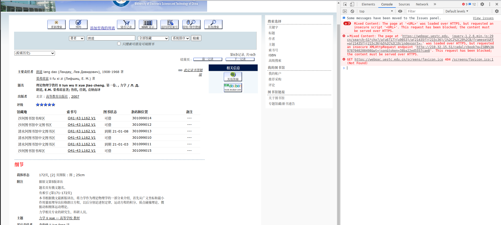
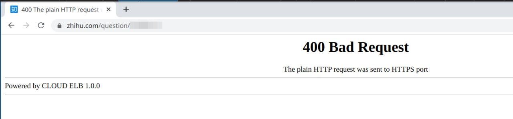
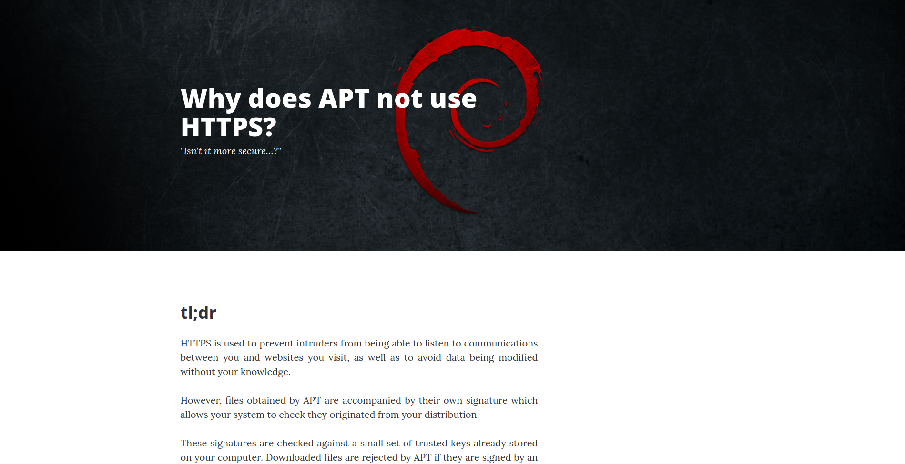
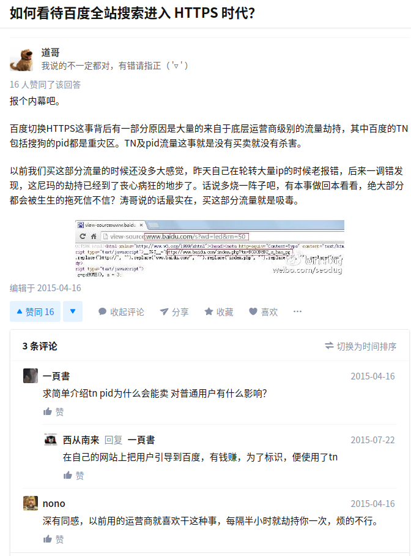
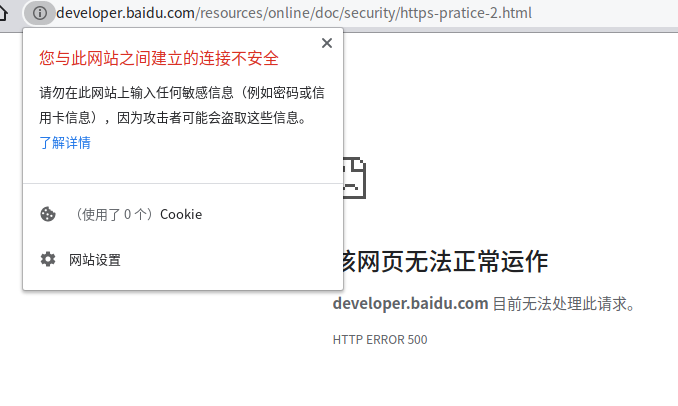

未完待续
<!-- more -->

诸如`git clone` 、 `apt/yum/pacman`下载公开文件，到底有没有必要用HTTPS(或者SSH之类的其他加密方式)？一些不传输帐号密码之类的隐私的不怎么改变网页内容的静态网站有必要吗？

以前我也觉得没有必要，结果就被险恶的世道教做人了。 
差不多可以盖棺定论了，如果处于运营商和防火墙的慈祥关爱中，有必要，那可太有必要了。

咋说，本来HTTPS是拿来给你们防范FBI、CIA、黑皮、灰产人士、高雅人士针对某个、某些特定目标搞中间人攻击偷你密码、篡改你获取的数据啥的。这种用途下载公开的包、镜像、一些仓库里的代码倒是没必要上HTTPS，普通人下个安装包也没啥东西值得攻击的，而且连到服务器下一个体积不太小的压缩包/二进制文件也不太好掺砂子，而且下完了之后还有GPG校验，传输的时候多套一个HTTPS大部分时候。而且HTTPS两边都有带宽、加解密之类的成本损耗，下载大文件是不太划算的。

可能他们也妹想到某些运营商和防火墙能这么流氓，直接公然大范围污染。

## 目前使用HTTPS的一些小牺牲

### 成本

一般来说：

需要证书，证书要给签发机构交钱  
延迟相比HTTP略高，不过TLS1.3之后
加密解密吃资源

上面那些在今天看来问题都不是特别大，现在有很多 Let's Encrypt 之类的免费的（收费的CA证书也比十年前便宜太多了），现在的CPU性能对于看网页肯定是过剩的，延迟在TLS1.3以后也不是太大问题

### 有些工具没有HTTPS支持

比如OpenWRT那个官方固件一开始就没有HTTPS支持，你得自己装一个。

### 很多老网站对HTTPS的支持也不太好

用了 HTTPS Everywhere 插件之后经常会发现很多网站体验极差，强制HTTPS之后各种资源加载不出来（关键是很多时候你还意识不到）


比如你电的图书馆，如果用的是HTTPS， 那你的图书位置看不到了（我来这找书最重要的就是这个东西，结果你不告诉我几楼）



这个问题自从17年就有了，一直到现在，都还没修，全站HTTPs遥遥无期。
当然这个问题是因为HTTPS和HTTP的混合 会被新版chrome浏览器悄无声息地拦截，在console里才能看到一个

```log
Mixed Content: The page at '<URL>' was loaded over HTTPS, but requested an insecure script '<URL>'. This request has been blocked; the content must be served over HTTPS.
```

你用尊贵的 *Internet Explorer* 或者老版本chrome是没有这种问题的，但是会加载漫长的几秒钟（在图书馆那个渣配的机子上甚至可能等待10秒），然后弹出来一个大大的警告框，问你`是否只查看安全传送的内容`，如果你点了`是`，恭喜你，那你看不到图书的位置了。（我这几年已经无数次看到有倒霉孩子点了是然后找不到书在什么地方了）

当然很多大网站也在换到HTTPS上也各种问题，知乎上个月准备全站HTTPS的时候出了好几天幺蛾子，`400 Bad Request The plain HTTP request was sent to HTTPS port`。(不过知乎这个只在乎APP，web版改版之后bug越来越多已经常态化了)


### 登陆认证页面没法劫持HTTPS

某些登陆认证的界面的原理和劫持差不多，用的[强制门户](https://en.wikipedia.org/wiki/Captive_portal)（Captive Portal）
强制门户在自己的DNS服务器中将用户的HTTP请求302重定向到登陆页面
HTTPS没法劫持（尤其是用了HSTS的情况下），结果就卡在那里弹不出登陆认证的界面了。（其实我建议你出门在外使用流量，不要用商场的WIFI，不要贪便宜用手机验证码登陆或者微信登陆）

有个网站叫[neverssl](http://neverssl.com/)，当你弹不出WIFI登录界面的时候可以访问一下。（其实你随便输入一个什么）

一般浏览器会有相应的机制，比如火狐的 detect portal， 会向 <http://detectportal.firefox.com> 周期性的发包。

有的时候登陆认证门户不认200状态码,得用204，然后302跳转到登陆界面。
（提供204状态码的网站很多了，比如[v站的这个](https://www.v2ex.com/t/303889?p=1)，基本都是给安卓用的，原生安卓会试图访问谷歌提供的204状态码的服务器来判断是否联网成功，）

### CA证书

CA证书颁发商公然耍流氓你有什么办法
https://www.zhihu.com/question/50298017
https://www.zhihu.com/question/22795329

CNNIC

HSTS MITM SSLStrip HTTP+Strict+Transport+Security HTTPSStrip
https://blog.cuiyongjian.com/safe/https-attack/
https://www.zhihu.com/question/22779469

## apt下载更新是否使用HTTPS的争议



之前有一个叫的网站上的一篇文章叫，引起了不少的讨论。大概的观点是HTTPS在下载这种公共资源的时候没有必要啊。

**而现在，这个网站已经变成体育博彩网站了，造化弄人啊。**

理由主要有：

1. 因为你有GPG校验，HTTPS显得没有什么太大必要。你下下来用GPG校验一下就行了，就算你用HTTPS下载，也只能保证传输过程中没有被篡改，。

2. 匿名和隐私的问题：你连上镜像站，那明显是在下镜像源的包。即使你用了HTTPS，还是能通过你下载的包的大小知道你下了些啥（就算你用`apt-transport-tor`也有这个问题）。

3. 还有一个重放攻击（Replay Attacks）的问题，可能有人将包替换为没有安全更新的老版本（签名校验能通过）。

   由于apt有自己的时间戳，晚于这个时间的都被认为非法，时间戳在一段时间内自动失效

### 现在再看

当时我还是觉得这个写的有点道理，不到一年就被 cqu mirrors 的事情啪啪打脸。

当然这个作者显然没考虑CQU Mirrors事件之类的情况。

## 重庆大学镜像源被搞

这个事件一出基本可以终结大部分争议了（至少国内是这样的）

几周前他们那边学校网管的防火墙拦截了80端口的部分HTTP请求，比如一些翻墙工具的包。如果你HTTP明文访问80端口，你会被直接RST。后来在与网管的交涉下恢复了。


## github用SSH还是HTTPS

按说SSH这种TCP+SSL的协议会比HTTPS这种跑在应用层的快不少。然而在天朝SSH挺容易被运营商Qos的，
HTTPS可以薅cloudflare之类的CDN的羊毛搭github反代。给HTTPS挂socks5/HTTP代理也方便。

## DNS over HTTPS

众所周知传统的DNS是裸UDP的，后来由于  有了使用TCP的DNS，后来出于隐私的考虑又有了DoH（DNS over HTTPS）和DoT（DNS over TLS）
那为什么不用DoT呢？DoT那个853端口太显眼了，分分钟被运营商搞。
DoH最大的问题是慢，如果直接使用远程的DoH，查询发过去和发回来都走HTTPS。在国内用cloudflare的DoH体验极差，如果想用最好自己搭一个。
另一个问题是不支持ECS

其实DoH在国内也不太推荐，主要是对速度影响太大了。有的方案是走分流，国内IP用国内的DNS，国外的走DoH或者在v2ray之类的跳板上用远程DNS
而且保护隐私方面也不太能

另，前几天360推出了收费浏览器，居然还有什么国密DoH，号称保护隐私。周红衣说是那就是吧。

## 苹果的OCSP

## 闲谈

HTTPS这种保护隐私的东西按说很多大公司推进起来都很不积极的。但是靠着隐私和广告挣钱的谷歌和百度推起HTTPs来相当的积极，还一口一个在意用户隐私。
谷歌当年大力推广HTTPS的时候还立着*不作恶*的牌坊，2010年的你说它在乎用户隐私，姑且信了。
谷歌为了推HTTPS，直接抬高HTTPS网站相对于HTTP网站的SEO搜索权重。

百度也是国内最早一批全站HTTPS的，，当然能说出来“你要隐私干什么”百度显然不会这么好心，嗯，**运营商猛于虎也**

[如何看待百度全站搜索进入 HTTPS 时代？](https://www.zhihu.com/question/28379088)



百度运维团队当时发布的系列文章还不错，然而



你用百度搜他们的文章，第一条第二条是CSDN和简书的抄袭转载，第三条是他们的，然而500挂掉了。这是怎么回事呢，对于这么好的文章没有被百家号抄袭，小编也很感到惊讶呢。

## 参考和链接

https://breakthrough.blog/broadcast/31929

https://v2ex.com/t/725979

https://www.solidot.org/story?sid=66084

很早就有了https://www.v2ex.com/t/622672?p=1

https://sneak.berlin/i18n/2020-11-12-your-computer-isnt-yours.zh/

https://blog.jacopo.io/en/post/apple-ocsp/

https://twitter.com/quakewang/status/1327880394801176576


https://www.reddit.com/r/linux/comments/aidxwa/why_does_apt_not_use_https/
https://blog.cuiyongjian.com/engineering/git-https-ssh/  
https://stackoverflow.com/questions/11041729/why-does-github-recommend-https-over-ssh  
https://news.ycombinator.com/item?id=18958679&p=2
https://askubuntu.com/questions/146108/how-to-use-https-with-apt-get
https://unix.stackexchange.com/questions/90227/why-there-is-no-https-transport-for-debian-apt-tool

https://web.archive.org/web/20180125154639/https://whydoesaptnotusehttps.com/ why does apt not use https的存档

https://wiki.debian.org/SecureApt

[The First Few Milliseconds of an HTTPS Connection](http://www.moserware.com/2009/06/first-few-milliseconds-of-https.html)

https://github.com/xirong/my-web/blob/master/readme.md

https://cloud.tencent.com/developer/article/1399863 APT 为什么不使用 HTTPS 协议？

## 附

### CQU Mirrors事件官方的完整说明

这里放一下CQU电报新闻的官方声明，地址：https://t.me/cqumirror

>2020.11.7
>
>#warnings 
>因学校防火墙过滤规则禁止明文访问部分文件，请使用 https 方式访问镜像站
>
>请暂时更换到其他镜像站。校信息中心进行防火墙维护及站群升级，目前镜像站处于完全不可用状态。恳请谅解。
>
>2020.11.8
>
>请务必使用https协议！目前使用http协议获取部分文件将被网络中心防火墙拦截并封禁 IP 约5分钟（初次访问）！目前无任何解决方法，我们仍在积极与校方沟通看是否能够放行。
>
>2020.11.9
>
>由于网络中心系统升级和维护，外部流量对于内部服务的访问将被拦截。目前未能知晓何时恢复。如急需使用镜像服务请更换至其他镜像服务器。对所造成的不便恳请谅解。
>
>2020.11.11
>
>已确认 IDC 正常开放外网流量访问。镜像服务恢复正常。但仍请不要明文访问数据库文件。目测防火墙策略已经调整但并未有明确证据表明限制放宽。请使用 HTTPS 协议访问镜像。
>
>2020.11.18
>
>经沟通目前 IDC 不再拦截明文入站请求。http 协议访问恢复

而且cqu国庆的时候也习惯性闭关锁校，~~跟你电完全一致~~（不是，全国高校的网管怎么都一个样啊）

>由于不可抗力，国庆期间重庆大学多个对外服务将无法从外部访问。镜像站服务亦受到牵连。恢复对外服务时间未知。对于所造成的不便我们深感遗憾。

### 为什么apt不使用HTTPS的原文

这个网站已经变成在线发排的体育博彩网站了。这里附上原文

># Why does APT not use HTTPS?
>
>*"Isn't it more secure…?"*
>
>## tl;dr
>
>HTTPS is used to prevent intruders from being able to listen to communications between you and websites you visit, as well as to avoid data being modified without your knowledge.
>
>However, files obtained by APT are accompanied by their own signature which allows your system to check they originated from your distribution.
>
>These signatures are checked against a small set of trusted keys already stored on your computer. Downloaded files are rejected by APT if they are signed by an unknown key[1](https://web.archive.org/web/20180125154639/https://whydoesaptnotusehttps.com/#footnote-apt-unkown-key) or are missing valid signatures. This ensures that the packages you are installing were authorised by your distribution and have not been modified or replaced since.
>
>HTTPS can not detect if malicious tampering has occurred on the disks of the server you are downloading from. There is little point "securely" transfering a compromised package.
>
>## But what about privacy?
>
>HTTPS does not provide meaningful privacy for obtaining packages. As an eavesdropper can usually see which hosts you are contacting, if you connect to your distribution's mirror network it would be fairly obvious that you are downloading updates.
>
>Furthermore, even over an encrypted connection it is not difficult to figure out which files you are downloading based on the size of the transfer[2](https://web.archive.org/web/20180125154639/https://whydoesaptnotusehttps.com/#footnote-tor). HTTPS would therefore only be useful for downloading from a server that also offers other packages of similar or identical size.
>
>What's more important is *not* that your connection is encrypted but that the files you are installing haven't been modified.
>
>## Overly trusting CAs
>
>There are over 400 "Certificate Authorities" who may issue certificates for any domain. Many have poor security records and some are even explicitly controlled by governments[3](https://web.archive.org/web/20180125154639/https://whydoesaptnotusehttps.com/#footnote-ca).
>
>This means that HTTPS provides little-to-no protection against a targeted attack on your distribution's mirror network. You could limit the set of valid certificates that APT would accept, but that would be be error-prone and unlikely worth the additional hassle over the existing public-key scheme.
>
>## Why not provide HTTPS anyway?
>
>Your distribution could cryptographically sign the files using the existing scheme and additionally serve the files over HTTPS to provide "defense in depth."
>
>However, providing a huge worldwide mirror network available over SSL is not only a complicated engineering task (requiring the secure exchange and storage of private keys), it implies a misleading level of security and privacy to end-users as described above.
>
>A switch to HTTPS would also mean you could not take advantage of local proxy servers for speeding up access and would additionally prohibit many kinds of peer-to-peer mirroring where files are stored on servers not controlled directly by your distribution. This would disproportionately affect users in remote locales.
>
>## Ah, what about replay attacks?
>
>One issue with a naïve signing mechanism is that it does not guarantee that you are seeing the most up-to-date version of the archive.
>
>This can lead to a *replay attack* where an attacker substitutes an archive with an earlier—unmodified—version of the archive. This would prevent APT from noticing new security updates which they could then exploit.
>
>To mitigate this problem, APT archives includes a timestamp after which all the files are considered stale[4](https://web.archive.org/web/20180125154639/https://whydoesaptnotusehttps.com/#footnote-valid-until).
>
>## Where can I find out more?
>
>More technical details may be found on the *[SecureAPT](https://web.archive.org/web/20180125154639/https://wiki.debian.org/SecureApt)* wiki page.
>
>### Footnotes
>
>1. This appears as `Release: The following signatures couldn't be verified because the public key is not available`.
>2. This may even be the case if using Tor via (for example) [apt-transport-tor](https://web.archive.org/web/20180125154639/https://retout.co.uk/blog/2014/07/21/apt-transport-tor).
>3. See, for example, *[What trusted root certification authorities should I trust?](https://web.archive.org/web/20180125154639/https://security.stackexchange.com/questions/53117/what-trusted-root-certification-authorities-should-i-trust)* on StackOverflow.
>4. See the *[Date, Valid-Until](https://web.archive.org/web/20180125154639/https://wiki.debian.org/DebianRepository/Format#Date.2C_Valid-Until)* section of the `DebianRepository` page on the Debian Wiki.

