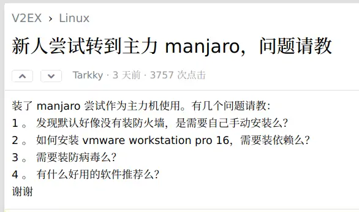
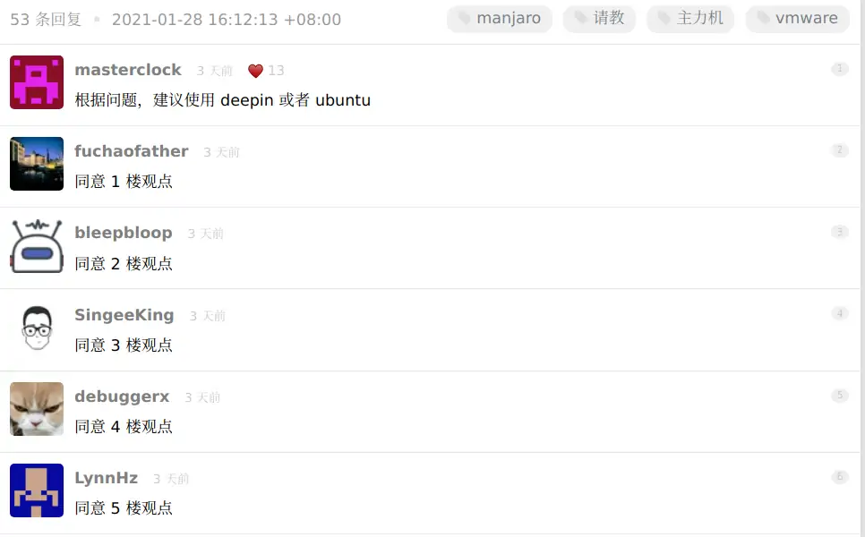

祖传服务器传到了我的手里, 行吧。其实我想把标题改成Ubuntu内部错误的解决办法（不是
<!-- more -->

## 更新（和洗手）

19年写的这个20年不知道怎么在2020年有一段时间被扔到了`重装Ubuntu`搜索结果的最前面，我这个小破站访问量暴增。然而那个时候20.04LTS都出了，已经有点过时了，而我19年那会写的那个几乎属于个人吐槽，差不多是我博客迁到，完全不适合作为一个教程。可能骗了很多人进来，

装什么Ubuntu啊，还是Arch香，群里个个都是人才，说话又好听

~~但是随便装个Ubuntu不仅快，他们跑深度学习的时候抄CSDN配置环境也方便~~

~~最重要的，又不是我用。~~

~~GNOME内存泄漏关我什么事~~

~~Ubuntu内部错误关我什么事~~

还是去用Ubuntu吧.jpg

## 认真发言

其实你可以试试Debian（Canonical强推snap太烦人了）

### 关于桌面（DE）

带桌面的版本建议避开Ubuntu的GNOME，那个东西。。。

可以试试Linux Mint，或者Fedora（这个的GNOME应该比 Ubuntu 16、18 那几个整天内存泄露的GNOME版本稳多了）

其实我推荐KDE，可以试试Kubuntu（或者KDE Neon？）

机器配置较差请直接Lubuntu，稳如老狗，除了略简陋没有别的缺点。

一众WM用户应该不会搜索这么蠢的关键词搜到我这里来，这里不谈WM了。

### 关于服务器

小作坊没有专职运维和技术支持，其实服务器建议试试Debian或者Ubuntu LTS，Debian stable稳如老狗

~~众所周知，Debian testing 都比 Ubuntu LTS 稳（注意这个安全更新比较慢，个人用户可以testing，开了公网端口的工作站不要用这个）~~

不过Ubuntu和CentOS6、7比起来，还是瞬间和蔼可亲了不少

求求新入坑的别再跟着什么鸟哥私房菜之类的老教程用CentOS了，2020年 CentOS 8 都被扬了，REHL马上就要给小作坊免费了，小作坊真迷信稳定上REHL吧。

没事不要用所谓稳定的老版本然后找不到包只能自己手动编译，就不说c/c++那一堆lib了，我已经见过不少人在编译python的时候没开ssl当场翻车。

什么你说容器？你试过在CentOS6上面弄Docker和k8s吗，我在教研室的祖传阿里云上试过一次，从此再也不想看到CentOS了

（整天在CentOS上手动编译凸显运维重要性和工作量的除外）

## 安装参考

[tutorial-install-ubuntu-server](ttps://tutorials.ubuntu.com/tutorial/tutorial-install-ubuntu-server)  
 [LVM arch-wiki](https://wiki.archlinux.org/index.php/LVM_(简体中文))  
[Ubuntu 安装 Docker CE](https://yeasy.gitbooks.io/docker_practice/install/ubuntu.html)、[镜像加速器](https://yeasy.gitbooks.io/docker_practice/install/mirror.html)  
[How to Configure Network Static IP Address in Ubuntu 18.04](https://www.tecmint.com/configure-network-static-ip-address-in-ubuntu/)  
[netplan官网的配置示例](https://netplan.io/examples)
