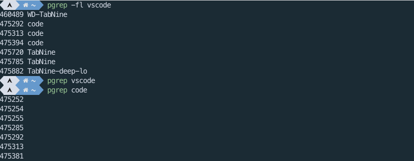
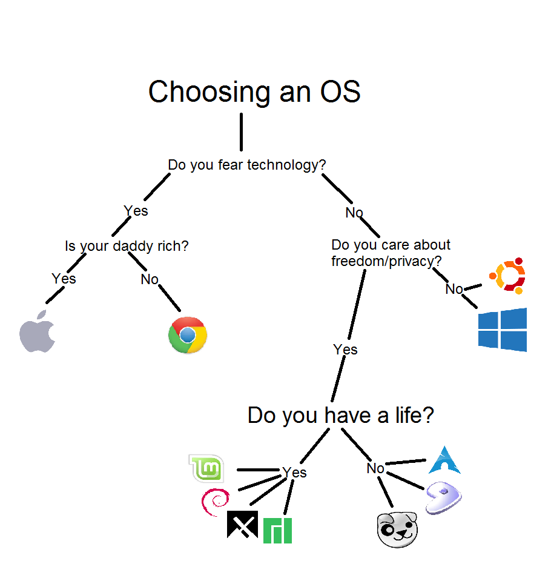
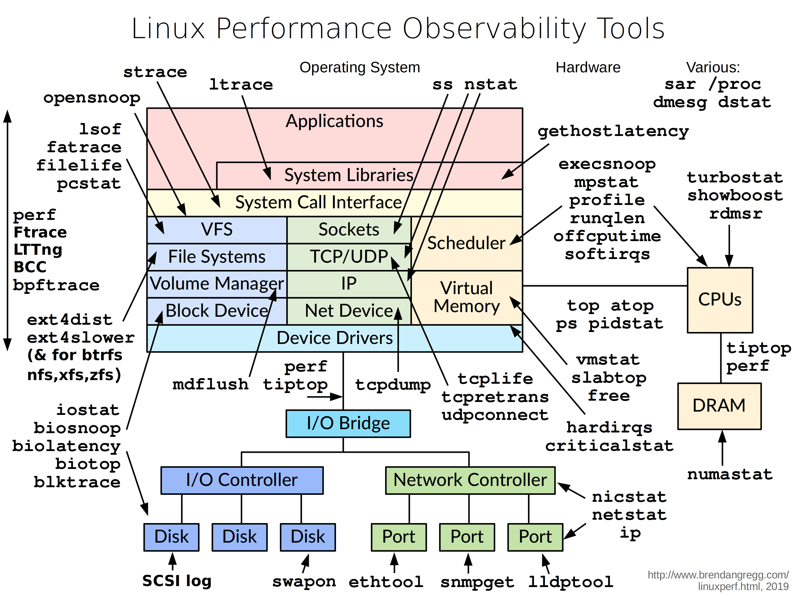
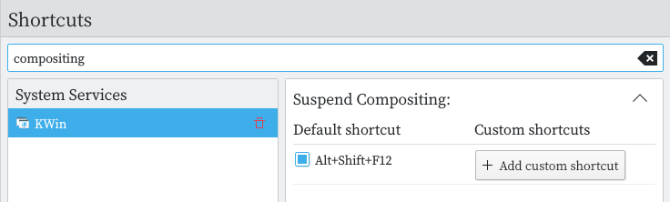

这篇水文主要是写给桌面玩家看的，如果您的服务器打出了GG/被黑了/库被删了，可能不适合来这里找答案。
<!-- more -->

由于这篇水文是写给普通玩家的，所以尽量简单易懂、适合萌新操作。所以像eBPF、Systemtap这样的神兵利器几乎不会多讲 （这还是我在《性能之巅》这本书看到作者传教DTrace才了解的，这些东西对于一般路过普通用户大概就像vim和emacs, 很强，但是学习成本太高）
这里面有一些systemd的内容，openrc用户请跳过（相信这年头还在坚守openrc和其他非systemd的用户水平应该不用看我博客）。
由于本人水平有限，而且这篇写的比较仓促，文中可能有不少错误，光临我博客的大佬们发现了请告诉我。
暂时先写这么多，还有很多有意思的、重要的、不好写的没有写，以后再更新。

## 通常的卡死解决流程

### 说明

1. 此处的“卡死”，指鼠标动不了或某个应用、进程没有响应了
2. 以下流程展示以KDE和Archlinux为例
3. 如果你想问ubuntu内部错误等，那我只能说无可奉告

### 通用流程

相比于Linux/Unix在服务器上几年不关机稳如狗的表现，桌面环境和应用的崩溃和卡死是常事，各种小bug就更多了，毕竟用爱发电的开源拖拉机没那么多人手和资金用在测试和GUI体验上，**要习惯，不要大惊小怪，也不要死机了就一言不合重启重装**

虽然KDE、GNOME都有图形化的系统监视器，看起来还不错。然鹅，有点鸡肋：**鼠标经常随着图形界面在x11、wayland罢工后一起没了，键盘几乎能战斗到最后一刻**（除非 kernel panic 或者 usb等外设的kernel module出问题了）。请适应并熟悉终端模拟器、tty、vim等键盘操作。

首先尝试`ctl+alt+t`呼出终端，如果能，那问题应该不大，然后用`htop`、`glances`之类的东西看一下罪魁祸首是谁。

找到那个进程的pid，试试杀掉它。比如vscode内存泄漏动不了了，那就`pkill code`(相当于`ps -ef | grep vscode | awk '{print $2}' | xargs kill -9`)。
如果你不知道具体叫什么，但是它在屏幕前能看到，可以用`xkill`命令终止它（如果你还能动鼠标）

如果程序或应用是systemd守护进程，用systemctl停掉或重启（openrc、crontab、pm2等同理），比如`systemctl disable neo4j --now`禁用并停止neo4j数据库的daemon；`systemctl daemon-reload && systemctl restart kubelet`刷新配置并重启kubelet（咦，好像没有桌面玩家在自己电脑上跑kubelet进程...一时没想起更好的例子）

提供了禁用命令的优先用自带命令，比如禁用KDE自带的文件搜索baloo，`balooctl stop && balooctl disable`

如果怀疑是KDE桌面及其组件的问题

```bash
plasmashell --replace
```

如果不能就`ctl+alt+F2`调出tty，htop看一下那个进程占用高，kill掉，如果不行就重启tty

```bash
kquitapp5 plasmashell && kstart5 plasmashell
```

正常退出不行就试试killall

```bash
killall plasmashell && kstart5 plasmashell
```

或者重启一下SDDM

```bash
systemctl restart sddm
```

还不行就杀掉tty1，然后重启xorg

```bash
ps aux | grep tty1 # 或者pgrep tty1
```

然后kill掉（或者直接`pkill -9 -t tty1`），重启。或者这样

```bash
pkill x
startx
```

那如果你连tty都切不过去，就用魔术键重启。（如果你提前设置开启了魔术键SysRq的话，这个下面再讲）
按住`Alt+Shift+SysRq`，依次按`REISUB`这几个键。（每按一个键停几秒钟）（如果你内核出了kernel panic之类的问题，那魔术键也没用）

再不行直接`reboot`，`shutdown -r now`就好了

以上的命令如果桌面经常卡死建议绑定到你喜爱的快捷键上（在动不了鼠标和快捷键调不出终端模拟器的时候能用上）

再不行就直接尝试长按电源关机了（一般长按电源键5-10秒，这取决于你的主板BIOS设置，这会发送一个`RESET`信号）。如果你的主板有复位键，就按复位键重启。实在实在没办法那就拔电源吧。（做好丢失所有未保存数据的准备）

ps: 如果你用的ext4，那恭喜你，中奖了。异常掉电可能不是丢失数据这么简单了，你的文件系统可能已经出了小问题。（这个后面再说）

### 如何终止/重启进程

#### 首先找到它

以vscode为例：`ps aux | grep vscode`或`pgrep -fl vscode`（`-f`参数表示`use full process name to match`，如果不加`-f`是找不到vscode的，只有`grep code`能找到进程（因为这个进程名字叫code））



如果不想让`ps aux | grep xx`的时候每次都显示他自己，再加上`|grep -v "grep"`
如果能在屏幕上看到它就直接`xkill`

#### 然后

kill的方式大概有这些

```
HUP INT QUIT ILL TRAP ABRT BUS FPE KILL USR1 SEGV USR2 PIPE ALRM TERM STKFLT CHLD CONT STOP TSTP TTIN TTOU URG XCPU XFSZ VTALRM PROF WINCH POLL PWR SYS
```

比较常用的有HUP(通常在关闭终端模拟器的时候，调用SIGHUP，可以用`nohup`等命令让终端模拟器关闭后进程继续)、QUIT（退出，调用SIGQUIT，`Ctrl+\`）、KILL（调用SIGKILL，使用`kill -9 就是这个`）。此外还有TERM（软中断），开发板常用，桌面用户可能用的不多。 

`Ctrl+z`调用的就是SIGTSTP，这是最温和的一种，挂起的进程可以用`fg`恢复;`Ctrl+c`调用的就是SIGINT，会终止进程。

这部分内容可以去阅读《UNIX高级编程》等书，或者看看维基词条[Unix信号](https://zh.wikipedia.org/wiki/Unix信号)

## 碰到比较严重情况的抢救

这种情况包括但不限于不小心卸载了系统自带的python、卸载了iptables、卸载了桌面环境（DE）或者卸载了什么重要的库，或者你改了什么`kernel parameter`直接黑屏进不去了，又或者你执行了危险的`dd`命令。

有或者显卡驱动有问题了

或者双系统Windows更新把你grub整没了（不要双系统就没这么多事，直接上`systemd-boot`之类的东西）

反正，开机直接黑屏了。或者你运气好，能进grub界面，还能抢救一下。或者运气更好，进了grub界面然后在DM那里黑屏了（这种可能是显卡驱动的问题）

你可能需要一个LiveUSB用来抢救。如果你没设置加密，那就挂载`\`, `\home`, `\boot`等目录然后chroot进去修。

试试重装重要的包

```bash
sudo pacman -S base base-devel linux linux-firmware linux-headers xorg plasma kde-applications
``` 

### 文件系统损坏

比如，ext4断电。

如果你的电脑要经常面对断电等恶劣情况，那建议去用ZFS等文件系统，不要用ext4

### kernel panic 等

Kernel panic之类的问题通常比较严重

kernel panic segmentation fault core dump

https://wiki.archlinux.org/index.php/Core_dump#Examining_a_core_dump

### 看看是不是硬件坏了

内存条没插紧、硬盘坏了、电源没插好、主板受潮了。。。。

## 排查问题

排查问题和调试比较需要经验，而且要花费不少时间。调试并修好，很有可能比直接重装所花费的时间、精力多得多。**如果你赶时间，我建议做好备份，随时重装。不要将有限的时间浪费在排查问题上。**

<!-- 


图源[reddit u/sovietarmyfan](https://www.reddit.com/r/linuxmemes/comments/ejdkaj/choosing_an_os_my_own_version/)
 -->

**但是，追根溯源找到问题并修好它，很有意思，不是吗？**

网上充斥着性能优化的教程，好多都盗了下面这张图，不仅不标注[来源](http://www.brendangregg.com/blog/2019-07-15/bpf-performance-tools-book.html
)还把右下角来源抹去（而且还是17年版的老图传来传去）

本来想仿照这个做一个调试的图，但是想到指不定又被盗了。算了，随便写点大家将就着看吧。

### 查看报错和日志

遇到解决不了的问题先把报错和版本信息记下来，然后去谷歌一下，搜不到的就去拿着详细的报错去相应的地方请教大佬（希望您提问之前已经阅读了[《提问的智慧》](https://github.com/ryanhanwu/How-To-Ask-Questions-The-Smart-Way/blo%20b/main/README-zh_CN.md)、[X-Y Problem](https://coolshell.cn/articles/10804.html)等）

进入急救模式

```bash
systemctl rescue
systemctl emergency
```

```bash
journalctl -x
```

### 如何调试内核

用户态的问题都还比较好调试，总不至于崩了连个报错信息和崩溃日志都保存不下来。内核相关的问题比较麻烦，不过好在除非自己各种折腾或者用Arch这种内核经常滚动升级的，一般碰不到这些问题。

我调试内核的经验也不多，为数不多的几次几乎都是当年在开发板上。sniper写得那个《Linux内核调试指南》写得挺好，然而不太适合普通的桌面玩家，而且有一点年头了。gdb调试，printk在桌面发型版kernel panic的时候几乎都失效了。对于普通的桌面玩家，遇到了 kernel panic 等严重问题，发现自己解决不了，不妨去论坛/群里提问，找有空的大佬帮你看看（有些小白尝试debug的时候可能越折腾问题越严重）。桌面玩家检查一下自己最近干了什么或者最近系统更新了什么应该就能找到问题了。

常见的调试方式包括：

1. Kdump+crash
2. Serial Console

用kdump捕获错误（kdump会在内核崩溃的时候用kexec运行捕获内核然后转储），然后用crash看一下。使用之前Kdump你可能需要自己编译内核，在内核参数里面设置参数，然后还要设置systemd守护进程。
ArchLinux玩家可以参考ArchWiki的[Kump](https://wiki.archlinux.org/index.php/Kdump)条目设置（Archlinux默认没装需要的包，Wiki也没说，要装一下`sudo pacman -S kexec-tools crash`。）

Serial Console 串口调试这个折腾过嵌入式的应该也很熟悉了，需要在bootloader设置一下。
Arch用户也可以参照ArchWiki词条[Working with the serial console](https://wiki.archlinux.org/index.php/Working_with_the_serial_console)设置（我只在树莓派上的archarm试过串口，并没有用这种方法调试过内核）
大部分桌面用户的笔记本和台式机上可能已经没有串口了（仅存不多的可能也就给个针脚），搞一个USB转串口才能愉快的调试。

一般桌面用户出现内核问题用journalctl看一下日至或者拍一下屏幕上的错误然后到群里/论坛请教就行了。见：[ArchWiki: General_troubleshooting_(简体中文)#内核崩溃_(Kernel_panics)](https://wiki.archlinux.org/index.php/General_troubleshooting_(简体中文)#内核崩溃_(Kernel_panics))

#### 例子

Go mod 命名导致的问题：[记一次二进制乱起名字引发的翻车](https://xuanwo.io/2020/14-bug-introduced-by-binary-name/)

我几个月前被和漩涡这个翻车一模一样的问题坑了。

### 调试驱动问题

驱动这个我单独讲一下。因为网上搜“驱动调试”都是嵌入式开发（几年前我）需要的（会叫你用strace、gdb、printk）,对于桌面用户（现在的我）应该去搜关键词：“型号+Linux”。不过如果你不用螃蟹网卡、Nvidia双显卡、某些阴间网卡、不支持Linux的BIOS，应该不用担心。用的XPS、Thinkpad系列等对Linux支持比较好的笔记本应该也不用担心。

#### 例子

我用一个PS\2键盘(P口键盘)为例演示一下:

OS：Archlinux
主板：b85
Kernel：Linux-lts 5.10
CPU：intel i5-4590
键盘：PS2口的老键盘
症状：PS\2键盘插上去用不了

1. 首先用`dmesg`等工具检查一下，没啥问题。然后重启（PS\2不支持热插拔，保险期间重启试试）
2. 除了通用驱动会被合并到kernel主线，大部分驱动是`kernel module`的形式。所以我们先`lsmod`看一下有没有PS\2相关的东西。只找到了`psmouse`（先假装不知道i8042是干嘛的）
3. 然后去找相关的驱动呗。搜一下“PS\2键盘 驱动”，搜出来第一条是微软的文档，不过没关系，它告诉我们是i8042了。再`lsmod`看一下，它有。再`modprobe i8042`看一下，也是好的。
4. 再搜一下启动参数就发现PS\2和atkbd这个模块有关，然后就顺手搜到这个：[Linux 3.13 警告：PS/2 键盘支持现已模块化](https://www.archlinuxcn.org/linux-313-warning-ps2-keyboard-support-is-now-modular/)。
5. 然而高兴早了，还是不行, 但是搜到了一个和我一样的[PS/2 keyboard only works up to GRUB, not after OS fully booted](https://unix.stackexchange.com/questions/354802/ps-2-keyboard-only-works-up-to-grub-not-after-os-fully-booted?noredirect=1&lq=1) 没有得到解决
6. 这个问题没有解决，但是有上面那个提问告诉我一个重要的信息：直到GRUB都还是工作的（works up to GRUB）。于是我在GRUB界面试了试，上下和回车都能用、NumLock也是亮的。
7. 那就简单了，是GRUB启动参数哪里有问题喽。搜索“GRUB i8042”发现很多触控板的问题（touchpad），GRUB加上启动参数`i8042.reset i8042.nomux i8042.nopnp i8042.noloop`问题立刻解决了
8. 还看到下面[这个链接](https://unix.stackexchange.com/questions/28736/what-does-the-i8042-nomux-1-kernel-option-do-during-booting-of-ubuntu)回答为什么添加`i8042.nomux`参数能解决触控板的问题（自动检测是否多工（Multiplexing）的默认配置有问题，改成禁用就好了）。
9. 去[内核文档](https://www.kernel.org/doc/Documentation/admin-guide/kernel-parameters.txt)里查一下, 其他几个选项分别是
```
i8042.nopnp	[HW] Don't use ACPIPnP / PnPBIOS to discover KBD/AUX具体
			     controllers
        不使用ACPIPNP或可插拔BIOS模式发现KBD/AUX（Keyboard input driver，键盘输入驱动，Auxiliary，音频）可能是这个意思，我猜的
i8042.notimeout	[HW] Ignore timeout condition signalled by controller
        忽略超时
i8042.reset	[HW] Reset the controller during init, cleanup and
			     suspend-to-ram transitions, only during s2r
			     transitions, or never reset
        就是reset重置呗
i8042.noloop	[HW] Disable the AUX Loopback command while probing
			     for the AUX port
        禁用AUX回环？音频相关的东西，应该跟这个参数没关系
```
看起来起作用的应该是nopnp这个参数起作用了，去掉其他3个参数，试了一下就是它。
1.   进一步查找根源问题和报告BUG的环节了。先去报BUG的那几个地方（Google搜出来都是launchpad怎么设置）用`nopnp`和`PnPBIOS`搜一下有没有相关的 Bug Report。在LKML邮件列表上可以找到这个：[PS/2 mouse not detected with ACPIPnP/PnPBIOS](https://lkml.org/lkml/2020/10/13/558) 这一串邮件已经找到了问题。
并且在2020.10.13在bugzilla已经发了[PnP unable to detect connected PS/2 mouse on Asus F2A85-M PRO](https://bugzilla.kernel.org/show_bug.cgi?id=209657)
今年3月份的时候还给出了Patch，就等合并了。（更新，4月14号这个patched被defer）
行了，[我修了Linux内核的一个小bug，应该如何把它推进主线呢？ - 醉卧沙场的回答](https://www.zhihu.com/question/332347632/answer/732307068)教的东西也用不上了，就等合并吧.....

## 日常维护

### 备份

>备份，然后重装

如果硬盘或者u盘够大，推荐使用rsync或timeshift（其实也是调用的rsync或btrfs snapshot）
btrfs用户可以使用btrfs snapshots

备份硬盘不够大就只备份dotfiles等配置文件和个人资料就好了。

### 谨慎进行危险操作

一些可能会带来的操作尽量现在虚拟机、容器里面试一下。然而，能够意识到危险的东西一般不会把你坑了。

### dotfiles和脚本

经常换电脑或重装可以准备dotfiles和快速安装脚本

### 安全问题

桌面发行版如果没有暴露在外的公网IP和端口，应该不用担心。（毕竟桌面玩家大部分连个独显都没有，挖矿都榨不出油水（而且我简单不少Linux万家有钱了都叛逃Mac了））
不放心就用iptables/nftables设置一下防火墙，设置一下用户和文件的权限；还不放心可以用clamav等工具扫一扫rookit。
虽然x11不少安全问题，桌面版sandbox隔离做的不好，可是这都不重要，你要小心的是流氓软件而不是所谓的CVE、0day。

Archlinux用户可以按照这个配置: [Arch Secure Laptop Install](https://gist.github.com/Th3Whit3Wolf/2f24b29183be7f8e9c0b05115aefb693) 对于一个桌面用户已经差不多了

## 不想重启怎么办

如果你用的是ArchLinux等滚动发行版，有不少更新是要重启后生效的。普通用户还是更新后重启一下比较好（这可能是最省心省力的）。
如果你不想重启，那也没问题。
**可能唯一不得不重启的就是内核更新了。**

### 安装更新发生了什么

你可能听过这样的说法，Linux更新后的旧程序仍然跑在内存里，重启后才生效。可是内存不才一共就那么点？（啊，还有swap等交换区，那加起来也而不多）怎么装得下？ 实际上这些安装文件是（通常是）通过mmap建立虚拟地址映射，还在硬盘里。

在安装脚本和编译命令里面你会看到`install`这个命令，它跟`cp`命令最大的区别不是权限管理，而是更改前`unlink`。
`cp`会把指定目录原有的文件删掉然后再将新的拷贝到指定目录，而当你有二进制文件在运行的时候，用`cp`更改这个二进制文件直接删会出错（可能`cp`命令报错`device or resource busy`执行失败，或`cp`执行成功但是导致正在运行的东西出现问题）。
而`install`会先`unlink`拷贝一个副本，很像Btrfs的COW（Copy on Write）机制，如果在用，原文件暂时保留（inode），新文件用新的inode，如果有程序在使用这个文件，在mmap映射中依然可以找到原文件（的inode）。虽然这个时候看起来你在安装目录原来的文件已经没了（`ls`命令查看`/usr/bin/XXX`、`/usr/lib/XXX`已经找不到旧文件了，只能看到新安装的），但是实际上在硬盘里还有副本（inode还在）。等到旧文件没有进程在用（refer,引用）之后（inode引用计数为0），旧文件才会被真正删掉；下次再引用的时候，就是新文件了。
（可以用`lsof /usr/bin/ssh`查看哪个进程在引用或读写`/usr/bin/ssh`这个文件）

普通的更新，无需重启整个系统。关闭应用或`kill`相关进程再打开应该就是新的了。

ps：不同文件系统的`cp`行为可能不一样（比如有COW的Btrfs和ZFS, 如果你启用了`reflink`参数）。不同`install`命令的实现可能也不一样。有些不太靠谱的安装使用`cp`命令更新二进制文件（比如Archlinux的AUR里某些野包），所以我喜欢刚开机的时候更新。

见：

[Linux中的mmap映射 [一]](https://zhuanlan.zhihu.com/p/67894878)
[install vs. cp; and mmap](https://web.archive.org/web/20090624104441/http://en.chys.info/2009/05/install-vs-cp-and-mmap/)
[Copy-on-write](https://en.wikipedia.org/wiki/Copy-on-write)
[unlink(2) — Linux manual page](https://man7.org/linux/man-pages/man2/unlink.2.html) 里的这段话：
If the name was the last link to a file but any processes still have the file open, the file will remain in existence until the last file descriptor referring to it is closed.

### 不重启整个系统让更新生效

普通的用户态的程序，直接重启这个程序就完了。
涉及到systemd daemon，`systemctl restart XXX`
如果更新了`glibc`，那稍微麻烦一点, 这个东西影响比较多。至少要重启DE（Desktop Enviroment, 比如KDE）、systemd（已经你正在跑的daemon）、以及systemd依赖的dbus等等。（不推荐萌新尝试，很容易搞出问题，直接重启整个系统简单粗暴好用）
如果更新了`kernel module`，如果没生效试试手动`modprobe XXX`一下。

### 内核更新不重启（暂时）

这个括号里的**暂时**的意思是说，现在并没有很好的真·更新内核后不重启的办法（特别是Archlinux等滚动发行版）。下面要说到的`kexec`、`livepatch`等热更新都是用来修安全问题打补丁的（狂刷版本号的滚动更新请老老实实挑个空闲时间重启）。  
如果想避免频繁更新内核之后的重启，请换用更新频率低的lts内核，比如非滚动升级的发行版（比如RH）。Arch可以用依云仙子的`linux-lily`，基本上半年更新一次（Arch的lts内核的更新频率并不低，甚至有些时候`linux-lts`比`linux`包版本号还高（前一段时间 5.10 lts 那会））。
如果你使用定制内核，部分模块（比如显卡驱动）推荐使用[DKMS](https://wiki.archlinux.org/index.php/Dynamic_Kernel_Module_Support)

一些给内核打热补丁的新技术，比如[livepatch](https://www.kernel.org/doc/html/latest/livepatch/livepatch.html)在[Ubuntu等发行版已经支持了](https://ubuntu.com/security/livepatch)，一定程度上减小了内核更新频率。很可惜更新内核频繁的Archlinux并没有默认启用，如果想自己打patch可以参考[wiki](https://wiki.archlinux.org/index.php/Kernel_live_patching)。很可惜Arch默认也不会像Debian/Ubuntu的apt更新之后提示你是否应该重启，不过有个叫`needrestart`的包，会帮你在更新之后检查哪个 systemd daemon 需要更新。

之前讲调试kernel panic的时候提过`kexec`用于切换内核, 临时应付一下到下次关机可以用这个。如果嫌`kexec`麻烦可以试试下面这个：

在Archlinux上如果想在更新内核后临时使用旧内核到关机，可以用`kernel-modules-hook`这个包。注意，这个包会保留你原来的kernel在`/usr/lib/modules/`里面，要在重启时自动清理旧内核需要启动 systemd daemon： `systemctl enable linux-modules-cleanup`

reddit版块有一个[讨论贴](https://www.reddit.com/r/archlinux/comments/d1lj0a/how_come_arch_linux_can_upgrade_the_kernel/)

## 个人体验和想说的话

### 使用体验

混成器（compositer）有OpenGL2、OpenGL3.1、xrender三个选项，混成器和显卡驱动设置不当经常会出一些小问题，比如Kwin屏幕撕裂、黑屏、卡死。如果你的鼠标卡住动不了了，可以在重启plasma之前禁用混成试试（默认的快捷键是Alt+Shift+F12）



对于混成器感兴趣可以看看fc老师的这篇博客：[桌面系统的混成器简史](https://farseerfc.me/zhs/brief-history-of-compositors-in-desktop-os.html)，不过现在2021年了，wayland还是。。。

如果你用Nivida，或者KDE，或者除了gdm以外的其他dm,不太推荐wayland。如果你喜欢触控板和GNOME,可以试试。
KDE用户可以考虑关闭baloo（这是一个搜索工具，然而经常出现内存占用飙升、CPU 100%）

> 如果你使用 [qt5ct](https://archlinux.org/packages/?name=qt5ct) 包，Qt5 设置工具将有可能覆盖系用设置内的字体设置。

小白用户可能还是适合Windows，如果用Linux就老老实实默认设置，不要为了好看去照着不知道哪来的教程做一些自己也不知道干了什么的美化。
如果真想入坑定制和美化，不妨去reddit的 Unix Porn 看看。
休眠设置不当经常导致很多问题，swap和zram要仔细配置
显卡驱动是万恶之源，Nvidia Fuck you！
使用wayland基本就是灵车漂移
使用pipewire也是
btrfs曾经是灵车，现在不是生产环境个人使用感觉还行（请善用snapshots备份）
虽然只用过2个月的Manjaro，然而出问题的次数比我用了一年Arch还多。
用CentOS是不可能用CentOS的，用windows都不可能用CentOS的。

### 一些闲话

Linux用户包括Linux做主力的桌面玩家，靠这个吃饭的服务器运维或者网管，驱动和嵌入式开发们、红帽和Canonical.....当然更多的人只是偶尔连上去服务器的或者有一台不常用的桌面系统（一般是Ubuntu，还是wsl、跑在虚拟机里的那种）。最早我接触Linux的时候，是本科那会，基本都是arm的板子，调试串口写点驱动...桌面发行版就一个Ubuntu16扔在虚拟机里除了干活没打开过几次。当时还要频繁的用protel画pcb、stm32套件，用word应付乱七八糟的实验报告，根本没想到有一天会将Linux作为主力桌面系统。  
余生也晚，据说曾经的Linux中文论坛和社区人声鼎沸，现在都随着irc、bbs时代一起没落了；然而现在Linux等话题下面充斥着活跃的是营销号、卖书的、卖课的、忽悠考证的，还有Linux中国之类的垃圾机翻，以及无数的伸手党。 
ps：最近老男孩抄袭spug运维的事又闹得沸沸扬扬的，某些卖课培训班的德行，啧啧。本来是想兼谈服务器的，毕竟在大多数人眼里这才是“正事”，“桌面”那属于不务正业浪费时间瞎折腾。让他们卖课噶韭菜用CentOS的人看抄了无数遍的N手老资料去吧。
都说到这了，[给CentOS上个香](https://centos.rip/)再走吧。

相比于Linux/Unix在服务器上几年不关机稳如狗的表现，桌面环境和应用的崩溃和卡死是司空见惯的事，，毕竟用爱发电的开源拖拉机没那么多人手和资金用在测试和GUI体验上，**要习惯，不要大惊小怪，也不要死机了就一言不合重启重装**（或者你可以去用wm或者在termial下面用Vim等终端工具生活）

现在的Linux桌面和软件已经比以前完善、漂亮、稳定多了，我个人比较看好KDE，当然。
大部分情况下导致桌面卡死的就那么几个东西，比如vscode内存泄漏，比如baloo，比如pipewire和pulseaudio，比如某些Wine的软件。

## 参考和推荐阅读

https://xiaoyeshiyu.github.io/linux/fae/2017/05/11/实例使用crash分析Kdump转储kernel崩溃内核/  
https://thomask.sdf.org/blog/2019/11/09/take-care-editing-bash-scripts.html  
https://news.ycombinator.com/item?id=23087308  
https://juejin.cn/post/6844904122609565703  
https://wiki.archlinux.org/index.php/Kdump  
http://www.brendangregg.com/linuxperf.html  
https://en.wikipedia.org/wiki/Magic_SysRq_key  
https://wiki.archlinux.org/index.php/General_troubleshooting  
[The Linux Kernel documentation](https://www.kernel.org/doc/html/latest/) 网上搜不到的解决办法时候再去查文档

ArchLinux相关：

[ArchWiki: General recommendations (简体中文)](https://wiki.archlinux.org/index.php//General_recommendations_(简体中文))  
[ArchWiki: General troubleshooting](https://wiki.archlinux.org/index.php/General_troubleshooting)  
[ArchWiki Debug - Getting Traces](https://wiki.archlinux.org/index.php/Debug_-_Getting_Traces)  
[ArchWiki Bug reporting guidelines](https://wiki.archlinux.org/index.php/Bug_reporting_guidelines)  

安全相关：

https://madaidans-insecurities.github.io/guides/linux-hardening.html#choosing-the-right-distro
https://wiki.archlinux.org/title/Security_(%E7%AE%80%E4%BD%93%E4%B8%AD%E6%96%87)
https://github.com/imthenachoman/How-To-Secure-A-Linux-Server#disable-root-login

### 喜欢折腾且有时间可以看看这些

[Linux From Scratch](http://www.linuxfromscratch.org/lfs/view/stable/) 著名的LFS，教你从头编译，照着教程来不难，需要一点耐心和性能足够好的机器用来编译。这有个[中文翻译](https://lctt.github.io/LFS-BOOK/lfs-sysv/LFS-BOOK.html)可以参考。  
[Embedded Linux From Scratch](https://bootlin.com/doc/legacy/elfs/embedded_lfs.pdf) bootlin的嵌入式Linux教程，略老  
[Embedded Linux “from scratch” in 45 minutes…on RISC-V | Bootlin](https://riscv.org/news/2020/12/embedded-linux-from-scratch-in-45-minutes-on-risc-v-bootlin/) 貌似现在流行risc-v和Rust写嵌入式的东西，老了，没玩过。  
[Elixir Cross Referencer](https://elixir.bootlin.com/linux/latest/source) 还是bootlin的，能在线查看Linux源码  
[通过实例快速入门Systemtap](https://www.codedump.info/post/20200128-systemtap-by-example/)  
[awesome-systemtap-cn](https://github.com/lichuang/awesome-systemtap-cn)  
[动态追踪技术漫谈](https://blog.openresty.com.cn/cn/dynamic-tracing/) 强烈推荐  
[Monitoring and Tuning the Linux Networking Stack: Receiving Data](https://blog.packagecloud.io/eng/2016/06/22/monitoring-tuning-linux-networking-stack-receiving-data/#)  
[Monitoring and Tuning the Linux Networking Stack: Sending Data](https://blog.packagecloud.io/eng/2017/02/06/monitoring-tuning-linux-networking-stack-sending-data/) 这两篇是讲网络栈监控和调优的，经典文章。流传很广，也有很多中文翻译，不过原文直白简练，推荐直接看原文