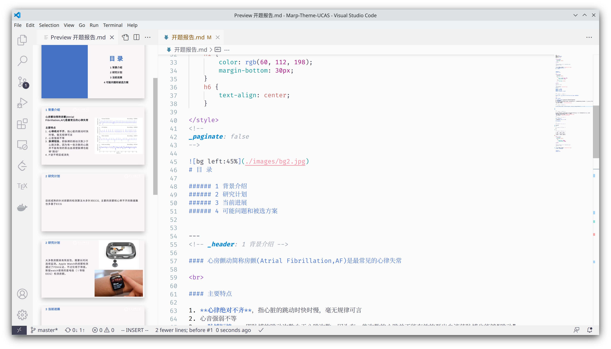

纯文本好，富文本坏。Markdown好，PPT坏！这是迫于毕业不得不向PPT低头才干出来的事情，大家没事不要学我。
<!-- more -->

## So, PpT fUck y0u！

Office三件套里面，我对word只是喜欢不起来（真要做到内容样式分离还是可以的，而且把富文本的所见即所得做到了地表最强），对Excel相当厌恶（谁让你多管闲事把身份者号给我改成科学计数法了？），对PPT的感情那或许可以算是不共戴天之仇了。

~~但是根据约翰霍普金斯大学的研究，喜欢做PPT的大概率是个传销分子~~

如果不是生活所迫谁愿意做PPT呢，直接拿Markdown写文档呗。（我们现在确实除了毕业答辩这种迫不得已的事情，都用Markdown给老板讲东西了）

好在毕业答辩类的学术PPT不用做的太好看，简陋一点反而显得比较朴实无华，Markdown生成的PPT也够看了。而且我前期给老板交差的调研材料什么的基本都是用Markdown写的，改一改就成PPT了。其实如果不是

功能简陋也好，这样免得我在PPT上面调格式浪费很多时间。**而且可以用键盘操作**。
除非迫不得已我是不愿意做PPT的，我一直觉得用直接拿着Markdown讲

至于为什么不用LaTeX的Beamer，那是我对LaTeX不熟，而我对CSS和HTML比较熟，Markdown做不到的可以伤感CSS魔改。

## 准备

作为一个毕业答辩之类的PPT，Marp的功能已经足够做一个丐版的学术简陋风格PPT了，Beamer的功能Marp几乎都有。这个东西有VSCode插件，直接装就好了。网页版也可以直接用。

当然这个东西没有什么惊艳的动画效果和对布局细致的控制和调整，Markdown本来就不适合干这个事情呢。如果是做传销风格的PPT那还请~~直接用Office~~试试隔壁的reveal.js，像写前端一样写你的演示，各种漂亮的动画效果全都有。

直接新建一个Markdown，在开头启用marp就好了。

```markdown
---
marp: true
---
```

语法都是markdown的语法，每一张PPT之间隔断就用`---`就可以了（最好在`---`前面空一行）

为了更符合传统的PPT界面的布局，VSCode打开Preview，然后将preview调到左边侧栏。好，它现在看起来和wps演示和PowerPoint完全一致。



## Markdown

## 图片

图片的支持当然没有PowerPoint那么好。Markdown本来就不支持调整图片的大小、图片缩放、指定图片位置这种操作。对于博客文章或者文档可以统一用css去设置居中、边框这些，但是PPT的图片几乎每页的布局和位置都不太一样。Marp对Markdown提供了一些扩展，能基本满足我对图片的位置调整需求。如果不满足要求可以用html标签去调图片。

下面的操作是一些粗略调整宽度高度的语法、以及上下左右、居中、背景图片。

```markdown


<!-- 将图片置于右上，宽度600px -->
```

## 模板

Marp自带的模板合适可以自己定制，只需要一点CSS就可以了

定制可以参考：https://marpit.marp.app/theme-css

太长不看版：[How to create a theme?](https://github.com/marp-team/marp/discussions/115)  

## 