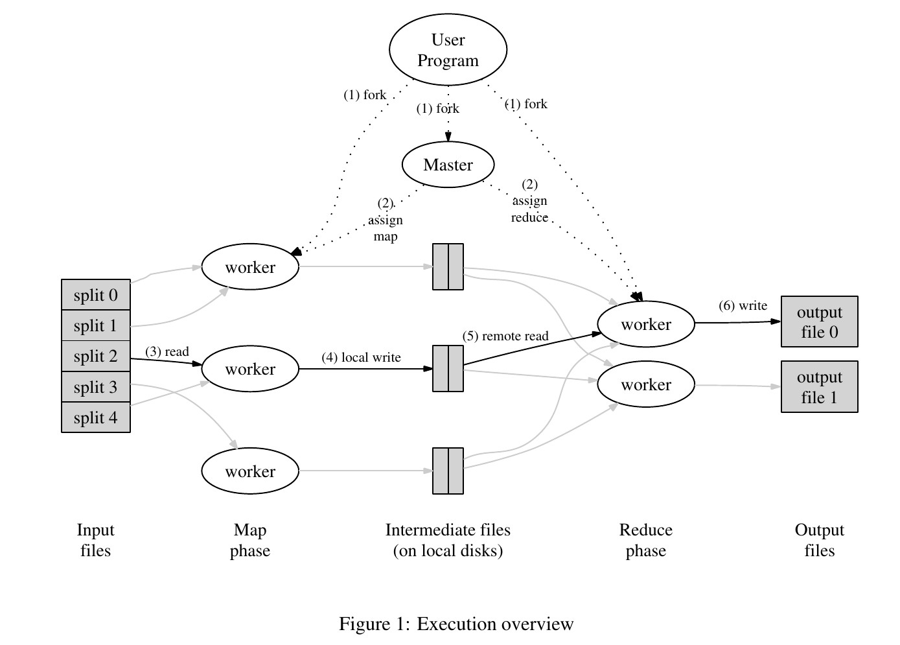

Long Live Map Reduce
<!-- more -->

MapReduce的影响挺大的

## Map和Reduce操作

MapReduce 最早是函数式编程里的概念，我一开始也是在python里面最听到这两个词的。map用来映射，reduce用来聚合。

python里面是这样的：

```python
from functools import reduce

def f1(x):
    return x*x

def f2(x, y):
    return x*y

nums = [1, 2, 3, 4 ,5]

suqare = list(map(f, nums))
//reduce作用于一个序列，效果相当于阶乘
factorial = list(reduce(f2, nums))
```

求阶乘的操作用循环也可以做到，但是我们注意到这些操作有很好的性质，可以分离开计算再求总和，这样就可以拆解为一些小的并行计算。（循环也可以被SIMD指令并行，这里先不多说了）

遍历使用迭代器完成的

## 分布式的MapReduce


Map和Reduce两种操作和上面python的例子用法一样



论文以 wc （单词统计）为例。master会分出M个Map任务和N个Reduce任务，然后分配给worker。

Map任务执行用户自定义的map函数，输出一个<key, value>。

Reduce执行用户自定义的reduce函数，用来聚合相同的<key, value>。

要注意Map和Reduce是有先后顺序的，需要完成Map操作

## Lab1 实现一个玩具MapReduce

注：看起来这个Lab和去年的一样，把去年做的直接拿过来了，当时实现的时候不少地方挺粗糙的。

6.824的Lab1是做一个MapReduce，例子就是当年Google经典论文里面的那个 word count。wc和阶乘、求和一样有很好的性质，能够并行。

这个Lab很简单，`src/main/mrapps/wc.go`给好了一个单机版的例子，实现这样的效果：`cat mr-out-* | sort | more`

仿照单机版本用rpc通信做一个并行版本就可以了。（这里没有真正的集群，用多个goroutine模拟并行）

我们需要补全3个文件：coordinator.go, worker.go, rpc.go。这里的coordinator就是论文里的master，因为~~黑命贵~~某些原因惨遭和谐，你打开以前的Lab就可以看到它本来就是master.go

rpc.go 里面已经给了一个例子，我们仿照着写就可以了（其实本来我是想直接用grpc来着）。注意PRC的struct要大写。

worker很容易，向master发送RPC请求然后接任务并返回就可以了。将Map任务分配到对应的worker中可以直接使用给好的`ihash`函数

master要产生并分配map任务和reduce任务，然后接收的时候判断一下是否可以合并。这里一个比较麻烦的地方是处理worker超时、停机等情况。不过这里提示我们用一个简单的方法：For this lab, have the master wait for ten seconds; after that the master should assume the worker has died (of course, it might not have). 不区分超时和宕机，直接等待10s，10s后如果没收到就直接不要这个worker的任务了。

### race问题

我去年做的时候是给channel加Mutex锁来保证没有race。go的风格是尽量用channel避免加锁，我试着全用channel但是更乱了，可能是我的操作不对，最后还是用了锁。

### reduce需要在每个map全部完成后再开始

Map任务和Reduce任务是不能并行的，Reduce需要等待所有Map任务完成之后才能开始。

之前做的时候是傻呼呼的让reduce任务的节点发rpc给master，然后等到map完成数为M了才开始。这次翻了翻Lab的Hints，原来可以用`sync.Cond` (条件变量)，大概像下面这样

```go
// w.cond = sync.NewCond(w)

// master
func (w *Worker) BeginReduceWork {
    w.cond.L.Lock()
    if {
        all_map_task_finish true
    }
    w.cond.L.Unlock()
    w.cond.Broadcast()   //广播，开始每一个Reduce任务
}

//worker
func (w *Worker) doReduce {
    w.cond.L.Lock()
    for !all_map_task_finish {
        w.cond.Wait()
    }
    // start Reduce Task
    w.startReduce()
    w.cond.L.Unlock()
}
```

`sync.Cond`这个讨论串挺有意思的[proposal: Go 2: sync: remove the Cond type](https://github.com/golang/go/issues/21165)。

### 写入的原子性

Lab的提示告诉你，写入新建一个副本，然后应用更改的时候重命名
>To ensure that nobody observes partially written files in the presence of crashes, the MapReduce paper mentions the trick of using a temporary file and atomically renaming it once it is completely written. You can use ioutil.TempFile to create a temporary file and os.Rename to atomically rename it.

### master挂了怎么办

我做Lab的时候没有考虑这个问题，假设它不会挂。

如果真的挂了那就再来一遍吧（可以保存中间文件，这样已经产生的中间文件就不用从Map操作再产生一遍了）

### 输入在变怎么办

如果输入（比如需要wc的单词）一直在改变，这样也是不适合用MapReduce处理的。这种可以去用storm和flink。实时计算这些我也不不懂，不管了。

### 网络问题和恶意篡改

一般我们部署在内网集群，不考虑网络带宽问题。TB级别的文件分为总文件大小除以64M的Map
同理假定所有节点不存在恶意篡改，也不考虑Paxos等算法考虑的拜占庭问题。

<!-- 
## Push一下老板

老板给本科生讲课讲王珊《数据库系统概论》，基本就还是老一套。除了上机和作业，一半的时间在讲约束和范式，一半的课时在讲触发器、游标、存储过程，还是有两把刷子的。
好吧，老板的课我当年都没从头到尾好好听，只听了和看了书里面范式、约束、隔离级别和锁那些。老板讲的那一套用面向对象那一套建好多个表和约束、多表联结查询、逻辑都写在存储过程里面，做一个传统的金融、HIS系统那种对约束要求严格业务繁多的

不过上周组会还是出乎我的意料。老板他老人家最近又有了奇思妙想，虽然他组会上说下周找一个毕业的师兄过来给我们讲一下联邦学习的时候，一口一个大数据，啊，开始吹什么大公司都在用啊这个很有前景啊。

我一脸懵，联邦学习是什么？
老板：巴拉巴拉....
我：这不就跟MapReduce那一套东西差不多
老板：MapReduce是什么？
我：巴拉巴拉
老板：不是的，不是这个东西

老板大概是多年没有亲自写过代码了，技术水平和概念还停留在sql server 2000、Oracle那一堆逻辑写在存储过程里面和上个世纪在金蝶公司用C++写图形界面。（**年轻帅气的老板在写代码的时候我甚至还没有出生**，Google经典三篇发布都已经是零几年的事了，当时老板做的东西也还是Oracle单机那一套，没听过可能也正常）

咳咳，不黑老板了
老板你要是看到我这篇博客，少玩点手机啊，看看DDIA吧
 -->


## 链接

 GFS的经典论文