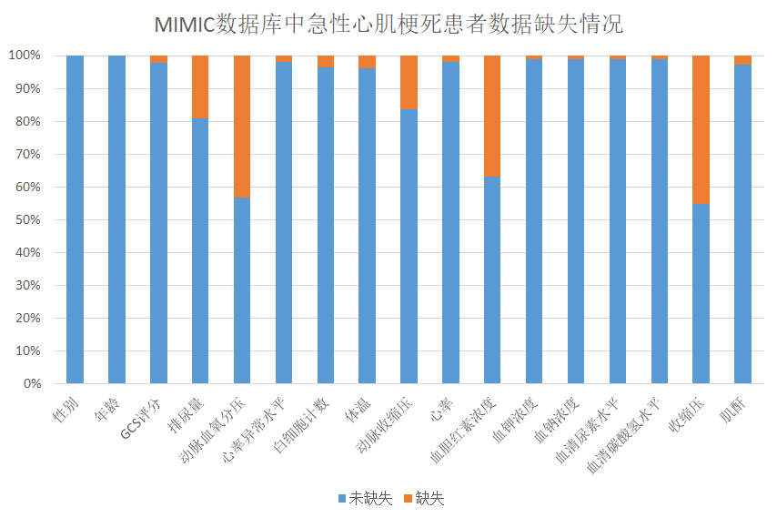

更新：推荐使用新版的MIMIC数据库自行构建数据集，并尝试整合eICU的病人数据。据说LSTM等方法效果不错，可以试试。
处理过程已经放在github上了：https://github.com/Archaeoraptor/AMI_morality_prediction.git
<!-- more -->

急性心肌梗死的发病率和死亡率都很高，MIMIC里面大概有5000次记录，用来构造数据集效果会比较好，这次就用MIMIC数据库里面的急性心肌梗死进行死亡风险的预测。

早期心血管疾病采用TIMI（the Thrombolysis in Myocardial Infarction）风险评分、全球急性心脏事件注册表（GRACE）评分或医生经验判断。后来MIMIC、eICU等开放医学数据库的建立和公布，数据量足够支撑起机器学习，疾病风险预测逐渐开始采用机器学习等方法。
数据清洗和构造数据集

目前开源的ICU重症数据库主要有MIMIC和eICU；eICU里面的患者数量多一点，但是貌似数据缺失很多，数据质量也不太好（eICU整合了几家不同医院的临床记录拼凑出来的数据库，数据质量参差不齐）

这里我用的MIMIC-Ⅲ数据库，内有近四万名成年人以及七千多名新生儿的五万余次住院资料，其中急性心肌梗死入院记录大概5000多次。

## 更新

前一阵MIT发布了 MIMIC IV 数据库（第四版），MIMIC-IV目前是0.4版本，以后要放出1.0正式版。希望大家下载最新版本进行训练~~炼丹~~

0.4版的压缩包有6.7G,要获取需要在网站注册帐号并进行考试答题，然后同意他们关于医学伦理的条款
下载地址： <https://physionet.org/content/mimiciv/0.4/>
并没有BT种子之类下载方式，下载需要帐号验证，由于版权和隐私等原因，应该也不能进行二次分发
所以大家自己去下吧。

通过考试答题后就直接点下载链接就好了。
官网还提供了wget的下载方式，安装包有点大，我们打开bbr下载会快一点（有美国代理记得挂）

```bash
sudo sysctl net.ipv4.tcp_congestion_control=bbr
```

然后填你的用户名和密码就好了

```bash
wget -r -N -c -np --user username --ask-password https://physionet.org/files/mimiciv/0.4/
```

下载好建库的时候记得建索引，不然后续操作会很慢

## 患者筛选

在MIMIC数据库中提取ICD-9疾病编号为410大类、疾病名称为 acute myocardial infarction的相关病人全部住院记录。数据表DIAGNOSE_ICD中的ICD9_CODE字段记录了患者的ICD-9编码，其中410大类编码根据发病部位被分为10个小类，例如第1个小类代表发病部位为前外侧壁、第2个小类代表发病部位为下外侧壁；这10 个小类又根据发病时期分为3个小类，0代表未细分，1代表初次入院，2代表再入院；例如，MIMIC数据库中ICD9_CODE字段为41031，对应的ICD-9编码为410.3.1，其中410代表急性心肌梗死，3代表下后壁，1代表初次入院。


提取到的除后续照顾类别以外的410大类患者数据中，共有5087次入院记录，去除同一患者重复的入院记录，共有4788名病人患有急性心肌梗死（包括同时患有急性心肌梗死的并发症），其中有727人死亡，总死亡率15.18%。男性患者共2924名，平均年龄为67.2岁，死亡391人，男性死亡率13.37%；女性患者共1864名，平均年龄为73.4岁，死亡337人,女性死亡率18.10%。统计急性心肌梗死患者人群种族信息，可以发现亚裔只有74次入院记录。
特征选取

MIIMC里面能用的特征大概有性别年龄这些个人信息、心率血压这些生理指标、还有些用药记录之类的，为了预测患者初次发病的死亡率，只采用患者初次入院24小时内的记录检查项目作为预测指标

先把24小时ICUSTAY_ID选出来

```sql
CREATE TABLE k_AMI2 AS
SELECT
	ADMISSIONS.SUBJECT_ID,
	ADMISSIONS.HADM_ID,
	ADMISSIONS.ADMITTIME,
	ADMISSIONS.DEATHTIME
FROM
	ADMISSIONS,
	(
		SELECT DISTINCT
			A.SUBJECT_ID,
			MAX(A.ADMITTIME) ADMITTIME
		FROM
			ADMISSIONS A,
			DIAGNOSES_ICD B
		WHERE
			A.HADM_ID = B.HADM_ID
		AND (
			ICD9_CODE = "41000"
			OR ICD9_CODE = "41001"
			OR ICD9_CODE = "41010"
			OR ICD9_CODE = "41011"
			OR ICD9_CODE = "41020"
			OR ICD9_CODE = "41021"
			OR ICD9_CODE = "41030"
			OR ICD9_CODE = "41031"
			OR ICD9_CODE = "41040"
			OR ICD9_CODE = "41041"
			OR ICD9_CODE = "41050"
			OR ICD9_CODE = "41051"
			OR ICD9_CODE = "41060"
			OR ICD9_CODE = "41061"
			OR ICD9_CODE = "41070"
			OR ICD9_CODE = "41081"
			OR ICD9_CODE = "41090"
			OR ICD9_CODE = "41091"
			OR ICD9_CODE = "41002"
			OR ICD9_CODE = "41012"
			OR ICD9_CODE = "41022"
			OR ICD9_CODE = "41032"
			OR ICD9_CODE = "41042"
			OR ICD9_CODE = "41052"
			OR ICD9_CODE = "41062"
			OR ICD9_CODE = "41072"
			OR ICD9_CODE = "41082"
			OR ICD9_CODE = "41092"
		)
		GROUP BY
			A.SUBJECT_ID
	) AS T
WHERE
	ADMISSIONS.ADMITTIME = T.ADMITTIME
AND ADMISSIONS.SUBJECT_ID = T.SUBJECT_ID
```

然后用找患者检查项目、生理指标的ITEM_ID。写一个简单的SQL联接查询就可以了：

```sql
SELECT DISTINCT
	SUBJECT_ID,
	MAX(VALUEUOM) MAX_VALUE,
	MIN(VALUEUOM) MIN_VALUE
FROM
	(
	SELECT
		CHARTEVENTS.SUBJECT_ID,
		CHARTEVENTS.ICUSTAY_ID,
		CHARTEVENTS.CHARTTIME,
		CHARTEVENTS.`VALUE`,
		CHARTEVENTS.VALUEUOM,
		CHARTEVENTS.ERROR,
		TIMESTAMPDIFF( HOUR, T.INTIME, CHARTEVENTS.CHARTTIME ) STAYHOUR 
	FROM
		CHARTEVENTS,
		A_AKF_DEATH T 
	WHERE
		CHARTEVENTS.ICUSTAY_ID = T.ICUSTAY_ID 
		AND ( CHARTEVENTS.ITEMID = 220546 OR CHARTEVENTS.ITEMID = 1542 )
	ORDER BY
		CHARTEVENTS.SUBJECT_ID 
	) AA
WHERE
	STAYHOUR <= 24 
GROUP BY
	SUBJECT_ID
```

本次选取的急性心肌梗死患者主要特征见下表：

| 特征               | 字段或ITEMID                  |
| ------------------ | ----------------------------- |
| 年龄               | PTENETS.DOD和DOB              |
| 性别               | PATIENTS.GENDER               |
| 心率               | CHARTEVENTS.ITEMID            |
| 入院类型           | ADMISSION_TYPE                |
| ICD细分编码        | ADMISSION.ICD9_CODE           |
| 最小GCS评分        | 220739、223901、223900、198   |
| 排尿量             | 40055、226559                 |
| PaO2               | 779、220224                   |
| 白细胞计数WBC      | 220546、15424、200、1127、861 |
| 体温               | 676、223762、678、223761      |
| 血钾浓度           | 50971                         |
| 血钠浓度           | 50983                         |
| 血胆红素浓度       | 50885                         |
| 是否有血液恶性肿瘤 | ICD9_CODE =200XX-208XX        |
| 收缩压             | 51、220050                    |
| 动脉收缩压         | 455、220179                   |
| 血清尿素水平       | 51006                         |

### 归一化和标准化

为了将患者特征转换成便于机器学习模型输入训练的特征变量的形式，对于MIMIC数据库中患者初次入院24小时中多次测量并记录的化验指标，选取最小值、最大值和平均值作为三个不同的特征。

然后对数字变量进行归一化，把标准差置为1，均值置为零（ICD细分编码之类的虽然是数字，但实际上是一个类别特征，应作为类别特征处理）

对于性别种族等类别特征，进行Onehot编码转换为梯度提升树模型能够接受的类型；以性别为例，将性别为女编码为01，性别为男编码为10。（LightGBM等可以用直方图算法之类的方式直接处理类别特征，不需要该操作）经过上述处理，共筛选并构建出42个急性心肌梗死患者的特征维度。

### 缺失值填补

由于MIMIC数据库中的数据是由两家不同的医院在10年间的ICU重症监护记录整合而成，急性心肌梗死患者的数据存在缺失和不统一的问题。以化验项目血清碳酸氢水平为例，在提取得到的4788份急性心肌梗死患者样本数据中，有4730份血清碳酸氢数据记录是完整的，有58份是缺失的，缺失率1.2%；但是部分检查指标，如收缩压，4788个样本中只有2665份完整数据，缺失率44.3%。

对于SVM等对于缺失值敏感的算法，用均值填补空缺数据的方法；对于缺失值不敏感的决策树类算法（如GBDT）和自带缺失值处理的算法（如XGBoost），将缺失值置为-1。

（缺失率在40%左右的会影响模型的效果，但是收缩压之类的又很重要，不能轻易舍弃）



### 数据集不平衡的问题

有的疾病可能会有，急性心肌梗死由于死亡率很高，正负样本比例已经超过了1：9，并不是那种极端不平衡的问题。有的疾病死亡率1%左右需要采样等方式构造平衡数据集。

## 模型训练

直接用的scikit-learn工具包，随便调了调参。决策树类的bsoosting算法表现都还不错，像GBDT啊，XGBoost啊，LightGBM啊。数据量还是有点小了，就没上深度学习那些网络。直接调sklearn的包调一下参：

```python
import pandas as pd
# pd.options.mode.chained_assignment = None
import numpy as np
import lightgbm as lgb


from sklearn import preprocessing
from sklearn.model_selection import train_test_split,cross_val_score,cross_val_predict
from sklearn.ensemble import RandomTreesEmbedding, RandomForestClassifier, GradientBoostingClassifier
# criteria
from sklearn.metrics import accuracy_score, roc_auc_score, f1_score,recall_score, precision_score, roc_curve


# 加载数据
data = pd.read_csv('./data/train_data_modified.csv', encoding='utf-8')
data = data.sample(frac=1, random_state=42)
data_x = data.iloc[:,[1,2,3,4,5,6,7,8,9,10,11,12,13,14,15,16,17,18,19,20,21,22,23,24,25,26,27,28,29,30,31,32,33,34,35,36,37,38,39,40,41,42]]
# data_x = data.iloc[:,[1,2,3,4,5,6,7,36]]
lbl = preprocessing.LabelEncoder()
# data_x['M'] = lbl.fit_transform(data_x['M'].astype(str))#将含有字符的类别特征这一列进行转换
# data_x['EMERGENCY'] = lbl.fit_transform(data_x['EMERGENCY'].astype(str))#将含有字符的类别特征这一列进行转换
data_y = data.iloc[:,[0]]

# 准备一个train/test来构建模型。
x_train, x_test, y_train, y_test = train_test_split(data_x,
                                                    data_y, 
                                                    test_size=0.2, 
                                                    random_state=52,
                                                    )

print(x_train.shape, x_test.shape, y_train.shape, y_test.shape)


from xgboost.sklearn import XGBClassifier
xgb = XGBClassifier(
    n_estimators=100,
    learning_rate =0.09,
    max_depth=4,
    min_child_weight=1,
    gamma=0.3,
    subsample=0.8,
    colsample_bytree=0.8,
    objective= 'binary:logistic',
    nthread=12,
    scale_pos_weight=1,
    reg_lambda=1,
    seed=27)
# xgb = HistGradientBoostingClassifier(learning_rate=0.09)
xgb.fit(x_train, y_train)

y_pred_xgb = xgb.predict(x_test)


y_pred_xgb_pr = xgb.predict_proba(x_test)[:,1]
fpr_xgb,tpr_xgb,thresholds  = roc_curve(y_test,y_pred_xgb_pr)

# y_pred_xgb = y_pred_xgb_pr > 0.5
# print(lr.coef_) #W
# print(lr.intercept_) #b
# 评价指标
print("auc面积:",roc_auc_score(y_test, y_pred_xgb_pr))
print("精确率:",precision_score(y_test, y_pred_xgb))
print("召回率:",recall_score(y_test, y_pred_xgb))
print("正确率:",accuracy_score(y_test, y_pred_xgb))
print("F1值:",f1_score(y_test, y_pred_xgb))
```

## 死亡率预测

### 结果

表3-3 几种机器学习方法的死亡率预测结果如下表：

|        | GBDT  | LR    | KNN   | SVM   | XGBoost | LightGBM | NB    |
| ------ | ----- | ----- | ----- | ----- | ------- | -------- | ----- |
| AUC    | 0.834 | 0.780 | 0.695 | 0.779 | 0.851   | 0.844    | 0.777 |
| 精确率 | 0.676 | 0.618 | 0.5   | 0.688 | 0.690   | 0.663    | 0.378 |
| 召回率 | 0.320 | 0.239 | 0.162 | 0.155 | 0.329   | 0.330    | 0.479 |
| 准确率 | 0.879 | 0.865 | 0.852 | 0.864 | 0.875   | 0.872    | 0.806 |
| F1 值  | 0.451 | 0.345 | 0.245 | 0.253 | 0.443   | 0.439    | 0.422 |

看上去准确率挺高，实际结果不太好，召回率太低了。召回率的意义是真阳性率（True Positive Rate），也就是预测到的死亡患者占所有患者的比例，大概真正死亡的患者只有一半被预测了出来。

|          | 实际死亡     | 实际存活     |
| -------- | ------------ | ------------ |
| 预测死亡 | 真阳性（TP） | 假阳性（FP） |
| 预测存活 | 假阴性（FN） | 真阴性（TN） |

由于数据集还是太小，就没有细分搞成多分类的问题预测一下短期（30天）和长期（90天以上）死亡率，数据集大了可以做一下。数据集再大可以做细分，比如STEMI和NSTEMI的细分或者

### ROC曲线


### 特征权重

以GBDT为例，提取训练模型的决策树权重，结果如图3-3所示。由图可知，梯度提升树模型认为最重要的10个指标为当日最小血清碳酸氢水平、平均动脉血二氧化碳分压、平均排尿量、心率范围、最小心率、肌酐、体温范围、当日最大收缩压、当日心率标准差、年龄。


## 其他问题

这个，急性心肌梗死这个直接看心电图或者彩超啥的更好一些，准确率一般不会低于90%。心血管疾病这种做这个预测基本没有太大意义。急性肾衰竭啥的可能更有意义一点

MIMIC数据库里面的数据亚裔很少，放到国内可能不太合适。护理和临床记录方式也差别不小。

这是2001-2012年的数据，近十年来医学水平提高了不少，包括再灌注等手段，死亡率已经下降了，用这批数据预测现在的可能会偏高

## 补充说明

### MIMIC数据库表格名称及用途

| 表格名称                | 表格内容                                                     | 备注                           |
| ----------------------- | ------------------------------------------------------------ | ------------------------------ |
| ADMISSIONS（入院表）    | 提供有关患者的入院信息，由于为病人进行的每次唯一的医院访问都分配了一个唯一的信息`HADM_ID`，因此ADMISSIONS表可以被认为是`HADM_ID` |                                |
| CALLOUT(标注表)         | 提供患者何时准备好从ICU出院以及患者何时实际从ICU出院的信息   |                                |
| caregivers              | 记录医护人员信息（ID、类型、附加信息）                       |                                |
| chartevents             | 记录所有病人的图表数据，住院期间的所有症状、体征、精神状态、实验室检查等 |                                |
| cptevents               | 包含当前的程序术语（CPT）代码，这些代码便于为在患者身上执行的操作计费。 |                                |
| d_cpt                   | 当前程序术语（CPT）代码的高级定义                            |                                |
| prescriptions（处方）   | 包含药物相关的订单条目，即处方                               |                                |
| inputevents_cv          | 患者输入数据（流入患者体内液体信息）                         | 表格来源CareVue ICU数据库。    |
| inputeevents_mv         | 患者输入数据（流入患者体内液体信息）                         | 表格来源Metavision ICU数据库。 |
| outputevent             | 患者的输出数据。                                             |                                |
| labevents               | 包含给定患者的所有实验室测量值，包括患者数据（ITEMID、VALUE） |                                |
| d_icd_diagnoses         | ICD-9疾病诊断的定义表,对 疾病编码的解释                      |                                |
| d_icd_procedures        | ICD-9治疗程序代码的解释                                      |                                |
| d_items                 | ICU数据库中所有项目的定义表                                  |                                |
| d_labitems              | 所有实验室测量的定义表（对ITEMID的解释，对应数据类型，关联的LOINC代码） |                                |
| datetimeevents          | 包含所有日期格式的数据                                       |                                |
| diagnoses_icd（诊断表） | 包含患者住院期间所有ICD-9诊断                                |                                |
| drgcodes                | 包含患者的诊断相关组（DRG）代码                              |                                |
| icustays                | 患者在ICU内的住院概要（入住或者转出ICU的时间等）             |                                |
| microbiologyevents      | 包含微生物学信息，包括进行的测试和敏感性                     |                                |
| noteevents              | 包含所有患者注意事项。，主要是不便于数字化的报告             |                                |
| patients                | 包含患者的基本信息（性别、出生日期、死亡日期、死亡标志位）   |                                |
| procedureevents_mv      | 包含患者的（治疗）程序                                       |                                |
| procedures_icd          | 包含患者的ICD程序，最值得注意的是ICD-9程序，即诊断程序       |                                |
| services                | 患者被接纳/转移的服务                                        |                                |
| transfers               | 患者整个住院期间的物理位置                                   |                                |

注意： 表格主要分为两种，一种是以D开头的，表示该表格为字典，比如d_labitems，表示实验室检查字典，内含每个实验室检查结果的说明；没有以D打头的表格则是记录患者信息的表格，比如labevents则表示患者住院期间的所有实验室检查结果。

### MIMIC数据表中主要字段

| 数据表        | 字段                 | 说明                              |
| ------------- | -------------------- | --------------------------------- |
| ADMISSION     | SUBJECT_ID           | 每个患者的唯一标识                |
| ADMISSION     | HADM_ID              | 患者每次入院的唯一标识            |
| ADMISSION     | ADMITTIME            | 入院时间                          |
| ADMISSION     | DEATHTIME            | 死亡时间                          |
| DIAGNOSES_ICD | ICD9_CODES           | 患者的ICD-9编码                   |
| ADMISSION     | HOSPITAL_EXPIRE_FLAG | 是否死亡                          |
| D_ITEMS       | ITEMID               | 项目编号                          |
| D_ITEMS       | LEABEL               | 项目名称                          |
| ICUSTAYS      | ICUSTAY_ID           | 每次ICU病房接受病人唯一标识       |
| LABEVENTS     | VALUE                | 检查项目                          |
| LABEVENTS     | VALUEUOM             | ITEM的值 检查项目的单位（如K/uL） |
| LABEVENT      | FLAG                 | 检查项目是否异常（正常为Null）    |

### 急性心肌梗死患者主要特征

| 特征               | 字段或ITEMID                  |
| ------------------ | ----------------------------- |
| 年龄               | PTENETS.DOD和DOB              |
| 性别               | PATIENTS.GENDER               |
| 心率               | CHARTEVENTS.ITEMID            |
| 入院类型           | ADMISSION_TYPE                |
| ICD细分编码        | ADMISSION.ICD9_CODE           |
| 最小GCS评分        | 220739、223901、223900、198   |
| 排尿量             | 40055、226559                 |
| PaO2               | 779、220224                   |
| 白细胞计数WBC      | 220546、15424、200、1127、861 |
| 体温               | 676、223762、678、223761      |
| 血钾浓度           | 50971                         |
| 血钠浓度           | 50983                         |
| 血胆红素浓度       | 50885                         |
| 是否有血液恶性肿瘤 | ICD9_CODE =200XX-208XX        |
| 收缩压             | 51、220050                    |
| 动脉收缩压         | 455、220179                   |
| 血清尿素水平       | 51006                         |

### 注意事项

- MIMIC IIII  数据库中用于识别患者身份的字段共有3个：subjects_id，hadm_id和icustay_id。其中subjects_id是患者身份的唯一标识，即一个subject_id只对应一名患者，一名患者也只有一个subject_id。hadm_id是患者每次住院的身份识别号，一个患者可能多次住院，因此一个subjects_id会对应多个hadm_id，但一个hadm_id只能对应一个subject_id。icustay_id表示患者在进入ICU的编号，因为患者一次住院可以多次进入不同的ICU，因此一个icustay_id只能对应一个hadm_id，当然也只能对应一个subject_id，但一个hadm_id可以对应多个icustay_id。在利用 MIMIC III 数据库进行研究时，往往需要运用sql语言对多个数据库进行连接，连接的基础一般就是这三个字段。
- 患者的临床资料不一定是住ICU期间的临床资料，也可能是住普通病房时的资料。记录患者入院时间的表格为admission，内含三个时间点：admittime，表示患者入院时间；dischartime，表示患者出院时间；deathtime，表示患者院内死亡的时间。如果deathtime为空(null)，则表示患者住院期间未死亡。记录患者进入和离开ICU的表格为icustays，这个表格中有两个时间较为重要，分别是intime和outtime，前者表示进入ICU的时间，后者表示离开ICU的时间。当然，如果患者在ICU死亡，那么dischartime、outtime和deathtime理论上就是同一个时间，但实际上会稍微有些出入，估计是由于录入不及时造成的；
- MIMIC III  中的数据来自于两套数据采集系统：carevue和metavision。在icustays表格中，有一个字段叫dbsource，用于标识数据是来源于carevue还是metavision。CareVue记录的是2001至2008年入院的患者资料，Metavision则是2008至2012年期间入院的患者资料。在Metavision中，病人的随访时间最少为90天，在CareVue中，病人的随访时间则至少为4年。换而言之，在进行预后研究时，如果将数据来源限定为CareVue，则可以将随访时间假定为4年，对于4年以后死亡的患者，可以将其在出院后第4年生存状况定义为“存活”。当然，如果患者的死亡状况(DOD_SSN)为空格(null)，也同样可以表明患者在出院后4年仍然存活。
- MIMIC数据库中的ICD编码统计方式和国内不太一样，基本都包含并发症，比如一个病人流感入院并死亡，同时患有急性心肌梗死的并发症，那么该病人也算作急性心肌梗死患者。（主要诊断是其他的疾病，但同时患有某疾病并发症，也认为是该疾病患者，统计死亡时也算在里面）
- 在MIMIC中有一个'ADMISSION_TYPE，其中有3个类别，分别是URGENT，EMERGENCY和ELECTIVE，ELECTIVE是不紧急的，URGENT和EMERGENCY的区别大概是URGENT的紧急程度更高（一般是需要立即采取措施的那种）