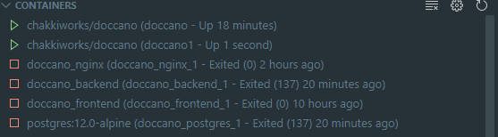
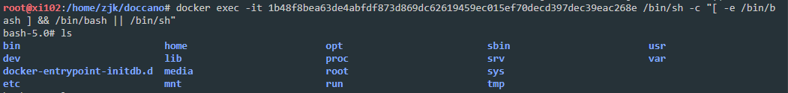
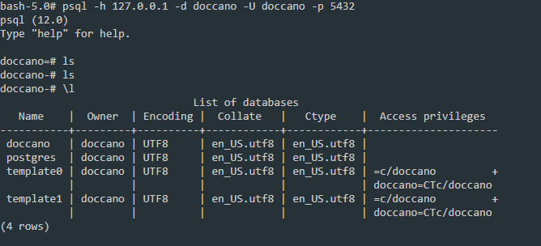
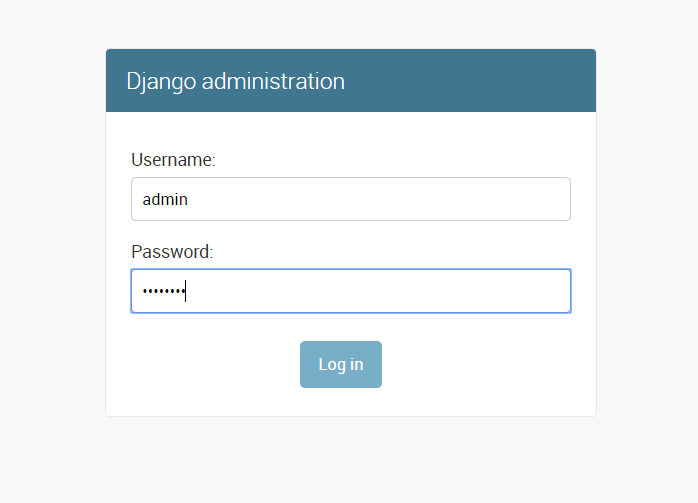
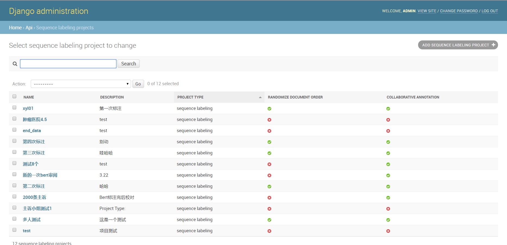
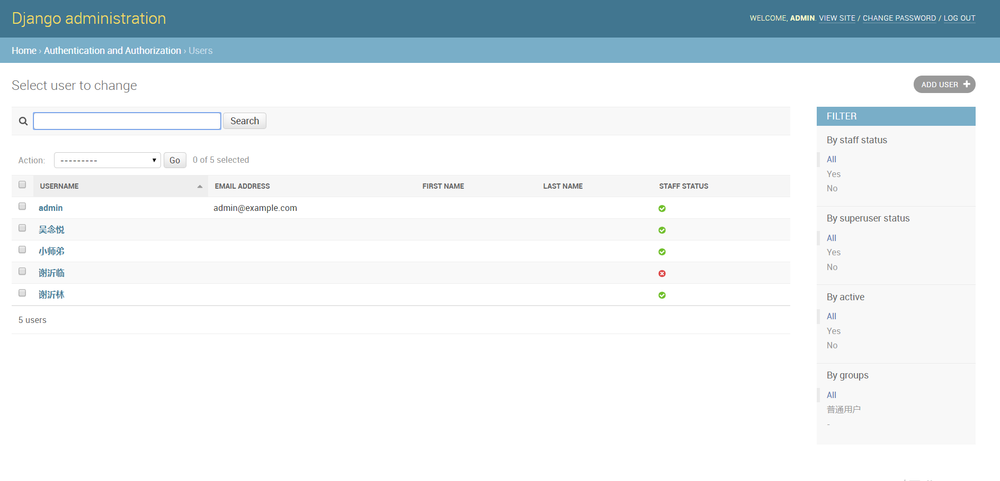
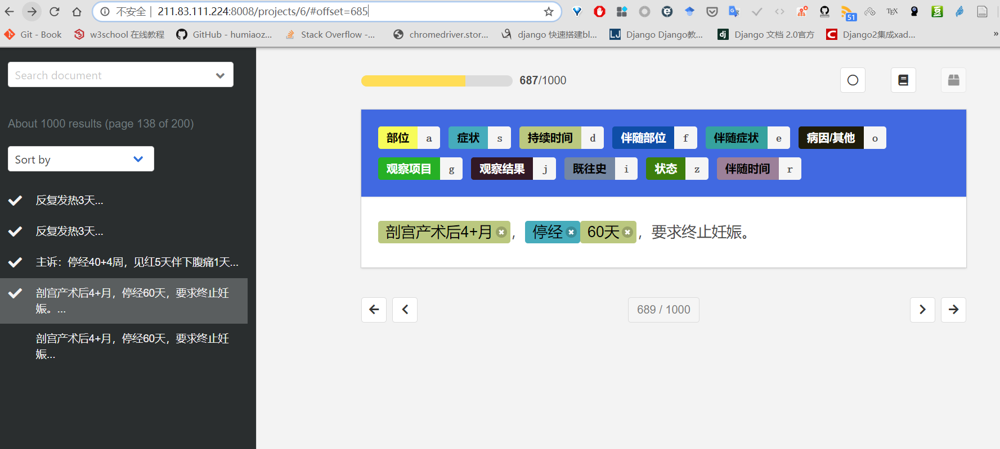

BERT效果确实好，就是有点吃内存

<!-- more -->

## 序列标注

一些医院的电子病历拆分的很细，比如主诉这一个大项里面部位、症状、时间、状态都是分开的；另一些医院的电子病历就跟纯文本差不多，要把大段文字中的主要结构提出来需要自然语言处理或者人工录入。一般做自然语言处理的时候都是几个部分分开做的，因为不同部分差异比较大，分开训练识别效果好。大部分电子病历包括入院记录、首次病程记录、病程记录、出院记录、手术记录、护理记录、病案首页，这里面又分为一些检查项、时间、主诉、既往史之类的小项。不少电子病历系统导出都是XML的，一般都是把电子病历拆成主诉那种一个个不能再拆的纯文本部分，比如主诉，见[上一篇](https://zhangjk98.xyz/81d4/)，然后再对不能拆分的纯文本用人工或自然语言处理进一步拆分。这就是所谓的电子病历结构化。

比如一段主诉：

> 反复胸痛伴胸闷1+年，加重20+天。

按照规范一定的规范可分为几个不同的小块，比如下面这十一种：

> 部位、症状、持续时间、伴随部位、伴随症状、伴随时间、状 态、病因/其他、观察项目、观察结果、既往史

胸是部位、痛是症状、1+年是持续时间、反复是状态......

标注出来的结果可以保存为json格式，labels里面的list分别为起始位置、结束位置、标签

```

{"text": "反复胸痛伴胸闷1+年，加重20+天。", "labels": [[0, 2, "状态"], [2, 3, "部位"], [3, 4, "症状"], [5, 7, "伴随症状"], [7, 10, "伴随时间"], [11, 17, "持续时间"]]}
```

BIO格式，大概是这个样子：B，begin标签开始；I，inside包含在标签内，O，outside在标签外

```

反 B-状态
复 I-状态
胸 B-部位
痛 B-症状
伴 O
胸 B-伴随症状
闷 I-伴随症状
1 B-伴随时间
+ I-伴随时间
年 I-伴随时间
， O
加 B-持续时间
重 I-持续时间
2 I-持续时间
0 I-持续时间
+ I-持续时间
天 I-持续时间
。 O
```

BERT的接口是BIO格式，标注工具doccano，这里写两个互相转换的脚本就行了，标注完成后将json转为BIO，训练和预测完成后将BIO预测结果转为JSON

## 训练模型 

NLP里面的命名实体识别很早就用在电子病历上，早期的机器学习方法效果一般，后来开始用RNN和CNN，后来用LSTM，再后来用BERT，效果一直在提升，BERT基本上到顶了（好一点的训练数据BERT基本能达到90%以上，对于主诉这样的较短的简单条目甚至能达到98%以上）

## 其他杂项

### doccano的部署和使用

#### 部署

##### Docker方式

###### 构建和部署

运行以下命令

```

$ docker pull chakkiworks/doccano # 拉取官方镜像
$ docker run -d --name doccano -p 80:8000 chakkiworks/doccano # 运行镜像，请按需修改端口
$ docker exec doccano tools/create-admin.sh "admin" "[email protected]" "password" # 创建用户并指定密码
```

> 注意  Docker镜像run之后会产生三个容器，doccona_nginx、doccona_backend、docker_frontend,其中docker_frontend在构建完成后会直接exit，这是一个feature，不是bug，它的主要作用是webpack打包
>
> 

#### 访问Docker中的PostgreSQL数据库中的数据

由于数据库安全问题，数据库分离再一个单独的容器中并且 首先执行`Docker exec`命令进入相应的PostgreSQL数据库容器

应该看到下图这样，终端从宿主机切换进容器



在容器的shell中用命令进入数据库

```

$ psql -h 127.0.0.1 -d doccano -U doccano -p 5432 # 注意你的host，数据库名、用户名和端口
```

应该看到下图这样，终端从Docker容器切进数据库



然后执行`\l`等命令进入和查看数据库（执行SQL）

#### 使用

后台管理入口是这个http://yoursite/admin/，就是一个Django自带的后台管理







登录进去后可自行添加账号和项目并设置权限和标签，标注项目选择sequential labeing即可，导出时选择JSONL格式

这个数据比较多的时候没有自动跳转比较麻烦，请直接在浏览器地址栏使用url跳转

比如，修改浏览器后面的url，#后面的offset改为685，直接回车，就可以从当前的689跳转到第685个数据

http://yoursite/projects/6/#offset=685



## 注

https://github.com/doccano/doccano 一个开源的标注工具

 https://github.com/macanv/BERT-BiLSTM-CRF-NER 一个BERT的NER工具包