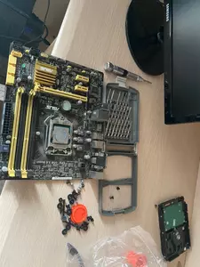
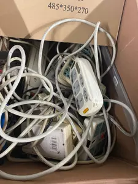

又是捡垃圾的快乐一天
<!-- more -->

### 教研室捡来的垃圾

> 又不是不能用

- 2GB 内存条（看起来全新实际上至少八九年前的了，别问为什么只有2G，这是教研室能捡垃圾捡到的最后一块内存条了）
- 120G intel固态（包浆成色，上个月刚从一个旧电脑上拆下来的）
- 一块 i5 4570 的CPU（战斗成色，貌似也六年了）
- 一个风扇（战损成色，全是灰）
- 六七年前的华硕主板（伊拉克战损成色）
- 一个三星显示器（屏幕漏光，也有五六年了，装系统临时用一下）
- 一个2014年的老机箱（战斗成色，全是灰）
- 一个主机电源（不是很新，200W）
- VGA线、电源线、排线（普通成色）
- 螺丝等（一大把旧主机上拆下来的）
- 键盘（N年前的薄膜，伊拉克战损成色，全是灰）

对，102网吧的主板就是这样子的战损主板



### 全新的和自掏腰包的

基本都是室友出的钱

- 螺丝刀等（全新，室友的）
- 一个插排（昨天室友买的）
- 硅脂（全新）
- 网卡（室友网购的，刚到）
- 网线（教研室网线太老了，就不捡垃圾了）
- clash和v2ray订阅，机场买的

### 刷机

自行编译时间太长就用人家编译好的了, 室友刷的。本来以为可能2G的老内存可能会卡，结果室友的win10 pe上去意外的流畅。

借用了这个[电子科技大学校园网自动登陆脚本](https://github.com/LomotHo/UESTC-NetworkAutoConnect)

### 一点小插曲

晚上室友买完插排，第二天我发现教研室的一个旧箱子里满满一箱子插排，好家伙，亏了一个亿。



本来Openclash都整好了，结果发现室友的安卓电报没法自行分流。换成了 ssr plus

装好之后发现风扇声音有点大........直接把风扇线拔了，世界终于清净了。至于散热，问题不大（这么点负载总不可能把CPU给烧了），于是SSH上去把风扇关了

```bash
fanspeedctl stop --all --now
```