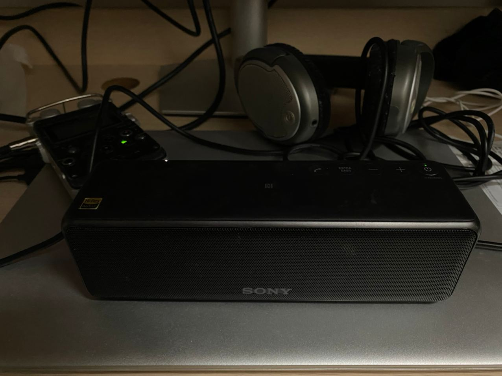
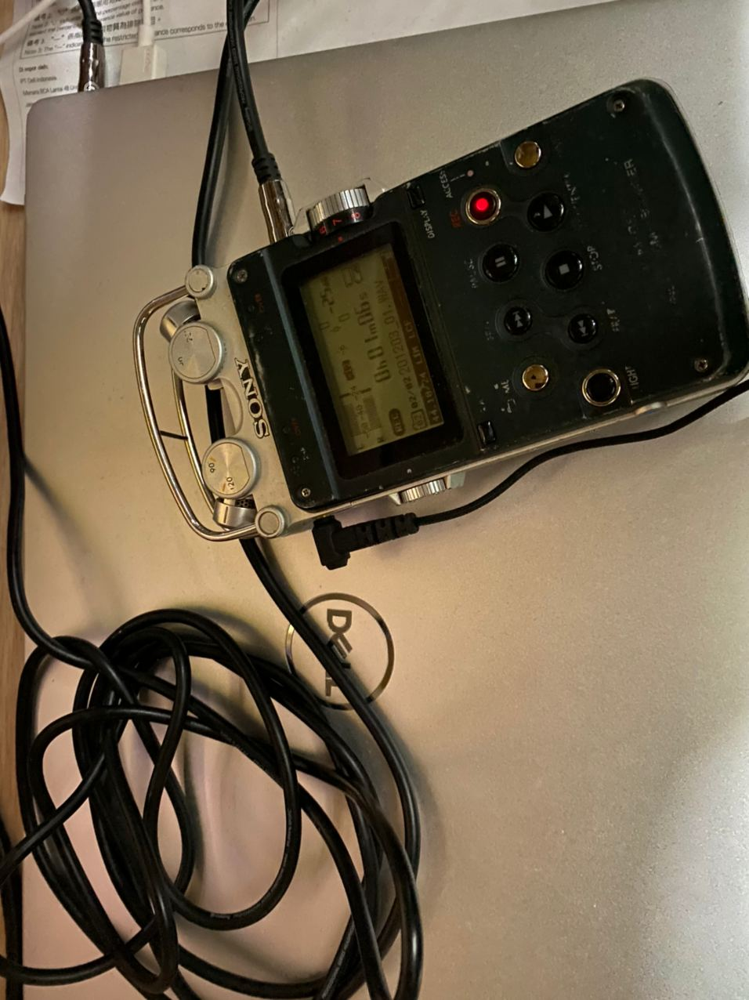
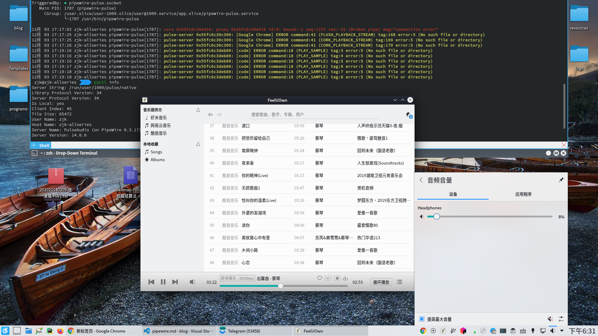
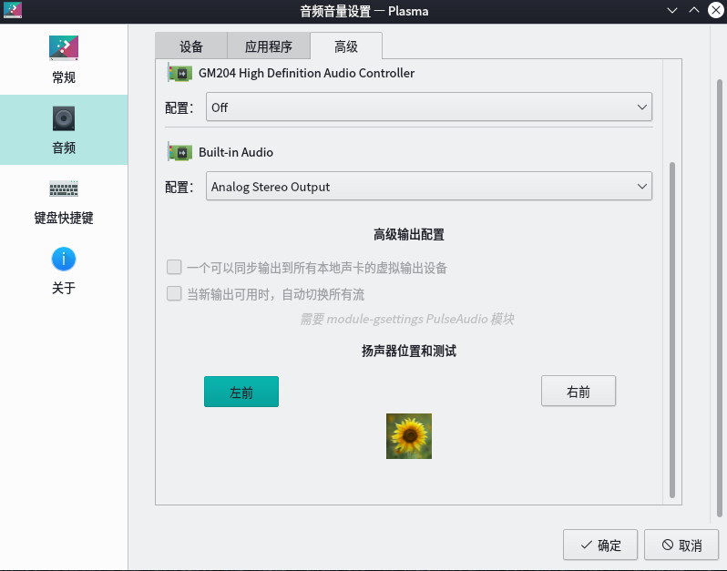
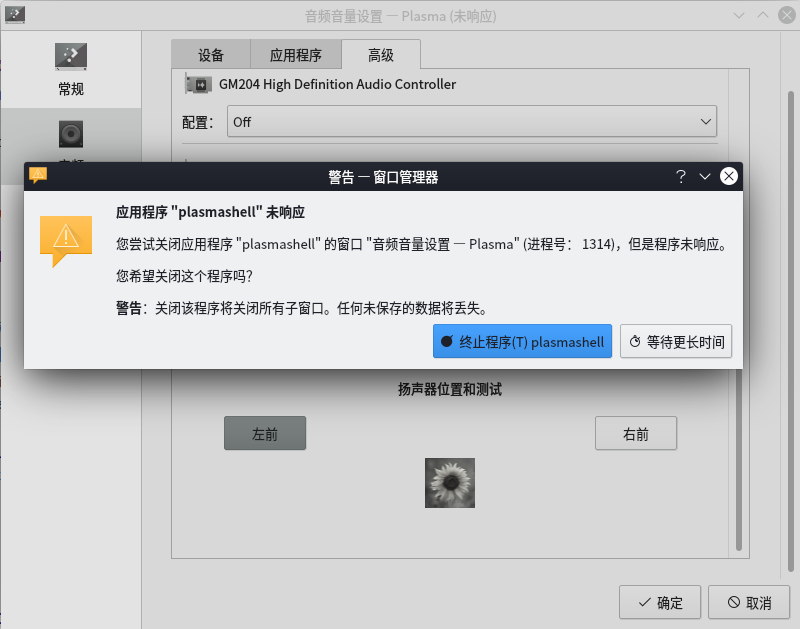
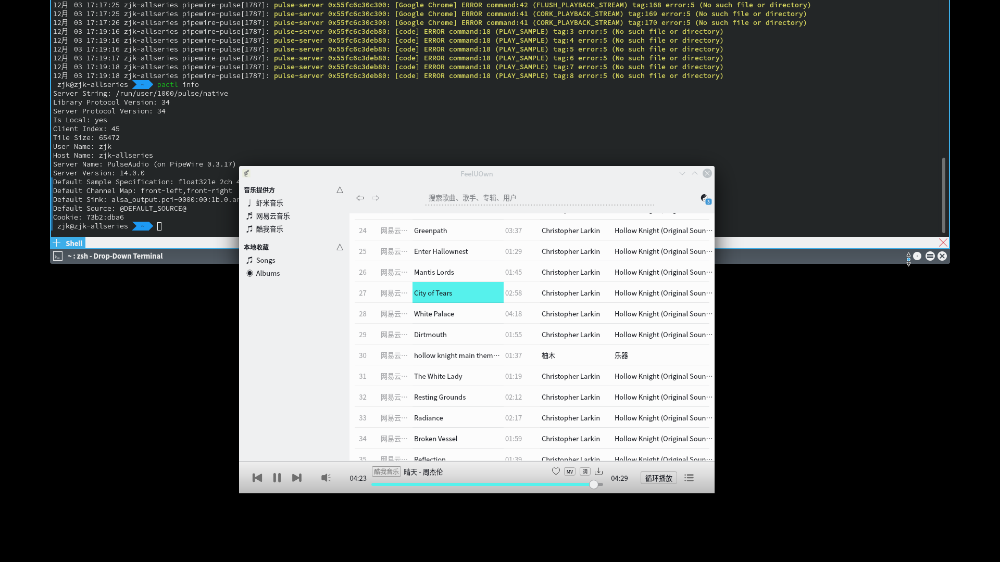

听说fedora都上Pipiwire了，正好这几天有点空，那就试试吧
<!-- more -->

Pipewire是红帽造的新一代音视频轮子，主要是用来取代PulseAudio、jack还有gstreams什么的。
**据说**延迟补偿还不错，**据说**能统一音视频框架还兼容PulseAudio和Jack，据说是朝着专业级音效去的。据说支持Wayland和平板，据说支持Flatpak之类的容器内使用，据说有类似PolKit的权限管理，不需要像PulseAudio那样新建音频用户组和添加用户了。。。。

>It provides a low-latency, graph based processing engine on top of audio and video devices that can be used to support the use cases currently handled by both pulseaudio and JACK. PipeWire was designed with a powerful security model that makes interacting with audio and video devices from containerized applications easy, with supporting Flatpak applications being the primary goal. Alongside Wayland and Flatpak we expect PipeWire to provide a core building block for the future of Linux application development.

都是据说啊，被Wayland骗了一次之后我已经不敢信这些宣传了，先试试实际效果再说。

当然这个目前貌似只正经适配了GNOME和Fedora，不过据说兼容PulseAudio，Arch上的坑已经有人踩了好久了，现在还有点小问题，不过可以考虑上了。
昨天刚把Arch和笔记本的EndeavourOS更了python 3.9，除了autojump出了点小问题外一切正常。索性直接上Pipewire看看吧，反正笔记本那个全损音质也跟没有一样，换了说不定能抢救一下。

## 安装

```bash
sudo pacman -S pipewire
```

要替代PulseAudio和Jack装这两个包`pipewire-pulse`、`pipewire-jack-dropin`。

```bash
yay -S pipewire-jack-dropin pipewire-pulse
```

然后systemd设置一下（archwiki说蓝牙设备需要手动设置一下，编辑`/etc/pipewire/pipewire.conf`，我手头没蓝牙耳机就不弄了）

```bash
systemctl enable --user pipewire-pulse
```

然后退出登录或重启。

运行`pactl info`，如果看到

```log
Server Name: PulseAudio (on PipeWire 0.3.17)
```

说明正常。

### 蓝牙设备

感谢室友赞助的一个索尼蓝牙音箱用于测试

pipewire自带了蓝牙的模块，不需要像PulseAudio那样安装`pulseaudio-bluetooth`之类的包

安装了pipewire-pulse之后编辑`/etc/pipewire/pipewire.conf`在`exec /usr/bin/pipewire-media-session`后面加上`-e bluez5`就可以使用了。

```bash
exec /usr/bin/pipewire-media-session -e bluez5
```

## 卸载

换回PulseAudio或者Jack可以用这个[脚本](https://gitlab.freedesktop.org/pipewire/pipewire/-/snippets/1164)

```bash
cd /usr/lib64/

sudo rm /usr/lib64/libpulse-mainloop-glib.so.0.999.0
sudo rm /usr/lib64/libpulse-simple.so.0.999.0
sudo rm /usr/lib64/libpulse.so.0.999.0

sudo rm /usr/lib64/libjack.so.0.999.0
sudo rm /usr/lib64/libjacknet.so.0.999.0
sudo rm /usr/lib64/libjackserver.so.0.999.0

sudo ldconfig
```

## 更新一点实测

### 人耳效果和使用体验

昨天回到宿舍，发现笔记本的EndeavourOS更新python 3.9
 Optimus-manager 出问题了，好在很快解决了。
然后在工具人室友的帮助下测试了绿联的外接声卡一块、某大法耳机一个音响一个，傻多戴显示器自带小音箱一个，均工作正常。




两种音质人耳都听不出差别，室友把两段音频放到Adobe Audition也看不出什么大区别

笔记本自带外放在KDE的设置中从其他音频播放设备切换过去之后出现没有声音的状况，经检查其实是有的，只是非常小，将声音调整到最大还是几乎要被笔记本的风扇声音盖住（这貌似不是pipewire的锅，），重启后外放音量恢复正常。
除了笔记本自带外放，在笔记本上音频切换KDE设置都没有出现卡死的状况，，声音也播放正常，没出现切换之后没声了的状况。

### 面板参数

笔记本使用原来的PulseAudio详情：

```yaml 
Server String: /run/user/1000/pulse/native
Library Protocol Version: 34
Server Protocol Version: 34
Is Local: yes
Client Index: 16
Tile Size: 65472
User Name: zjk
Host Name: zjk-7591
Server Name: pulseaudio
Server Version: 14.0
Default Sample Specification: s16le 2ch 44100Hz
Default Channel Map: front-left,front-right
Default Sink: alsa_output.pci-0000_00_1f.3-platform-skl_hda_dsp_generic.HiFi__hw_sofhdadsp__sink
Default Source: combined.monitor
Cookie: 94e6:e6bf
```

更换pipewire-pulse之后：

```yaml
Server String: /run/user/1000/pulse/native
Library Protocol Version: 34
Server Protocol Version: 34
Is Local: yes
Client Index: 69
Tile Size: 65472
User Name: zjk
Host Name: zjk-7591
Server Name: PulseAudio (on PipeWire 0.3.17)
Server Version: 14.0.0
Default Sample Specification: float32le 2ch 48000Hz
Default Channel Map: front-left,front-right
Default Sink: alsa_output.pci-0000:00:1f.3-platform-skl_hda_dsp_generic.HiFi: hw:sofhdadsp,5: sink
Default Source: alsa_input.pci-0000:00:1f.3-platform-skl_hda_dsp_generic.HiFi: hw:sofhdadsp: source
Cookie: 6242:4425
```

看起来参数是好了一点，实测听不出来。

### 其他

据说pipewire音视频延迟低了，手头没有专业设备没法测。其他的混响、均衡、采样手头没有专业设备也测不出来。

视频的话，浏览器HTML5播放器和本地VLC能正常播放。笔记本播放youtube4k视频外接4k显示器硬解没有大问题。VLC播放用N卡（笔记本的1650）解码也没有问题，驱动正常。

其他的视频方面和屏幕共享之类的功能暂时还没有测试。我也找不到熟悉视频的工具人了，等找到了再说吧，自己瞎测估计也测不出什么来。

## 体验

### 音质

`pw-cli`显示的台式机面板参数

```bash
$ pw-cli info 0
        id: 0
        permissions: rwxm
        type: PipeWire:Interface:Core/3
        cookie: 653542227
        user-name: "zjk"
        host-name: "zjk-allseries"
        version: "0.3.17"
        name: "pipewire-0"
*       properties:
*               core.name = "pipewire-0"
*               context.profile.modules = "none"
*               core.daemon = "true"
*               link.max-buffers = "16"
*               default.clock.rate = "48000"
*               default.clock.quantum = "1024"
*               default.clock.min-quantum = "32"
*               default.clock.max-quantum = "8192"
*               default.video.width = "640"
*               default.video.height = "480"
*               default.video.rate.num = "25"
*               default.video.rate.denom = "1"
*               mem.allow-mlock = "true"
*               cpu.max-align = "32"
*               object.id = "0"
```

教研室的Arch台式机的老声卡接耳机和外接绿联声卡接耳机看不出什么大的区别。
Arch开Virtualbox里的win7能用，但是音质不知道为什么变差了特别多。 

只有笔记本外放音质确实好了一点，我的笔记本外放能听出差别的那种，然而还是比win10差了不少（这个没有参考价值，我的笔记本Realtek驱动太阴间了）。  
据说延迟低了，这个听不出来，手头上也没有专业设备。  

其他的等我的校交响乐团的工具人室友回来了再说。  

### 遇到的问题

目前使用的问题大概有：

1. `systemctl status --user pipewire-pulse`报错

```log
● pipewire-pulse.service - PipeWire PulseAudio
     Loaded: loaded (/usr/lib/systemd/user/pipewire-pulse.service; enabled; vendor preset: enabled)
     Active: active (running) since Thu 2020-12-03 17:10:09 CST; 12min ago
TriggeredBy: ● pipewire-pulse.socket
   Main PID: 1787 (pipewire-pulse)
     CGroup: /user.slice/user-1000.slice/user@1000.service/app.slice/pipewire-pulse.service
             └─1787 /usr/bin/pipewire-pulse

12月 03 17:17:02 zjk-allseries pipewire-pulse[1787]: core 0x55fc6c39e410: proxy 0x55fc6c39e410 id:0: bound:-1 seq:1272 res:-32 (Broken pipe) msg:"connection error"
12月 03 17:17:25 zjk-allseries pipewire-pulse[1787]: pulse-server 0x55fc6c30c300: [Google Chrome] ERROR command:42 (FLUSH_PLAYBACK_STREAM) tag:168 error:5 (No such file or directory)
12月 03 17:17:25 zjk-allseries pipewire-pulse[1787]: pulse-server 0x55fc6c30c300: [Google Chrome] ERROR command:41 (CORK_PLAYBACK_STREAM) tag:169 error:5 (No such file or directory)
12月 03 17:17:26 zjk-allseries pipewire-pulse[1787]: pulse-server 0x55fc6c30c300: [Google Chrome] ERROR command:41 (CORK_PLAYBACK_STREAM) tag:170 error:5 (No such file or directory)
12月 03 17:19:16 zjk-allseries pipewire-pulse[1787]: pulse-server 0x55fc6c3deb80: [code] ERROR command:18 (PLAY_SAMPLE) tag:3 error:5 (No such file or directory)
12月 03 17:19:16 zjk-allseries pipewire-pulse[1787]: pulse-server 0x55fc6c3deb80: [code] ERROR command:18 (PLAY_SAMPLE) tag:4 error:5 (No such file or directory)
12月 03 17:19:16 zjk-allseries pipewire-pulse[1787]: pulse-server 0x55fc6c3deb80: [code] ERROR command:18 (PLAY_SAMPLE) tag:5 error:5 (No such file or directory)
12月 03 17:19:17 zjk-allseries pipewire-pulse[1787]: pulse-server 0x55fc6c3deb80: [code] ERROR command:18 (PLAY_SAMPLE) tag:6 error:5 (No such file or directory)
12月 03 17:19:18 zjk-allseries pipewire-pulse[1787]: pulse-server 0x55fc6c3deb80: [code] ERROR command:18 (PLAY_SAMPLE) tag:7 error:5 (No such file or directory)
12月 03 17:19:18 zjk-allseries pipewire-pulse[1787]: pulse-server 0x55fc6c3deb80: [code] ERROR command:18 (PLAY_SAMPLE) tag:8 error:5 (No such file or directory)
***
12月 03 18:58:02 zjk-allseries pipewire-pulse[1787]: pulse-server 0x55fc6c37c6f0: [VirtualBox] ERROR command:23 (GET_SOURCE_INFO) tag:249 error:5 (No such file or directory)
12月 03 19:00:16 zjk-allseries pipewire-pulse[1787]: pulse-server 0x55fc6c37c6f0: [VirtualBox] ERROR command:23 (GET_SOURCE_INFO) tag:376 error:5 (No such file or directory)
```

不过貌似都不影响使用

2. KDE调节音量的按钮换了之后经常卡死（KDE下面整个任务栏都卡死了），恢复之后调节音量无效



3. KDE音频切换设置偶尔卡死

下图这个




点终止之后整个plasma桌面都无了



4. 上图中的Build-in Audio切换之后耳机没有声音

5. 切换外放麦克风和耳机之后再切回来没声了

6. 有几个人之前说virtualbox会冲突，我这暂时没遇到

<!-- 如果需要屏幕共享，chrome需要启用WebRTC PipWire支持`chrome://flags/#enable-webrtc-pipewire-capturer`，可能需要用`libpipewire02` -->

## 参见

<https://pipewire.org/>  
<https://wiki.archlinux.org/index.php/PipeWire>  
<https://zh.wikipedia.org/wiki/PulseAudio>  
<https://lwn.net/Articles/734103/>  
<https://blogs.gnome.org/uraeus/2020/09/04/pipewire-late-summer-update-2020/>  
[pipewire 0.3的一些局限和问题](https://gitlab.freedesktop.org/pipewire/pipewire/-/wikis/Limitations-in-0.3)

## 番外：Arch滚动更新pyhton3.9

昨天晚上回去本来想直接装上pipewire试一下的，结果发现我笔记本外接4k显示器只有一个最高2k的显示选项。而且开机的混合驱动变成只有Intel集显了。

检查了一下是更新python3.9后optimus-manager坏了。

到群里看了一下好多都是因为Optimus Manger更新出了问题，貌似这此升级python3.9的桌面用户黑屏进不去的基本都是Nvidia显卡，Optimus-manager出问题直接SDDM进不去了。

本来以为出问题的只有一个autojump

```log
  File "/usr/bin/autojump", line 39, in <module>
    from autojump_argparse import ArgumentParser
ModuleNotFoundError: No module named 'autojump_argparse'
```

然后检查了一下python 3.8 升级 python 3.9 失败的包

```bash
cd /usr/lib/python3.8/site-packages
```

```bash
/usr/lib/python3.8/site-packages $ ls
optimus_manager  optimus_manager-1.3-py3.8.egg-info  __pycache__  tcping-0.1.1rc1-py3.8.egg-info  tcping.py
```

只有Optimus,autojump和tcping，还好。

重新rebuild编译一下然后再重启Optimus Manager就好了，其他几个同理（如果还不行就用python 3.8 rebuild）

```bash
yay -Rsc optimus-manager-qt
yay -S optimus-manager-qt # package to clean build 选 ALL
sudo systemctl enable optimus-manager
sudo systemctl start optimus-manager
```

相关issue见 <https://github.com/Askannz/optimus-manager/issues/174>