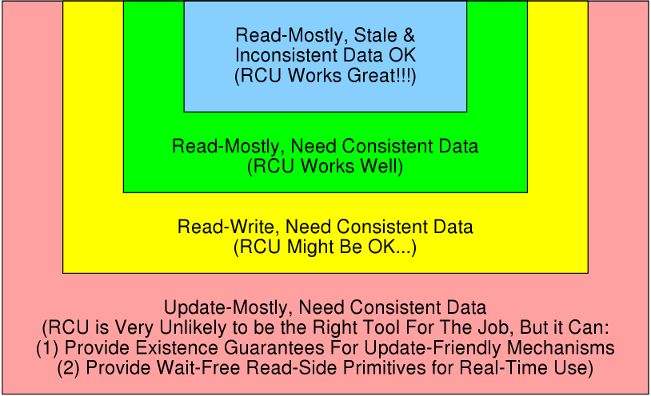
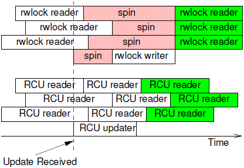
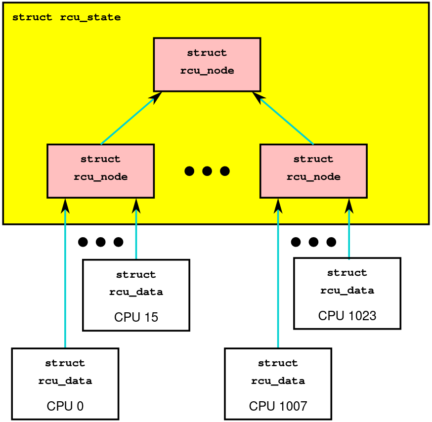

之前有很多场景都是读多写少，而且不怎么需要实时。一直比较好奇应该用什么锁，读写锁总是不满意，最近看6.S081看到rcu，咦，是我想要找的东西。
<!-- more -->

## 水平超低预警

一年前就开始看DDIA和做6.824 Raft 那些东西，不过当时水平太菜了。一直不太敢写并发和分布式相关的东西。并发有很多反直觉的地方，我写出来总是踩坑。好在golang的channel什么的写起来都很舒服。  
一年过去了，自认水平总没有当初那么菜了，鼓起勇气开始写一点关于并发和Go的东西，所以新开了一个分类。（结果发现一年前看的好多东西都忘了。。。记住的好多也是错的。。。）
**这个系列肯定有很多丢人现眼的地方，路过的朋友看到我说的不对的地方请在评论告诉我**

## 用途和概念

### 用途



我们可以用读写锁来保证读取和写入的一致性。在大量读取、少量写入的场景，读写锁的效率会比较低，用RCU可以提高读的性能。使用RCU，读的时候可以不加锁，也不用去管什么内存屏障和原子性了，直接读就完事了。
而且如果写入很少，几乎没有同时写入的情况，RCU的写入速度是很快的，写并不一定比读写锁慢（Grace Period其实很短）



典型场景包括：路由表、DNS查询、内核

>The basic form of such “Pure RCU” designs is as follows:
>1. Make a change, for example, to the way that the OS reacts to an NMI.
>2. Wait for all pre-existing read-side critical sections to completely finish (for example,by using the synchronize_sched() primitive). The key observation here is that subsequent RCU read-side critical sections are guaranteed to see whatever change was made.
>3. Clean up, for example, return status indicating that the change was successfully made

在内核里面主要是处理中断、代替读写锁、订阅发布、代替引用计数等。在内核中应用的介绍可以看文章：[RCU Usage In the Linux Kernel: One Decade Later](https://pdos.csail.mit.edu/6.828/2018/readings/rcu-decade-later.pdf)
下面是一个NMI的例子（不可打断中断应该也不会被抢占，正适合RCU）

```c
rcu_list_t nmi_list;
spinlock_t nmi_list_lock;
void handle_nmi()
{
	rcu_read_lock();
	rcu_list_for_each(&nmi_list, handler_t cb)
		cb();
	rcu_read_unlock();
}
void register_nmi_handler(handler_t cb)
{
	spin_lock(&nmi_list_lock);
	rcu_list_add(&nmi_list, cb);
	spin_unlock(&nmi_list_lock);
}
void unregister_nmi_handler(handler_t cb)
{
	spin_lock(&nmi_list_lock);
	rcu_list_remove(cb);
	spin_unlock(&nmi_list_lock);
	synchronize_rcu();
}
```

RCU在用户态用的比较少，远不如mutex和spinlock普遍。
当然，用户态一般不怎么用这个东西，像数据库那种（用redis上内存用cache硬抗.jpg）

### 概念

reader很简单，就是`rcu_read_lock`和`rcu_read_unlock`。`rcu_read_lock`和`rcu_read_unlock`中间的这一段通常叫读侧临界区 (read-side critical sections)

writer的要复杂一点

## 实现

rcu的实现有很多，比如实时性比较好的srcu（sleepable rcu）、嵌入式用的比较多的tinyrcu、用于CPU核数非常多的tree-rcu；这里只说一下简单经典的rcu实现，其他具体的实现可以去看Paul的文章。
这里大部分都是从lwn那里抄来的，建议英文好的直接看原文：
[What is RCU? Part 2: Usage](https://lwn.net/Articles/263130/)

如果想看详细实现可以去看linux rcu主要作者Paul的文章和书：[Is Parallel Programming Hard, And, If So, What Can You Do About It?](https://mirrors.edge.kernel.org/pub/linux/kernel/people/paulmck/perfbook/perfbook.html)

**Linux对于指针的load和store都是原子的**，所以在链表读取的时候，指针要么指向新插入完成的，要么指向旧的还没被删的链表，不会出现正在修改链表的时候刚删除指针还没来得及插入产生`segmentation fault`。

以链表为例，写入（Write）的时候先复制（copy）一个副本，然后在读取（read）较少的合适时间执行插入操作。当然，我们可以等到完全没有写入的间隙。但是读取（reader）很多一直没用空闲，写入会非常慢；一直都有reader的极端情况会导致一直无法写入。rcu用宽限期（grace period）巧妙的解决了这个问题。

### 怎么知道copy之前的读取全部完成可以reclaim了

我看rcu之前的第一反应是引用计数，当引用计数降到0就说明copy的副本可以reclaim了。但是引用计数效率太低了，而且多核的时候引用计数更麻烦了。

经典的rcu模型是不允许抢占的。当读取完成进入临界区，我们认为这个CPU进入一次**静止状态（quiescent state）**，以下简称QS。linux里面用cpumask来记录这个状态，我们就简单的当成是用一个bitmap来保存每个cpu的状态好了。显然，从bitmap得知copy之后每个CPU都经历过一次QS后，那在copy之前的读操作都已经完成了，这个时候就可以reclaim了。


### 多个writer怎么处理

如果有多个writer，那通常会给不同的writer加spin_lock来处理

### 无锁

无锁是对于读来说的，写入的时候锁比较多。在修改bitmap的时候是需要加锁的（一般是spin_lock）。太多的写入同时对bitmap加锁效率很低，于是就有了tree-rcu。tree-rcu是将不同的CPU状态分组加锁，然后树状结构向上汇总状态。



如果你的逻辑CPU数量（就是你在htop里看到的，比如6核12线程的5600x是12）小于16，那它会退化成单个rcu_node。
tree-rcu详见[A Tour Through TREE-RCU's DataStructures]

多个writer的情况下也要加锁，一般是spin_lock锁。

## 用户态

rcu的实现依赖了很多内核态的东西，移植到用户态比较困难。比较出名的一个用户态rcu是`liburcu`

模仿rcu的思想可以实现一点读多写少的优化，比如`sonic`的map
[如何实现一个超快读的map](https://hanshanglin.space/tech/rcu/)

## 链接

[What is RCU? – “Read, Copy, Update”](https://www.kernel.org/doc/html/latest/RCU/whatisRCU.html) Linux Kernel文档的介绍    
[RCU Usage In the Linux Kernel: One Decade Later](https://pdos.csail.mit.edu/6.828/2018/readings/rcu-decade-later.pdf) MIT 6.828课 RCU的阅读材料，我就是在这个课上看到rcu的，看起来还挺有意思
[Introduction to RCU](http://www.rdrop.com/users/paulmck/RCU/)  
[Is Parallel Programming Hard, And, If So, What Can You Do About It?](https://mirrors.edge.kernel.org/pub/linux/kernel/people/paulmck/perfbook/perfbook.html) 我对于rcu的不少疑惑是看了这个才懂，推荐（本书主要作者Paul也是linux rcu的主要实现者）
[深入理解并行编程](http://ifeve.com/wp-content/uploads/2013/05/深入理解并行编程V1.0.pdf) 上面那本书的中文翻译
谢宝友 深入理解RCU系列文章  
[Linux锁机制：可抢占RCU原理](https://zhuanlan.zhihu.com/p/374902282)
[CPU masks - linux-insiders] linux-insiders的CPU masks介绍（这本书也挺不错的，我好几次查资料翻到，讲的比较易懂）  
[CPU masks 介绍](https://xinqiu.gitbooks.io/linux-insides-cn/content/Concepts/linux-cpu-2.html) 中文翻译  

