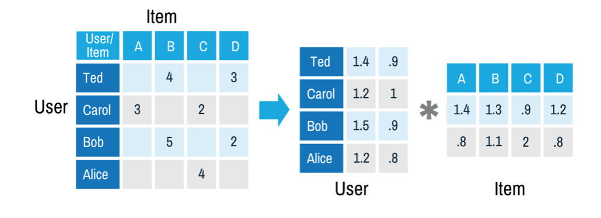

要啥DNN、LSTM、BERT啊，真用起来FM就完事了
<!-- more -->

## 推荐系统的简单模型

在处理文章、记录、电子病历、购物记录等真实数据时，常常将用户和文本对应，用横纵坐标分别代表用户（m个人）和对应的物品、浏览记录（n个），以每个二维坐标的数值代表用户的喜好程度或浏览时长，可以将用户和物品的关系对应表示成一个$m \times n$的矩阵$A$（在推荐系统中通常称为评分矩阵）。这样，在分析不同用户评分或喜好相似程度，不同物品间受欢迎的关联程度等问题都可以转化为矩阵和向量的计算。

假设user对item的打分$\hat{r}_{ui}$由下式决定

$$
\hat{r}_{ui} = q_i^T p_u + \mu + b_i + b_u
$$

其中$q_i$是第i个item对相应的隐向量，$p_u$是第u个user对应的隐向量，$b_i$代表item的偏置，用于解释商品本身的热门和冷门，$b_u$代表user的偏置，用于解释用户本身的打分偏好（例如有些人喜欢打低分），μ是常数。

为了简便起见，这里先不考虑物品的偏置和常数项，简单的将评分视为用户对物品的打分，评分矩阵表示为：

$$
A_{m \times n} = U_{m \times r}V_{r \times n}^T
$$

其中，$U$表示用户对隐含特征的偏好矩阵，$V$表示物品对隐含特征的归属矩阵。



通常，用户数量可能大于几千甚至几万几十万，而电商物品、电影书籍或文章的数量也通常高于几千。一个用户通常会浏览或评论几个物品，此时的评分矩阵是一个维度很大的稀疏矩阵，这时需要用到降维等方法进行计算。（这里将维度简单的视为矩阵的秩）矩阵分解（Matrix Factorization）是一类常用的降维方法，包括经典的特征值、奇异值分解，以及对于奇异值分解的多种改进方法，以及新的非负矩阵分解和概率矩阵分解等新算法。

最简单的矩阵分解是特征值分解，将方阵$A$分解为

$$
A_{n \times n} = Q \lambda Q^{-1}
$$

只要取对角矩阵$\lambda$的前k大的k个特征值，舍弃其他特征值，得到维度为k的近似矩阵$A'$，维度就降为了k。但是实际的数据几乎没有方阵，此时就要用到特征值分解等其他方法。

## 奇异值分解

计算奇异值分解的时间复杂度为$O(N^3)$，不过通常稀疏矩阵的计算中，计算量会远小于$O(N^3)$

评分矩阵$A_{m \times n}$可以分解为

$$
A_{m\times n}=U_{m\times k}\Sigma_{k\times k}V^T_{k\times n}
$$

其中，$U$是酉矩阵，$\Sigma$为对角矩阵，对角元的奇异值为$\sigma_i = \sqrt{\lambda_i}$，其中$\lambda_i$为矩阵$A$的特征值

为了方便，以下分析过程省略矩阵下标。

由于

$$
(AA^T)u_i = \lambda_i u_i
$$

计算$U$可以用$AA^T$的所有特征向量得到

类似的，

$$
(A^TA)v_i = \lambda_i v_i
$$

计算$V$可以用$A^TA$的所有特征向量得到

求奇异值可以使用下面的方法

$$
A=U\Sigma V^T \Rightarrow AV=U\Sigma V^TV \Rightarrow AV=U\Sigma \Rightarrow  Av_i = \sigma_i u_i  \Rightarrow  \sigma_i =  Av_i / u_i
$$

此时矩阵分解的复杂度为$O((max(m,n)^3)$

通常在实际计算时会舍弃很多奇异值，用前k大的k个奇异值来近似估计原矩阵，此时维度降为k

$$
A_{m \times n} = U_{m \times m}\Sigma_{m \times n} V^T_{n \times n} \approx U_{m \times k}\Sigma_{k \times k} V^T_{k \times n}
$$


在考虑用户的偏见和物品的偏置后，评分会更加复杂，损失函数变为

$$
C = \sum_{(u,i)\in{R}}(r_{u,i} - b_i - b_u - u_u*v_i^T)^2 + \lambda(\parallel {u_u} \parallel ^2 + \parallel{v_i}\parallel ^2 + b_u^2 + b_i^2)
$$

其中$r_{u,i}$为包含用户偏见和物品偏置的评分。

当加入了用户对物品的隐式行为，评分变为

$$
r_{u,i} = \mu + b_i + b_u + v_i^T * (u_u + \mid{I_u}\mid^{-\frac{1}{2}}* \sum_{j\in I_u}{y_j})
$$

其中$I_u$是该用户有隐式行为的所有物品集合，而$y_j$是隐式评分电影j反应出的喜好值。损失函数相应的变为：

$$
\begin{equation}
\begin{split}
C = \sum_{(u,i)\in{R}}(a_{u,i} - u - b_u - b_i - v_i^T* (u_u + \min I_u \mid^{-\frac{1}{2}}\sum_{j \in I_u}y_j))^2 \\
 + \lambda(\sum_u(bi_u^2 + \parallel{u_u}\parallel^2) + \sum_i(b_i^2 + \parallel{v_i}\parallel^2 + \parallel{y_j}\parallel^2)))
\end{split}
\end{equation}
$$

对此式的分解算法优化成为SVD++算法，较为复杂，此处不详细推导。此外，还有将时间流逝用户兴趣变化纳入考虑的多种推荐评分的改进版，奇异值分解计算与普通的评分矩阵类似。

实际计算稀疏矩阵奇异值分解的时候，会采用因子机(Factorization Machine, FM)模型或者FFM模型或者交替最小二乘法(Alternating Least Squares)算法加速奇异值的计算。其中，因子机算法在实际商业公司的推荐算法中使用最广。


## 非负矩阵分解

非负矩阵分解的一些算法的时间复杂度效果好于SVD的分解算法。

然而各种看起来没多少优化好的库函数，更不要提什么多线程或者分布式版本，，真用起来自己写一个或者现成的库大概率跑不过原有的模型，所以没太多人用

## 计算相似度

### 协同过滤算法

最老最经典的一个算法了，通过计算相似度给用户推荐兴趣和关注点相似用户的感兴趣内容。

#### 基于物品的协同过滤

（item-based collaborative filtering，ItemCF）
找到物品之间的属性关联，向用户推荐属性相似的物品
设N(i)是喜欢i物品的用户数
相似度：

$$w_{ij}=\frac{|N(i)\cap N(j)|}{|N(j)|}$$

避免热门物品干扰，改为

$$w_{ij}=\frac{|N(i)\cap N(j)|}{\sqrt{|N(j)||N(i)|}}$$

#### 基于用户的协同过滤

（User-based collaborative filtering，UserCF）
找到和用户相似的其他用户，将其他用户感兴趣的产品推荐给用户。还有一种是“购买过XXX等用户也XXX”，算是这个方法的一个变种

计算相似度，N(u)是用户正反馈的集合，N(v)是用户负反馈物品的集合
Jaccard相似度：

$$w_{u,v}= \frac{|N(u)\cap N(v)|}{|N(u)\cup N(v)|}$$

余弦相似度：

$$w_{u,v}= \frac{|N(u)\cap N(v)|}{\sqrt{|N(u)||N(v)|}}$$

余弦相似度用的特别多

## 冷启动问题

等待填坑，利用用户注册信息，人工标注等。
已经弃坑，冷启动这个不太好搞，搞不太定。

## 大众行为/个性化推荐

等待填坑。
半弃坑，没怎么深入做

## imdb电影评论推荐例子

还是用最最经典的那个电影评分抄袭过来作为示例吧，用户的打分

这里使用[movielens数据集](http://files.grouplens.org/datasets/movielens/)，
数据集的rating.csv包括用户id，物品id，评分，评论时间。(这个csv文件第一行是userid，movieid，·····，把第一行直接删掉或者从第二行开始读取，不然会报TypeError: unsupported operand type(s) for -: 'str' and 'int'的错)
使用的算法是SVD矩阵分解。构建一个用户-物品矩阵，每一项的值是评分，这是一个极其稀疏的矩阵
我们导入数据集并分割：

```python
header = ['user_id', 'item_id', 'rating', 'timestamp']  # 用户id，物品id，评分，评论时间

df = pd.read_csv('../data/u.data', sep='\t', names=header)
n_users = df.user_id.unique().shape[0]  #用户数量
n_items = df.item_id.unique().shape[0]  #物品数量
print('Number of users = ' + str(n_users) + ' | Number of movies = ' + str(n_items))
# 数据集分割——训练集：测试集 = 3:1
train_data,test_data = train_test_split(df, test_size = 0.25)
```

建立评分矩阵

```python
train_data_matrix = np.zeros((n_users, n_items))
test_data_matrix = np.zeros((n_users, n_items))
#使用 pandas 遍历行数据
for line in train_data.itertuples():
    #训练集评分矩阵
    train_data_matrix[line[1]-1, line[2]-1] = line[3]
for line in test_data.itertuples():
    #测试集评分矩阵
    test_data_matrix[line[1]-1, line[2]-1] = line[3]
```

计算余弦相似度：

```python
user_similarity = pairwise_distances(train_data_matrix, metric = "cosine")  # 计算余弦距离
item_similarity = pairwise_distances(train_data_matrix.T, metric = "cosine")
```

基于用户和基于物品的协同过滤

```python
def predict(rating, similarity, type = 'user'):
    if type == 'user':
        # 
        mean_user_rating = rating.mean(axis = 1)    #mean函数：压缩列，对各行求均值，返回 m *1 矩阵
        # print(mean_user_rating)
        rating_diff = (rating - mean_user_rating[:,np.newaxis])
        pred = mean_user_rating[:,np.newaxis] + similarity.dot(rating_diff) / np.array([np.abs(similarity).sum(axis=1)]).T
        #dot函数：矩阵相乘；np.abs()：矩阵元素的绝对值  .T:转置
        # print('test',pred.min())
    elif type == 'item':
        pred = rating.dot(similarity) / np.array([np.abs(similarity).sum(axis=1)])
        # print('test2',pred.max())
    return pred
```

```python
item_prediction = predict(train_data_matrix, item_similarity, type = 'item')
user_prediction = predict(train_data_matrix, user_similarity, type = 'user')
print(len(item_prediction))
print(len(item_prediction[0]))
print(np.argsort(item_prediction[0]))
```

计算均方误差

```python
def rmse(prediction, ground_truth):
    # 计算均方误差
    #nonzero(a)返回数组a中值不为零的元素的下标
    #flatten()创建矩阵
    prediction = prediction[ground_truth.nonzero()].flatten()
    ground_truth = ground_truth[ground_truth.nonzero()].flatten()
    return sqrt(mean_squared_error(prediction, ground_truth))
print('User based CF RMSE: ' + str(rmse(user_prediction, test_data_matrix)))
print('Item based CF RMSE: ' + str(rmse(item_prediction, test_data_matrix)))
```

SVD分解的方法，其中k是特征值个数，指定将分解为$m*k$和$k*n$，中间的对角矩阵有k个特征值
>k: int, optional,Number of singular values and vectors to compute. Must be 1 <= k < min(A.shape)

```python
u, s, vt = svds(train_data_matrix, k=500)
s_diag_matrix = np.diag(s)
X_pred = np.dot(np.dot(u, s_diag_matrix), vt)

print('User-based CF MSE: ' + str(rmse(X_pred, test_data_matrix)))
```

参考

[基于矩阵分解的推荐算法](https://lumingdong.cn/recommendation-algorithm-based-on-matrix-decomposition.html)  
[项亮的《推荐系统实践》的代码实现](https://github.com/qcymkxyc/RecSys)  
[谈谈因子分解机模型（FM）](https://liam.page/2019/03/25/Factorization-Machine/)  
