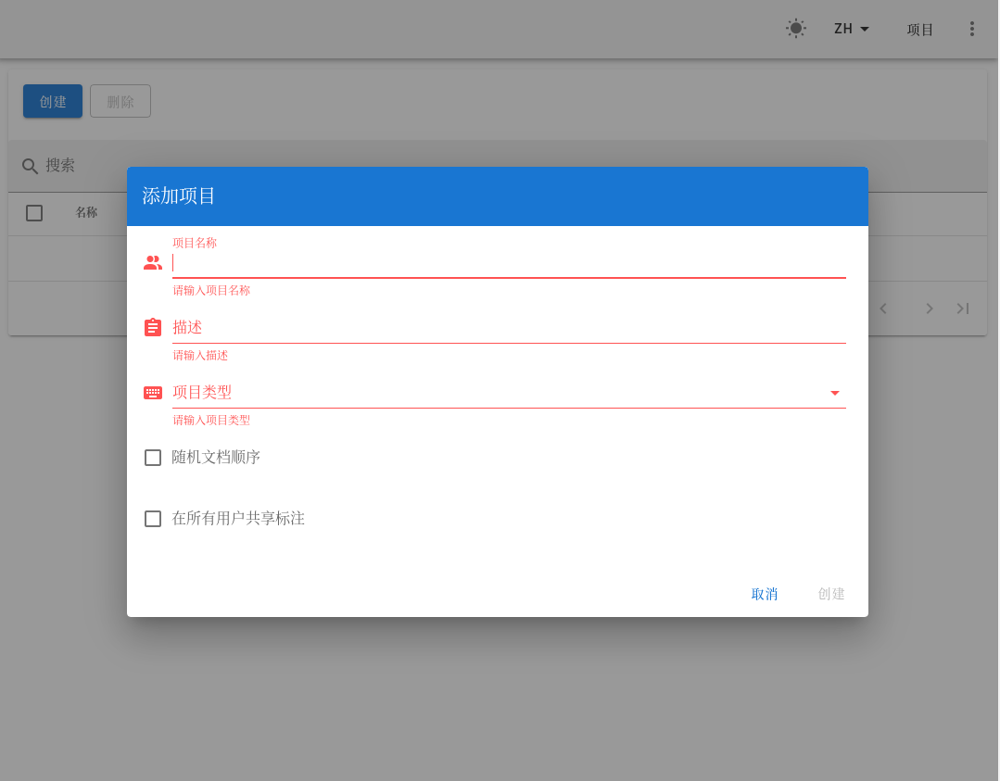

这是鸽了很久的一篇

<!-- more -->

## 老鸽子发言

去年年底还没爆发疫情的时候，润润实习回来说他们那用的标注工具是二次开发的doccano。大家一看确实好，决定用doccano替换之前教研室卖酱N年前拿Flask+jQuery写的

疫情在家的时候找不到什么苦力，教研室集体当工具人标注了几千份电子病历。doccano好用是挺好用的，然而这个东西经常卡顿严重。教研室配置不算差的服务器。
之前想着解决一下这个问题的，然而**又不是不能用**，就一直这么用了下去。当时Django已经忘的差不多了，前端Nuxt.js那一堆东西也不怎么熟。

一年过去了，doccano一直在维护更新，还加了不少新功能、升级了node、Django、python版本。连中文都有了，感动。



然而最近试了一下，更卡了，在issue随便一搜slow，能看到一堆，不过貌似都暂时没有解决。

当时在README的文档里面还有直接运行`django server`和`npm run`的方式，后来就变成Docker了。再后来变成Docker compose了，最后开发环境的搭建也变成Docker compose了。今年年初的时候（据某个师兄说，我没试过）在win10上面直接运行Nuxt前端和Django后端跑在本地没什么问题，也不卡。
之前我直接扔了一个在服务器上就卡，当时以为是教研室上传速度只有感天动地的1M/s校园网在疫情期间连到家里的网速瓶颈造成的。
这几天师兄跟我说他又搞了一个Docker的在服务器上，还是卡。

现在有两种怀疑，一个是Docker Compose的镜像没有精简，另一个是前端加载了太多东西（比如字体资源和一大堆图片还有动画什么的）

现在本地照着官方文档的方式跑一个看看

```bash
git clone https://github.com/doccano/doccano.git
cd doccano/app
pyenv virtualenv 3.8.6 doccano
pip install -r requirements.txt
python manage.py migrate
python manage.py create_roles
python manage.py create_admin --noinput --username "admin" --email "admin@example.com" --password "password"
python manage.py runserver
cd ../..
cd doccano/frontend
npm install
npm run dev
```

安装过程中报错`Running setup.py install for pyodbc ... error`,是个连 sql server 的库，不需要，删了
（如果你需要，在Arch上要装这个包`sudo pacman -S unixodbc`）
同理，`Running setup.py install for psycopg2-binary ... error`postgresql可以直接在arch仓库里面装包`yay -Syu python-psycopg2`

本地看起来没什么大问题

## 字体资源等CDN加载的问题

感觉应该还是那几个资源加载的问题。在`/app/server/templates`里面

```html
  <link rel="stylesheet" href="https://use.fontawesome.com/releases/v5.0.13/css/all.css" integrity="sha384-DNOHZ68U8hZfKXOrtjWvjxusGo9WQnrNx2sqG0tfsghAvtVlRW3tvkXWZh58N9jp"
    crossorigin="anonymous">
  <link href="https://fonts.googleapis.com/css?family=Open+Sans:300,400,700" rel="stylesheet">
  <link rel="stylesheet" href="https://cdnjs.cloudflare.com/ajax/libs/bulma/0.7.1/css/bulma.min.css" crossorigin="anonymous">```
```

前面两个在国内速度可能很慢，可以寻找国内的CDN替代，比如换为

```html
<link href='https://fonts.loli.net/css?family=Open+Sans' rel='stylesheet'>
<link href="https://cdn.bootcdn.net/ajax/libs/bulma/0.7.1/css/bulma.min.css" rel="stylesheet">
```
或者将字体直接删了用系统默认字体。那个cloudflare的CDN移动用户可能比较慢

还有一个`frontend/nuxt.config.js`里面的第25行，Material Icon 的CDN，可以改为`'https://fonts.googleapis.com/icon?family=Material+Icons'`

## Docker的问题？

Docker images没做好是容易出这些问题，然后就看了一下它的Dockerfile

貌似没什么大问题，也没有很多layers之类的会导致很慢的写法。

貌似这个Docker Compose装了一大堆的东西。我用的podman，貌似和docker-compose不一样的地方还挺多的。本地`podman-compose`了一下报错了。不太行。

一上来就装了一个Alpine，正常，然后上来又装了一堆`python3-dev libpq postgresql-dev unixodbc-dev musl-dev g++ libffi-dev`
那个`unixodbc-dev g++`是sql server的依赖，`libpq`是postgresql的依赖

## 链接

<https://github.com/doccano/doccano> doccano的github repo  
<https://zhuanlan.zhihu.com/p/48320901> 几年前的一个doccano介绍  
<https://doccano.github.io/doccano/>  


