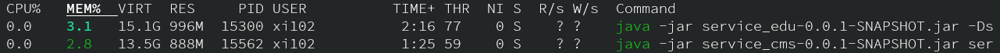
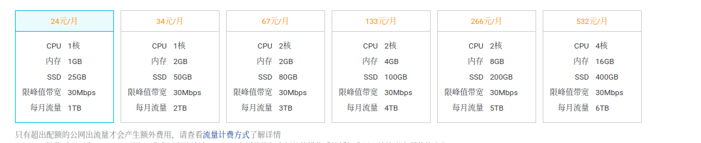
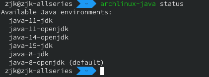
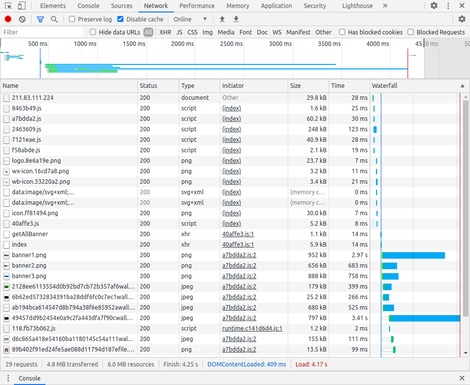
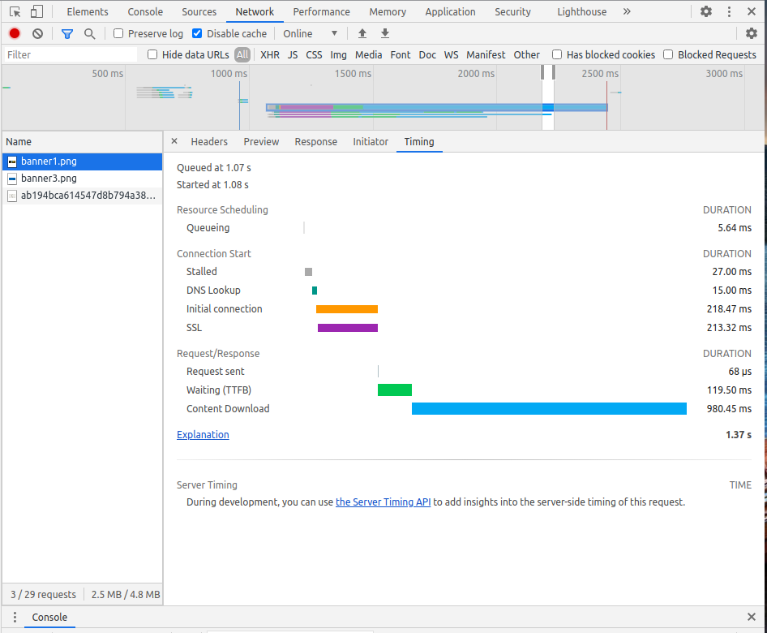

没钱买 256G 内存的服务器的人是这样的

<!-- more -->

其实本来想说Spring Cloud上线性能优化的，想了想不是，这波，这波啊是性能反向优化（性能不性能的已经不重要了，用户量应该也不太大，先把成本压下来再说吧）。

## 怎么回事

朋友们好啊，
我是浑元形意太极门掌门人马保国。
刚才有个朋友问我：
“马老师发生肾么事了？”
我说怎么回事。给我发了几张截图。
我一看！哦，原来是昨天，有两个微服务，
上线一天，一个内存**996M**，一个内存**888M**。

~~其实是我调了一下凑出来的这两个数~~
它说要吃一点资源，我说可以。
诶，我一说它“啪”就站起来了，很快啊！
然后上来就是，一个虚拟机，一个Docker，一个mysql，我全部防出去，防出去了啊。
防出去以后，自然是，上线部署以点到为止。没有限制它内存。
我笑一下，准备收工，因为这时间，按传统部署的点到为止，服务器已经够用了。我收工的时间回宿舍啦。
它突然袭击，还有8个微服务，来打我机子，啊。我大意了啊，没有闪。
来，抢！来，偷吃，我DDR3的，老内存，这好吗？这不好。
它说它是乱占用的，它可不是乱占用的。一个996，一个888，这明显是，有备而来！

## 服务器

正常的操作是加钱上大一点的内存，但是大内存VPS、杜甫它贵啊。以套路云香港为例，明晃晃的抢钱。而且16G内存及以上的版本已经无了。其他华南华北的VPS更贵一点，而且全都是1M小水管。



~~服务器内存比本地台式还小是要出大问题的,上线炸内存警告~~

102网吧里面服务器是有32G内存的，然而网速.....

服务器的套餐是学校20一个月20M的普通套餐（20M是下载速度，要想对外服务，上传速度可能只有几M）同为校园网。而且你电的教育网会有各种小问题，比如逢年过节十一国庆公网IP就被信息中心收回去了、校园网出口线路很差、域名也不好搞。

加钱换校园网的套餐也没用，你电沙河主楼的网速我很少见有人跑出过100Mbps以上的。而且问题是主楼那个墙里的网线，貌似是百兆网...教研室的老交换机上面还赫然贴着一张2010年的封条。。。

VPS的话选Debian，根据我多年用128M-1G内存VPS灵车漂移的印象，占用资源最少的少的就这个了（CentOS占用>Ubuntu Server>Debian>VSP2ARCH）

~~其实我很想VPS2ARCH再次灵车漂移，但是毕竟是要出事背锅生产环境我不敢~~

## 考虑扔掉Docker

直接裸跑吧，不要再套几层了。

## 其他能扔的

### Redis

这么点用户量没啥缓存的必要，关了

### NACOS

动态注册发现之类的单机版也没必要用了，直接手动排查和维护吧。

NACOS的内存占用单机版在几百M左右（默认参数是`-Xms512m -Xmx512m -Xmn256m`，可以在startup.sh里面改，不过还是直接关掉比较清静。


## JDK版本

之前一直用的java8-Openjdk。

后来看到据说 Oracle JDK 和 Open JDK 有性能差异，不同版本的jdk也有性能差异，java 8 的64位版本和32位版本也有区别（据说不超过2G内存的情况下貌似32位会好一些）

那就都试试吧。在Arch上打的jar包，就在本地测试了一下，没在服务器上试。

### 不同版本内存占用

Arch有个脚本，可以切换OpenJDK的版本，



Oracle JDK 由于甲骨文公司不武德，跟各路开源组织（以及很多闭源福报公司）都闹僵了，Arch仓库不提供支持，得自己安装。

从AUR安装结果报错说`**==> ERROR:** **Failure while downloading manual://jdk-8u271-linux-x64.tar.gz**    **Aborting...** error downloading sources: jdk8`，看了一下还得跑到[Oracle](https://www.oracle.com/java/technologies/javase/javase-jdk8-downloads.html)那里去注册下载然后pkgbuild

从阿里云的镜像可以不用注册下载[jdk8](https://code.aliyun.com/kar/ojdk8-8u271/raw/master/jdk-8u271-linux-x64.tar.gz)和[jdk11](https://code.aliyun.com/kar/ojdk11-11.0.9/raw/master/jdk-11.0.9_linux-x64_bin.tar.gz)，然后扔到`~/Downloads`里面，再运行`yay -Syu jdk8 jdk11`就好了。

java8 和java11 的编译通过了，看起来Oracle JDK效果是要好一点(也只有十几兆的微弱差别，感觉区别不大)，java14和java15还没试，以后有空再说。

### 32位和64位的差异

试了一下java8的32位和64位，貌似有一点区别，32位是节省一点资源。大概差距也在十几兆左右，区别不太大。

## JVM调参

大概调了调，冲着压榨内存占用调的

几个比较重要的参数：

- -Xms
- -Xmx
- 

暂时把参数改成这样子了：

```bash
java -Xms16m -Xmx32m -XX:MaxMetaspaceSize=48m -XX:CompressedClassSpaceSize=8m -Xss256k -Xmn300m -XX:InitialCodeCacheSize=4m -XX:ReservedCodeCacheSize=8m -XX:MaxDirectMemorySize=16m -jar service_ucenter-0.0.1-SNAPSHOT.jar
```

不太敢压榨的太狠，怕上线了OutofMemory。

现在每个jar包跑起来大概内存占用在300M以下。

## 压缩MySQL内存占用

MySQL的内存占用压缩一下还是很低的，之前还在用wordpress的时候128M内存的灵车VPS跑起来没什么大问题。

## 图片压缩

浏览器F12 可以看到，在加载首页的时候，大部分html、css、js资源在300ms内加载完成，500ms以后开始加载图床资源，一直到最4000ms以后才加载完成。



下图是打开首页时png图片（阿里云图床，大小 926k）的时候的加载速度，耗时最长的就是下载图片的过程。



主要就是压缩图片大小了，jpg和png全换成webp，今年6月份Safari14已经支持webp了，现在主流浏览器都问题不大。

## 重构

暂时不考虑，不过上线的时候砍掉几个无关紧要的功能倒是问题不大，这样只开4个微服务就差不多能用了。

## 最终结果

如果不跑别的东西，一个4G内存的VPS已经够用了。


## 参考

https://developers.redhat.com/blog/2017/04/04/openjdk-and-containers/

https://blog.kelu.org/tech/2018/05/30/running-a-jvm-in-a-container-without-getting-killed.html

https://www.cnblogs.com/ityouknow/p/5610232.html

https://github.com/flyleft/tip/blob/master/blog/springboot%E6%80%A7%E8%83%BD%E8%B0%83%E4%BC%98.md

https://medium.com/@yortuc/jvm-memory-allocation-in-docker-container-a26bbce3a3f2