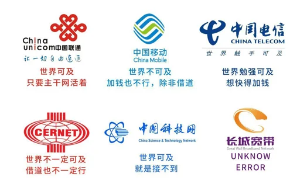
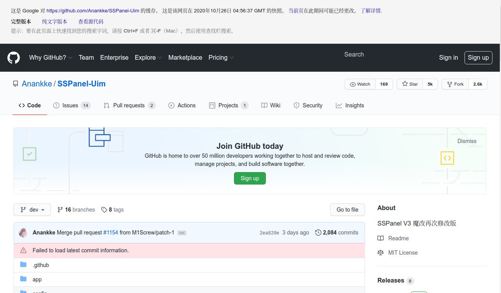
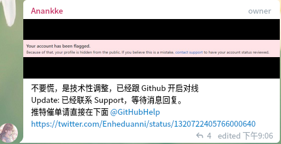

长安夜半秋，风前几人老

<!-- more -->

本文尚未完成，这两天教育网CERNET出口突然大面积炸了（现在好了）。据群友和论坛等反应来看长城这两天也突然变高了，于是这个提前丢出来，各位看官轻拍

## 前言

距上一篇网上冲浪指北已经过去一年了，感觉当年那篇写的乱七八糟。去年正值七十周年，教研室其他人的云梯全断了（当时他们不管是机场还是自己拿VPS搭的都还是ss和ssr, 没人上v2ray和Trojan，被一波带走也不奇怪），就我的苟住了（当时我还是自己搭的，TLS套了一层cloudfalre）。当时写的时候也是随手写了一个，颇为潦草。
后来发现那篇的点击量居然是我博客从wordpress换到hexo以来搜索和点击量最高的，惭愧。

一年前那个写的很乱，后来陆续又更新了几次，就更乱了。一年多了，虽然今年国庆很平静，现在的形势看起来也不是很太平。7月份的时候trojan-qt5作者停更，客户端最后一个版本停留在了1.4.0（目前原作者删除了），这其中有喝茶的原因，也有一些学业等不方便透露的原因。

那些辛苦写工具写协议的贡献者们基本上结局都不很圆满，我先后看到一个又一个大佬不敢接受一分钱捐赠最后还要被喝茶（还要被issue里部分理直气壮的伸手党和白嫖当气到），同时一堆跳梁小丑和黑心机场赚的盆满钵满。

> 杀人放火金腰带，修桥补路无尸骸

我的网龄算起来也很长，不过当年上网都是泡泡论坛什么的，小的时候基本感觉不到墙的存在。当时包括谷歌在内的网站都可以直接上的，甚至小学的微机的课本里还有教你打开浏览器访问谷歌这样的内容，当时我翻墙是翻学校的围栏和小区的围栏（迫 真 翻 墙）。后来初中和高中也没怎么留意，就只按论坛上教程改了改hosts什么的，后来好像下了蓝灯还是什么。那个时候也没什么感觉，当时上维基百科偶尔查查资料都是能直连的。本科之后就用教育网了，虽然不能直连Google，但是城墙低到形同虚设。

所以我和长城较劲的经历很少，开始有点认真的对付长城始于本科和宿舍移动宽带的墙中墙和Qos斗智斗勇。所以这篇指北是真的指北，夹杂了大量的道听途说内容和我没亲自试过的内容。

### 对于本文和本人的说明

本人非通信、网络工程、网络安全科班出身

本人当年学的信息论、计算机网络、通信原理已经差不多忘光了

本人没有系统性学习研究过密码学和网络安全的内容

所以本文会有很多错误（没办法，本人水平很菜）

本文讲的很浅，还很啰嗦，所以大佬请直接离开

各位看官如果发现本文的弱智错误，还请指正

本文没有任何对于如何使用、如何搭建的详细教程，寻找保姆级教程的客官请去别处

本文没有机场推荐、VPS推荐或杜甫推荐，也没有可供白嫖的

本文不是网上冲浪指南，搜索如何越过障碍网上冲浪的朋友请绕行

本人宿舍里没有水表、没有快递、没点外卖、也不喜欢喝茶（尤其是红茶）

不谢邀，本人人在航母，刚下蒙古

本文可能会不定期更新，更可能因为懒直接咕了

本文夹杂大量个人主观判断和个人情绪以及无端暴论

本文不打算讨论太多社会问题、法律问题和政治问题

本文借鉴、参考、抄袭了网上的很多资料和文章，本人尽量注明出处，如有侵权，本人立马删除并置顶道歉

本文开放转载，转载不必注明出处，也不必署名

## 主流协议及方法

### 目前能用的和勉强能用的

#### Shadowsocks

shadowsocks, 这个不用我多说了，实在太经典了，客户端是一个小飞机的样子，因而一些提供ss代理的服务商也被称为机场。就像VPN一度成了翻墙软件的代名词，机场成了所有提供代理服务商的代名词，今日仍有大量shadowsocks机场存在，那些提供其他协议订阅连接的商家都被成为机场。

clowwindy是一个值得尊敬的人。

后来的事情不提了，唉。

#### Trojan

原理类似于v2ray的ws+tls，作者大火酱 性能比v2ray的TLS要好一点。目前看来比较稳的一个（主要是几乎没有什么机场在大规模使用）
当时Trojan只有几百star的时候就被人安利过，当时好像性能比v2ray上TLS好一点，也更加轻量。当时拿自己的VPS搭了一个，试了一下发现确实好，然后十分尴尬的发现好是好，没找到安卓客户端。。。
转眼间Trojan都三年了
现在Torjan都几万个star了，客户端也基本都有了，安卓SSRRAY、ios小火箭都支持了Trojan、Trojan-Qt5还成了支持协议众多全家桶一般的最强客户端（风头太盛被盯上，甚至7月被喝茶）。
（大火酱和奶爸（小火箭开发者）还有过争吵，见[电报](https://telete.in/s/trojan_gfw?before=53)）
有一个[Trojan-Go](https://github.com/p4gefau1t/trojan-go)的Go语言实现，看起来不错，可以一试。

#### V2Ray

（V2Ray的写法是V2Ray，但是我懒，经常顺手写成v2ray，希望大家不要学我）

最开始是抗议shadowsocks作者喝茶的一个项目，全家桶一样支持了很多协议和功能，不过后来v2ray的作者也喝茶了

#### naiveproxy

这个应该比较稳的，模仿chrome正常访问网页

安卓等设备没有好用的客户端

#### Surge

不开源，只能Mac/iphone

#### SSH端口转发

很早很早流行的手段，只要一个VPS即可（不过我当年根本没用过，流行的那会也在上高中）

后因特征过于明显被墙橄榄

#### 境外电话卡

除了贵没有其他缺点

#### tor和I2P

慢，想要快一点需要前置代理。
除了对隐私要求极高的人士，不推荐作为日用刷网页看视频主力，在对tor不友好的网站访问体验极差。

### 差不多凉了的

#### 改DNS和HOSTS

早年间常用做法，我还在上高中的时候这样干过
后来随着长城升级基本上不行了。
不过这种简单的方法在某些时候还是有用的，比如某些教育网或部分ipv6墙很低的场景，某些漏网之鱼的网站和服务器。

#### GoAgent

也是很早的东西了，当年也比较流行的一个东西，虽然带了个Go字，是python写的。（怎么感觉早些时候好多翻墙工具都拿python写的，现在一大堆用Go写的）。当时是利用Google App Engine的服务器进行中转。

后来作者被水表（被捕那种大水表），停更。外加后来墙增高，几乎把谷歌的IP全橄榄完了

后续有GAEProxy, XX-Net等项目继续维护和更新。

XX-Net至今仍在更新，救急可以用。在有ipv6的教育网依然坚挺。

#### SSR

SSR这个项目及其作者本人都挺有争议的。

#### VPN

好吧，当年的

当年最流行的翻墙手段，流行到以至于VPN等同于翻墙工具的代名词。
不是专门用来翻墙的，特征过于明显，墙升级后基本凉凉

#### WireGuard

> 说WireGuard是一件艺术品的，大约是没有体验过中国的防火墙；又或者他是在自黑，因为艺术品通常是没有使用价值的。
>
> ——victoria，v2ray

18年刚出来那一阵跟风试过，那会中文资料都没几篇，客户端也不存在，win10和Mac也用不了，Linux对Linux。当时还没有被墙盯上，速度极快，也不会被Qos（比v2ray开了bbr和mKCP都要快）。后来客户端、win10版陆续推出，用的人也多了，凉凉。

特征也过于明显，被墙盯上后基本凉了。

另一个问题是wireguard这种VPN一类的东西直接虚拟网卡，不好分流，不过后来陆续有了不少方案。

比如安卓的tunsafe支持分应用代理,ios的Blatu也支持wireguard分流，还有这个项目[auto-add-routes](https://github.com/lmc999/auto-add-routes)，在win10上的分流,神奇的使用不断删除和更新路由表来达到这种效果。
或者整一个路由器，在路由器先分流，分流之后走wireguard。

#### MTProto

Telegram开发的协议，现在貌似除了电报也没大有别的程序在用
特征过于明显，被墙盯上基本凉了。在封锁不严的时候可以用。

### 一些客户端

目前市面上的客户端多如牛毛，好用的不是很多。随手一搜可以搜到很多收录和总结，比如[这个](https://ausers.github.io/)。

当年VPN时代的翻墙软件，基本一个软件一个客户端，这里直接略过。像Surge那样的专有协议的这里也不多讲了。Mac我没用过，windows我已经全格了装Linux了，当年在win10下面就用过点小飞机和.net写的v2rayN，我当时用的时候作者2dust更新还非常勤快，现在貌似不怎么更新了。这么算起来我是用过的真没几个，没用过的东西不好推荐和评价，这里说几个用过的还不错的。

#### Qv2ray

Qt写的，支持协议很多、更新非常勤快、颜值也不差、贡献者全员用爱发电，个人心目中目前Linux上最佳客户端（不是，Linux一共也没几个好用的客户端

可能是继Trojan-Qt5之后最全家桶的一个

配置选项很多，很多高级功能可以手动编辑（比如高级路由配置）、修Bug很勤快，~~Arch安装qv2ray-dev-git测试包可以体验天天被推送更新Bug的感觉~~

win10版和Mac版没用过不评价。

#### ios小火箭

ios上著名的小火箭shadowrocket售价三美元。比很多动辄十几美元几十美元的客户端好多了。貌似作者拿lua把那些协议都实现了一遍。后台占用和耗电不是很高，感觉体验比绝大多数安卓客户端要好不少（废话，好歹是个付费软件

ios另一个好用的客户端是Quantum X,不过要贵一点。

#### SSRRAY

全称shadowsocksr-v2ray-trojan-android，安卓下的全家桶，支持Trojan等协议。

### 其他的工具

#### gost

Go写的安全隧道，大概能干些端口转发和内网穿透之类的事情。很多人拿它来做国内中转。

如果你用v2ray之类的已经有一层加密的话，国内中转可以直接用端口转发（直接iptables就完事了）。如果你用裸ss（性能会好一点），中转的时候可以用gost的加密功能。

#### proxychains

用于给终端挂代理

#### SwitchyOmega

网页代理切换。之前微软应用商店还出过一次李鬼事件

#### clash

一个Go写的东西，支持自动测速和切换线路等。

目前很多机场会给clash的订阅链接，客户端好多都是electron的（反正后台占用挺高，而且客户端操作逻辑有点别扭），自建就没必要上这个了

#### 订阅转换

机场和你客户端的订阅格式不一致时可用订阅转换工具进行转换

<https://github.com/tindy2013/subconverter>

#### 全局代理

tun/tap和tun2socks over ws/tcp/tls等

或者用wireguard over ws/tcp/tls/vmess等

#### 一键脚本

有很多人写了很多好用的一键脚本，比如秋水逸冰等人。其实不太推荐你们用一键脚本，用一键脚本好歹也改改端口，一键脚本都用2333端口这么明显真的吗好。

一些VPS的检测脚本倒是可以用用，节约大量时间，比如[这个](https://github.com/oooldking/script/blob/master/superbench.sh)

### 一些折中方案

很多时候翻越长城的目的并不是获得完整的World Wide Web访问能力，突破封锁穿越长城的意愿也不强烈。

只是上维基百科查个资料、上某hub下点东西，或者用用谷歌学术上上sci-hub什么的

这个时候我们有很多的镜像和反代网站，当然还有很多视频搬运工和字幕组。不得不说墙养活了

#### 反向代理的网站

（很多反代都是薅cloudflare或者aws之类的羊毛

你可以找到维基百科、谷歌、Github的众多反代。比如 <https://fastgit.org/>

#### 镜像站

大部分镜像站同步远程资源到本地服务器，然后在本地服务器给大家提供服务，比如清华的tuna。不过也有一些是反代，比如[tuna的AUR](https://aur.tuna.tsinghua.edu.cn)反代

清华、中科大等镜像站已经同步了不少镜像，速度也还行（在教育网下，其他的线路我很久没试过了）。PyPI、npm包和Docker仓库这种数据量很大的也都有镜像。

#### 下载

我很惊奇的发现大多数新生代网民已经不知道BT种子、ed2k为何物了。好吧，不少人也不知道多线程下载和断点续传的工具了，只会在浏览器里点下载。（好吧，还会找百度云）

很多有BT或者PT种子的下载没必要挂代理（而且很多机场或者VPS商不欢迎你跑BT之类的东西）。反正速度比直接从国外网页点击下载或者百度云资源快。是时候温习一下早年拨号上网时代开放共享的风气了，记得留种做种哦（以及屏蔽吸血雷）。

怎么说到真网上冲浪去了，扯远了扯远了

#### 改改DNS

很多时候不是翻墙就能解决网速慢的问题，不少时候是你的DNS给你把网址解析到一个网速不怎么快的IP去了。这时候改改DNS和HOSTS。一般能选国内的就选国内的，其他的李加坡之类的线路也会快一点。

<https://github.com/badafans/better-cloudflare-ip>

## 服务商、运营商和线路

>世界加钱可及

直接从reddit偷了张图，来源[2020梯子现状](https://www.reddit.com/r/GFWatch/comments/gzg8sz/2020%E6%A2%AF%E5%AD%90%E7%8E%B0%E7%8A%B6/)


### 运营商

> 墙和墙的体制不能一概而论



移不动、联不通、奠信、~~长城宽带~~、教育网的墙差别很大。不同时间的差别也很大。当年我曾经在图书馆直接教育网上谷歌，回到宿舍跟移动搏斗，每次回到宿舍都有点抓狂。

当然了，长城在不同的时节还会有不同的风光。每年的几个特殊时间，比如十月一，会严一点，去年这个时候ss几乎全没了。大多数时候你不把带宽拉满，基本上ss没什么问题的（他们应该知道你在干什么，只是没管）。

出国最好的线路当然是CN2和IPLC了（不考虑教育网CERNET这种某些学校能直连上谷歌的特殊存在的话）。这里面水也比较深，请酌情自行选择。


### 服务器厂商

>不建议无 Linux、基础网络知识及 NGINX TLS 配置经验者自行建立服务器。
——大火酱，Trojan

这部分好像没什么说的必要:爱折腾的人自己早就搞定了，也不会跑来看我这篇没什么营养的水文;不爱折腾单纯想要个游戏加速器、上个Netflix的话呢，应该在开头就被我劝走了。

不过万一有人翻到了这里还想看我聊一点呢，所以还是聊一点。

对于大部分人来说，现在的市场行情，如果你用VPS不在上面挂其他脚本和服务、不跟人合租、不是用信用卡白嫖、不是价格巨便宜的灵车，那你买一个单纯用来翻越长城的性价比元低于直接上机场。如果你有看高清Netflix需求、FPS游戏加速低延迟需求，也建议你直接找机场算了。

服务商提供的服务包括独立服务器（除非你要干大事啥的，否则应该用不到，有的所谓独立服务器是可能假的），云服务器（只有AWS等少数几家算得上是真云服务器，好多号称云服务的东西也是假的），VPS（存在着不少超售的情况），以及各种灵车（十块钱一年的灵车你还指望啥，别跑路就行）

有钱有需求上独立服务器和云服务的人应该不会来看我在这胡扯，要上灵车的勇士应该也一样，而且灵车的行情变化实在太快了，所以只讲VPS吧。
Virtual Private Service，不是灵车的通常最低行情在一个月5美元左右，偶尔有2.5美元的。
（有外币信用卡什么的可以上AWS，这个教育网出口速度很快，自动化工具也很好用

VPS主要有KVM和Xen的。对，KVM就是你Linux开虚拟机用的那个东西，比如DigitalOcean、AWS什么的。早几年很多用Xen的，后来好多都换KVM了。这两个用起来基本差不太多（注意某些厂商可能用Xen半虚拟化超售）。（有些服务器厂家喜欢号称VDS（Virtual Dedicated Server），尤其是毛子那边，实际上跟VPS没区别，大概率超售）

一般杜甫可能会给多个公网IP，而VPS基本只有一个，有的很便宜的VPS可能会用NAT,你要跟别人共享IP和带宽

主要留意那种用OpenVZ的黑心厂家，基本灵车专属，大概率超售严重，还有各种限制，比如不能开Docker，由于共用内核啥的很多地方你也没法魔改。不过如果价格足够便宜，仅仅当梯子用倒也没啥问题。

另外多说下灵车，小白不建议上灵车，太容易翻了，我已经看到好几个小白贪便宜翻车了。上灵车前请做好功课，简单了解一下灵车商家的套路。不愿意多了解就记住一句话，只要上车早，放心漂移。不少灵车是那种只支持年付或者半年的（跟某些跑路理发店的年卡和健身房的年卡差不多），等到半年或者一年的时候，骗一波新老用户充钱，然后你懂的。所以上车要趁早，开了半年的灵车商家就不要上他们的车了，价格再诱人也不要上。
（不过一些年付十元的灵车倒是可以用来作为一个备用救急线路

还有一些国内的服务器，用来做中转。不过国内的VPS都比较贵，而且套路云和良心云都要备案。只是做中转的话，可以买NAT的VPS，市场价为在一个月。

### 机场

有FPS游戏加速器需求或者Netflix看视频需求的建议直接找机场

#### 开，开个机场？

那如果你想开机场呢？首先最好你人在国外或者已经了解过刑法了。当然你最好先去hostloc之类的论坛转一圈探探风声，要是看到严打还是不要顶风作案了。确认问题不大，如果你手里囤了不少小鸡甚至杜甫想回回本，或者如果你生活拮据想赚点零花钱。建议这之前先去找一家机场试用一下，看看他们的运营方式、使用条款和套路。（没吃过猪肉总得见过猪跑啊）这时候你大概率会发现开机场的门槛是如此的低，机场主的水平居然也能如此之低。（毕竟风险太高，技术水平稍微高一点的都去996修福报了）

真要开的话，首先去找个一键脚本，机场也不用讲究，ss裸奔就完事了，ss的脚本最多了，什么多用户管理和流量控制都有人帮你写好了。 然后你要搞个网站，随便整个域名就好了，然后拿别人的模板改改（难道你没发现好多小机场的界面都一样吗，对，都是ss-panel魔改的）。然后你就可以去找一些小鸡来，如果你要开黑心机场就用月抛机好了，多整几个国家的节点。稍微良心点就搞些cn2线路或者国内中转。

然后是一些服务条款和规则，这个直接抄别家机场的就好了。如果生意实在太小也可以不要什么条款。但是一些过滤规则和限制还是要的，什么，iptables太复杂不会？没事，sspanel的审计规则可以直接添加，正则表达式的明文数据包匹配哦。网上好多模板都弄好了，想自己定制改改正则就行了。（所以你知道为什么好多小机场都用ss裸奔了吧）

你可能需要屏蔽BT下载（客户拿你这下盗版触犯欧美地区严格的版权够你喝一壶），360等大流氓（废话），zz网站（废话），滥发邮箱（可以批量注册的免费邮箱全ban了），比如下面这个针对360的

```regex
(.*\.||)^360|0360|1360|3600|360safe|^so|qhimg|qhmsg|^yunpan|qihoo|qhcdn|qhupdate|360totalsecurity|360shouji|qihucdn|360kan|secmp)\.(cn|com|net)
```

最后是收款方式，支付宝肯定风险很大，但是有BTC、外币信用卡和paypal的应该没几个人会贪便宜来这种小机场。都弄好了你就可以开始推广坐等~~收钱~~入狱了。

##### 另外

> 机场的灵魂是线路而不是协议（确信）
>
> 在做协议的看来，协议越安全越好
>
> 在用户看来，速度越快、效率越高越好
>
> 在机场看来，能卖更多钱更好

也就是说，再隐蔽的协议其实都不适合大规模共用代理而适合自建

> 因为对于使用者，关键参数（域名，端口）是透明的
>
> 维护墙的人其实只要买个订阅然后手动拉黑订阅地址和节点就足够了（

#### 所以你会选机场了吧

有上面那些典型特征的尽量避开（最重要的是不要贪小便宜，加钱，多花点钱生活更美好）。

不过既然你加钱了，如果你没有游戏需求和Netflix等需求，其实还是自己买一个VPS比较好。大一点的服务商基本不会禁你的BT，也不会偷偷记录你的访问记录日志，魔改内核什么的也随你折腾。

## 安全、速度、价格

这三个里面最多选两个

>别看你今天白嫖欢，今后早晚拉清单。白嫖党没有好果子吃，日志是记在那的，早晚是要应验的。

### 穿墙、不被窃听、匿名

这三个都选也行，但是要加钱，只要钱管够。
在预算成本有限的大多数时候，不易被墙识别和传输加密(不被窃听)通常是矛盾的。

纯裸的TCP肯定没有VPN以及tor之类的东西安全，但是后者就容易被墙看出来（这些东西实在太拉风太引人注意了）。折中一点的方案是外面套一层TLS什么的，不过速度会慢一点。v2ray的ws运气好能跑到500Mbps甚至1000Mbps，但是套TLS就慢不少（很多地区会被Qos）

### 反正永远不要贪小便宜

> 天上不会掉馅饼

总有人爱贪小便宜，像什么一年十刀甚至五刀的VPS灵车啊，每日签到免费用的机场啊，不知道从哪搜集来的免费ss啊，甚至跑去用轮子的东西的。像Tuber浏览器，老王VPN这种看起来就像钓鱼的软件请及时远离，看都不用看。
当然有些人就是喜欢用隐私换取便利，开心就好（彦言宏语）

### 注意某些国产流氓（以及非国产流氓）

号称安全的国产流氓软件不要在网上冲浪时使用，对对对，就那个什么数字安全浏览器。

当然其他几家也不是什么好人，比如[我与腾讯游戏安全团队争论《ROE》内嵌安全插件搜集SS配置事件的始末](https://medium.com/@hackl0us/关于我和-无限法则-搜集ss配置事件的始末及观点-59ab3c638748)

非国产软件，也.....反正小心一点。

这不是重点，扯远了，如何保护个人隐私和安全问题请去看别的介绍和教程

## 关于长城

由于本人水平实在有限，这部分可能有很多错误，也不会仔细讲，有兴趣请看其他文章和论文。

墙在十几年来跟梯子和打洞人的搏斗中不断升级，跟十年前相比已经高了很多。

十年前的时候还是论坛的和贴吧兴盛的时代，饭否刚刚停掉开放注册，新浪、搜狐、腾讯微博还没有兴起，也没有微信公众号这种封闭的鬼东西。论坛和一些独立网站在当时还人声鼎沸，非常热闹。（说起来我还见过方校长，当时他到我们学校开讲座来着，我呆在后排不起眼的座位静静的听完了。方校长看起来起色尚好，同学们有至少一半觉得建墙很有必要）

后来有一个西厢计划，研究了一下长城并给出了一些办法，后来墙陆续把洞堵上了。

西厢计划的简介可以看https://blog.youxu.info/2010/03/14/west-chamber/和http://www.chinagfw.org/2010/04/gfw.html

早期墙的措施基本是DNS污染，后来加入了主动探测和深度包检测。

再后来有了SNI阻断和IP黑洞什么的。有些人用ESNI，最近ESNI不幸被封杀了（准确的说，是使用ESNI+TLS1.3的流量）。

陆续有过域前置等方法的尝试，比如[这个](https://steemit.com/cn/@v2ray/sni)，不过目前非常积极支持ESNI的浏览器也就Firefox了，chrome表现的非常不积极（毕竟谷歌靠广告恰饭的嘛了，这种保护个人隐私的事都不怎么积极，当年支持DoH的时候也不积极）

### 一些相关文章和频道

1. http://gfw.report/ 这里面的文章都挺好的，值得一看，比如[揭示和规避中国对加密SNI（ESNI）的封锁](https://gfw.report/blog/gfw_esni_blocking/zh/)
2. https://t.me/anticensorship_epics Qv2ray维护的频道
3. https://blog.cloudflare.com/zh/esni-zh/ cloudflare关于ESNI的介绍

## 外传

### 关于法律

这里不打算多讲法律问题，比较详细的讨论可以看《个人使用vpn"翻墙"是否违法？——基于规范性法律文件、案例以及相关计算机技术的分析与讨论》，网上到处都是，一搜就有。

### 一些事件记录

#### SSPanel维护者Anakke的Github帐号被封

2020年10月27日


前一天还在的



作者表示他暂时没事。



前几天youtube-dl也被DMCA橄榄了，说实话我对微软治下的Github有点悲观，当然作为一个代码托管网站肯定会更好的，但是作为一些法外狂徒（各种意义上的）的庇护所就.........

## 真网上冲浪环节

上面扯了一堆跟方校长对线的东西，现在正经说一点网上冲浪的东西吧。

下面这些东西环境以linux为主，win10我很久没用了，Mac只装过一周的黑苹果，FreeBSD和UNIX完全没用过。

### 一些网络工具

| 工具            | 简介                                                    | 注                                                           |
| --------------- | ------------------------------------------------------- | ------------------------------------------------------------ |
| iptables        | 用的最多的防火墙                                        | 功能非常多，命令选项也非常多，我也不太熟。新手请用UFW。      |
| Wireshark       | 抓包工具，终端请用tcpdump                               | 这么有名的东西有什么介绍的必要吗                             |
| nmap            | 探测扫描端口啥的                                        | 我可没用它干过坏事啊，真的没有                               |
| netcat（nc）    | 功能选项相当多的网络工具                                | 我也没用它干过坏事，我是良民，反弹shell是什么我不知道啦      |
| ipcalc& sipcalc | 命令行里面的子网掩码等IP计算工具                        | ipcalc有不少中文介绍而sipcalc基本没有，不知道为什么          |
| httpie          | 命令行里的http client                                   | 自带格式化、html和json语法高亮                               |
| curlie          | 语法跟curl兼容                                          | 带高亮等功能                                                 |
| besttrace       | traceroute的增强版                                      | ipip.net开发的能显示地理位置的东西                           |
| iperf           | 网络性能测试，包括带宽和丢包啥的                        | 请装iperf3，功能多一点                                       |
| mosh            | ssh替代品，适合较差网络条件下使用、支持IP变化后自动重连 | 用的UDP、这个东西貌似好几年没更新了                          |
| putty           | 串口调试                                                | 对于不用调试串口的大多数人没啥用（Linux下好用的图形化串口调试工具还真没几个。。。） |
|                 |                                                         |                                                              |
|                 |                                                         |                                                              |
|                 |                                                         |                                                              |
|                 |                                                         |                                                              |
|                 |                                                         |                                                              |
|                 |                                                         |                                                              |

一些常用命令

一些过于常用的我们直接跳过吧，像什么ping、nslookup、telnet什么的

| Command                          | Explanation                                        |
| -------------------------------- | -------------------------------------------------- |
| netstat -lntp                    | 查看本地TCP端口连接情况                            |
| systemctl restart NetworkManager | 遇事不决就重启                                     |
| ip addr                          | 查看当前网络配置                                   |
| ethtool -p eno1                  | 让网卡闪烁，在机房好多台机子好多个网口时用来找位置 |
|                                  |                                                    |
|                                  |                                                    |
|                                  |                                                    |
|                                  |                                                    |
|                                  |                                                    |
|                                  |                                                    |
|                                  |                                                    |
|                                  |                                                    |
|                                  |                                                    |
|                                  |                                                    |
|                                  |                                                    |
|                                  |                                                    |
|                                  |                                                    |
|                                  |                                                    |
|                                  |                                                    |

#### 连通性测试

ping和TCPing、hping

ping使用ICMP协议

#### 性能测试

iperf

#### 分流和代理设置

比较简单的方法是用一些全局分流规则，让境外IP走代理，国内直连。比如GFWList，geoip，geosite

不过很多时候手动设置更好，可以更精确的实现一些想要的效果。而且有的应用或进程无法被socks或HTTP代理，这种时候需要手动设置。

以下假设你的socks5、HTTP、HTTPs代理端口为1089，本地地址为`127.0.0.1`

下面这种方法是临时的，终端支持代理的程序在读取环境变量后会

```bash
# HTTP agent
export http_proxy=http://127.0.0.1:1089
#socks agent
export http_proxy=socks5://127.0.0.1:1089
export https_proxy=socks5://127.0.0.1:1089
#FTP proxy
export ftp_proxy=socks5://127.0.0.1:1089
# all proxy
export ALL_PROXY=socks5://127.0.0.1:1080
```

如果要固定设置可以放到`.bashrc`之类的配置文件里

某些不支持代理的程序是不吃这个配置的，有些作为daemon启动的服务也是不吃这个配置的（这种你可以修改systemd配置文件）。

一些不支持代理的终端程序可以用proxychains强行开代理

编辑`/etc/proxychains.conf`写入你的代理配置，这里以socks5为例

```bash
echo "socks5 127.0.0.1 1089" > /etc/proxychains.conf
```

使用的时候只要在前面加上`proxychains`就好了

proxychains 不行还有 [graftcp](https://github.com/hmgle/graftcp)，可以给Docker之类的systemd启动的daemon之类的东西挂代理。

Arch系安装直接用AUR包`yay -Syu graftcp-git `

启动`graftcp-local -socks5 127.0.0.1:1089 &`

执行`graftcp chromium`，chromium的流量会被socks5代理

（不要同时运行graftcp和proxychains

## 参考

下面是一些参考文章和推荐阅读

1. [GoAgent原理和实现(一) ：基本原理介绍](https://studygolang.com/articles/4319)
2. [Shadowsocks 的前世今生](https://shadowsockshelp.github.io/Shadowsocks/Shadowsocks-wiki.html)
3. [使用主动探测方法识别 Shadowsocks 服务](https://phuker.github.io/shadowsocks-active-probing.html)
4. [左耳朵耗子](https://haoel.github.io/)
5. [透明代理-sower-技术剖析](https://wweir.cc/post/透明代理-sower-技术剖析/)