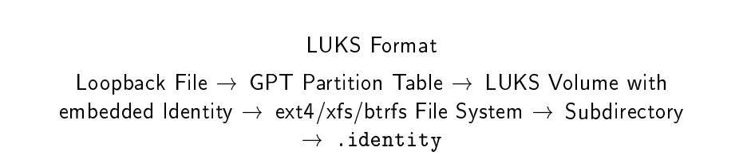
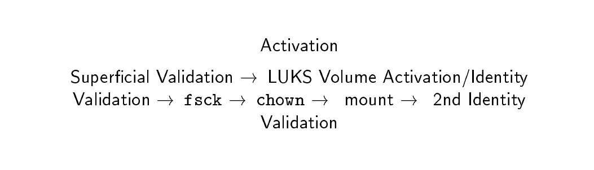
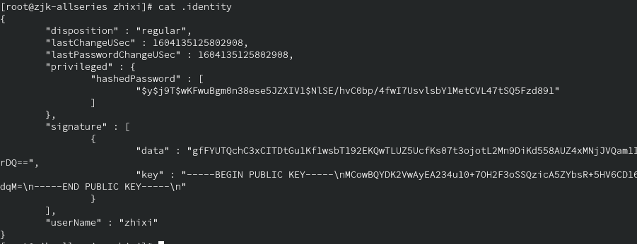
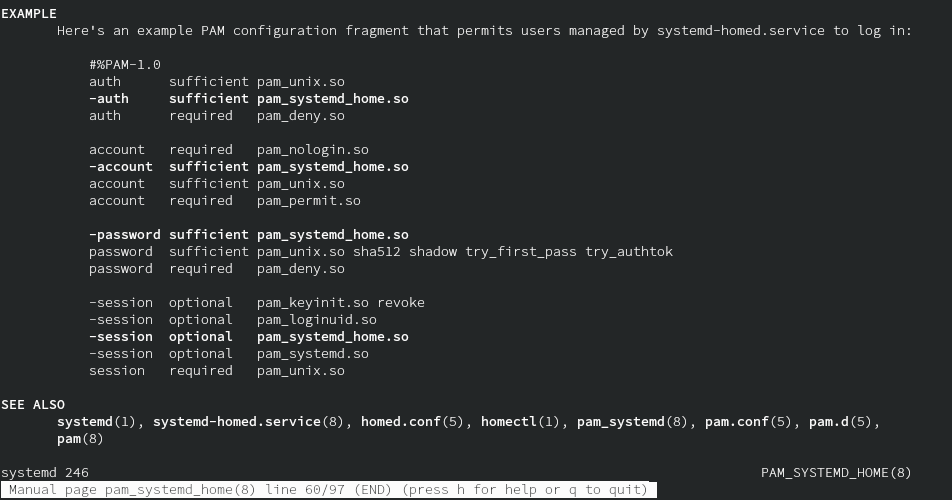

在2020.3 发布的systemd 245增加了systemd-homed，改变了`/home`目录的加密和工作方式。用homectl设置用户组，直接加密整个`/home`目录更方便了，快来当小白鼠吧。
<!-- more -->

## 太长不看版

### 使用homectl新建用户、用户组

首先你的systemd要在245以后，版本较低或使用SysV或者OpenRC、Upstart的玩家请跳过。

更新：systemd-247以后的版本默认采用Btrfs，还加了一个可选的恢复密码（recovery key），你的密钥丢了可以用这个重置

homectl是systemd-homed.service的一个cli工具，用来配置用户组、用户，包括新建、删除、修改权限和密码等。考虑到systemd近乎一统江湖的的市场占有率，可能你们将不得不面对这种方式。

没开启的先开启一下`systemd-homed.service`

```bash
systemctl enable systemd-homed
systemctl start systemd-homed
```

如果你的daemon没启动可能会出现`**Operation on home test1 failed: Failed to execute operation: Resource temporarily unavailable**`

看到下面这样就行了

```log
Created symlink /etc/systemd/system/dbus-org.freedesktop.home1.service → /usr/lib/systemd/system/systemd-homed.service.
Created symlink /etc/systemd/system/multi-user.target.wants/systemd-homed.service → /usr/lib/systemd/system/systemd-homed.service.
Created symlink /etc/systemd/system/sockets.target.wants/systemd-userdbd.socket → /usr/lib/systemd/system/systemd-userdbd.socket.
```

新建用户

```bash
homectl create zhixi
```

会像下面这样提示你输入密码，输完之后要稍等一会

```bash
[root@zjk-allseries zjk]# homectl create zhixi
🔐 Please enter new password for user zhixi: ******                  
🔐 Please enter new password for user zhixi (repeat): (press TAB for no echo) 
```

创建成功之后使用`homectl list`查看homectl创建的用户是否存在

```bash
[root@zjk-allseries zjk]# homectl list
NAME  UID   GID   STATE    REALNAME HOME        SHELL    
test  60444 60444 inactive test     /home/test  /bin/bash
test1 60510 60510 inactive test1    /home/test1 /bin/bash
zhixi 60353 60353 inactive zhixi    /home/zhixi /bin/bash

3 home areas listed.
```

`homectl inspect username`可以查看用户信息

```
[root@zjk-allseries zhixi]# homectl inspect zhixi
   User name: zhixi
       State: active
 Disposition: regular
 Last Change: Sat 2020-10-31 17:05:25 CST
    Login OK: yes
 Password OK: yes
         UID: 60353
         GID: 60353 (zhixi)
   Directory: /home/zhixi
     Storage: luks (strong encryption)
  Image Path: /home/zhixi.home
   Removable: no
       Shell: /bin/bash
LUKS Discard: online=no offline=yes
   LUKS UUID: 107ff22e399d417d92f398c91275de3b
   Part UUID: 645499ec3e554eaca0f09a9b172d89b3
     FS UUID: a6b5969ecfee4ae49f0cad9931f31589
 File System: ext4
 LUKS Cipher: aes
 Cipher Mode: xts-plain64
  Volume Key: 256bit
 Mount Flags: nosuid nodev exec
   Disk Size: 654.0G
  Disk Usage: 11.3G (= 1.8%)
   Disk Free: 642.7G (= 98.2%)
  Disk Floor: 11.3G
Disk Ceiling: 769.5G
  Good Auth.: 1
   Last Good: Sat 2020-10-31 19:23:25 CST
   Bad Auth.: 1
    Last Bad: Sat 2020-10-31 19:23:17 CST
    Next Try: anytime
 Auth. Limit: 30 attempts per 1min
   Passwords: 1
  Local Sig.: yes
     Service: io.systemd.Home
lines 2-36/36 (END)
```

然后激活用户

```bash
homectl activate zhixi
```

退出当前用户并切换用户就可以了(你可能需要更改PAM设置才能正常使用su切换用户)

### 从原来的用户组管理方式迁往systemd-homed

> 这里直接复读一下systemd官网的警告，需要手动操作、有风险、做好备份、出了事自行承担

(不喜欢折腾的人不推荐这么干，原来的又不是不能用了

其实建议你直接去看[官网的英文说明](https://systemd.io/CONVERTING_TO_HOMED/)，这个是给不想看官方文档的懒狗准备的（不会吧不会吧，不会真有这种懒狗吧）

切到root操作，先重命名你的用户目录，随便移到一个空间够的位置

```bash
mv /home/zhixi /home/zhixi.saved
```

然后看一下你的用户设置（假设用户名是zhixi,GID=1000），以及所在的用户组设置（1000改成你的GID）

```bash
getent passwd zhixi
getent shadow zhixi
getent group 1000
```

（上面是官方文档的做法，也可以用`lslogin -u`查看）

把上面这些也备份一下。然后把`/etc/passwd`和`/etc/shadow`和`/etc/group`还有`/etc/gshadow`里面的zhixi用户相关的东西删了（基本上就只有一行）。

（官方文档说为了安全请使用`vipw`, `vipw -s`, `vigr` and `vigr -s`，这些是给配置文件加锁，防止多人同时更改出现问题，使用跟vim一样（找到那一行按dd然后ESC, :,wq回车就好了），如果你确定是自己一个人操作（也没有别人远程登陆或者其他程序正在修改），似乎用别的什么文本编辑器也没什么问题）

（其实，你可以直接用`userdel`删除）

然后剩下的操作跟第一节一样，用`homectl`新建一个就好了

```bash
homectl create zhixi --uid=1000 --real-name=zjk
```

(uid填你的uid，real-name后面填你的GECOS)

可能你还想改改磁盘加密方式什么的，想设置的都先设置好。

然后rsync把原来备份了的东西放回`/home/zhixi`

```bash
 homectl with zhixi -- rsync -aHAXv --remove-source-files /home/zhixi.saved/ . &&  rmdir /home/foobar.saved
```

### 注意

systemd-homed是一个用户一个私有用户组。如果你一个用户组设置了多个用户的话，可能要调整一下。

## systemd-homed简介

~~感觉这下子systemd接管的东西更多了~~

### 以前的用户和用户组管理

好吧，以前要加引号，现在这个在大部分Linux都还没人用呢（甚至连一篇中文介绍都没有）。

通常使用`useradd`或`adduser`新建用户（不同发行版这两条命令有一点区别），比如

```bash
useradd -U temp
sudo useradd temp1 -m -G temp
```

新建一个temp用户组并给temp用户组中新建一个叫temp1的用户（同时在`/home`下新建一个`temp1`目录作为用户目录）。

然后使用`passwd temp1`为用户temp1指定密码

（虽然useradd有`-p`选项可以直接指定密码，通常不建议这样做，因为这样子恁的密码会明文留在历史命令里，如果有人不怀好意的执行一下`history`或者`more /home/$USER/.bash_history`或者`ctrl+r`搜索useradd，他将轻易获取你的密码），你用了sudo也可能会被找到，比如[这个](https://superuser.com/questions/309434/how-to-view-command-history-of-another-user-in-linux)

<https://www.freebuf.com/news/135845.html> history -c 也不太保险

你的用户名、密码、用户组、权限配置基本都放在`/etc`目录下面，比如`/etc/passwd`里面存你的密码，`etc/group`里面放用户组的设置。`/etc/sudoers`是超级用户的设置。每个用户的配置散落在各个地方，一些个人设置还被放在了`/home/user`底下。

这个样子你需要`/etc`的写权限，一个用户不同系统迁移的时候需要同时迁移其他的目录（而且UID还得一样），想对`/home`单独加密也不太方便。

### 变化

主要的变化就是你的个人用户都扔到`/home/yourusername`下面了。（据说）这样更方便加密和迁移。默认采用LUKS，在用户登陆的时候解密并挂载`/home/user`，在用户退出登陆的时候加密并取消挂载。休眠挂起（Suspend）的时候也会加密锁住。

比如你有一个u盘，里面装了你的用户目录，到别的电脑上插上去就能用了，不需要那边给你新建一个用户（现在基本不太行，对面电脑起码得也是systemd 245 版本以上还得启用`systemd-homed`，我乐观估计等这玩意普及至少得两年吧，那些用老CentOS的万年钉子户更别想了）

这样也方便全盘加密（我不是那种对物理安全都看的很在乎的申必人士，据说全盘加密会有点性能问题，而且休眠睡眠也比较容易起不来，所以我没试过）（不过恁不用这个systemd-homed其实也能全盘加密）

现在使用`systemd-homed.service`和`systemd-userdbd.service`两个daemon管理用户，登陆的时候是`systemd-logind` 在管。大概是这么个流程：





另外，Yubikeys现在是一等公民（说的好像这小玩意这么贵我买得起一样）
Yubikeys或者别的加密设备我手头没有，而且LUKS加密home目录之类的我也没有那么高的安全需求，哪位好心人要是愿意送/借我一个玩玩，我把这部分内容补上

### 现在的样子

使用`homectl activate`激活用户目录后你会看到在`/home`目录下多了一个用户目录

```bash
$ homectl activate zhixi
🔐 Please enter password for user zhixi: ****** 
```

原来`/home`下只有一个zhixi.home，activate之后多了一个zhixi目录

我们看一下这个目录下面有什么

```bash
$ cd /home/zhixi && ls -a
.  ..  .bash_logout  .bash_profile  .bashrc  .identity
```

其中的`.identity`存放你的密码等登陆认证信息（以json存储用户记录（JSON User Recoed））,大概长这样



`homectl inspect username`可以查看用户信息

```bash
$ homectl inspect zhixi
   User name: zhixi
       State: active
 Disposition: regular
 Last Change: Sat 2020-10-31 17:05:25 CST
    Login OK: yes
 Password OK: yes
         UID: 60353
         GID: 60353 (zhixi)
   Directory: /home/zhixi
     Storage: luks (strong encryption)
  Image Path: /home/zhixi.home
   Removable: no
       Shell: /bin/bash
LUKS Discard: online=no offline=yes
   LUKS UUID: 107ff22e399d417d92f398c91275de3b
   Part UUID: 645499ec3e554eaca0f09a9b172d89b3
     FS UUID: a6b5969ecfee4ae49f0cad9931f31589
 File System: ext4
 LUKS Cipher: aes
 Cipher Mode: xts-plain64
  Volume Key: 256bit
 Mount Flags: nosuid nodev exec
   Disk Size: 654.0G
  Disk Usage: 11.3G (= 1.8%)
   Disk Free: 642.7G (= 98.2%)
  Disk Floor: 11.3G
Disk Ceiling: 769.5G
  Good Auth.: 1
   Last Good: Sat 2020-10-31 19:23:25 CST
   Bad Auth.: 1
    Last Bad: Sat 2020-10-31 19:23:17 CST
    Next Try: anytime
 Auth. Limit: 30 attempts per 1min
   Passwords: 1
  Local Sig.: yes
     Service: io.systemd.Home
lines 2-36/36 (END)
```

### 存在的一些问题

这个东西主要是focus on ` particularly Laptop users`，目前可能多多少少有点小问题。企业用途和运维貌似也不怎么需要这个。

#### SSH的问题

这个东西直接把/home全都加密了，当然也包括`.ssh`目录下面的东西。

目前看来没有什么很完美的办法，有人是这样干的：先整一个其他的空用户在他的/home/user下面存公钥，用密码登陆，然后su切过去。(反正看起来挺扭曲的)

不过对于笔记本个人用户来说SSH到自己的加密盘貌似不是什么刚需，还是等完善了随身带着硬盘走比较好。

#### 休眠

貌似不少人会碰到奇奇怪怪的休眠问题，很在意休眠的笔记本用户请谨慎上车。

#### 删除用户后SDDM仍有残留

用`homectl activate`激活了一个用户temp1，然后用`homectl remove`删除了这个用户temp1，结果发现我的SDDM在登陆页面仍然有原来的temp1。检查`/home`发现这下面已经没有temp1.home文件了，但是还有temp1这个文件夹（受保护）。

我又用刚才新建的用户zhixi试了一下，在inactive情况下会比较干净的remove。

## 可能的报错

```
homectl su: Authentication service cannot retrieve authentication info
```

可能是你的daemon没启动，试试启动daemon并重启一下试试。

```
Operation on home me failed: Specified user name me conflicts with an NSS group by the same name, refusing.
```

用户组冲突了，看看你之前是不是用useradd之类的操作新建过同名用户组。

```
su: Authentication service cannot retrieve authentication info
```

这个报错出现在我换到systemd-homed后试图用su切换用户。一开始我用 su 在桌面环境下切用户就没成功过，退出登陆后跑到SDDM里是可以的，本来以为这是个feature。后来觉得不应该啊，一查果然，要手动改PAM设置，在`/etc/pam.d`里面改一下su的配置就好了。配置照着模板改就好了，`man pam_systemd_home`，详情参考[pam_systemd_home](https://www.freedesktop.org/software/systemd/man/pam_systemd_home.html)，arch用户看[这里](https://jlk.fjfi.cvut.cz/arch/manpages/man/pam_systemd_home.8)



而且看起来很多时候有root权限它还是会让你输入当前用户的密码，比如[这个issue](https://github.com/systemd/systemd/issues/16166)

```
Operation on home username failed: Access denied
```

权限不够，你至少需要root权限或者要切换到的那个用户的密码才能操作对应目录或者修改配置。（貌似homectl的很多操作需要输入）

```
Operation on home username failed: Failed to execute operation: File exists
```

这个错误的原因可能有很多，或许可以试试`systemctl restart systemd-homed`

```
(Unknown (FileSystemError): Error: ENOSPC: no space left on device, write)
```

我新建第二个的时候没有指定存储空间，直接塞满了。用`homectl resize user 10G`调整了磁盘分配后解决。

## 附

给不愿意`--help`看英文说明的懒狗翻译一下命令选项

### homectl命令选项

| homectl              | Explinations                                    | 作用                                                         | 例子                              |      |
| -------------------- | ----------------------------------------------- | ------------------------------------------------------------ | --------------------------------- | ---- |
| list                 | List home areas                                 | 列出用户信息（包括NAME  UID  GID  STATE   REALNAME HOME     SHELL） | homectl    list                   |      |
| activate USER…       | Activate a home area                            | 激活用户（执行后`/home`下面会多出一个和用户同名的目录）      | homectl activate zhixi            |      |
| deactivate USER…     | Deactivate a home area                          | 取消激活                                                     | homectl deactivate zhixi          |      |
| inspect USER…        | Inspect a home area                             | 查看用户信息，跟userdbctl user... 的输出差不多               | homectl inspect zhixi             |      |
| authenticate USER…   | Authenticate a home area                        | 验证用户                                                     | homectl authenticate zhixi        |      |
| create USER          | Create a home area                              | 新建用户                                                     | homectl create zhixi              |      |
| remove USER…         | Remove a home area                              | 移除用户                                                     | homectl remove zhixi              |      |
| update USER          | Update a home area                              | 更改用户设置和状态                                           | homectl update me --locked=false  |      |
| passwd USER          | Change password of a home area                  | 改密码                                                       | homectl passwd zhixi              |      |
| with USER [COMMAND…] | Run shell or command with access to a home area | 用到/在某个用户目录下执行命令（需要root或该用户密码）        | homectl with zhixi -- mkdir test1 |      |
| resize USER SIZE     | Resize a home area                              | 调整用户的存储空间                                           | homectl resize zhixi 30G          |      |
| lock USER...         | Temporarily lock an active home area            | 锁定用户                                                     | homectl lock zhixi                |      |
| unlock USER          | Unlock a temporarily locked home area           | 解锁用户                                                     | homectl unlock zhixi              |      |

### userdbctl命令选项

| userdbctl               | Explinations                                      | 作用             | 例子                           |
| ----------------------- | ------------------------------------------------- | ---------------- | ------------------------------ |
| user [USER…]            | Inspect user                                      | 查看用户信息     | userdbctl user zhixi           |
| group [GROUP…]          | Inspect group                                     | 查看用户组信息   | userdbctl group zhixi          |
| users-in-group [GROUP…] | Show users that are members of specified group(s) | 查看组中用户     | userdbctl users-in-group zhixi |
| groups-of-user [USER…]  | Show groups the specified user(s) is a member of  | 查看用户所在的组 | userdbctl groups-of-user zhixi |

## 参考

<https://systemd.io/HOME_DIRECTORY/> 官方文档

<https://www.man7.org/linux/man-pages/man1/homectl.1.html>
<https://www.freedesktop.org/software/systemd/man/homectl.html>

[systemd 245 released](https://lwn.net/Articles/814068/) systemd第245次更新详情

<https://wiki.archlinux.org/index.php/Systemd-homed>

<https://wiki.archlinux.org/index.php/Users_and_groups_(简体中文)>

<https://systemd.io/CONVERTING_TO_HOMED/>

<https://www.reddit.com/r/archlinux/comments/fgc91b/with_systemd_245_landing_in_repos_systemdhomed_is/> 在Arch上使用的reddit讨论，archwiki的页面也是这个帖子的楼主写的

<https://media.ccc.de/v/ASG2019-164-reinventing-home-directories> 一个传教视频

<https://cfp.all-systems-go.io/media/homed-asg2019.pdf> 一个传教PPT

其他的一些简介

<https://linuxreviews.org/Systemd-Homed_Is_Merged_And_It_Will_Fundamentally_Change_Linux_Home_Directories>

<https://www.techrepublic.com/article/linux-home-directory-management-is-about-to-undergo-major-change/>