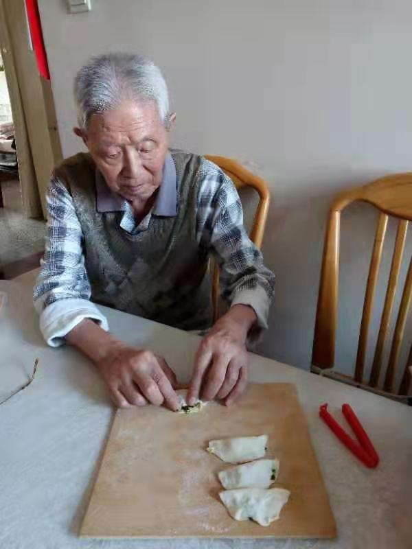

So this is how liberty die, with thunderous applause
<!-- more -->

这次非典，我感觉不对劲的时间挺早，。那八个人被训诫荣登央视的时候我就再不说话了，大路朝天，各走一边。
相信可防可控就信去吧，劝是劝不住的，我倒是会喝茶。
想来我也算医学逃兵，颇有些

>凄然不作零丁叹，检点平生未尽心

元旦就看到江宁狗这个反向指标洋洋得意跑出来喷粪，又过了两天看到新加坡和香港有动静了，再一看查处造谣都上央视了，那稳了。你甚至不需要医学知识，除非你第一天生活在人间。

然而现在恰恰逃兵是正确选择，扁鹊望桓侯而还走，管轶惊惶弃武汉回港

我什么也不想说，1月20号坐飞机回家之前，周围师兄师姐一会去春熙路逛街买新衣服一会出去玩，老板一会带我们去川大华西商量制造科研垃圾，一会说准备一下到肿瘤医院把之前的科研垃圾中期结题一下，并没有人感觉异常，我也不想自讨没趣。只能把去春熙路和出去玩找个借口推了，找个心理安慰，毕竟教研室巴掌大的地方，真出事一个也躲不掉。

爱国爱党信中医的景润师兄12号回了黄冈，淡定的一匹，比电视上的群众还淡定，我又何必自讨没趣呢

求仁得仁，复何怨哉

## 六朝如梦

经此一疫，又有一群不食人间烟火的人黄粱梦醒，纷纷如丧考妣，惊讶愤怒心痛，只觉所住非人间。你们是第一天住在人间吗？或许是承平日久了，想想这十几年真是好日子过多了，真觉得和平发展充满爱是世界主流了，这一片绿油油的韭菜不割都对不住韭菜。就像之前的故宫大G，愤怒可以理解，惊讶就太外宾了。
难道你们不知道权贵一直如此？
难道你们第一天接触慈善和红会？
难道你们第一天活在地球？

天下大乱、礼崩乐坏、风起云涌，这是一个王佐之才如过江之鲫的时代，这是一个两脚羊的时代。
管他春秋繁荣还是六朝纷乱，反正都比虚假繁荣的皇朝有意思多了。

前一阵奥斯卡奖,一群人居然又开始吹捧寄生虫了。寄生虫刚出来的时候我扫了一眼两极分化的影评我就不想看了，实在没意思。小丑也没意思，至少不如爱尔兰人，我感觉快把蝙蝠侠三部曲的牌子给砸了。建议奥斯卡也加大力度，回头和WHO比比哪个更搞笑。
还有一些人哀叹中国影视文艺百花凋零，那大可不必，你看到这个暗流涌动的世界了吗?实在没有必要看那些电影工作者和文艺工作者的自嗨产物,更没必要理会电影工作者自己给自己颁的奖。更何况近五年来影视界和五年前十年前比实在没意思。你们小时候读过儿歌和故事，甚至被要求背过课本上的文章吧；我反正经常有种被喂屎的感觉，他们就喜欢搞一堆[骗小孩](https://en.wikipedia.org/wiki/Lie-to-children)的玩意，他们还装小孩语气说话写课本（虽然装得一点也不小孩），然后小孩还要背诵他们装小孩的东西（顺便来个读后感）。
现在的问题是越来越多电影制作者装高深和整天把观众当傻子，观众却不买帐了。
反正我看到一些有脑子的社会活动家和键政人士纷纷表示寄生虫这电影就是个垃圾，有点作为半个动物爱好者的我看[小鹿斑比](https://translations.headsalon.org/post/2018/07/随小鹿斑比而生的文化潮流/)的样子,更恰当地说，学机械的工科狗看到有人吹高达的设计和威力的样子。实在是太假了，简直有违常识，韩国电影当年有很多好的深刻的讽刺现实作品，这几年用力过度甚至失去了常识（虽然韩国的猎奇片子一向就喜欢为了猎奇抛弃常识）。有人说韩国影视界近年来进步很大，我觉得恰恰相反。

一些吃瓜群众人纷纷表示不服，看到寄生虫获奖：就这？就这？就这？
大有项羽见始皇帝出游，“彼可取而代也”的感觉
哦，不，是看了湖北政府，“我也能当省长”的感觉

## 他们都不说人话

>社会主义没有失业,那叫下岗

有人怕了，就怕跟SARS扯上关系啊

这病毒终于还是有了个名字叫SARS-cov-2，然而国内官媒一个个都有意回避SARS的说法，甚至绝口不提非典，非得叫新型冠状病毒，却又说不是SARS
我们随便点开一个百科,比如默沙东手册:

>严重急性呼吸综合征（SARS）是由SARS冠状病毒（SARS-CoV）引起的严重急性呼吸道疾病。

这可不就是SARS，这次疾病就叫 SARS2 我看正合适。
WHO（Winne Happy Orgnization）不管这个叫 SARS，当然了，他们还满口可防可控不列疫区，我建议WHO加大力度，力度再大点就可以被总书记**亲自批准**火线入党了，岂不美哉

你们还是说点人话吧，什么2019-nCov啊，什么NCP啊，特色社会主义都能叫社会主义，这新型冠状病毒都不算SARS？

## 国士垂垂老矣

元旦那会我觉得这个可能要闹大,当时也没想到会闹成今天这个样子。

钟南山那个儒贼出来我就感觉要坏事，却没想到从上到下如此不堪。
03年非典，蒋先生做出了青史留名的举动，涛哥不戴口罩亲临广州街头，臊子面稳住了北京。今天只留下了一个又一个笑话，让大家觉得“彼可取而代也”

大家一边吹捧钟南山，一边骂双黄连和可防可控，我看得哭笑不得。
钟南山当年的板蓝根和可防可控大家都忘了吗？莲花清瘟都忘了吗？
他可不是糊涂，他自己是不信的。他父亲都是反中医的。

以下内容直接复制自维基百科
>2月11日上午，广州市政府召开新闻发布会公布广州地区非典型肺炎情况，称所有病人的病情均在控制当中。强调对于广州千万人口300多人染病是个很小的比例，非典型肺炎只是局部发生，河源中山等市已无新发病例报告。还解释了2月前前阶段没有公布情况的原因是：河源中山等地的患者经过治疗大多已康复或好转没有再发病，非典型肺炎并不是法定报告传染病，而发病人数305例并不算多。负责人强调会按传染病法公布疫情。
>同日下午，广东省卫生厅举行情况通报会。中国工程院院士钟南山表示，市民到公众场所进行正常的活动是不会受到感染的，宣布广东大中小学将会如期开学。专家还指出，从临床角度看，可能是由病毒引起的，也有可能是病毒的亚型或变种引起的。对于患者的治疗都是采用“对症下药”的方法。

当然了，肯定有人让我闭嘴，我算个什么东西，哎，我还真不算个东西。
我一个稀里糊涂读了几年生物医学工程的工科狗，给自己脸上贴金也只能算半个医学相关闲杂人等，跑到知乎[^2]去说两句，能引来几千个人追着骂我。（2020年的，2013年前的应该不能）

那我就贴一点[小儿外科裴医生](https://www.weibo.com/u/1829870212)的话
(以下内容大段粘贴，指不定哪天号就没了，留个备份，前几天刚炸了一大批怼中医的)

>小儿外科裴医生  
>2019-9-8 09:36 来自 iPhone客户端
>你要是以为钟南山在这个“科普”中讲到莲花清瘟胶囊是无意的，或者他只是因为没有了解这个药，那就太幼稚了，人家不蠢，只是没有节操，为了利益，用自己的学术地位给那些没用的药站台背书，就是恶。[O“知感冒·防流感——全民科普公益行”活动在汉举... ​​​​](http://hb.chinadaily.com.cn/a/201909/07/WS5d738f67a31099ab995de93f.html)

这活动还有视频哦（太长了就只贴个图好了）

这底下有个评论：

>fanbobb：如果有人问我，连我们最该拥有权威的院士，前几天还有正能量新闻的院士，都宣传中成药，你还成天说中药是骗人的吗？我作为一个非医学专业的普通人还真有点哑口无言

我也哑口无言。

>小儿外科裴医生
>2月2日 22:07 来自 iPhone 11 Pro
>面对一个大家都不太了解的病毒，被感染了有什么丢脸，为什么要用此这么恶毒的词？我觉得他比钟南山客观、务实、专业、真实多了。//@st5873:这样草包还有脸出来到处接受采访
>@小儿外科裴医生
>中青报对这篇对@北大呼吸发哥 的访谈很不错，推荐大家看看。O卫健委专家组成员王广发出院了，回答了我们8... ​​​​

>阿瓦达啃大瓜1633：回复@蓝小诺CC:几年前亲耳听钟老板在欧洲呼吸病年会分会上演讲说他们团队研究治疗H1N1板蓝根有效，莲花清韵胶囊有效，当初差点以为听错了，那时才明白钟老板那一刻的身份是行政官员不是医生。

下面这段已经被删了,戳到某些人的脊梁骨了。这里我手动加粗，以免太长不看的读者在跳读我写的这一堆垃圾时错过重点内容

>@小儿外科裴医生:专业我就说几个词吧：**连花清瘟、板蓝根、装修致白血病、兰菌净、羧甲司坦、口罩**。//@嘛咪嘛咪-hong:所以我想知道钟南山哪儿不客观，不务实，不专业，不真实呢？（非杠，真心请教）

当然很多都删了，还有很多没有说出口（很多话我也没说出口）

>昨天在隔壁号我又有一篇文章被删了，算上之前被删的和推送不出去的，整个疫情期我有约1/10的文章没法见人，昨天看到棒棒医生的那篇循证的崩溃的文章也被删了，医学专业人员连专业问题都不能讨论和发言，那可能是这块土地真的不再需要专业和科学了。 ​​​​

19年10月钟南山还在搞：[钟南山：正研发新版板蓝根，药效或强五六倍](https://www.thepaper.cn/newsDetail_forward_4731106)，还给莲花清瘟站台，对了，还有虫草呢（就是内含重金属，改变了平西王历史的进程的那个虫草）

什么叫国士无双啊，战术后仰

另，友情提示，李兰娟的人品、水平和能力还不如钟南山。

没多少人提起，蒋先生的往事
据说蒋先生现在身体也不太好，唉

“我之所以能直面现实，是因为我相信我们的国家。因为国家如果能从我提供的这些情况吸取一定的教训，因此建立好公共防疫制度，从SARS的挑战与困境中站起来，获得全世界人民的信任。”

这次怕是让老爷子心寒了

当然某人青年时代就亲自读过莎士比亚，并且在15年引经据典告诉过我们：“凡是过去，皆为序章”。[^1]

*我将无我，亲自指挥*

正常表现罢了

>因笑王谢诸人，登高怀远，也学英雄涕

## 我还是说点什么吧

建议大家多屯点粮食

有钱记得做空美股（当然你也可以拿期权做空A股，只要你不怕投机倒把当场击毙）

对野生动物保护持续悲观（你看见之前环保部门煤改气了吧）

再多说两句，流浪猫狗应该跟本次非典没有太大关系，不管有没有关系，流浪猫狗本就应该组织扑杀（收容和安乐是宠保人士和猫奴狗奴的事，政府以极大浪费~~纳税人~~韭菜的血汗钱进行收容和安乐都是不合适的，TNR属于迁就猫奴狗奴的绥靖行为，同样不可取）。
昆明滇池的红嘴鸥和黔灵山公园的猕猴今年缺少游客喂食，景区组织投喂，这是十分不好的。

下面贴一些鸟类爱好者的话：

[中土饲养员]：有研究表明人为投喂淀粉类的面包蛋糕等会降低各种鸥类育雏的成功率，但是还好红嘴鸥只把昆明当成补充体力的中转站
[JK协捕队2世](https://weibo.com/u/6552893675)：
[漂泊极北鲵](https://weibo.com/u/5832997504)：...首先 这是红嘴鸥Chroicocephalus ridibundus 不是海鸥Larus canus 其次这些鸥已经被喂得彻底与自然环境分离了 这是在毒害它们
没事请与野生动物保持距离，不要乱摸、投喂，除了保育和救助等都不要打扰动物
动物园和景区里的也不行，很多动物园和景区做得都不好，禁止投喂的牌子并不管用，工作人员也制止不过来

我只是半个动物爱好者，这里就不自己扯淡了, 这是一篇土澳学生物的博主写一篇长微博：<https://weibo.com/3962135262/Isy79BHPA>
我抄一点过来:
>人类的食物，如面包、薯条、饼干，高油高盐，高热量高糖分，对野生动物的健康极为不利，多表现为肥胖、肾衰竭、毛发脱落等。因为人类的饮食根本不是它们自然食物链的一部分。不天然的饮食及其附属物，例如塑料袋、油污，也会污染野生动物的自然栖息地。
>亲密接触野生动物增加疾病的传播概率，这点在当下这个时候，想必不用再过多说明了吧？某市以投喂红嘴鸥为荣的，鸟类身上携带什么疾病来着，禽流感啊，好自为之！去高原上摸旱獭喂食旱獭，自私且无耻，将自己暴露在甲级传染病鼠疫病原的触碰范围内，你又为你家人想过吗？犰狳是恐怖的麻风病宿主，很多小型食肉动物传播狂犬病，动物身体体表和体内的各种寄生虫，野生动物从来都不好惹。
>使野生动物依赖人类获取食物。这次疫情限制出行，很多问题就暴露出来了，为什么贵州那群猴子和某市的红嘴鸥离不开人的投喂了？这是个恶性循环啊，本来就不该投喂野生动物，养成依赖了，现在甩不了手，离不开人了，出了事动物们自己不会觅食，纷纷饿死，有得去投喂，这个循环刹不住车了，你觉得是好事吗。就说红嘴鸥吧，这种鸟类本来还是候鸟，人家到点了想飞走就飞走，想留下就留下，一投喂全留下了，这基数不断变大，竞争压力也不断变大。红嘴鸥的自然种群数量庞大，适应力很好，年前跑鸟类调查，上万只反正是随随便便看到了，它们也不是什么濒危物种，完全不依靠人类“救援”。所以这事，从一开始做的就不对，不是说你现在不投喂要出问题，是一开始就压根不该投喂，动物不是人，它脑子里只有吃和繁殖，这样强行转变了它们的生存策略，到最后只能是出问题。

还有这方面的疑问不建议问我，请直接去问他们

中医早已变成一个庞大的利益集团，随便一个阿胶之类的体量都在鸿茅药酒十倍以上。总规模和能量加起来应该不低于清真食品产业链。
我不想说什么中医了，我也不拦着，谁爱信谁信。以前看到有人想不开，我都觉得应该劝劝，现在抑郁症想自杀的人我都觉得不应该拦着，信中医就我就更不反对了，都是个人选择，尊重个人意愿。非公共场合抽烟也是个人意愿，还能成为光荣的~~纳税人~~烟草局韭菜。喝中药对他人危害并不高于香烟，还能解决医保和老龄化的难题，顺便进行智商筛选。

在现代医学已经发展到这个样子的今天，再想想《赠医者汤伯高序》文末“嗟夫，使世之医皆若虚、伯高，信之者皆吾里之人，巫其能久胜矣乎”，问题的答案是：你别说，还真能！

楚俗信巫不信医，今天群魔乱舞自称中医的一群人，基本都是跳大神的巫医，谋财害命之徒。可以粗暴的认为是一个宗教性质的东西。

再有人问中医怎样，我建议你们这样安利他们：试试恒河水，这个纯天然，效果也很好，还免费

死生有命，富贵在天
善哉，善哉

>庚子年春，大雪，惊雷，天有五日,瘟疫封城

[^1]:http://politics.people.com.cn/n/2015/1021/c1001-27724579.html
[^2]:https://www.zhihu.com/question/28634829
