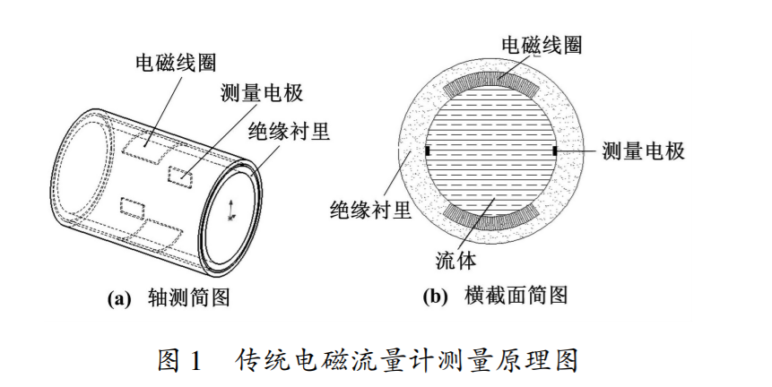
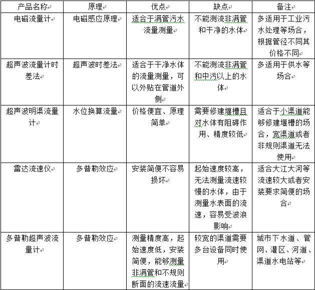
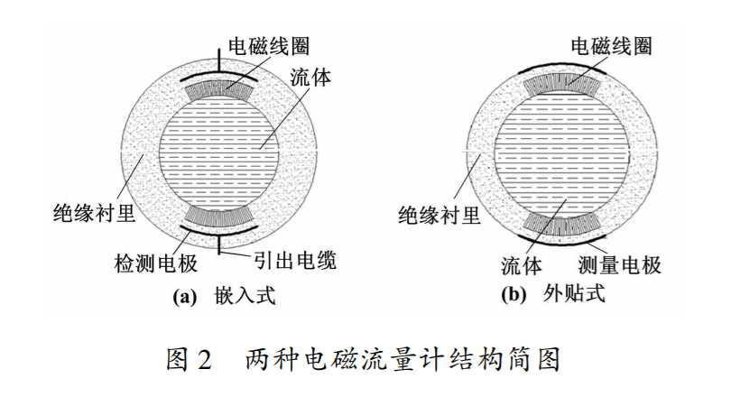
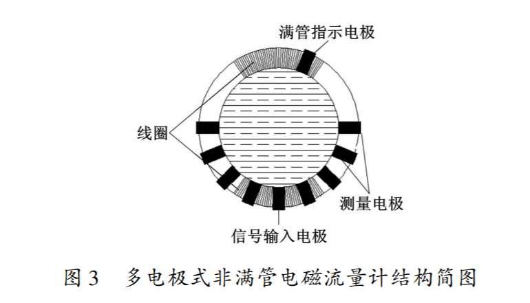

电磁流量计是一种常用流速流量计，应用电磁感应原理， 根据导电流体通过外加磁场时感生的电动势来测量导电流体流量的一种仪器。电磁流量计适用于满管污水等强导电性液体流量测量，多用于工业污水检测等场合。
<!-- more -->

#### 电磁流量计原理

常用流速流量计有测量导电液体的电磁流量计、采用超声波流量计时差法外夹式或者管段式超声波流量仪表、采用多普勒雷达测速原理或利用声波在流体中传播的多普勒效应的流速仪。

电磁流量计（Electromagnetic Flowmeters，简称EMF），是20世纪50~60年代随着电子技术的发展而迅速发展起来的流量测量仪表。 电磁流量计是应用电磁感应原理， 根据导电流体通过外加磁场时感生的电动势来测量导电流体流量的一种仪器。

传统电磁流量计测量原理如图1所示。 电磁线圈在直径为 d、横截面积为A的管道中产生一个磁场强度为B的磁场。当有流体经过 时会切割磁感线而产生感应电动势 U,测量电极接收电动势信号。由公式
$Q={1 \over k}*{UA \over Bd}$
可计算其流量。式中:Q为流量;k为修正系数。

电容式电磁流量计解决了电极表面附 着、腐蚀、摩擦等问题 ,其电极与被测流体间有绝缘 衬里隔离,或者直接采用绝缘测量管, 结构如图 2 所示。电极与被测流体通过绝缘管形成检测电容,通 过此电容来耦合流量信号。

#### 电磁流量计的优化改进

普通的电磁流量计只能测量满管流的流量,常见的非满管电磁流量计有下面几种：

1. 多电极式非满管电磁流量计。其底部是一对信号注入电极,中间有多对测量电极,顶端有一个满管电极。当流体非满管时,满管电极检测到管道非满状 态,利用算法修正测量值,此时流量计的测量方式改 成测量流体流速和液面高度。信号注入电极与在不同位置的三对测量电极共同工作,用于测量液位面的高度和流体的速度。
2. 电容式非满管电磁流量计。电容式非满管电磁流量计就是利用液位的变化使 得电容的极距发生变化,通过测量发送电极和检测电 极之间的电容耦合值即可测量流量值。
3. 利用阻抗或信号衰减研制的非满管电磁流量计。其结构是流量管底部贴一对信号发射电极,在流量管中间贴信号接收电极。由于信号在流体 中传播会产生衰减,且传播时间越长,衰减越多,因此 通过信号接收电极接收到的信号衰减量即可得知液面高度;

励磁方式可以分为两种基本 形式,即采用交变磁场的形式(包括正弦波励磁、矩形 波励磁、三值波励磁和双频矩形波励磁) 和采用恒定 磁场的形式(包括直流电源励磁和永磁体励磁)。

相对于交变磁场励磁方式来说,恒定磁场励磁的 方式实现起来更加简单,受工频干扰影响小,而且使用 恒定磁场励磁可以简化传感器结构

#### 电磁流量计与其他测流量原理仪器的比较

| 产品名称           | 原理         |                                  优点                                  |                                    缺点                                    |                              备注                              |
| :----------------- | :----------- | :--------------------------------------------------------------------: | :------------------------------------------------------------------------: | :------------------------------------------------------------: |
| 电磁流量计         | 电磁感应     |                            适合满管污水测量                            |                        不能测非满管污水和干净的水体                        |          多适用于工业污水处理等场合，管径不同价格不同          |
| 超声波流量计时差法 | 超声波时差   |               适合于干净水体的流量测量可以外贴在管道外侧               |                      不能测非满管污水和中污以上的水体                      |                       多适用于供水等场合                       |
| 超声波明渠流量计   | 水位换算流量 |                           价格便宜，原理简单                           |                需要修建堰槽且 对；水体有阻碍作用、精度较低                 | 适合于小渠道等能够修建堰槽的场合，宽渠道或者非规则渠道无法使用 |
| 雷达流速仪         | 多普勒效应   |                            安装简单不易损坏                            | 起始速度较高，无法测量流速较慢的水体，由于测量水表面的流速，容易受波浪影响 |          适合大江大河等流速较大或者安装要求简便的场合          |
| 多普勒超声流量计   | 多普勒效应   | 测量精度高，起始速度低，安装简便，能够测量非满管和不规则断面的流速流量 |                       较宽的渠道需要多台设备同时使用                       |           城市下水道、管网、灌区、河道、渠道水电站等           |

#### 参考

1. AMARE T. Design of an electromagnetic flowmeter for insulating liquids[ J]. Measurement Science & Technology, 1999, 10 ( 8 ): 755 - 758.
2. DONEY B. Going with partial flow[ J]. Control Engineering,1998, 45(12):131 - 133.
3. BERA, S. C., CHAKRABORTY, B.. A Novel Technique of Flow Measurement for a Conducting Liquid[J]. IEEE Transactions on Instrumentation and Measurement,2009,8(8).
